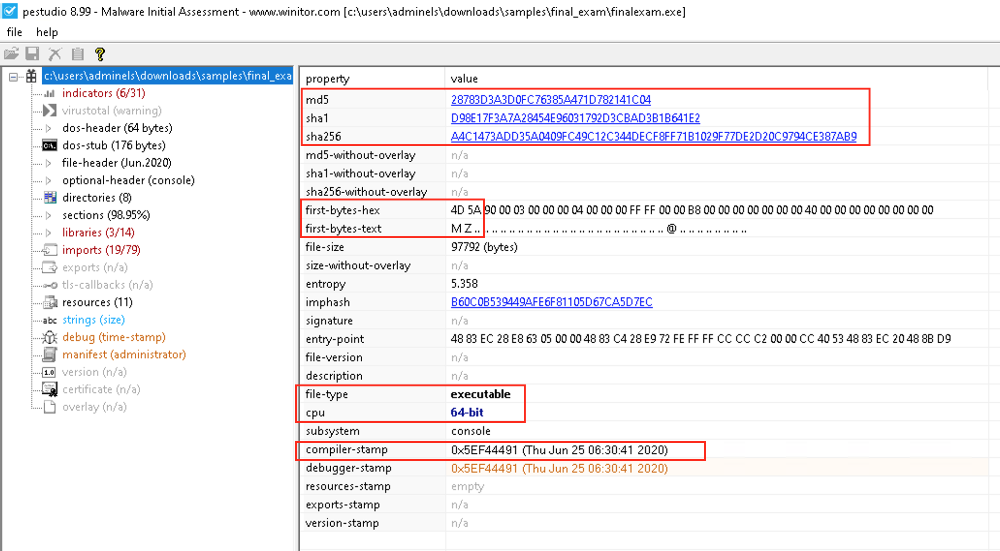
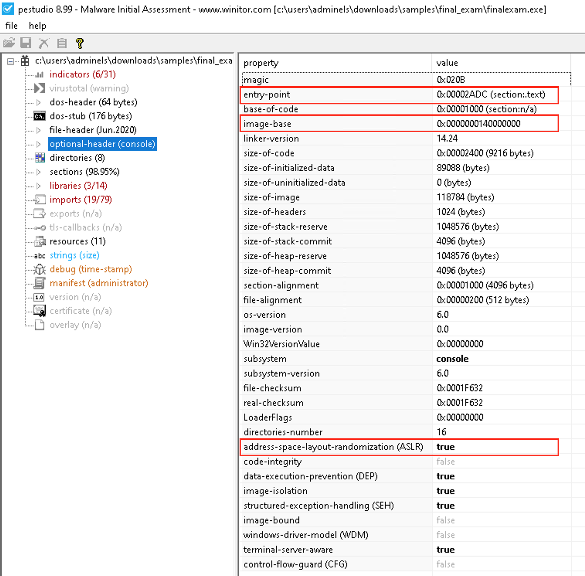
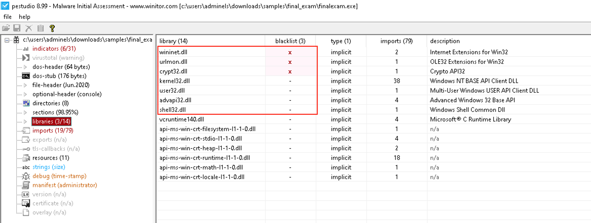
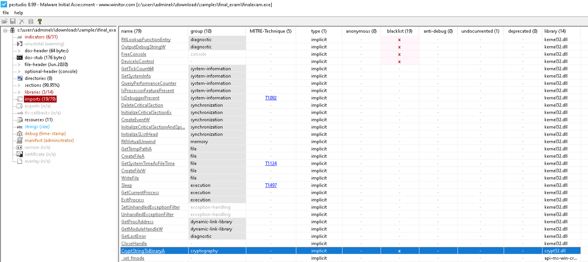
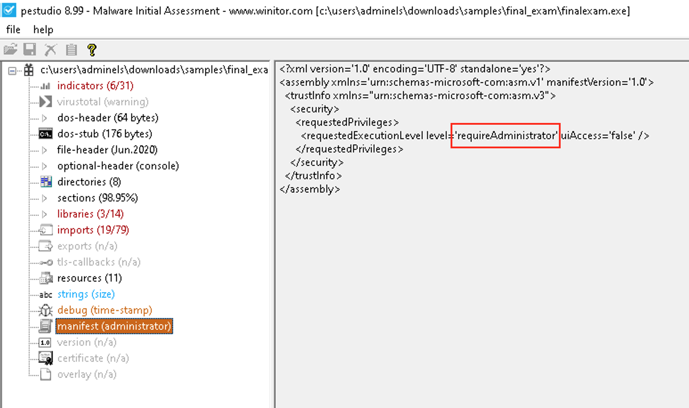
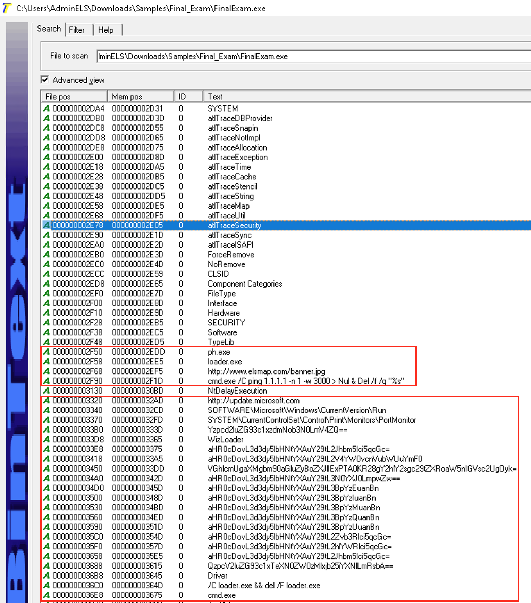

# eCMAP Exam

- [eCMAP Exam](#ecmap-exam)
  - [Configuration](#configuration)
  - [1 - Initial Assessments](#1---initial-assessments)
    - [Summary](#summary)
    - [1-1 - Hashes](#1-1---hashes)
    - [1-2 - Optional Header](#1-2---optional-header)
    - [1-3 - Sections](#1-3---sections)
    - [1-4 - Functions](#1-4---functions)
    - [1-5 - ATT&CK Analysis](#1-5---attck-analysis)
    - [1-6 - Resources](#1-6---resources)
    - [1-7 - Strings analysis](#1-7---strings-analysis)
  - [Reverse Engineering](#reverse-engineering)
  - [Running the malware](#running-the-malware)
  - [Unpacking](#unpacking)
  - [Network Activity](#network-activity)
  - [Persistence](#persistence)
  - [Dropped and Downloaded Files](#dropped-and-downloaded-files)
  - [IOCs](#iocs)
  - [Visualization](#visualization)
  - [Summary & Conclusion](#summary--conclusion)
  - [References](#references)

---

## Configuration

192.168.210.10 
AdminELS / Nu3pmkfyX

 

Sample:
- `C:\Users\AdminELS\Downloads\Samples\Final_Exam`

 

---

## 1 - Initial Assessments

**Questions**

Please provide background information about the malware sample given and any other malicious file(s) that gets downloaded. Use the questions below to help you when providing details about the file being analyzed.

1. What are the hashes of the malware sample?
2. What is the file type?
3. What is the compilation time stamp?
4. What are the file characteristics (e.g. EXE, DLL, 32-bit, 64-bit, etc.)?
5. What is the Image Base and the Entry Point address?
6. Provide details about each section found in terms of their names, sizes, permissions, entropy, and what each is used for.
7. What are the libraries (DLLs) referenced by this sample and which functions do you think are suspicious?
8. What are the MITRE techniques being used?
9. Is this sample packed or not and what proof do you have?
10. What interesting findings can you extract from the resources section?
11. What interesting strings (ASCII and Unicode) did you find and could they be used later as an IOC? Provide a brief explanation for each string found.
12. Are there any crypto functions being used by the sample and what are they?

 

**Answer**

### Summary

| Question | Answer | Reference section |
| --- | --- | --- |
| 1. What are the hashes of the malware sample? | MD5: 28783D3A3D0FC76385A471D782141C04 SHA1: D98E17F3A7A28454E96031792D3CBAD3B1B641E2 SHA256: A4C1473ADD35A0409FC49C12C344DECF8FF71B1029F77DE2D20C9794CE387AB9 IMPHASH: B60C0B539449AFE6F81105D67CA5D7EC | 1-1 |
| 2. What is the file type? | Windows PE | 1-1 |
| 3. What is the compilation time stamp? | Thu Jun 25 06:30:41 2020 | 1-1 |
| 4. What are the file characteristics (e.g. EXE, DLL, 32-bit, 64-bit, etc.)? | EXE, 64-bit | 1-1 |
| 5. What is the Image Base and the Entry Point address? | EntryPoint: 0x2ADC ImageBase: 0x140000000 | 1-2 |
| 6. Provide details about each section found in terms of their names, sizes, permissions, entropy, and what each is used for. | See details in the reference 1-3 | 1-3 |
| 7. What are the libraries (DLLs) referenced by this sample and which functions do you think are suspicious? | See details in the reference 1-4 | 1-4 |
| 8. What are the MITRE techniques being used? | T1497, T1124, T1112, T1106, T1082 | 1-5 |
| 9. Is this sample packed or not and what proof do you have? | Not packed based on the section names and entropy | 1-3 |
| 10.  What interesting findings can you extract from the resources section? | It requires administrator privilege to run | 1-6 |
| 11. What interesting strings (ASCII and Unicode) did you find and could they be used later as an IOC? Provide a brief explanation for each string found.| See the details in 1-7 | 1-7 |
| 12. Are there any crypto functions being used by the sample and what are they? | Yes - CryptStringToBinaryA (from crypt32.dll) | 1-4 |

 

### 1-1 - Hashes

Use **PeStudio** to open the sample to inspect it statically.

 

  

Based on this screenshot of summary page on **PeStudio** we can get the following information:

- **1. File hashes:**
  - MD5: 28783D3A3D0FC76385A471D782141C04
  - SHA1: D98E17F3A7A28454E96031792D3CBAD3B1B641E2
  - SHA256: A4C1473ADD35A0409FC49C12C344DECF8FF71B1029F77DE2D20C9794CE387AB9
  - IMPHASH: B60C0B539449AFE6F81105D67CA5D7EC
- **2. File type:**
  - Windows PE (Based on the first-bytes being `MZ` (`0x4D5A`))
- **3. Compilation timestamp:** 
  - Thu Jun 25 06:30:41 2020
- **4. File characteristics:**
  - Type: EXE (Based on the **file-type** field)
  - Architect: 64-bit (AMD64)
  - Subsystem: Console

 

### 1-2 - Optional Header

Check the **optional header**:

  

- **5. Image Base & Entrypoint:**
  - EntryPoint: 0x2ADC
  - ImageBase: 0x140000000
- Also note that **ASLR** is enabled for this executable - we may have to turn it off later so we can analyze it on disassembler more easily.

 

### 1-3 - Sections

Check the **sections**:

  

- **6. Sections information**
  - **Section Name:** .text
    - Usage: Executable code
    - Raw Size: 9216 bytes
    - Virtual Size: 9180 bytes
    - Permissions: Executable
    - Entropy: 5.802  
  - **Section Name:** .rdata
    - Usage: Read-only initialized data
    - Raw Size: 8704 bytes
    - Virtual Size: 8488 bytes
    - Permissions: N/A
    - Entropy: 4.497
  - **Section Name:** .data
    - Usage: Initialized data
    - Raw Size: 29696 bytes
    - Virtual Size: 31176 bytes
    - Permissions: Writable
    - Entropy: 4.717
  - **Section Name:** .pdata
    - Usage: Exception information
    - Raw Size: 1024 bytes
    - Virtual Size: 732 bytes
    - Permissions: N/A
    - Entropy: 3.037
  - **Section Name:** .rsrc
    - Usage: Resource directory
    - Raw Size: 47616 bytes
    - Virtual Size: 47228 bytes
    - Permissions: N/A
    - Entropy: 4.031
  - **Section Name:** .reloc
    - Usage: Image relocations
    - Raw Size: 512 bytes
    - Virtual Size: 48 bytes
    - Permissions: N/A
    - Entropy: 0.647

Based on the Entropy score and section names, this sample is unlikely packed.

 

Check the **libraries** section:

  

- **Library:** wininet.dll
  - Usage: This DLL contains higher-level networking functions that implement protocols such as FTP, HTTP and NTP.
  - Suspicious?
    - Yes - It can be used to establish internet connections.
- **Library:** urlmon.dll
  - Usage: Perform internet communications
  - Suspicious?
    - Yes - It can be used to establish internet connections.
- **Library:** crypt32.dll
  - Usage: Handle cryptographic messaging functions
  - Suspicious?
    - Yes - This is commonly seen in malware for encrypted data, or even in ransomware
- **Library:** kernel32.dll
  - Usage: Contain core functionlity, like access and manipulation of memory, files, and hardware
  - Suspicious?
    - No - This is a very common DLL for any Windows executable
- **Library:** user32.dll
  - Usage: Contain all the user-interface components, such as buttons, scroll bars, and components for controlling and responding to user actions
  - Suspicious?
    - Could be - The subsystem is Console while having UI components, which is not consistent
- **Library:** advapi32.dll
  - Usage: Provide access to advanced core Windows components such as the Service Manager and Registry
  - Suspicious?
    - Could be - Commonly used for addign registry keys for persistence
- **Library:** shell32.dll
  - Usage: Contain Windows Shell API functions, which are used when opening webpages and files.
  - Suspicious?
    - No
- Other libraries are added by Windows Visual C++, which can be likely ignored

 

### 1-4 - Functions

Check the **imports** section to see the functions referenced by each library:

  

- **wininet.dll**
  - **Function:** DeleteUrlCacheEntry
    - Usage: Removes the file associated with the source name from the cache, if the file exists.
    - Suspicious?
      - Not obvious
    - Reference:
      - https://docs.microsoft.com/en-us/windows/win32/api/wininet/nf-wininet-deleteurlcacheentry
  - **Function:** InternetCheckConnectionA
    - Usage: Allows an application to check if a connection to the Internet can be established.
    - Suspicious?
      - Yes - Can be used by the malware to check internet connectivity
    - Reference:
      - https://docs.microsoft.com/en-us/windows/win32/api/wininet/nf-wininet-internetcheckconnectiona

 

  

- **crypt32.dll**
  - **Function:** CryptStringToBinaryA
    - Usage: The CryptStringToBinary function converts a formatted string into an array of bytes.
    - Suspicious?
      - Yes - Could be used to decrypt componenets in the suspicious executable and execute it somehow.
    - Reference:
      - https://docs.microsoft.com/en-us/windows/win32/api/wincrypt/nf-wincrypt-cryptstringtobinarya

 

  

- **urlmon.dll**
  - **Function:** URLDownloadToFileA
    - Usage: Downloads bits from the Internet and saves them to a file.
    - Suspicious?
      - Yes - Can be used by the malware to download additional files from the internet
    - Reference:
      - https://docs.microsoft.com/en-us/previous-versions/windows/internet-explorer/ie-developer/platform-apis/ms775123(v=vs.85)

 

  

- **user32.dll**
  - **Function:** MessageBoxW
    - Usage: Displays a modal dialog box that contains a system icon, a set of buttons, and a brief application-specific message, such as status or error information.
    - Suspicious: Yes - commonly used by malware to mislead the user
    - Reference: https://docs.microsoft.com/en-us/windows/win32/api/winuser/nf-winuser-messageboxw

 

  

- **advapi32.dll**
  - **Function:** RegOpenKeyExA / RegOpenKeyExW
    - Usage: Opens the specified registry key.
    - Suspicious: Yes - Could be used for persistence
    - Reference: https://docs.microsoft.com/en-us/windows/win32/api/winreg/nf-winreg-regopenkeyexa
  - **Function:** RegSetValueExA
    - Usage: Sets the data and type of a specified value under a registry key.
    - Suspicious: Yes - Could be used for persistence
    - Reference: https://docs.microsoft.com/en-us/windows/win32/api/winreg/nf-winreg-regsetvalueexa
  - **Function:** RegCloseKey
    - Usage: Closes a handle to the specified registry key.
    - Suspicious: Yes - Could be used for persistence
    - Reference: https://docs.microsoft.com/en-us/windows/win32/api/winreg/nf-winreg-regclosekey

 

### 1-5 - ATT&CK Analysis

  

- Also there are MITRE ATT&CK techniques with reference to the imports:
  - **Defense Evasion - T1497.003 - Virtulization/Sandbox Evasion: Time Based Evasion**
    - Library: kernel32.dll
    - Function: Sleep
    - Description:
      - Adversaries may employ various time-based evasions, such as delaying malware functionality upon initial execution using programmatic sleep commands or native system scheduling functionality (ex: Scheduled Task/Job). Delays may also be based on waiting for specific victim conditions to be met (ex: system time, events, etc.)
    - Reference:
      - https://attack.mitre.org/techniques/T1497/003/
  - **Discovery - T1124 - System Time Discovery**
    - Description:
      - Library: kernel32.dll
      - Function: GetSystemTimeAsFileTime
      - Description:
        - An adversary may gather the system time and/or time zone from a local or remote system. 
      - Reference:
        - https://attack.mitre.org/techniques/T1124/
  - **Defense Evasion - T1112 - Modify Registry**
    - Description:
      - Library: advapi32.dll
      - Function: RegSetValueExA
      - Description:
        - Adversaries may interact with the Windows Registry to hide configuration information within Registry keys, remove information as part of cleaning up, or as part of other techniques to aid in persistence and execution.
      - Reference:
        - https://attack.mitre.org/techniques/T1112/
  - **Execution - T1106 - Native API**
    - Description:
      - Library: kernel32.dll
      - Function: CreateProcessA
      - Description:
        - Functionality provided by native APIs are often also exposed to user-mode applications via interfaces and libraries. For example, functions such as the Windows API `CreateProcess()` or GNU `fork()` will allow programs and scripts to start other processes.
      - Reference:
        - https://attack.mitre.org/techniques/T1106/
  - **Execution - T1106 - Native API**
    - Description:
      - Library: shell32.dll
      - Function: ShellExecuteA
      - Description:
        - Functionality provided by native APIs are often also exposed to user-mode applications via interfaces and libraries. For example, functions such as the Windows API `CreateProcess()` or GNU `fork()` will allow programs and scripts to start other processes.
      - Reference:
        - https://attack.mitre.org/techniques/T1106/
  - **Discovery - T1082 - System Information Discovery**
    - Description:
      - Library: kernel32.dll
      - Function: IsDebuggerPresent
      - Description:
        - An adversary may attempt to get detailed information about the operating system and hardware, including version, patches, hotfixes, service packs, and architecture. IsDebuggerPresent is commonly seen in self-defense malware to detect if it is being debugged.
      - Reference:
        - https://attack.mitre.org/techniques/T1082/

 

### 1-6 - Resources

Check the resources section:

  

- Most of them are icons

 

Check the manifest as well:

  

- The sample requires running as administrator.

 

### 1-7 - Strings analysis

Use **BinText** to look for interesting strings:

  

| Type | File position | Memory position | Text | Description |
| --- | --- | --- | --- | --- |
| ASCII | 2F50 | 2EDD | ph.exe | Unknown executable name |
| ASCII | 2F58 | 2EE5 | loader.exe | Unknown executable name |
| ASCII | 2F68 | 2EF5 | http://www.elsmap.com/banner.jpg | URL of a JPG file from an unknown site |
| ASCII | 2F90 | 2F1D | cmd.exe /C ping 1.1.1.1 -n 1 -w 3000 > Nul & Del /f /q "%s" | A cmd command for execute a one-time ping to 1.1.1.1 (possibly check internet connection) and delete a file quitely. |
| ASCII | 3320 | 32AD | http://update.microsoft.com | URL of Microsoft Update - possibly used for internet connectivity |
| ASCII | 3340 | 32CD | SOFTWARE\Microsoft\Windows\CurrentVersion\Run | A persistence run key by running a process automatically when a user login. |
| ASCII | 3370 | 32FD | SYSTEM\CurrentControlSet\Control\Print\Monitors\PortMonitor | A persistence run key by injecting a DLL into the spoolsv.exe process. Ref: https://pentestlab.blog/2019/10/28/persistence-port-monitors/ | 
| ASCII | 33B0 | 333D | Yzpcd2luZG93c1xzdmNob3N0LmV4ZQ== | Base64 encoded string. Decoded version is `c:\windows\svchost.exe` |
| ASCII | 33D8 | 3365 | WizLoader | Uncommon string |
| ASCII | 33E8 | 3375 | aHR0cDovL3d3dy5lbHNtYXAuY29tL2Jhbm5lci5qcGc= | Base64 encoded string. Decoded version is: `http://www.elsmap.com/banner.jpg` |
| ASCII | 3418 | 33A5 | aHR0cDovL3d3dy5lbHNtYXAuY29tL2V4YW0vcnVubWUuYmF0 | Base64 encoded string. Decoded version is: `http://www.elsmap.com/exam/runme.bat`, a potential suspicious script file. |
| ASCII | 3450 | 33DD | VGhlcmUgaXMgbm90aGluZyBoZXJlIExPTA0KR28gY2hlY2sgc29tZXRoaW5nIGVsc2UgOyk= | Base64 encoded string. Decoded version is: `There is nothing here LOL Go check something else ;)` - Thanks for this easter egg! |
| ASCII | 34A0 | 342D | aHR0cDovL3d3dy5lbHNtYXAuY29tL3N0YXJ0LmpwZw== | Base64 encoded string. The decoded version is: `http://www.elsmap.com/start.jpg` |
| ASCII | 34D0 | 345D | aHR0cDovL3d3dy5lbHNtYXAuY29tL3BpYzEuanBn | Base64 encoded string. The decoded version is: `http://www.elsmap.com/pic1.jpg` |
| ASCII | 3500 | 348D | aHR0cDovL3d3dy5lbHNtYXAuY29tL3BpYzIuanBn | Base64 encoded string. The decoded version is: `http://www.elsmap.com/pic2.jpg` |
| ASCII | 3530 | 34BD | aHR0cDovL3d3dy5lbHNtYXAuY29tL3BpYzMuanBn | Base64 encoded string. The decoded version is: `http://www.elsmap.com/pic3.jpg` |
| ASCII | 3560 | 34ED | aHR0cDovL3d3dy5lbHNtYXAuY29tL3BpYzQuanBn | Base64 encoded string. The decoded version is: `http://www.elsmap.com/pic4.jpg` |
| ASCII | 3590 | 351D | aHR0cDovL3d3dy5lbHNtYXAuY29tL3BpYzUuanBn | Base64 encoded string. The decoded version is: `http://www.elsmap.com/pic5.jpg` |
| ASCII | 35C0 | 354D | aHR0cDovL3d3dy5lbHNtYXAuY29tL2Zvb3Rlci5qcGc= | Base64 encoded string. The decoded version is: `http://www.elsmap.com/footer.jpg` |
| ASCII | 35F0 | 357D | aHR0cDovL3d3dy5lbHNtYXAuY29tL2hlYWRlci5qcGc= | Base64 encoded string. The decoded version is: `http://www.elsmap.com/header.jpg` |
| ASCII | 3658 | 35E5 | aHR0cDovL3d3dy5lbHNtYXAuY29tL2Jhbm5lci5qcGc= | Base64 encoded string. The decoded version is: `http://www.elsmap.com/banner.jpg` |
| ASCII | 3688 | 3615 | QzpcV2luZG93c1xTeXN0ZW0zMlxjb25iYXNlLmRsbA== | Base64 encoded string. The decoded version is: `C:\Windows\System32\conbase.dll` - This is suspicious since it is similar to a legit Windows DLL called `combase.dll` in the same path. |
| ASCII | 36C0 | 364D | /C loader.exe && del /F loader.exe | A cmd command for running `loader.exe` and force delete it afterwards. |
| Unicode | 2FD0 | 2F5D | WINDBG.EXE | A debugger name - possibly used for debugger detection |
| Unicode | 2FE8 | 2F75 | VsDebugConsole.EXE | A debugger name - possibly used for debugger detection |
| Unicode | 3010 | 2F9D | devenv.exe | A debugger name - possibly used for debugger detection |
| Unicode | 3040 | 2FCD | x96dbg.exe | A debugger name - possibly used for debugger detection |
| Unicode | 3058 | 2FE5 | x64dbg.exe | A debugger name - possibly used for debugger detection |
| Unicode | 3070 | 2FFD | x32dbg.exe | A debugger name - possibly used for debugger detection |
| Unicode | 3098 | 3025 | Debugger Detected | Possible message when debugger detected |
| Unicode | 30C0 | 304D | WIRESHARK.EXE | Network sniffer commonly used for malware analysis - possible a self-defense for detecting the sample itself being analyzed. |
| Unicode | 30F8 | 3085 | Abort! | Possible message when Wireshark is detected. |
| Unicode | 3160 | 30ED | Good night! | Possible message when Wireshark / Debugger is detected. |
| Unicode | 3178 | 3105 | Sleep tight my sweety | Possible message when Wireshark / Debugger is detected. |
| Unicode | 31A8 | 3135 | \\.\PhysicalDrive0 | Possible sandbox detection by checking the drive size |
| Unicode | 31D0 | 315D | C:\Windows\System32\VBox*.dll | Possible sandbox detection by checking if libraries related to VirtualBox are used. |
| Unicode | 3210 | 319D | C:\Windows\System32\vm*.dll | Possible sandbox detection by checking if libraries related to VMWare are used. |
| Unicode | 3248 | 31D5 | Do it now? | Possible message when VM / Sandbox is detected. |
| Unicode | 3260 | 31ED | SYSTEM\ControlSet001\Services\VBoxSF | Possible sandbox detection by checking if registry used by VirtualBox exists. |
| Unicode | 32B0 | 323D | SYSTEM\ControlSet001\Services\VMTools | Possible sandbox detection by checking if registry used by VMWare exists. |
| Unicode | 3300 | 328D | Reboot required | Possible message when VM / Sandbox is detected. |
| Unicode | 3620 | 35AD | ABORT! | Possible message when VM / Sandbox is detected. |
| Unicode | 3630 | 35BD | Sandbox Detected! | Possible message when VM / Sandbox is detected. |

---

## Reverse Engineering

**Question**

You are required to reverse engineer all the files that are related to the malware sample, whether they were given to you or downloaded by the malware. 

You need to identify them and reverse engineer them to understand what they do. You are not required to reverse every single part of them, but at least their main functionality. 

Explain all the APIs that are used, how they are used and make sure you reference them with their online documentation found at the MSDN.

 

**Answer**

 

---

## Running the malware

**Question**

You are required to dynamically analyze the malware sample(s) and provide thorough details to what it does. Use the questions below to guide you through your analysis.

1. Explain what happens upon execution (effect) and why?
2. If the malware is applying any anti-x (debugging, vm, reversing, etc.), how will you bypass those methods? Provide a step by step detailed.
3. What are the processes involved in this malware sample?
4. Provide activity details of the processes involved.
5. What are the files accessed, downloaded, and used? Where are the locations of these files on disk (PATH)?
6. What Registry keys and values were added, removed, updated?
7. What obfuscation was applied and how did you deobfuscate?
8. Does this malware perform any type of injection? Explain in detail how injection is performed.
9. Does the malware drop or download any files? If it does, what are they used for and how?

 

**Answer**

 

---

## Unpacking

**Question**

If there is a packed file, you need to unpack it and then provide full analysis of what it does and how it works. Don’t forget to add details such as but not limited to the File entropy, names of the sections, size of the sections.

 

**Answer**

 

---

## Network Activity

**Question**

What network activity did this malware sample generate, use the bullet points below to help you with what you need to document on your final report.

1. Domains and IP addresses that the malware communicated with
2. Protocols used
3. Files accessed or downloaded, their type and what are their contents

 

**Answer**

 

---

## Persistence

**Question**

You need to provide thorough details and explanations on how this malware is achieving persistence on the victim’s system. You should list all the persistence techniques in use (e.g. running as a service, registry keys, autorun folders, etc).

 

---

## Dropped and Downloaded Files

**Question**

What are the hash values of all the files that are related to this malware? You
should list all files in a table showing their type, from where they were
downloaded, where they were saved on disk, their hash value, and a description
about what they are used for.

 

**Answer**

| # | Name | Type | Hash | URL | Location on Disk | Description |
| --- | --- | --- | --- | --- | --- | --- |

 

---

## IOCs

**Question**

What are the IOCs that you could use to write a YARA rule in order to detect this sample on other systems? The rule should be able to identify that sample based on PE header, File Hash, Functions used, Strings, etc. Be very specific about what you use, otherwise it will lead to many false positives.

 

**Answer**

 

---

## Visualization

**Question**

Provide a visualization for the whole execution life cycle (or execution flow) of the sample. You do not have to use ProcDOT, you can draw it using any tool you prefer.

 

**Answer**

 

---

## Summary & Conclusion

**Question**

This one is very simple, just write a summary of your analysis.

 

**Answer**

 

---

## References

1. PE Format - https://docs.microsoft.com/en-us/windows/win32/debug/pe-format
2. Wininet.dll - https://wikidll.com/microsoft/wininet-dll
3. 