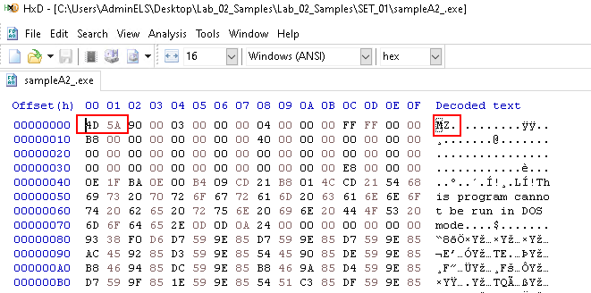
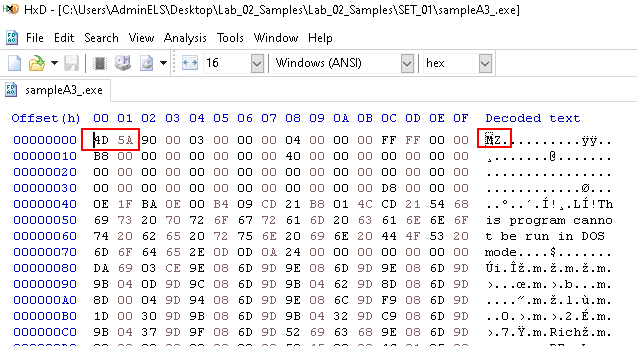
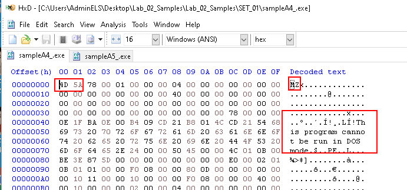
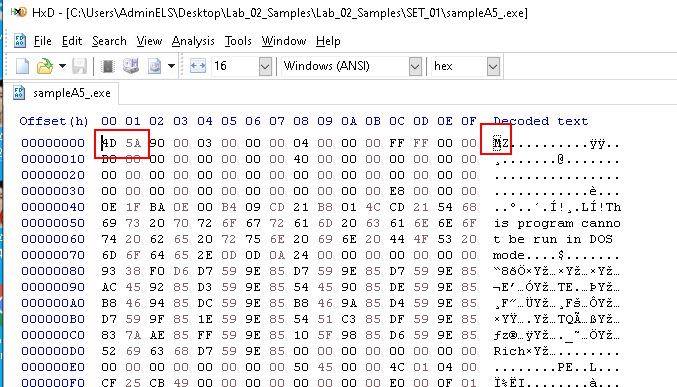
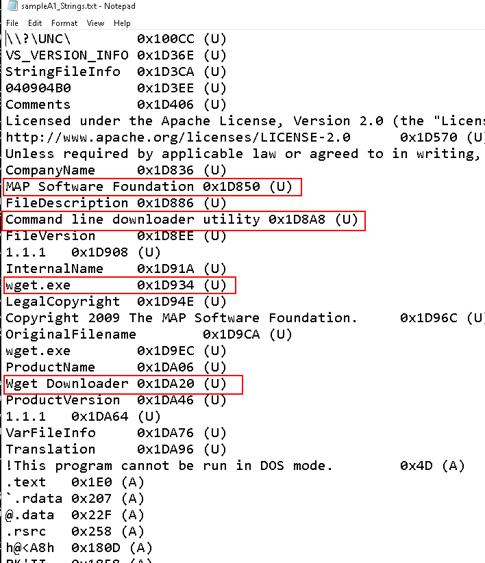

# Lab 02 - File Identification

- [Lab 02 - File Identification](#lab-02---file-identification)
  - [Scenario](#scenario)
  - [Tools](#tools)
  - [Credential](#credential)
  - [Task 1: Generate File Hashes](#task-1-generate-file-hashes)
  - [Task 2: Identify File Types](#task-2-identify-file-types)
  - [Task 3: Classify using Fuzzy Hashes](#task-3-classify-using-fuzzy-hashes)
  - [Task 4: String Extractions](#task-4-string-extractions)
  - [Task 5: More Strings](#task-5-more-strings)
  - [Task 6: Reporting](#task-6-reporting)
    - [Summary](#summary)

---

## Scenario

You have been called by a client to examine a couple of samples that their IR team has collected from different locations within their network.

The goals of this lab are to get comfortable generating hashes for samples, identifying file types, and extracting strings which could be used later to build IOCs.

`Lab_02_Samples.7z` (password = `infected`)

1. generate hashes for samples given
2. compare them with a database for similarity purposes
3. extract strings that could be used for writing IOCs
4. present your work in a formal report.

<br/>

---

## Tools

1. PowerShell
2. BinText
3. Bstrings
4. ssdeep
5. FireEye Labs Obfuscated String Solver (FLOSS)
6. Strings

<br/>

---

## Credential

192.168.210.10 / AdminELS / Nu3pmkfyX

<br/>

---

## Task 1: Generate File Hashes

**Question**

Identify the MD5, SHA1 and SHA256 hash values for the sample.

<br/>

**Answer**

First extract the sample folder using 7-Zip.

Use PowerShell to examine the file hashes:

```
Get-FileHash -Algorithm MD5 .\SET_01\* | Export-Csv SET_01_md5.csv
Get-FileHash -Algorithm SHA1 .\SET_01\* | Export-Csv SET_01_sha1.csv
Get-FileHash -Algorithm SHA256 .\SET_01\* | Export-Csv SET_01_sha256.csv
Get-FileHash -Algorithm MD5 .\SET_02\* | Export-Csv SET_02_md5.csv
Get-FileHash -Algorithm SHA1 .\SET_02\* | Export-Csv SET_02_sha1.csv
Get-FileHash -Algorithm SHA256 .\SET_02\* | Export-Csv SET_02_sha256.csv
```

  

  

<br/>

Alternatively, use **HashMyFiles** to generate all of the hashes at once - drag the folders into **HashMyFiles**:

  

Also generate an HTML report:

  

<br/>

|Filename|MD5|SHA1|CRC32|SHA-256|SHA-512|SHA-384|Full Path|Modified Time|Created Time|Entry Modified Time|File Size|File Version|Product Version|Identical|Extension|File Attributes|
|--- |--- |--- |--- |--- |--- |--- |--- |--- |--- |--- |--- |--- |--- |--- |--- |--- |
|sampleA1_.exe|55e4ae8a3cfe024494429e5e6d18fd57|1f79fa57e408e41b5ba2ad5f7f66def04d837e03|3524369f|66853381cbfb9bce5180abc66107ae8284e7bb5c2245cde2810d4423ac736594|1c900af23f2802a9cbec28c6b8e83ccc23d9cb9153db584d6e3ccacac6aae68524c8beef5b21156567179b7688651f9df55e0b6a86183652e8d3ee7e8b6f0089|b079a503e51b36d63ab3cec37cf8a686333fc74354106267cea5f4c6874ed871a399a9212c1fe5fcf5ab284c6091156f|C:\Users\AdminELS\Desktop\Lab_02_Samples\Lab_02_Samples\SET_01\sampleA1_.exe|12/19/2019 8:58:21 PM|5/23/2021 3:50:22 PM|5/23/2021 3:50:29 PM|122,954|1.1.1|1.1.1||exe|A|
|sampleA2_.exe|67b561db4ab848aa2e6d4c470cdea7d0|9d1936bb4e9afe370202cefd196fb71cfa348c67|217d29fc|3221e0ff49e4ad33eb5dbf63e6678539c7590d2cf11d3ead040a249565760e0a|4981cff1aaf29736b4205347de272655b1d0ce04772e6caf3ec28b1c439613b0b2444f1744300964709ee8a0d9637c0f6ac97ea3ea346d8000e4bb10b50bcedd|f2adc46b28b170dc5201a59ec5a7d87f7a645b6b5da0a4348b6040fb4e8c872dc12d777923e8299f79d74df51d4800de|C:\Users\AdminELS\Desktop\Lab_02_Samples\Lab_02_Samples\SET_01\sampleA2_.exe|12/19/2019 8:14:17 PM|5/23/2021 3:50:22 PM|5/23/2021 3:50:29 PM|286,794|1.4.4.0|||exe|A|
|sampleA3_.exe|21651e453025871eb7fdb0dd3125575c|3c9b3a652a6129432c6787a2e1b9d4f4d6d7dc07|fae3700f|e0bc4dbc113c5d28cc339836e0f9706a9b537dd05aacf66858361c8024299591|b2cbc7462917af45803340e52d45281049a70e7182d41097d52ff69087709ac6602720506101c5b61626488f0e63bbcfe1455d99ac1fadbc5dd707e17fca90a8|7ab1d0f6ab6a55bbf9c5950b70a591befb8946238a8943cf9e252b7c8877f1d7373c40cc4f3133e4e42571254a4911fe|C:\Users\AdminELS\Desktop\Lab_02_Samples\Lab_02_Samples\SET_01\sampleA3_.exe|12/19/2019 9:15:14 PM|5/23/2021 3:50:22 PM|5/23/2021 3:50:29 PM|91,136||||exe|A|
|sampleA4_.exe|b62a9224072c581e662db646f6a3a175|63166a3da2004c27a8fd7c5849f9cc5d077c3c16|7508cc7a|b113168035bef9d50f656c65af8eeaaf09d97bef8e57702031936fbbd2a621b1|3800f11b31b08de32eded6e3218cc351be07169ffd71c4b987fba0af5acd2537b2888647cf50d64067e9a1fbef7f9ebc1b7b94d273c4e22a1a989d8b729f8a47|57479970528c5da6d47baaec0b074c6cf09a3ca0a9e1c78000227b16973864d92fca1a6bfaf567c5561a9377bb0faad7|C:\Users\AdminELS\Desktop\Lab_02_Samples\Lab_02_Samples\SET_01\sampleA4_.exe|12/19/2019 7:43:54 PM|5/23/2021 3:50:22 PM|5/23/2021 3:50:29 PM|1,425,408|Release 0.73 (with embedded help)|Release 0.73|1|exe|A|
|sampleA5_.exe|0b959f96144017bb3e48fec4a74f120c|808db52580ddf5e8528eb4ce57abb76aeb9cfe47|b6df410a|7e8ddac230f738f8f1eef42935de7017eeaf1172d14b33f4b601b24acc62ee3f|ae759442689a1268552a49aaf3800eeeee6bc722cf2a987f4b614ca719e59890e297b5bbf294b757a7daca58ef3a1e25035466414c3552fe35a9db2d46299148|7f321f66e2d91b2ec823eb6525d59dba8ad8768d3b0b41843476db804e4fbb2d4ca6e5fe591c29591656dee4961fb76e|C:\Users\AdminELS\Desktop\Lab_02_Samples\Lab_02_Samples\SET_01\sampleA5_.exe|12/19/2019 8:56:45 PM|5/23/2021 3:50:22 PM|5/23/2021 3:50:29 PM|118,858|0.1|||exe|A|
|sampleB1_.exe|18b517f7346a2e76ab9671c5c65f1cb9|09118937c3250c0b4c96fc1313e64046ef610004|f58120cb|a8982f715e3f2d7062c11459184558ef3aebc2e559ee0c5980264b6793e39572|4ad3abd4fa80492815f21196543901e6b8faca00b659f26b99b73179a3a64d32e9b443bc9b51cc434b501a7cd193c5718b48332428061b2effff485bfc58246b|a3507c6f43413b6c60b104ca4671a3d2204a49382043d202b18a6ab661362591dbc5df48605abfea50f3894ba15178cf|C:\Users\AdminELS\Desktop\Lab_02_Samples\Lab_02_Samples\SET_02\sampleB1_.exe|12/19/2019 8:59:16 PM|5/23/2021 3:50:22 PM|5/23/2021 3:50:29 PM|282,112|5.00.2128.1|5.00.2128.1||exe|A|
|sampleB2_.exe|a3969b60338064e19ff7d1c1432bb282|0d280fdaf352e26a2447ae46fd15e554199dd610|648f1275|0c98cba6f730980dc24b4c693a848850e9b967ad194ca1f103dce7732e0ac183|2a7c833c24883b69da9c15cb03191487d45c3dddf4dce1d2dd5cbd4f123a643b839fe15c82824af16c194c7582e1fea878cb63b8710d63a67cee444e28120b7e|b28a007de1f541ca3a01183dd4973acd49df8a4e5de64066f40620682afd0fb78f9319abb75553abf718884d0f4e5bdd|C:\Users\AdminELS\Desktop\Lab_02_Samples\Lab_02_Samples\SET_02\sampleB2_.exe|12/29/2004 5:07:18 PM|5/23/2021 3:50:22 PM|5/23/2021 3:50:29 PM|94,208||||exe|A|
|sampleB3_.exe|b62a9224072c581e662db646f6a3a175|63166a3da2004c27a8fd7c5849f9cc5d077c3c16|7508cc7a|b113168035bef9d50f656c65af8eeaaf09d97bef8e57702031936fbbd2a621b1|3800f11b31b08de32eded6e3218cc351be07169ffd71c4b987fba0af5acd2537b2888647cf50d64067e9a1fbef7f9ebc1b7b94d273c4e22a1a989d8b729f8a47|57479970528c5da6d47baaec0b074c6cf09a3ca0a9e1c78000227b16973864d92fca1a6bfaf567c5561a9377bb0faad7|C:\Users\AdminELS\Desktop\Lab_02_Samples\Lab_02_Samples\SET_02\sampleB3_.exe|12/19/2019 7:45:32 PM|5/23/2021 3:50:22 PM|5/23/2021 3:50:29 PM|1,425,408|Release 0.73 (with embedded help)|Release 0.73|1|exe|A|
|sampleB4_.exe|9052d06c6ac53471f8496263f8fef2eb|73016558c8353509b15cd757063816369e9abfa7|53f55644|736330aaa3a4683d3cc866153510763351a60062a236d22b12f4fe0f10853582|84837f8c708a8e51fcc611c3035c5676ff527d5b132398d935c77ac737035bef9c27dd6010188d6c96b7d1b02ff8dc41a3f50c487f42348bd0f3d016164fa7fc|3b7dbae202b252a64bdf3b915d25dec0686effef82254e87d55bb9e6ad4e39f7193447cadb95dcee216ed93c3a002474|C:\Users\AdminELS\Desktop\Lab_02_Samples\Lab_02_Samples\SET_02\sampleB4_.exe|12/19/2019 7:30:09 PM|5/23/2021 3:50:22 PM|5/23/2021 3:50:29 PM|1,096,080|Release 0.73 (with embedded help)|Release 0.73||exe|A|

<br/>

---

## Task 2: Identify File Types

**Question**

Identify the type of file for each of the samples given in SET#1.

<br/>

**Answer**

To identify the file types in SET#1, we can use **HxD** to inspect one-by-one.

<br/>

1. sampleA1_.exe

  

- Based on the magic bytes `MZ` (`0x4D5A`), it is a PE (EXE)

<br/>

2. sampleA2_.exe

  

- Based on the magic bytes `MZ` (`0x4D5A`), it is a PE (EXE)

<br/>

3. sampleA3_.exe

  

- Based on the magic bytes `MZ` (`0x4D5A`), it is a PE (EXE)

<br/>

4. sampleA4_.exe

  

- Based on the magic bytes `MZ` (`0x4D5A`), it is a PE (EXE)

<br/>

5. sampleA5_.exe

  

- Based on the magic bytes `MZ` (`0x4D5A`), it is a PE (EXE)

<br/>

---

## Task 3: Classify using Fuzzy Hashes

**Question**

Perform file classification using fuzzy hashing. Use `SSDEEP` to create a hash database for samples in SET#1 and then use the files in SET#2 to compare between them. Identity similar files and determine the percentage of similarity.

<br/>

**Answer**

First use `ssdeep.exe` to create a hash database:

```
ssdeep.exe -b ..\SET_01\* > hash_database.txt
```

  

<br/>

Then compare the hashes of SETB with the hash database:

```
ssdeep.exe -bm hash_database.txt ..\SET_02\*
```

  

<br/>

The result is summarized as follows:

| File | Similar file | Similarity |
| --- | --- | --- |
| sampleB1_.exe | sampleA2_.exe | 65% |
| sampleB2_.exe | sampleA3_.exe | 90% |
| sampleB3_.exe | sampleA4_.exe | 100% |
| sampleB4_.exe | sampleA4_.exe | 80% |

<br/>

---

## Task 4: String Extractions

**Question**

Extract all the strings that can be useful and provide meaning. List their type (ASCII or Unicode) and the offset of their location.

<br/>

**Answer**

1. sampleA1_.exe

Use **BinText.exe** to inspect:

  

Interesting strings:

| Offset | String Type | String |
| --- | --- | --- |
| 0x7FB9 | ASCII | `/user1.exe` |
| 0x8036 | ASCII | `downloader.exe` |
| 0x804A | ASCII | `www.elsmap.tech` |
| 0x1D850 | Unicode | `MAP Software Foundation` |
| 0x1D934 | Unicode | `wget.exe` |

<br/>

2. sampleA2_.exe

Interesting strings:

| Offset | String Type | String |
| --- | --- | --- |
| 0x46010 | ASCII | `C:\local0\asf\release\build-2.2.14\support\Release\ab.pdb` |
| 0x45B4C | Unicode | `Adobe PDF Documet Reader` |
| 0xF264 | ASSCII | `Usage: %s [options] [http://]hostname[:port]/path` |


<br/>

3. sampleA3_.exe

Interesting strings:

| Offset | String Type | String |
| --- | --- | --- |
| 0xC498 | ASCII | `c:\netcat\Release\netcat.pdb` |

<br/>

4. sampleA4_.exe

Interesting strings:

| Offset | String Type | String |
| --- | --- | --- |
| 0x10012C | Unicode | `PuTTY suite` |
| 0x100290 | Unicode | `Release 0.73` |

<br/>

5. sampleA5_.exe

Interesting strings:

| Offset | String Type | String |
| --- | --- | --- |
| 0x4423 | ASCII | `net user ah Xbox2020 /ADD` |
| 0x1D010 | ASCII | `C:\local0\asf\release\build-2.2.14\support\Release\ab.pdb` |
| 0x1C7B0 | Unicode | `The DOERS` |


<br/>

---

## Task 5: More Strings

**Question**

Repeat the requirement of task #4 using different tools and target strings with more than 5 characters. Compare the results of both tasks and explain which could be helpful in building IOCs.

**Answer**

We can use **bstrings.exe** to extract strings:

```
bstrings.exe -f SET_01\sampleA1_.exe -m 5 --off -o .\sampleA1_Strings.txt
bstrings.exe -f SET_01\sampleA2_.exe -m 5 --off -o .\sampleA2_Strings.txt
bstrings.exe -f SET_01\sampleA3_.exe -m 5 --off -o .\sampleA3_Strings.txt
bstrings.exe -f SET_01\sampleA4_.exe -m 5 --off -o .\sampleA4_Strings.txt
bstrings.exe -f SET_01\sampleA5_.exe -m 5 --off -o .\sampleA5_Strings.txt
```

- `-m`: minimum length = 5
- `--off`: Show the offset

  

  

<br/>

---

## Task 6: Reporting

**Question**

Write a simple report explaining the results in a way that could be easy to read by your client. Based on your analysis results, explain if you think the samples are benign or suspicious and whether they require further investigation/analysis.

<br/>

**Answer**

### Summary

The suspicious files given have been analyzed. Belwo are the results of all the findings.

The following table summarizes the result of the analysis:

| Filename | Verdict | Reason |
| --- | --- | --- |
| SampleA1_.exe | Suspicious | |
| SampleA2_.exe | 