# 04 - Packed Malware Identification and Basic Analysis

- [04 - Packed Malware Identification and Basic Analysis](#04---packed-malware-identification-and-basic-analysis)
  - [Scenario](#scenario)
  - [Tools](#tools)
  - [Task 1: Packer Identification](#task-1-packer-identification)
    - [Using CFF Explorer](#using-cff-explorer)
    - [Using Exeinfo PE](#using-exeinfo-pe)
    - [Using PEStudio](#using-pestudio)
    - [Using Detect It Easy (DiE)](#using-detect-it-easy-die)
  - [Task 2: String Extractions - Part 1](#task-2-string-extractions---part-1)
    - [Using BinText](#using-bintext)
    - [Using PEStudio](#using-pestudio-1)
  - [Task 3: PE File Anaylsis - Part 1](#task-3-pe-file-anaylsis---part-1)
    - [PE Studio](#pe-studio)
  - [Task 4: Resource Analysis](#task-4-resource-analysis)
    - [Using Resource Hacker](#using-resource-hacker)
  - [Task 5: Unpacking](#task-5-unpacking)
    - [GUI - CFF Explorer](#gui---cff-explorer)
    - [CLI - UPX.exe](#cli---upxexe)
  - [Task 6: String Extractions - Part 2](#task-6-string-extractions---part-2)
    - [PEStudio](#pestudio)
  - [Task 7: PE Analysis - Part 2](#task-7-pe-analysis---part-2)
    - [PE Studio](#pe-studio-1)

---

## Scenario

You have been called by a client to examine a couple of samples that their IR team has collected from different locations within their network.

The samples for this lab are in `Lab_04.zip` (password = `infected`)

<br/>

**Goals**

The goals of this lab are to understand what a packed executable is, how some can be unpacked using basic techniques, and why sometimes you will need different analysis approaches for analyzing packed samples.

You will learn how to identify packed samples, unpack them, and continue your analysis. You will also learn when further analysis is required.

<br/>

192.168.210.10 / AdminELS / Nu3pmkfyX

<br/>


---

## Tools

| Tools | Usage |
| --- | --- |
| BinText | Inspect ASCII / Unicode strings in the binary |
| Strings | Inspect ASCII strings | 
| Bstrings | Inspect ASCII strings (Windows) |
| FLOSS | |
| PEiD | | 
| Detect it Easy (DiE) | | 
| Exeinfo PE | | 
| pestudio | |
| CFF Explorer | | 
| Resource Hacker | |
| UPX | |

<br/>

---

## Task 1: Packer Identification

**Question**

Identify whether or not the file is packed and, if so, what type of packer is being used.

<br/>

**Answer**

### Using CFF Explorer

First examine the file `Lab3_1.exe` and inspect its **Section Headers** using **CFF Explorer**:

  

- The sections naming is different from a typical PE 
- **UPX0** has a raw size of `0`, which is a hint of the usage of packing

Also check the **Characteristics** flags:

  

- It is writable
- It contains uninitialized data, which are all flags that packers will use

<br/>

### Using Exeinfo PE

Open `Lab3_1.exe` in **ExeinfoPE.exe**:

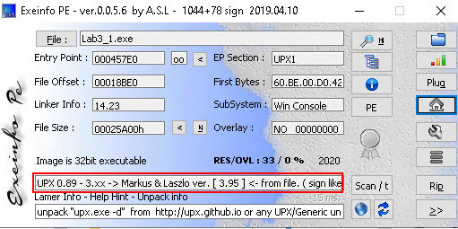  

- `UPX 0.89 - 3.xx -> Markus & Laszlo ver. [ 3.95 ] <- from file. ( sign like UPX packer ) `
- The PE is packed by **UPX packer**

<br/>

### Using PEStudio

Open `Lab3_1.exe` in **PEStudio**:

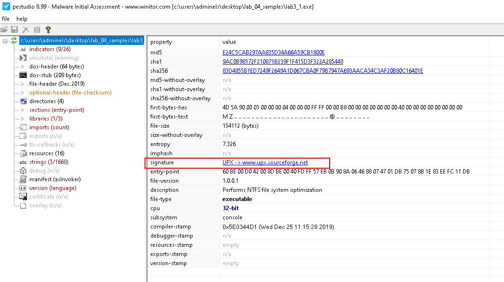  

- The signature shows `UPX -> www.upx.sourceforge.net`

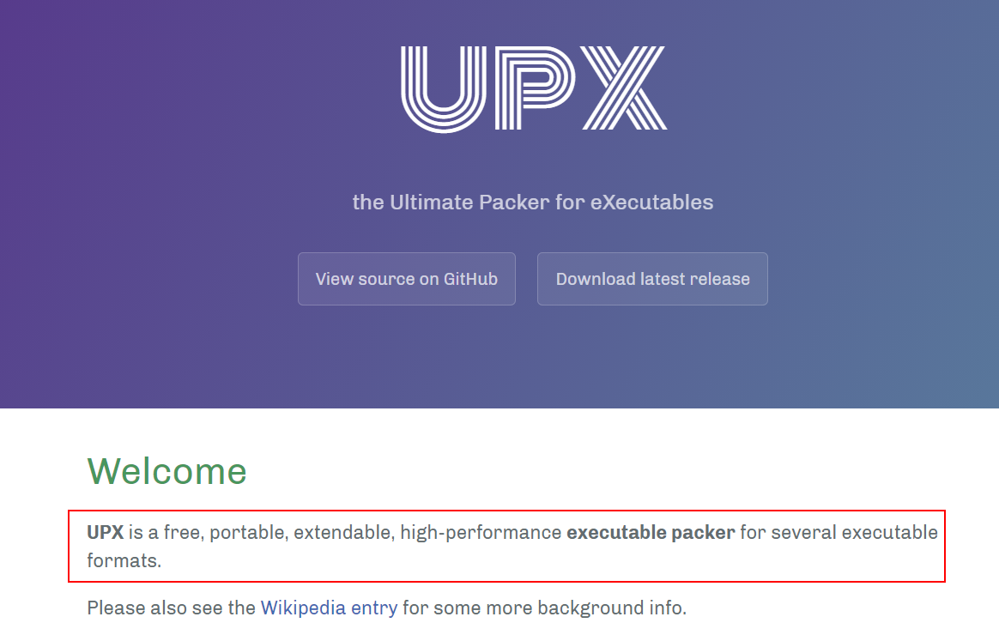  

<br/>

### Using Detect It Easy (DiE)

Open `Lab3_1.exe` in **DiE**:

  

- The executable is packed with **UPX (3.95)**

<br/>

Clicking the `S` in the section, it shows the signature:

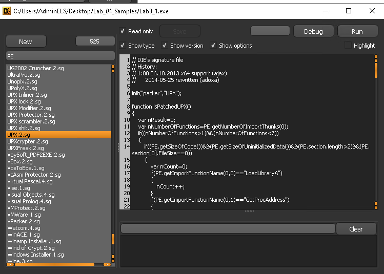  

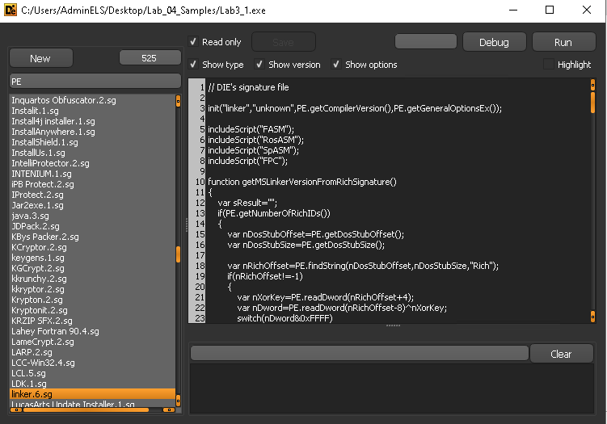  

<br/>

Also check the Entropy:

  

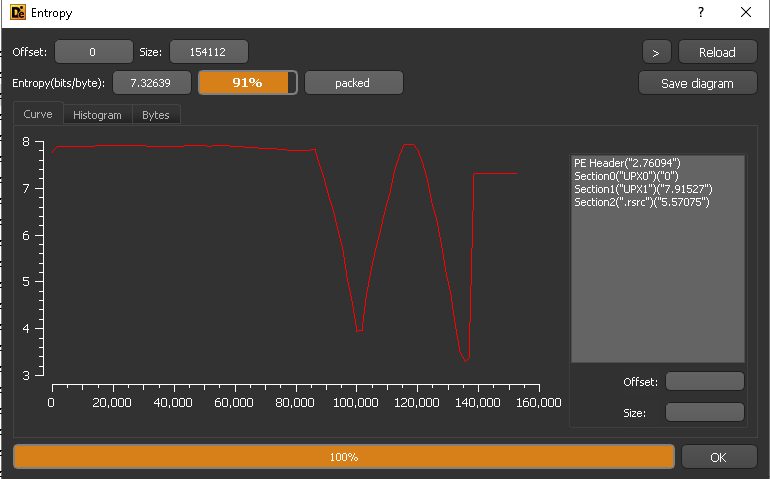  


| Section | Entropy | Verdict |
| --- | --- | --- |
| PE Header | 2.76 | Normal |
| Section0 | 0 | Suspicious |
| Section1 | 7.91527 | Indicator of scrambled / compressed / packed |
| Section2 | 5.57075 | Normal |

- The analysis of DiE shows the entropy to be `7.32639`, which is likely a packed PE

<br/>

---

## Task 2: String Extractions - Part 1

**Question**

Use the string extraction techniques you learned to extract as many strings as you can to help you understand the sample’s capabilities.

<br/>

**Answer**

### Using BinText

Scan the file using **BinText**:

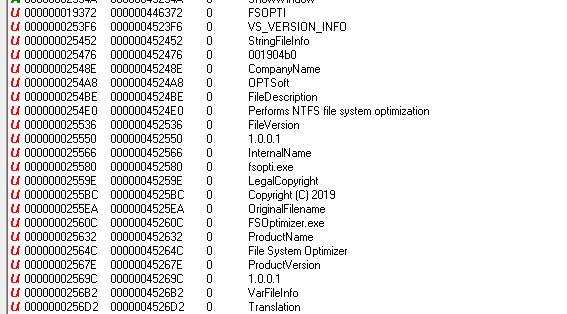  

- Company Name: `OPTSoft`
- File Description: `Performs NTFS file system optimization`
- Internal Name: `fsopti.exe`
- Original Filename: `FSOptimizer.exe`
- Product Name: `File System Optimizer`
- Version: `1.0.0.1`

<br/>

### Using PEStudio

Open `lab3_1.exe` in PEStudio and inspect the **Strings** section:

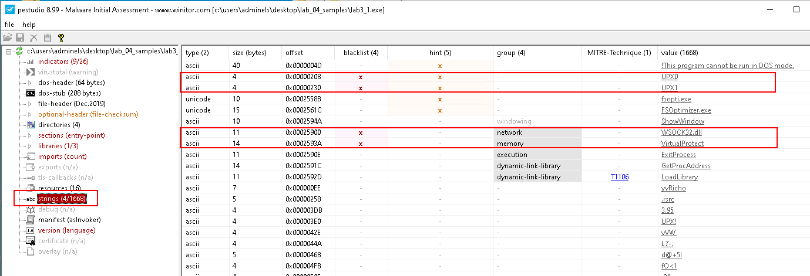  

- `blacklist` means the stings are known to be used by malware
- `hint` means notable / suspicious

<br/>

Checking the **Verison** section:

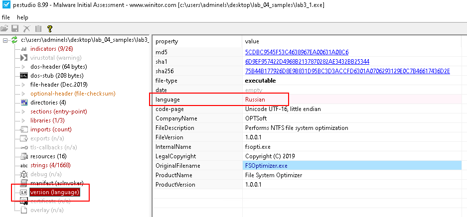  

- The language `Russian` is highly suspicious since it does match the context of the company
- The filename `FSOptimizer.exe` is not a known software

  

<br/>

Checking the **Imports** section:

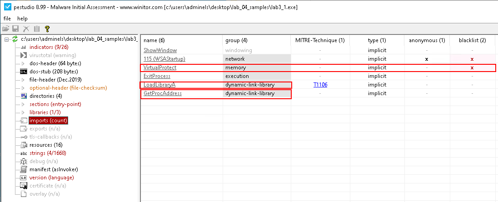  

- `VirtualProtect` changes the protection on a region of committed pages in the virtual address space of the calling process; this change the memory region, for example, from RW(`rw-`) to RX(`r-x`) so the sample can execute code from that memory region
- `LoadLibraryA` loads the specified module into the address space of the calling process; since the PE is packed, it is likely that it uses this import to load a library that it needs to call some functions
- `GetProcAddress` retrieves the address of an exported function or variable from the specified DLL; after loading the library, this module help call functions required from within the library

<br/>

Checking the **Libraries** section:

  

- wsock32.dll
- kernel32.dll
- user32.dll

<br/>

---

## Task 3: PE File Anaylsis - Part 1

**Question**

Use the PE file analysis skills you learned to do first attempt of analysis on the sample.

<br/>

**Answer**

### PE Studio

Open the sample `lab3_1.exe` in PEStudio and check the **indicators** section:

  

- The highlighted indicators refer to UPX information
- There are 2 writable and executable sections - those are probably where the new libararies or other malicious will be loaded `written` and then executed

<br/>

Check the **sections**:

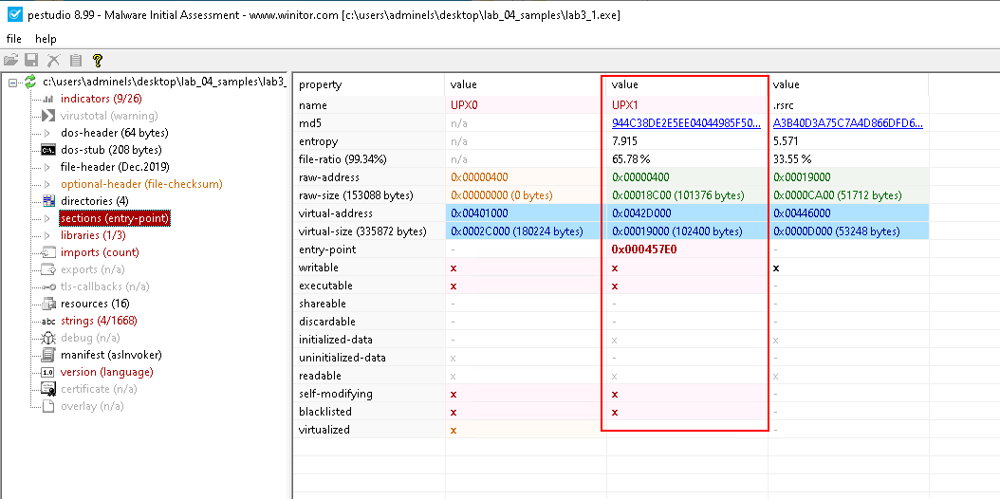  

- The `EntryPoint` is the **UPX1** section, which is probably to start the unpacking process

<br/>

Checking the **imports**:

  

- 6 functions are referenced, where 5 are referenced by name and 1 is referenced by ordinal number
- It shows 2 blacklist import modules - `115 (WSAStartup)` and `VirtualProtect`
- `115 (WSAStartup)` indicates the mapping by PEStudio and translated the ordinal number `115` to the referenced name `WSAStartup`

<br/>

---

## Task 4: Resource Analysis

**Question**

Check whether or not the resource section is packed and analyze it.

<br/>

**Answer**

### Using Resource Hacker

Load the executable into **Resource Hacker**:

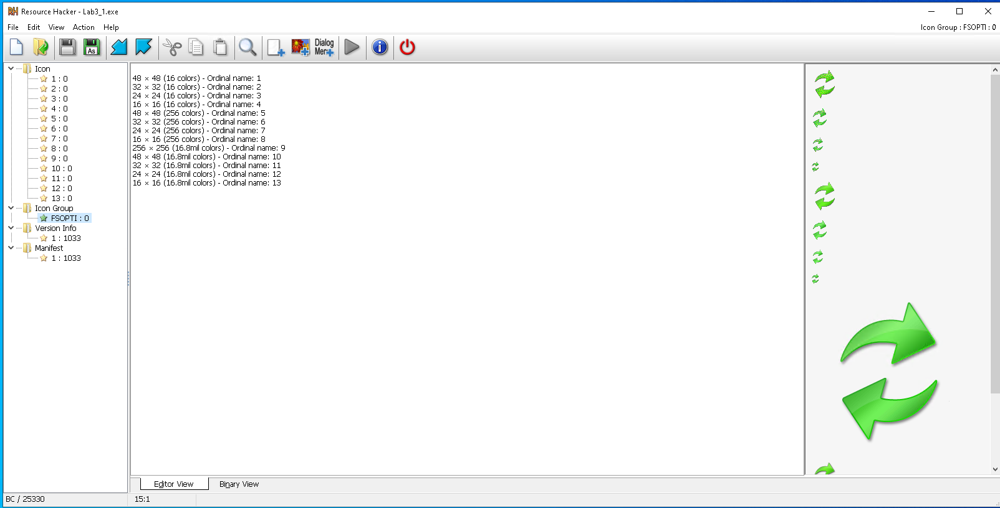  

- `FSOPTI: 0` shows all the icons used by the program

<br/>

Check the **Version Info** section:

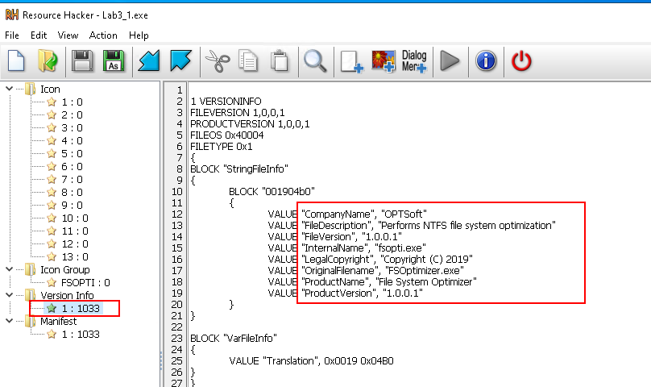  

- Again this shows the metadata of the file, which is also seen in the String analysis
- The program name is not a well-known one, which is suspicious

<br/>

Check the **Manifest** section:

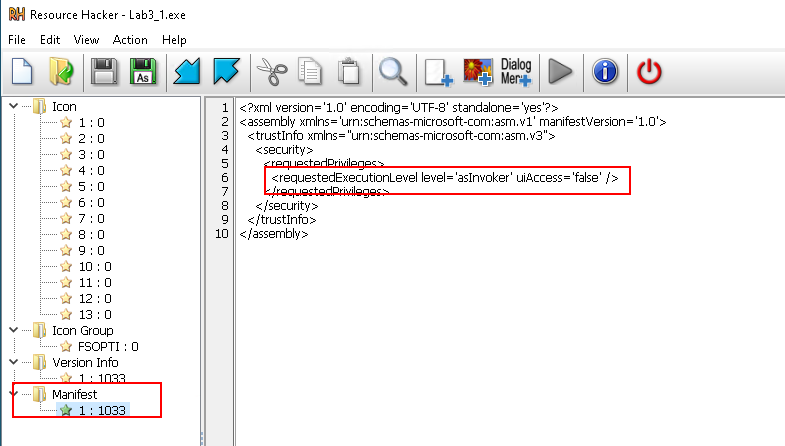  


- `<requestedExecutionLevel level='asInvoker' uiAccess='false' />`
- `asInvoker` = Not requiring Administrator privilege to execute

<br/>

---

## Task 5: Unpacking

**Question**

Try to unpack the given sample.

<br/>

**Answer**

### GUI - CFF Explorer

Load the sample `lab3_1.exe` into **CFF Explorer** and go to **UPX Utility**:

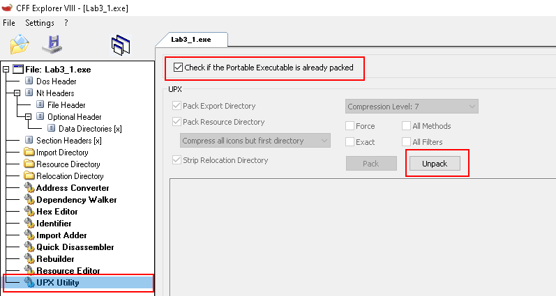  

- Click `Unpack`

<br/>

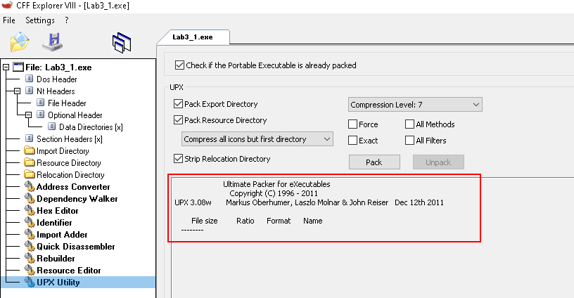  

<br/>

Inspect the **Section Headers**:

  

- As shown, the orginal sections of the PE are shown

<br/>

  

- Save the unpacked PE as `Lab3_1_unpacked.exe`

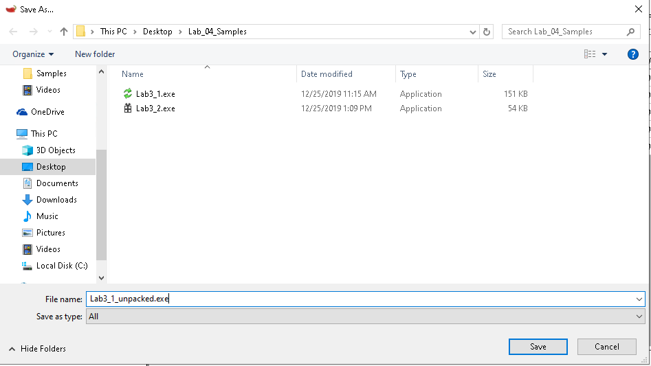  

<br/>

### CLI - UPX.exe

Download **upx.exe** from https://github.com/upx/upx/releases/tag/v3.96.

```
upx.exe --help
```

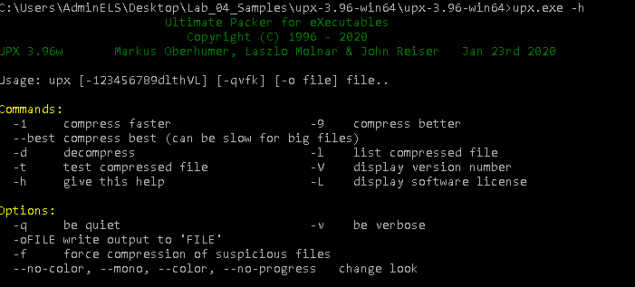  

- To decompress, use the `-d` switch
- To write output, use the `-o` switch

```
upx.exe -d C:\Users\AdminELS\Desktop\Lab_04_Samples\Lab3_1.exe -o C:\Users\AdminELS\Desktop\Lab_04_Samples\Lab3_1_unpacked_upx.exe
```

  

<br/>

Load the unpacked sample into **CFF Explorer** and check the **sections header**:

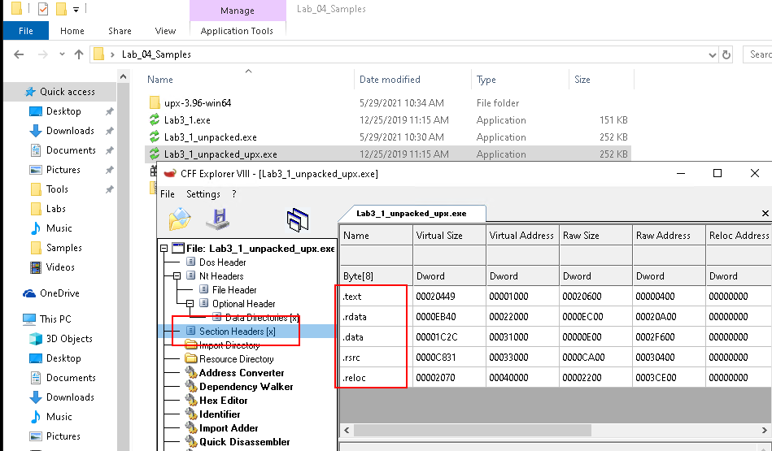  

- As shown, the PE has been unpacked and the original sections are shown

<br/>

---

## Task 6: String Extractions - Part 2

**Question**

After you were able to unpack the sample, do a second attempt of string extraction and see if you got anything different this time.

<br/>

**Answer**

### PEStudio

Inspect the strings using **PEStudio**:

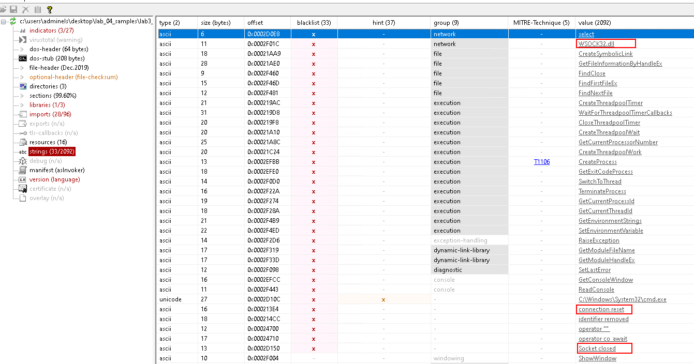  

- Some network related strings are found

<br/>

---

## Task 7: PE Analysis - Part 2

**Questions**

This is a second attempt of analyze the PE file after you were able to unpack the sample. See if you find anything different this time.

<br/>

**Answer**

### PE Studio

Again use **PE Studio** to check the indicators on the unpacked sample:

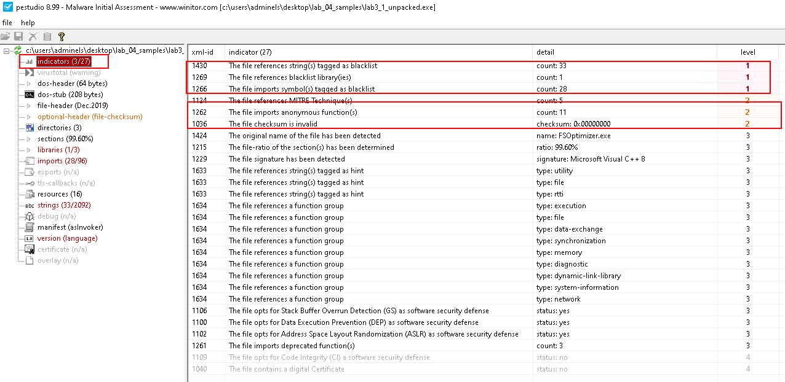  

<br/>

Check the **Imported Libraries**:

  

- Note the number of functions imported
- `wsock32.dll`: 11 functions (1 when packed)
- `kernel32.dll`: 84 (4 when packed)
- `user32.dll`: 1 (same with packed)

<br/>

Check the **imports** section:

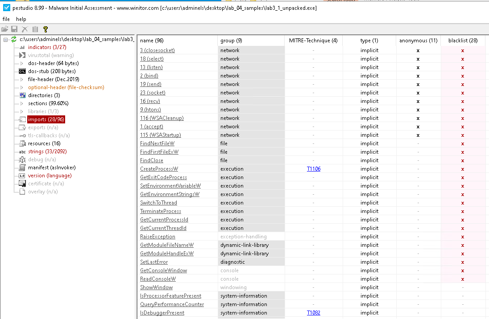  

- Notable imports:

| name | group | flag |
| --- | --- | --- |
| closesocket | network | anonymous, blacklist |
| select | network | anonymous, blacklist |
| listen | network | anonymous, blacklist |
| bind | network | anonymous, blacklist |
| send | network | anonymous, blacklist |
| socket | network | anonymous, blacklist |
| recv | network | anonymous, blacklist |
| htons | network | anonymous, blacklist |
| WSACleanup | network | anonymous, blacklist |
| accept | network | blacklist |
| WSAStartup | network | blacklist |
| FindNextFileW | file | blacklist |
| FindFirstFileExW | file | blacklist |
| FindClose | file | blacklist |
| CreateProcessW | execution | T1106, blacklist |
| GetExitCodeProcess | execution | blacklist |
| SetEnvironmentVariableW | execution | blacklist |
| GetEnvironmentStringsW | execution | blacklist |
| SwitchToThread | execution | blacklist |
| TerminateProcess | execution | blacklist |
| GetCurrentProcessId | execution | blacklist |
| GetCurrentThreadId | execution | blacklist |
| RaiseException | exception-handling | blacklist |
| GetModuleFileNameW | exception-handling | blacklist |
| GetModuleHandleExW | exception-handling | blacklist |
| SetLastError | diagnostic | blacklist |
| GetConsoleWindow | console | blacklist |
| ReadConsoleW | console | blacklist |

<br/>

---

