# Lab 05 - Writing YARA rules

- [Lab 05 - Writing YARA rules](#lab-05---writing-yara-rules)
  - [Scenario](#scenario)
  - [Tools](#tools)
  - [Task 1: Basic Rules](#task-1-basic-rules)
    - [SampleA1_.exe](#samplea1_exe)
    - [SampleA2_.exe](#samplea2_exe)
    - [SampleA3_.exe](#samplea3_exe)
    - [SampleA4_.exe](#samplea4_exe)
    - [SampleA5_.exe](#samplea5_exe)
  - [Task 2: Rules and PE imports](#task-2-rules-and-pe-imports)
    - [Lab_02.exe](#lab_02exe)
  - [Task 3: Advanced PE rules](#task-3-advanced-pe-rules)
    - [Packed sample](#packed-sample)
    - [Unpacked](#unpacked)

---

## Scenario

In this lab, you are called to write YARA signatures (rules) to locate all of the samples that have been examined so far.

The goal of this lab is to get comfortable transforming IOCs into YARA rules.

You will learn how to write YARA rules using the IOCs collected. The rules that you will learn range from easy to more advanced.

<br/>

192.168.210.10 / AdminELS / Nu3pmkfyX

- Sample: `Lab_05_Samples.7z`

<br/>

---

## Tools

- Notepad++
- Yara32.exe

<br/>

---

## Task 1: Basic Rules

**Questions**

You are required to write YARA rules to classify all of the samples collected in Lab 01.

<br/>

**Answer**

### SampleA1_.exe

Information about **SampleA1_.exe**:

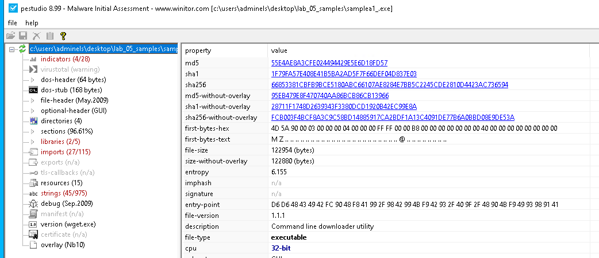  

- MD5: 55E4AE8A3CFE024494429E5E6D18FD57
- SHA1: 1F79FA57E408E41B5BA2AD5F7F66DEF04D837E03
- SHA256: 66853381CBFB9BCE5180ABC66107AE8284E7BB5C2245CDE2810D4423AC736594
- First bytes: 0x4D5A

  

- `0x7FB9`: `/user1.exe`
- `0x804A`: `www.elsmap.tech`
- `0x0836`: `downloader.exe`
- `0x1E010`: `C:\local0\asf\release\build-2.2.14\support\Release\ab.pdb`

<br/>

YARA rule:

```
import "hash"

rule DetectSampleA1
{
  meta:
    description = "Rule to detect SampleA1_.exe"
    author = "Brian Yau"
    date = "29 May 2021"
  strings:
    $mz = {4d 5a}
    $s1 = "/user1.exe"
    $s2 = "www.elsmap.tech"
    $s3 = "downloader.exe"
    $s4 = "C:\\local0\\asf\\release\\build-2.2.14\\support\\Release\\ab.pdb"
  condition:
    (
      ($mz at 0) and (hash.md5(0, filesize) == "55e4ae8a3cfe024494429e5e6d18fd57" or hash.sha1(0, filesize) == "1f79fa57e408e41b5ba2ad5f7f66def04d837e03" or hash.sha256(0, filesize) == "66853381cbfb9bce5180abc66107ae8284e7bb5c2245cde2810d4423ac736594" )) or
      ( ($mz at 0) and 2 of ($s*) )
}
```

<br/>

Use **yara32.exe** to try detecting **SampleA1_.exe**:

```
yara32.exe Task1-1.yar -s -r . 
```

  


<br/>

### SampleA2_.exe

Use **PEStudio.exe** to extract some information:

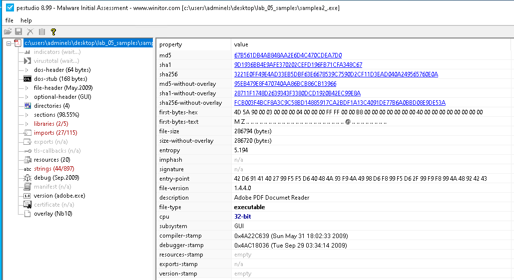  

- md5: 67B561DB4AB848AA2E6D4C470CDEA7D0
- sha1: 9D1936BB4E9AFE370202CEFD196FB71CFA348C67
- sha256: 3221E0FF49E4AD33EB5DBF63E6678539C7590D2CF11D3EAD040A249565760E0A
- First bytes: `0x4D5A`

<br/>

  

- `0x45BE2`: `adobe.exe`
- `0x46010`: `C:\\local0\\asf\\release\\build-2.2.14\\support\\Release\\ab.pdb`

<br/>

Yara Rule:

```
import "hash"

rule DetectSampleA2 
{
  meta:
    description = "Detect SampleA2"
    author = "Brian Yau"
    date = "30 May 2021"
  strings:
    $mz = {4d 5a}
    $s1 = "adobe.exe" wide
    $s2 = "C:\\local0\\asf\\release\\build-2.2.14\\support\\Release\\ab.pdb"
  condition:
    ( ($mz at 0) and ( hash.md5(0, filesize) == "67b561db4ab848aa2e6d4c470cdea7d0" or hash.sha1(0, filesize) == "9d1936bb4e9afe370202cefd196fb71cfa348c67" or hash.sha256(0, filesize) == "3221e0ff49e4ad33eb5dbf63e6678539c7590d2cf11d3ead040a249565760e0a" ) ) or
    ( ($mz at 0) and ( all of ($s*)) )
}
```

Note:
To match strings in Unicode, use the `wide` keyword

<br/>

Use `yara32.exe` to test:

```
yara32.exe Task1-2.yar -s -r .
```

  

<br/>

### SampleA3_.exe

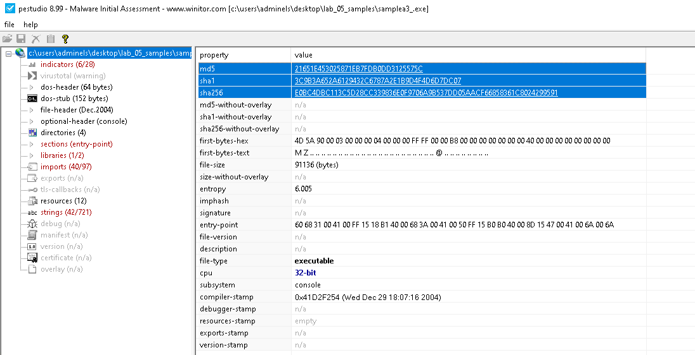  

- md5: 21651E453025871EB7FDB0DD3125575C
- sha1: 3C9B3A652A6129432C6787A2E1B9D4F4D6D7DC07
- sha256: E0BC4DBC113C5D28CC339836E0F9706A9B537DD05AACF66858361C8024299591
- First bytes: `0x4D5A`

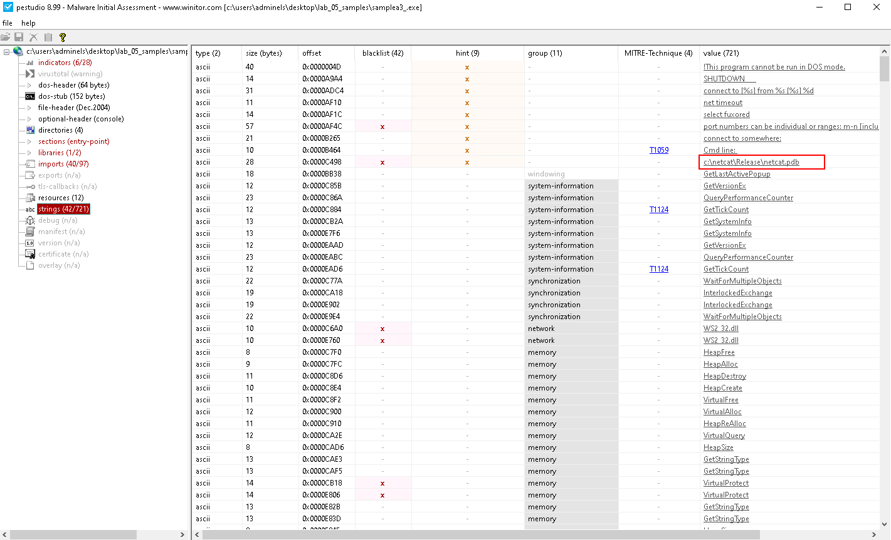  

- `0xC498`: `c:\\netcat\\Release\\netcat.pdb`

<br/>

Yara Rule:

```
import "hash"

rule DetectSampleA3 
{
  meta:
    description = "Detect SampleA3"
    author = "Brian Yau"
    date = "30 May 2021"
  strings:
    $mz = {4d 5a}
    $s1 = "c:\\netcat\\Release\\netcat.pdb" nocase ascii wide
  condition:
    ( 
      ($mz at 0 and $s1) and
      ( hash.md5(0, filesize) == "21651e453025871eb7fdb0dd3125575c" or hash.sha1(0, filesize) == "3c9b3a652a6129432c6787a2e1b9d4f4d6d7dc07" or hash.sha256(0, filesize) == "e0bc4dbc113c5d28cc339836e0f9706a9b537dd05aacf66858361c8024299591" )
    )
}
```

<br/>

Check the yara rule:

```
yara32.exe Task1-3.yar -s -r .
```

  

<br/>

### SampleA4_.exe

Load **SampleA4_.exe** in PEStudio:

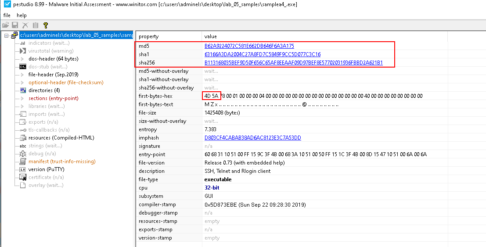  

- md5: b62a9224072c581e662db646f6a3a175
- sha1: 63166a3da2004c27a8fd7c5849f9cc5d077c3c16
- sha256: b113168035bef9d50f656c65af8eeaaf09d97bef8e57702031936fbbd2a621b1
- First bytes: `0x4D5A`

<br/>

Load the sample in BinText:

  

- `0x100228`: `Release 0.73 (with embedded help)`
- `0x10012C`: `PuTTY suite`

<br/>

Yara Rule:

```
import "hash"

rule DetectSampleA4
{
  meta:
    description = "Detect SampleA4"
    author = "Brian Yau"
    date = "30 May 2021"
  strings:
    $mz = {4d 5a}
    $s1 = "Release 0.73 (with embedded help)" nocase ascii wide
    $s2 = "PuTTY suite" nocase ascii wide
  condition:
    ( 
      ( $mz at 0 and all of ($s*) ) or
      ( hash.md5(0, filesize) == "b62a9224072c581e662db646f6a3a175" or hash.sha1(0, filesize) == "63166a3da2004c27a8fd7c5849f9cc5d077c3c16" or hash.sha256(0, filesize) == "b113168035bef9d50f656c65af8eeaaf09d97bef8e57702031936fbbd2a621b1" )
    )
}
```

<br/>

Check the rule by running:

```
yara32.exe Task1-4.yar -s -r .
```

  

<br/>

### SampleA5_.exe

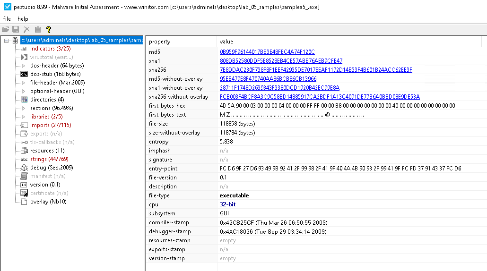  

- md5: 0b959f96144017bb3e48fec4a74f120c
- sha1: 808db52580ddf5e8528eb4ce57abb76aeb9cfe47
- sha256: 7e8ddac230f738f8f1eef42935de7017eeaf1172d14b33f4b601b24acc62ee3f
- First bytes: `0x4D5A`

  

- `0x4423`: `net user ah Xbox2020 /ADD`
- `0x1D010`: `C:\\local0\\asf\\release\\build-2.2.14\\support\\Release\\ab.pdb`

<br/>

Yara Rule:

```
import "hash"

rule DetectSampleA5
{
  meta:
    description = "Detect SampleA5"
    author = "Brian Yau"
    date = "30 May 2021"
  strings:
    $mz = {4d 5a}
    $s1 = "net user ah Xbox2020 /ADD" nocase ascii wide
    $s2 = "C:\\local0\\asf\\release\\build-2.2.14\\support\\Release\\ab.pdb" nocase ascii wide
  condition:
    ( 
      ( $mz at 0 and all of ($s*) ) or
      ( hash.md5(0, filesize) == "0b959f96144017bb3e48fec4a74f120c" or hash.sha1(0, filesize) == "808db52580ddf5e8528eb4ce57abb76aeb9cfe47" or hash.sha256(0, filesize) == "7e8ddac230f738f8f1eef42935de7017eeaf1172d14b33f4b601b24acc62ee3f" )
    )
}
```

<br/>

Run the Yara rule against the samples:

```
yara32.exe Task1-5.yar -s -r .
```

  

<br/>

---

## Task 2: Rules and PE imports

**Question**

You are required to write YARA rules to classify all of the samples collected in Lab 02. Make sure to check your PE imports and functions to make the rules more granular.

<br/>

**Answer**

### Lab_02.exe

First load the sample into PEStudio and check the basic properties:

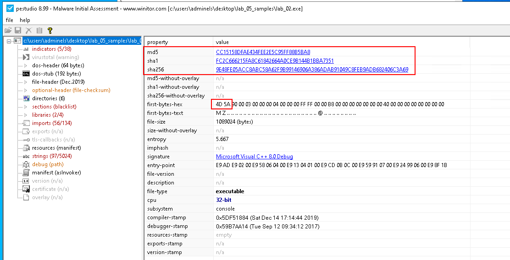  

- md5: cc15158dfae434fee2e5c95ff88b5ba8
- sha1: fc2c666215fa8c61842664a0ce9b144b1bba7351
- sha256: 9e48fe05acc8abc58a62f9b99146906a386adab91049c8feb9adb682406c3a69
- First bytes: `0x4d5a`

<br/>

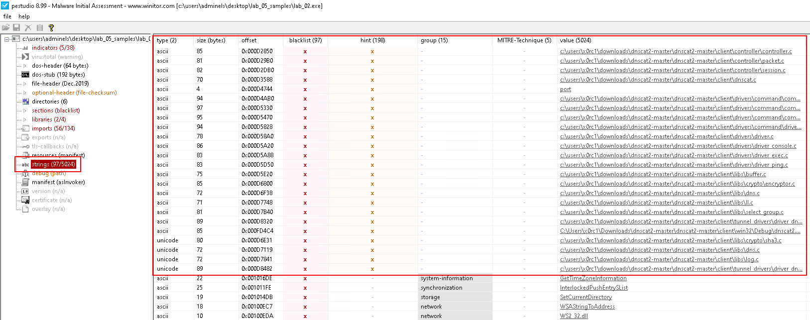  
- 0xD2850: `c:\\users\\x0rc1\\downloads\\dnscat2-master\\dnscat2-master\\client\\controller\\controller.c`

  

- 0xD410E: `./dnscat skullseclabs.org`
- 0xD4138: `http://www.attacker.domain`


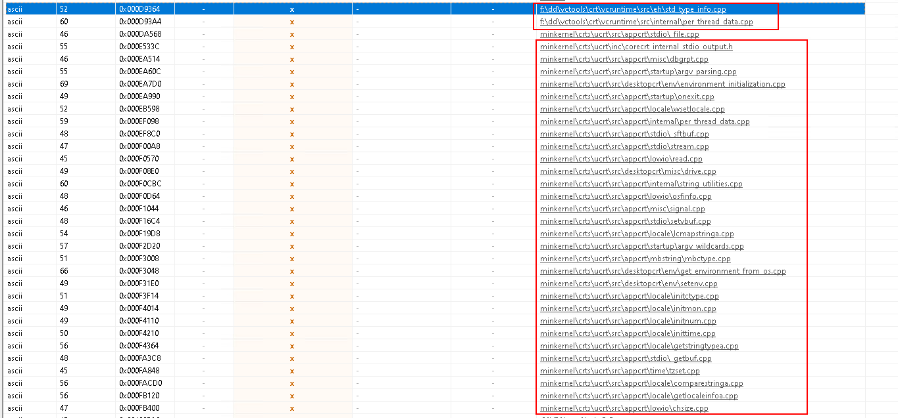  

- 0xD9364: `f:\\dd\\vctools\\crt\\vcruntime\\src\\eh\\std_type_info.cpp`
- 0xF0570: `minkernel\\crts\\ucrt\\src\\appcrt\\lowio\\read.cpp`

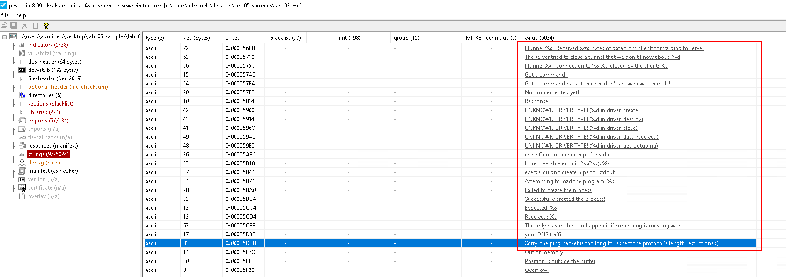  

- 0xD56B8: `[Tunnel %d] Received %zd bytes of data from client; forwarding to server`
- 0xD5D38: `your DNS traffic.`

<br/>

Checking the libraries:

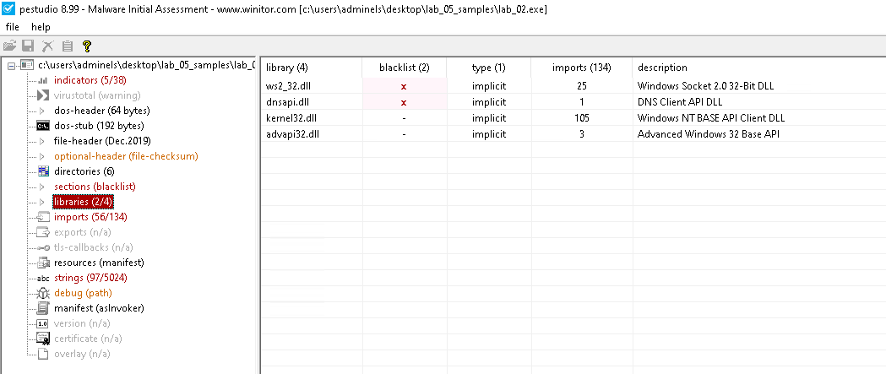  

- ws2_32.dll
- dnsapi.dll
- advapi32.dll

<br/>

YARA Rule:

```
import "pe"
import "hash"

rule DetectLab02 
{
  meta:
    description = "Detect Lab02_.exe"
    author = "Brian Yau"
    date = "30 May 2021"
  strings:
    $mz = {4d 5a}
    $s1 = "c:\\users\\x0rc1\\downloads\\dnscat2-master\\dnscat2-master\\client\\controller\\controller.c" nocase ascii wide
    $s2 = "./dnscat skullseclabs.org" nocase ascii wide
    $s3 = "http://www.attacker.domain" nocase ascii wide
    $s4 = "f:\\dd\\vctools\\crt\\vcruntime\\src\\eh\\std_type_info.cpp" nocase ascii wide
    $s5 = "minkernel\\crts\\ucrt\\src\\appcrt\\lowio\\read.cpp" nocase ascii wide
    $s6 = "[Tunnel %d] Received %zd bytes of data from client; forwarding to server" nocase ascii wide
    $s7 = "your DNS traffic." nocase ascii wide
  condition:
    (
      $mz at 0 and
      all of ($s*) and
      pe.imports("advapi32.dll") and
      pe.imports("ws2_32.dll") and
      pe.imports("dnsapi.dll") 
    ) or
    (
      hash.md5(0, filesize) == "cc15158dfae434fee2e5c95ff88b5ba8" or hash.sha1(0, filesize) == "fc2c666215fa8c61842664a0ce9b144b1bba7351" or hash.sha256(0, filesize) == "9e48fe05acc8abc58a62f9b99146906a386adab91049c8feb9adb682406c3a69"
    )
}

```

<br/>

Test running the rule against the samples:

```
yara32.exe Task2.yar -s -r .
```

  

<br/>

---

## Task 3: Advanced PE rules

**Question**

You are required to write YARA rules to classify all of the samples collected in Lab 03. Make sure to check your PE sections, imports, functions, version information, section entropy, etc. to make the rules more granular.

<br/>

**Answer**

### Packed sample

Load the packed sample into PEStudio and check the basic info:

  

- md5: e24c5cab297aa835d34a66a59cb1800e
- sha1: 9ac0b98172f210871b239f1f415d3f322a285448
- sha256: 83d4855b1ed7249f2649a1d067cba0f79b7947a693aaca34c3af20b80c16401e
- First byte: `0x4D5A`

Check the strings:

  

- `0x208`: `UPX0`
- `0x230`: `UPX1`
- `0x2558B`: `fsopti.exe`
- `0x2561C`: `FSOptimizer.exe`

Check the version info:

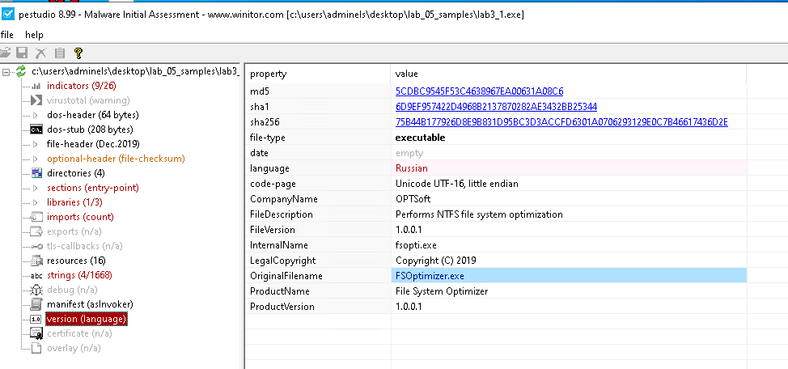  

- CompanyName: `OPTSoft`
- FileVersion: `1.0.0.1`
- InternalName: `fsopti.exe`

<br/>

Check the imports:

  

- `wsock32.dll`: `WSAStartup`
- `user32.dll`: `ShowWindow`
- `kernel32.dll`: `VirtualProtect`
- `kernel32.dll`: `ExitProcess`
- `kernel32.dll`: `LoadLibraryA`
- `kernel32.dll`: `GetProcAddress`

<br/>

Use HxD to check the entropy:

  

- Entropy >= 7

<br/>

YARA rule:

```
import "pe"
import "hash"
import "math"

rule DetectPackedLab03 
{
  meta:
    description = "Detect Packed Lab03.exe"
    author = "Brian Yau"
    date = "30 May 2021"
  strings:
    $mz = {4d 5a}
    $s1 = "UPX0" nocase ascii wide
    $s2 = "UPX1" nocase ascii wide
    $s3 = "fsopti.exe" nocase ascii wide
    $s4 = "FSOptimizer.exe" nocase ascii wide

  condition:
    (
      $mz at 0 and
      all of ($s*) and
      (
        pe.version_info["CompanyName"] contains "OPTSoft" or
        pe.version_info["FileVersion"] contains "1.0.0.1" or
        pe.version_info["InternalName"] contains "fspoti.exe"
      ) and
      (
        pe.imports("wsock32.dll", "WSAStartup") and
        pe.imports("user32.dll", "ShowWindow") and
        pe.imports("kernel32.dll", "VirtualProtect") and
        pe.imports("kernel32.dll", "ExitProcess") and
        pe.imports("kernel32.dll", "LoadLibraryA") and
        pe.imports("kernel32.dll", "GetProcAddress")
      ) and
      math.entropy(0, filesize) >= 7.0
    ) or
    (
      hash.md5(0, filesize) == "e24c5cab297aa835d34a66a59cb1800e" or hash.sha1(0, filesize) == "9ac0b98172f210871b239f1f415d3f322a285448" or hash.sha256(0, filesize) == "83d4855b1ed7249f2649a1d067cba0f79b7947a693aaca34c3af20b80c16401e"
    )
}
```

<br/>

Try to run the rule:

```
yara32.exe Task3.yar -s -r .
```

  

<br/>

Note:
It is known that the raw size of the section "UPX0" is 0; we can match it using `pe.sections[0].raw_data_size == 0`

<br/>

### Unpacked

Load the unpacked sample in PEStudio and check the strings:

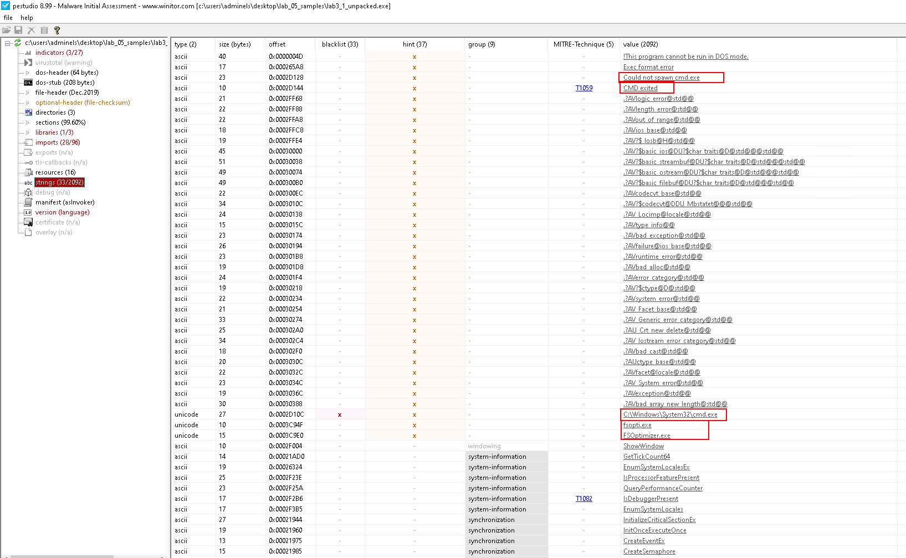  

- `0x2D144`: `CMD exited`
- `0x2D10C`: `C:\\Windows\\System32\\cmd.exe`
- `0x3C94F`: `fsopti.exe`
- `0x3C9E0`: `FSOptimizer.exe`

<br/>

Check the version info:

  

- language: `Russian`
- CompanyName: `OPTSoft`
- FileVersion: `1.0.0.1`
- InternalName: `fsopti.exe`
- OriginalFilename: `FSOptimizer.exe`

<br/>

Check the imports:

  

```
3 (closesocket),network,-,implicit,x,x,-,-,-,wsock32.dll
18 (select),network,-,implicit,x,x,-,-,-,wsock32.dll
13 (listen),network,-,implicit,x,x,-,-,-,wsock32.dll
2 (bind),network,-,implicit,x,x,-,-,-,wsock32.dll
19 (send),network,-,implicit,x,x,-,-,-,wsock32.dll
23 (socket),network,-,implicit,x,x,-,-,-,wsock32.dll
16 (recv),network,-,implicit,x,x,-,-,-,wsock32.dll
9 (htons),network,-,implicit,x,x,-,-,-,wsock32.dll
116 (WSACleanup),network,-,implicit,x,x,-,-,-,wsock32.dll
1 (accept),network,-,implicit,x,x,-,-,-,wsock32.dll
115 (WSAStartup),network,-,implicit,x,x,-,-,-,wsock32.dll
FindNextFileW,file,-,implicit,-,x,-,-,-,kernel32.dll
FindFirstFileExW,file,-,implicit,-,x,-,-,-,kernel32.dll
FindClose,file,-,implicit,-,x,-,-,-,kernel32.dll
CreateProcessW,execution,T1106,implicit,-,x,-,-,-,kernel32.dll
GetExitCodeProcess,execution,-,implicit,-,x,-,-,-,kernel32.dll
SetEnvironmentVariableW,execution,-,implicit,-,x,-,-,-,kernel32.dll
GetEnvironmentStringsW,execution,-,implicit,-,x,-,-,-,kernel32.dll
SwitchToThread,execution,-,implicit,-,x,-,-,-,kernel32.dll
TerminateProcess,execution,-,implicit,-,x,-,-,-,kernel32.dll
GetCurrentProcessId,execution,-,implicit,-,x,-,-,-,kernel32.dll
GetCurrentThreadId,execution,-,implicit,-,x,-,-,-,kernel32.dll
RaiseException,exception-handling,-,implicit,-,x,-,-,-,kernel32.dll
GetModuleFileNameW,dynamic-link-library,-,implicit,-,x,-,-,-,kernel32.dll
GetModuleHandleExW,dynamic-link-library,-,implicit,-,x,-,-,-,kernel32.dll
SetLastError,diagnostic,-,implicit,-,x,-,-,-,kernel32.dll
GetConsoleWindow,console,-,implicit,-,x,-,-,-,kernel32.dll
ReadConsoleW,console,-,implicit,-,x,-,-,-,kernel32.dll
```

<br/>

Check the sections:

  

- .text
- .rdata
- .data
- .rsrc
- .reloc

<br/>

YARA Rule:

```
import "pe"
import "hash"

rule DetectUnpackedLab03 
{
  meta:
    description = "Detect Packed Lab03.exe (Unpacked)"
    author = "Brian Yau"
    date = "30 May 2021"
  strings:
    $mz = {4d 5a}
    $s1 = "CMD exited" nocase ascii wide
    $s2 = "C:\\Windows\\System32\\cmd.exe" nocase ascii wide
    $s3 = "fsopti.exe" nocase ascii wide
    $s4 = "FSOptimizer.exe" nocase ascii wide

  condition:
    (
      $mz at 0 and
      all of ($s*) and
      (
        pe.version_info["CompanyName"] contains "OPTSoft" and
        pe.version_info["FileVersion"] contains "1.0.0.1" and
        pe.version_info["InternalName"] contains "fsopti.exe" and
        pe.version_info["OriginalFilename"] contains "FSOptimizer.exe"
      ) and
      (
        pe.imports("wsock32.dll", "closesocket") and
        pe.imports("wsock32.dll", "select") and
        pe.imports("wsock32.dll", "listen") and
        pe.imports("wsock32.dll", "bind") and
        pe.imports("wsock32.dll", "send") and
        pe.imports("wsock32.dll", "socket") and
        pe.imports("wsock32.dll", "recv") and
        pe.imports("wsock32.dll", "htons") and
        pe.imports("wsock32.dll", "WSACleanup") and
        pe.imports("wsock32.dll", "accept") and
        pe.imports("wsock32.dll", "WSAStartup") and
        pe.imports("kernel32.dll", "FindFirstFileExW") and
        pe.imports("kernel32.dll", "FindClose") and
        pe.imports("kernel32.dll", "CreateProcessW") and
        pe.imports("kernel32.dll", "GetExitCodeProcess") and
        pe.imports("kernel32.dll", "SetEnvironmentVariableW") and
        pe.imports("kernel32.dll", "GetEnvironmentStringsW") and
        pe.imports("kernel32.dll", "SwitchToThread") and
        pe.imports("kernel32.dll", "TerminateProcess") and
        pe.imports("kernel32.dll", "GetCurrentProcessId") and
        pe.imports("kernel32.dll", "GetCurrentThreadId") and
        pe.imports("kernel32.dll", "RaiseException") and
        pe.imports("kernel32.dll", "GetModuleFileNameW") and
        pe.imports("kernel32.dll", "GetModuleHandleExW") and
        pe.imports("kernel32.dll", "SetLastError") and
        pe.imports("kernel32.dll", "GetConsoleWindow") and
        pe.imports("kernel32.dll", "ReadConsoleW")
      ) and
      pe.number_of_sections == 5 and
      for any i in (0..pe.number_of_sections-1): (pe.sections[i].name == ".text" or pe.sections[i].name == ".rdata" or pe.sections[i].name == ".data" or pe.sections[i].name == ".rsrc" or pe.sections[i].name == ".reloc")
    )
}
```

<br/>

Try to run:

```
yara32.exe Task3-2.yar -s -r .
```

  


---