# Lab 07 - Working with Windows Processes

- [Lab 07 - Working with Windows Processes](#lab-07---working-with-windows-processes)
  - [Sceanrio](#sceanrio)
  - [Tools](#tools)
  - [Task 1: More about Windows Processes](#task-1-more-about-windows-processes)
  - [Task 2: Running Processes: Strings and Memory](#task-2-running-processes-strings-and-memory)
    - [Experiment 1](#experiment-1)
    - [Experiment 2](#experiment-2)
    - [Experiment 3](#experiment-3)
  - [Task 3: Processes and TCP/IP](#task-3-processes-and-tcpip)
  - [Task 4: Working with Windows Sessions](#task-4-working-with-windows-sessions)

---

## Sceanrio

You are required to do a couple of different experiments to understand how processes work and understand them better. The skills acquired in this lab will be later used when doing malware analysis and it could also be used if you are doing threat hunting too.

<br/>

The goals of this lab are to: 
- Further understand the different Process Explorer properties and settings, what they mean, and how to benefit from them.
- Understand more about threads and processes with network connections. 
- Searching for strings in program image files and memory. 
- Understand the different Windows sessions.

<br/>

By the end of the lab, you should have a better understanding of Windows processes, threads, how to find strings in the image file and in memory, processes with network connections, and the different Windows sessions and what each one is used for. You will also have the ability to spot a suspicious process that tries to use a common Windows process name.

<br/>

192.168.210.10 / AdminELS / Nu3pmkfyX

<br/>

---

## Tools

- Sysinternals Process Explorer (procexp.exe)
- Sysinternals PsExec
- Process Hacker
- Windows Netcat

<br/>

---

## Task 1: More about Windows Processes

**Question**

To continue our understanding about Windows Processes, use Process Explorer to answer the questions below. Some questions require you to do some research.

1. What do processes in pink represent?
2. Why are there two `csrss.exe`?
3. Which ports is your `explorer.exe` listening on? Is that normal, and why?
4. How many threads does your System Idle Process have and why?

<br/>

**Answer**

**[1] What do processes in pink represent?**

Launch `procexp64.exe` as admin. Navigate to `Options > Configure Colors ...`:

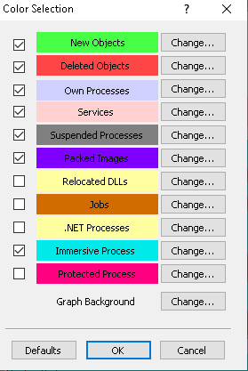  

- Color in Pink represents `Services`

<br/>

**[2] Why are there two `csrss.exe`?**

  

- The reason is that there will be one `csrss.exe` for the system, and then one for each user that is logged into the machine
- In the screenshot, it shows 3 `csrss.exe`, meaning that there are 2 users logged into the machine

To check whether the path is correct, we can double click `csrss.exe`:

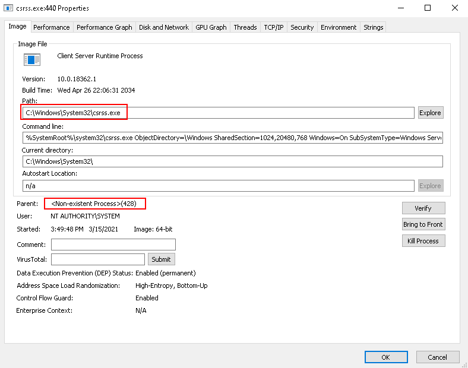  

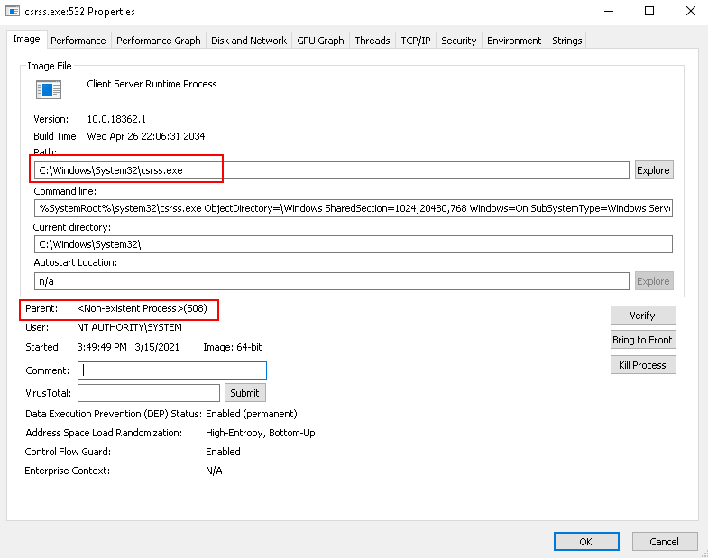  

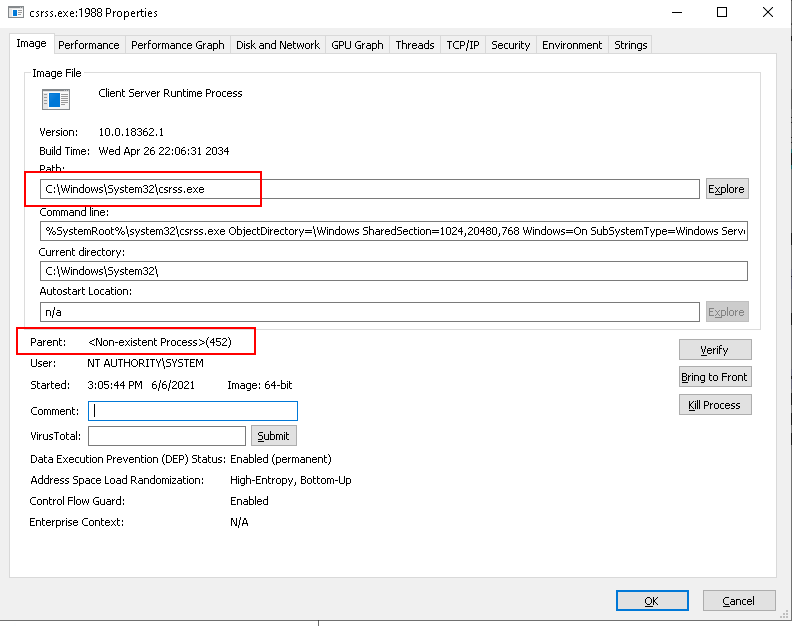  


- Image:
  - The `path` is `C:\Windows\System32\csrss.exe` - legit
  - The `parent` is non-existent - legit

<br/>

Naviagting to `Security` tab, we can understand which one is for the System and which one is for client by checking the **Session**:

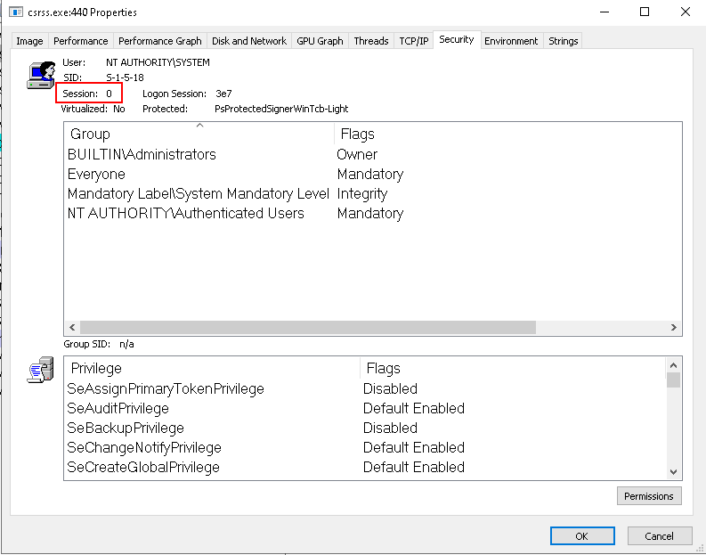  

- `Session 0` shows the SYSTEM instance
- User is `SYSTEM`
- SID is `S-1-5-18`

<br/>

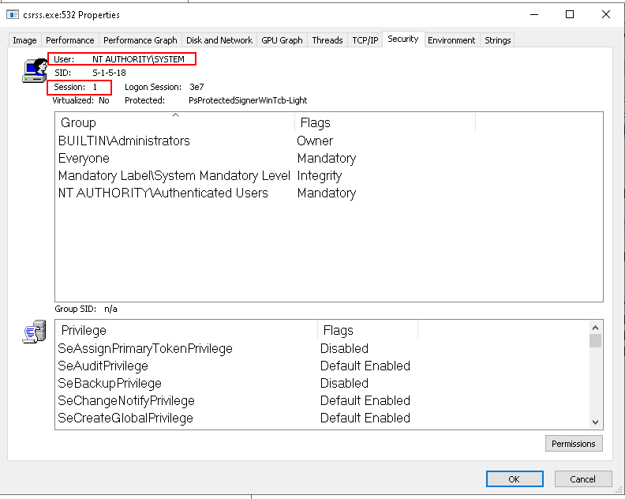  

- `Session 1` shows the USER instance
- User is `SYSTEM`
- SID is `S-1-5-18`

<br/>

**[3] Which ports is your `explorer.exe` listening on? Is that normal, and why?**

Double click `Explorer.exe` and check the `TCP/IP` tab:

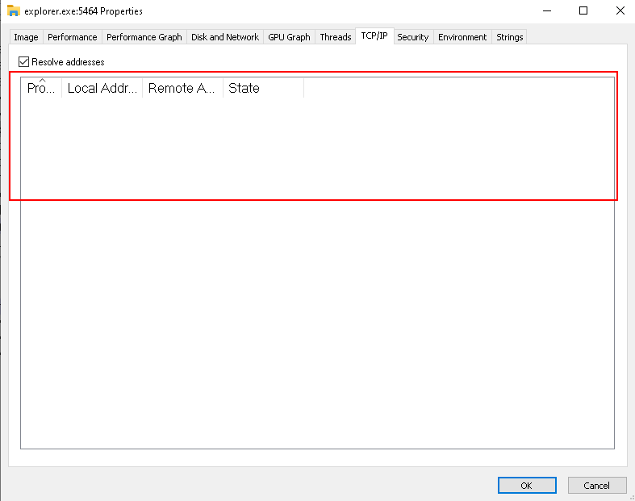  

- Should be no listening port!

Also, the path of a legit `explorer.exe` should be:

- `\%SYSTEMROOT%\Explorer.exe`, which is defined in Registry `HKLM\SOFTWARE\Microsoft\Windows NT\CurrentVersion\Winlogon\Shell`

<br/>


---

## Task 2: Running Processes: Strings and Memory

**Question**

Determine how strings found while doing static analysis can help you with your analysis. What if the malware sample you are working on is obfuscated so the strings cannot be found during a basic search? This is one way of using the process’s memory to help us in our analysis.

Note: There are three experiments to help you understand this task.

<br/>

**Answer**

### Experiment 1

Extract `lab_07_samples.7z`.

Launch `procexp.exe` as Admin and run `Welcome.exe`:

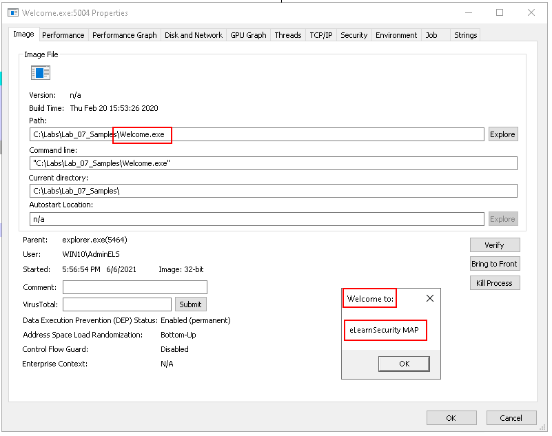  

- Note the strings: `Welcome to:` and `eLearnSecurity MAP`
- Expected these to be seen in the **Strings** tab

<br/>

Go to the **Strings** tab and find the above strings in **Image**:

  

- Both strings are found

<br/>

Try to search in **Memory**:

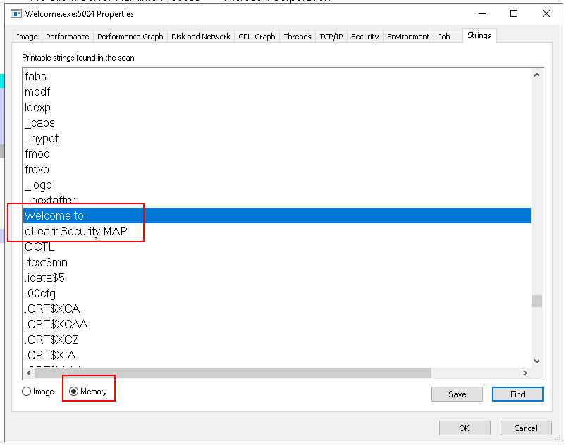  

- Same result

<br/>

### Experiment 2

Launch `notepad.exe` and type `Hello this is lab 7 test`, and then save as `Lab7_Test.txt`.

<br/>

Check the `notepad.exe` process, and go to the **Strings** tab. Search for `Hello` in the Image:

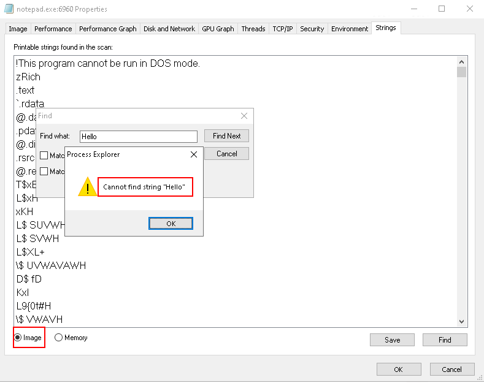  

- Not found! This is because it is not part of the `notepad.exe` image file

<br/>

Search for `Hello` in the Memory:

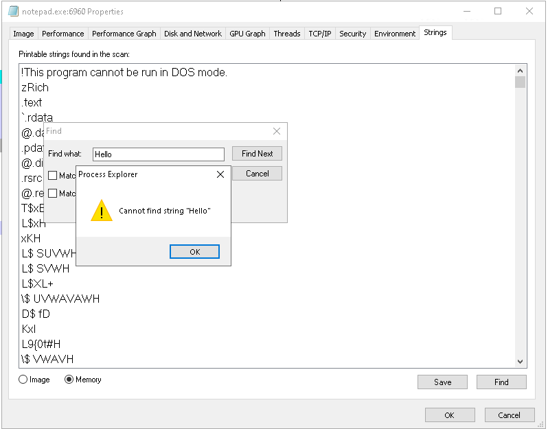  

- Still not found!

<br/>

Search for the filename `Lab7_Test.txt` in Memory:

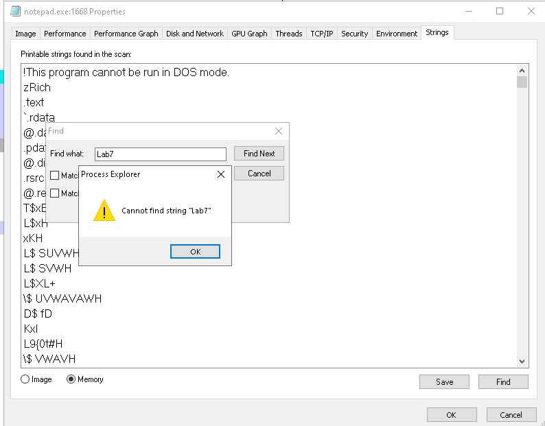  

- Still not found!

<br/>

Anyway, there is some information which is not part of the image file (EXE) or only available after running he program, then we can search the memory for that information.

Whatever is hidden in the executable itself is exposed in memory if we know where and how to search for it.

Keep in mind that not all strings are searched for this way, but this is just one way of doing things.

<br/>

### Experiment 3

Open `welcome2.exe` and inspecrt in ProcExp. Try to search `eLearn` in the String tab (Image):

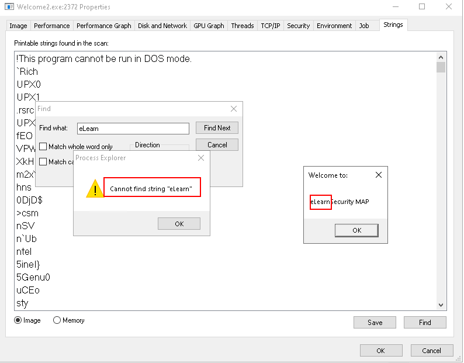  

- Not found!

<br/>

Try again in memory:

  

<br/>

To understand why, check the Section Header of  `Welcome2.exe` in **CFF Explorer**:

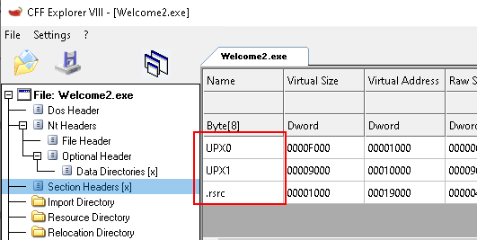  

- As shown, this is a packed executable and that's why we cannot see the strings in the Image
- However, the strings are found in memory - we are able to find the strings and because the program was **unpacked in memory** and now the strings inside are shown in memory.

<br/>

---

## Task 3: Processes and TCP/IP

**Question**

Use `netcat` to run an experiment and determine how the netcat listener on port 9999 can be seen in a process monitoring tool such as process explorer.

Note: There is an experiment that will help you understand this task.

<br/>

**Answer**

Extract `nc111nt.zip` (password is `nc`) and launch `cmd.exe`:

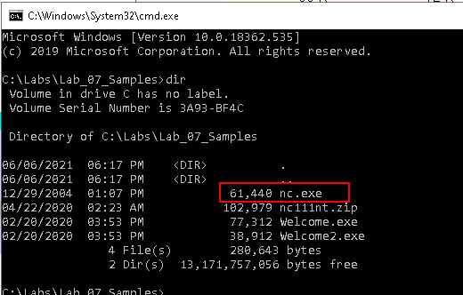  

<br/>

Launch `nc.exe` and allow access:

```
nc -nlvp 9999
```

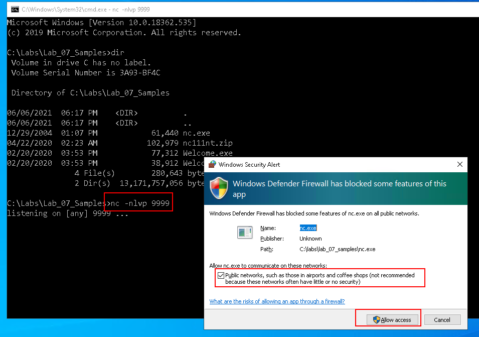  


<br/>

Check if `nc.exe` is listening on `tcp/9999`:

```
netstat -ant -p tcp
```

  

<br/>

Use **ProcExp** to check the **TCP/IP** tab of `nc.exe`:

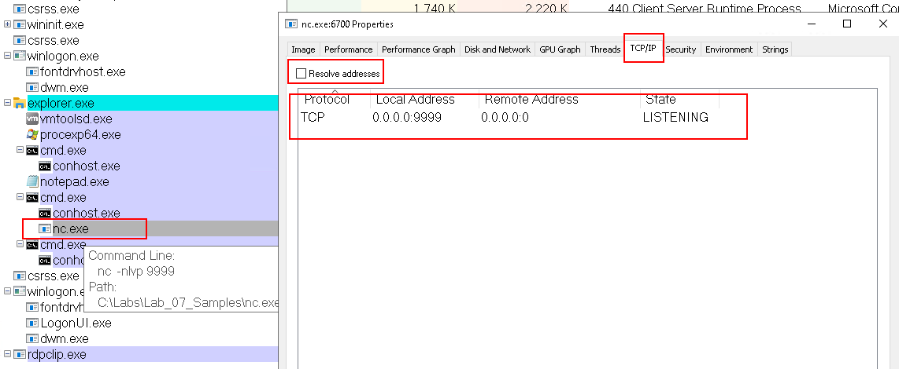  

- Same process status we've seen in `netstat` output

<br/>

Launch another `nc.exe` and try to connect to this listener:

```
nc 192.168.210.10 9999
```

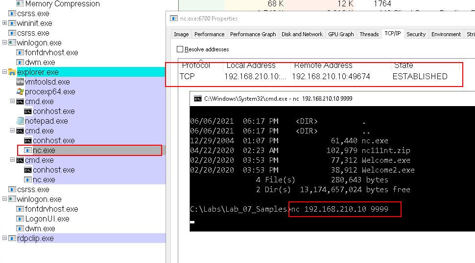  

- As shown, if a process connects to the listener, the state will be `ESTABLISHED` in the **TCP/IP** tab in the listener

<br/>

---

## Task 4: Working with Windows Sessions

**Questions**

In this task, we want to understand what Windows sessions are and how to interact with them.

Note: There is an experiment that will help you understand this task.

<br/>

**Answer**

Run `cmd.exe` as Admin, and then run `notepad.exe` in the command. Check the process details in **ProcExp** of `notepad.exe`:

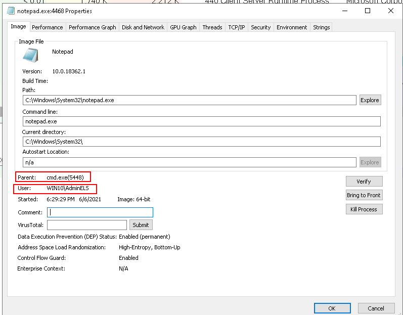  

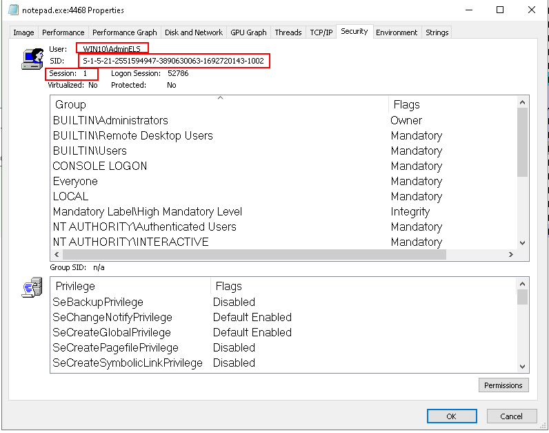  

- `notepad.exe` is running in session 1, which is an interactive session that our uyser can interact with

<br/>

Try to run `notepad.exe` using `psexec.exe`:

```
cd C:\Tools\SysinternalsSuite
PsExec.exe -s notepad.exe
```

Note:
`-s`: Run the remote process in the System account.

  

- Though a process of `notepad.exe` is running (whose parent is `PSEXESVC.EXE`), it is not shown in the user-end.

<br/>

In `ProcExp`, check the security tab of the `notepad.exe` process:

  

- The User is `SYSTEM`
- The SID is `S-1-5-18`
- The Session number is `0`
  - We can’t interact with processes running in session 0 directly
  - Processes in session 0 will not be visual to us, since they are running in another environment which is isolated

<br/>

Try to execute the following command using PsExec:

```
PsExec.exe -i -s notepad.exe
```

Note:
`-i`: Run the program so that it interacts with the desktop of the specified session on the remote system. If no session is specified the process runs in the console session. This flag is required when attempting to run console applications interactively (with redirected standard IO).

  

- Notepad.exe GUI is shown

  

- It is in Session `1` but not `0`
- It is a child of `service.exe\PSEXESVC.exe` but not explorer.exe

<br/>

---