# Lab 09 - Working with DLLs and DLL Injections

- [Lab 09 - Working with DLLs and DLL Injections](#lab-09---working-with-dlls-and-dll-injections)
  - [Scenario](#scenario)
  - [Tools](#tools)
  - [Task 1: Basic DLL Analysis](#task-1-basic-dll-analysis)
    - [Welcome3.dll](#welcome3dll)
      - [Static Analysis](#static-analysis)
      - [Dynamic Analysis](#dynamic-analysis)
  - [Task 2: Analyzing a malicious DLL](#task-2-analyzing-a-malicious-dll)
    - [Static Analysis using CFF Explorer](#static-analysis-using-cff-explorer)
    - [Dynamic Analysis](#dynamic-analysis-1)
  - [Task 3: DLL Injection](#task-3-dll-injection)
  - [Task 4: Use IOCs to scan the memory](#task-4-use-iocs-to-scan-the-memory)

---

## Scenario

You have been called by a client to examine a couple of weird samples (DLLs) that were found on some of their systems. The network security engineers noticed weird connection activity to the device that some of these samples were found on.

<br/>

The goal of this lab is to understand how to run a DLL, analyze a DLL and how we could use basic techniques to detect DLL Injections by checking the process’s memory. In this lab, we will focus on an injection known as "Reflective DLL Injection (RDI)". Please check the course material for more information about RDI.

After completing this lab, you will be able to analyze suspicious DLLs using basic dynamic analysis techniques using tools such as RunDLL32, Process Explorer, Process Monitor, VMMap, AptDNS, and Wireshark.

<br/>

64-bit - 192.168.210.10 / AdminELS / Nu3pmkfyX
32-bit - 192.168.210.11 / AdminELS / pippo123!

<br/>

---

## Tools

- Microsoft RunDLL32 
- Sysinternals Process Explorer (procexp.exe) 
- Sysinternals Process Monitor (procmon.exe) 
- Sysinternals VMMap 
- Sysinternals ListDLLs 
- AptDNS 
- Yara 
- Wireshark

<br/>

---

## Task 1: Basic DLL Analysis

**Question**

Analyze the given DLL sample and understand what it is doing. This is a non-malicious sample, so use it to explain how you would approach DLL analysis and how you can run and list it being loaded by a process.

<br/>

**Answer**

### Welcome3.dll

#### Static Analysis

Use **CFFExplorer** to open `Welcome3.dll`. First check the charactertics of the file in the **File Header**

  

- Executable
- DLL
- 32-bit

<br/>

Checking the **Export Directory**, we can see 3 API entries:

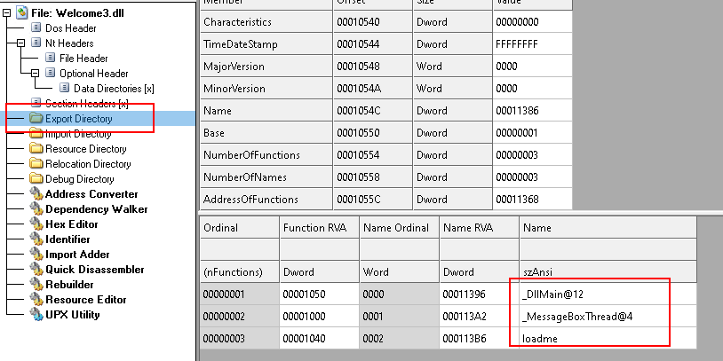  

- `_DllMain@12`
- `_messageBoxThread@4`
- `loadme`

- `_DllMain@12` is usually added by **MSCRVT**, which is not worth looking into it

<br/>

For DLLs, we can write program to call and use them; we can also use a default windows program `RunDLL32` to run them as well.

<br/>

#### Dynamic Analysis

Open **Process Monitor** (as admin) first, and use the filter `ProcessName = rundll32.exe`.

Also open **Process Explorer**

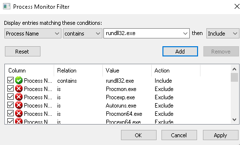  

<br/>

Run `cmd.exe` as admin, and use `rundll32.exe` to run to sample:

```
cd C:\Users\AdminELS\Desktop\Lab_09_Samples\Lab_09_Samples
rundll32.exe Welcome3.dll,loadme
```

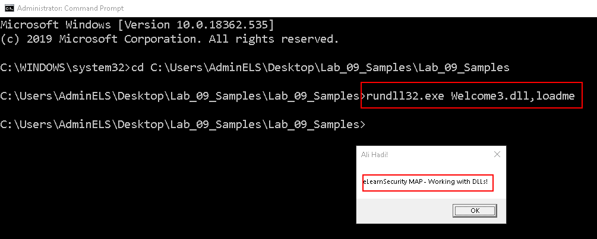  

- It shows a message box - highly likely to be related to another API `_messageBoxThread@4`

<br/>

In **Process Explorer**, click **View > Show Lower Pane** and **View > Lower Pane View > DLL**. Then find and click the process `rundll32.exe > rundll32.exe`:

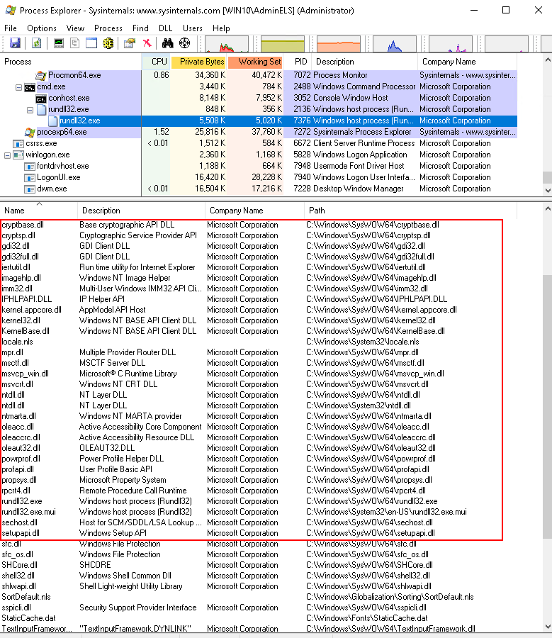  

- All of the libraries loaded are shown

<br/>

In **Process Monitor**, we can see the operation `Load Image` as well:

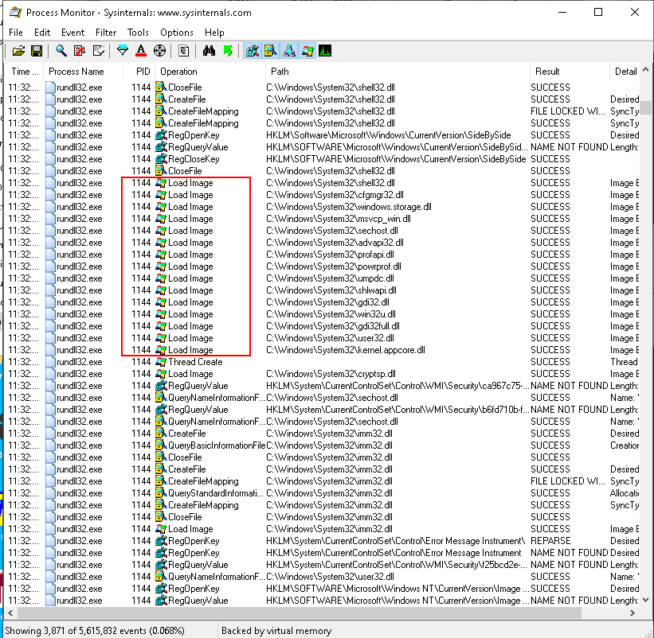  

<br/>

We can also use **listdlls.exe** from Sysinternals to inspect the DLLs that are currently loaded by `rundll32.exe`:

```
listdlls.exe rundll32.exe
```

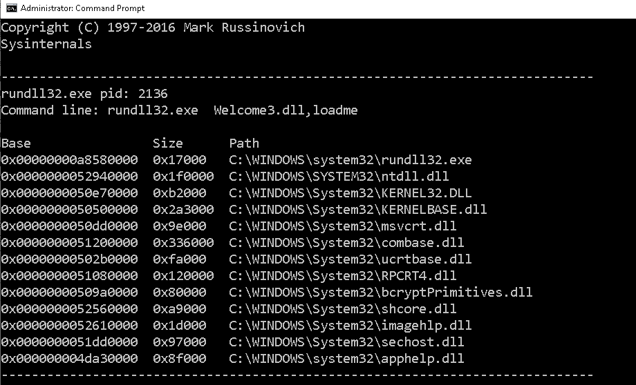  

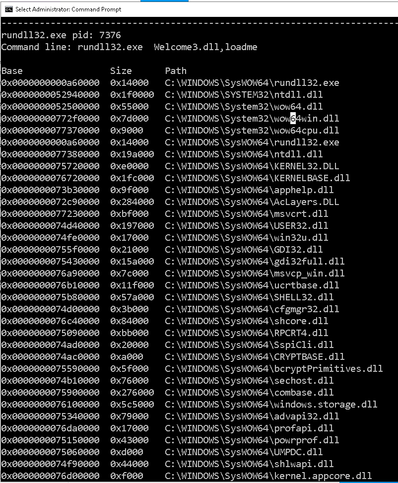  

- Command Line
- The base where the DLL is loaded
- The size of the DLL
- The path where the DLL is located in the system

<br/>

Also, we may use the `PID` to show the dlls loaded and list DLLs that are not signed by Microsoft:

```
listdlls.exe -u 7376
```

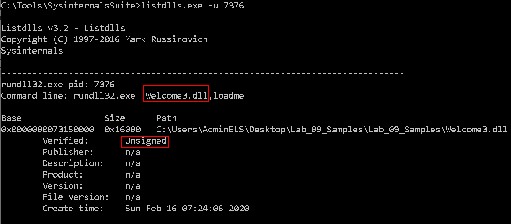  

<br/>

---

## Task 2: Analyzing a malicious DLL

**Question**

A malicious DLL sample was collected, and you are required to analyze it and provide as much information to what activity it is doing.

<br/>

**Answer**

### Static Analysis using CFF Explorer

Open `Downloader.exe` in CFF Explorer.

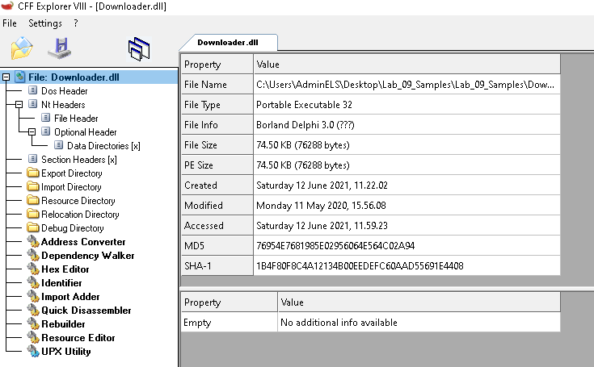  

<br/>

Inspect the **Export Directory**:

  

- Two APIs are found:
  - `_ThreadProc@4`
  - `loadme`

<br/>

Also inspect the **Import Directory** to see the libraries that the DLL uses:

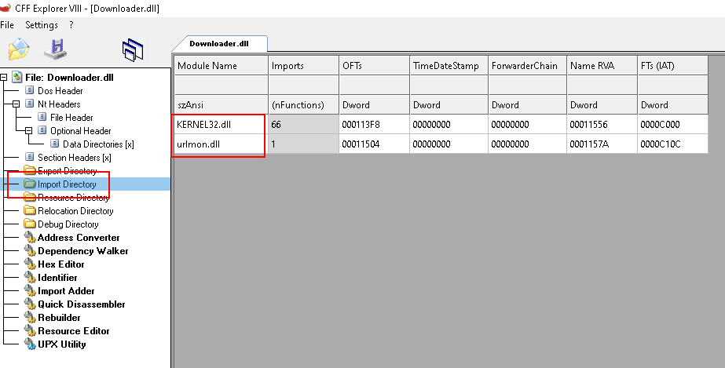  

- kernel32.dll
- urlmon.dll
  - https://docs.microsoft.com/en-us/previous-versions/windows/internet-explorer/ie-developer/platform-apis/ms775123(v=vs.85)
  - One of the functions is to download files

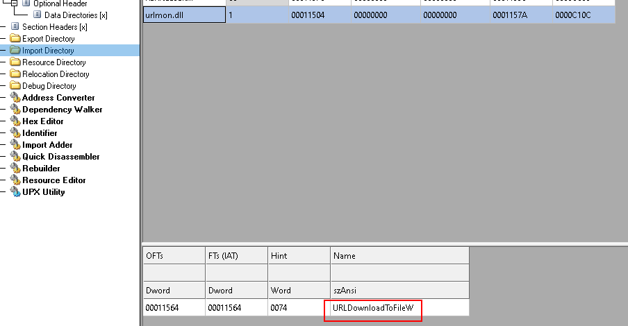  

<br/>

### Dynamic Analysis

Open (as admin) **Process Explorer** and **Process Monitor** (filter out `rundll32.exe`). Then run the sample in `cmd.exe` (privileged):

```
rundll32.exe Downloader.dll,loadme
```

  

- Nothing obvious is shown in the user perspective

<br/>

In **Procmon**, filter out `Operation is Process Create`:

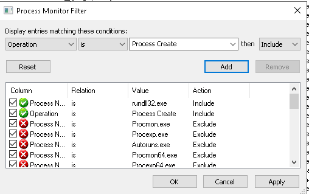  

  

- `C:\Windows\SysWOW64\rundll32.exe`, the fact that it is using the version in `SysWOW64` is that the DLL is a 32-bit one. That's why Windows will use WoW64 (Win32 on Win64).

<br/>

Filter out `Operation is Load Image`:

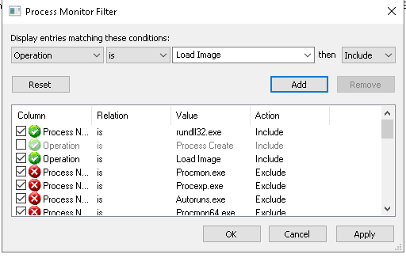  

  

- The sample loaded `urlmon.dll` - which can be used to download file

<br/>

Open Wireshark and track the HTTP and DNS traffic - re-run the sample:

- HTTP:

  

- DNS:

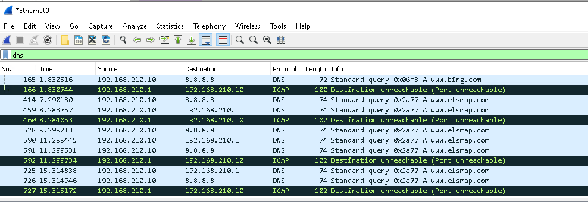  

- Found DNS query `www.elsmap.com`

<br/>

Create the `FileCreate` operations in **Procmon**:

  

- `C:\User\AdminELS\Desktop\Lab_09_Samples\Lab_09_Samples\runme.exe` has been created

<br/>

Open it in **CFF EXplorer**:

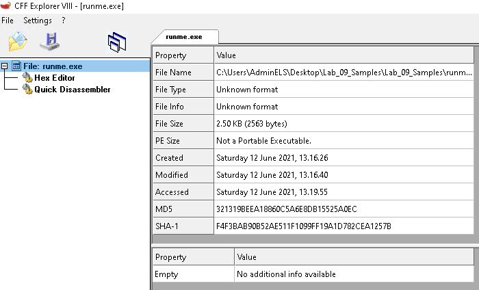  

- MD5: `321319BEEA18860C5A6E8DB15525A0EC`
- It is in fact not a PE

Open it in **BinText**, it is a HTML document:

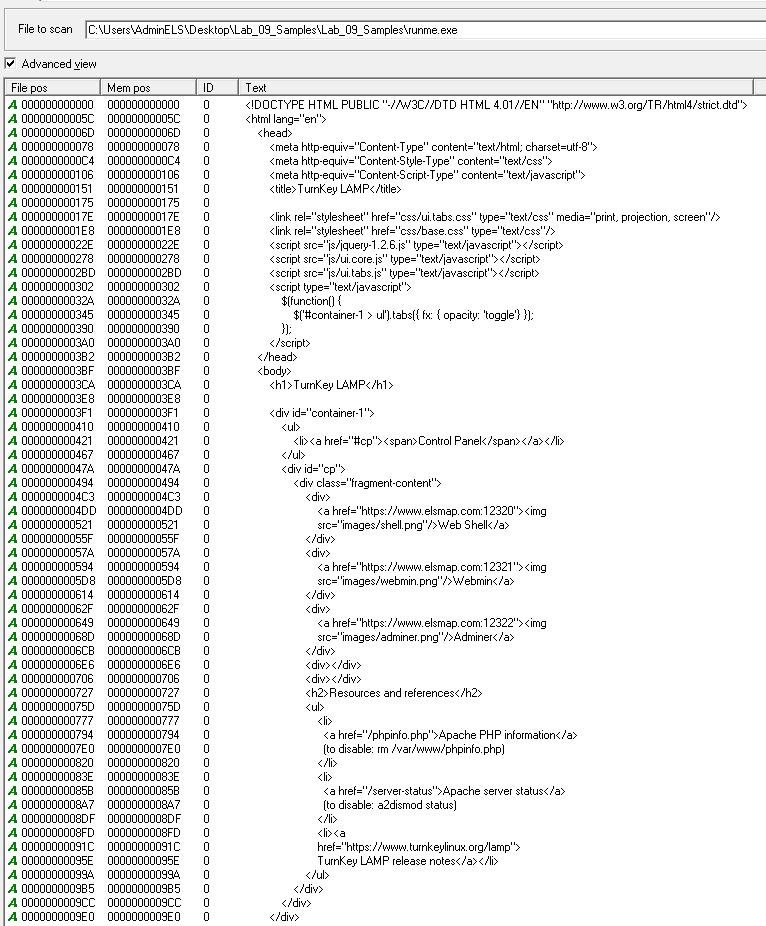  

<br/>

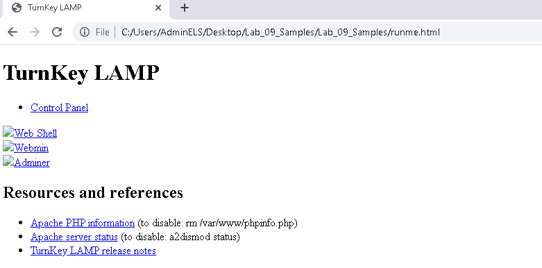  


<br/>

---

## Task 3: DLL Injection

**Question**

You are required to perform DLL injection and show why we cannot use the techniques we have seen in both tasks 1 and 2 with this sample. 

Also, show an easy way of finding the injected DLL by looking at memory (no memory forensics are required at this point).

<br/>

**Answer**

> Reflective DLL injection creates a DLL that can map itself into memory for execution instead of relying on the Windows loader.

<br/>

**Answer**

Open `rdi64.dll` in **PE Studio**:

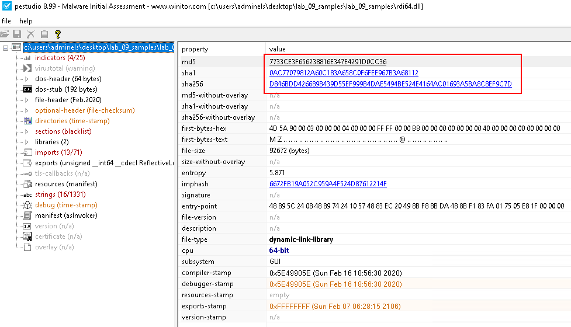  


- MD5: `7733CE3F656238816E347E4291D0CC36`

<br/>

Inspect the strings:

  

- Interesting strings:
  - `MAP DLL Injection`
  - `Hello from Injected DLL!`

<br/>

Export:

  

- ReflectiveLoader

<br/>

Download `inject.x64.exe` from https://www.pconlife.com/download/otherfile/287999/dbda80da592b526568e2642ee52ed37b/.

<br/>

First run an instance of `notepad.exe` and check the PID in **Process Explorer**:

  

- PID: 2488

<br/>

Next, try to inject the DLL `rdi64.dll`:

```
inject.x64.exe 2488 rdi64.dll
```

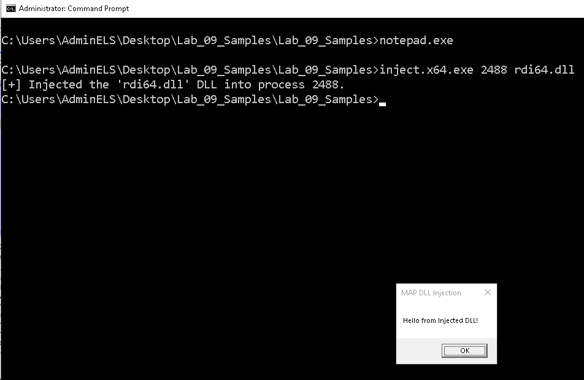  

- As shown, message box appears - the DLL is injected into the notepad process successfully

In **Process Explorer**, `rdi64.dll` is not shown:

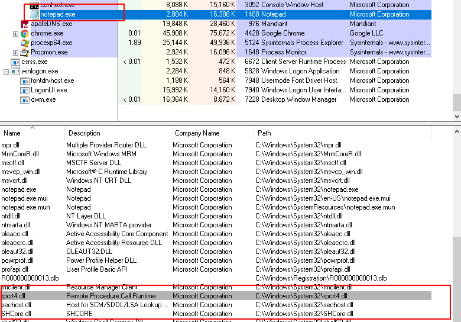  

<br/>

If we look for the appeared string `Hello` in **Process Explorer** strings tab, we cannot find it neither in Image nor Memory:

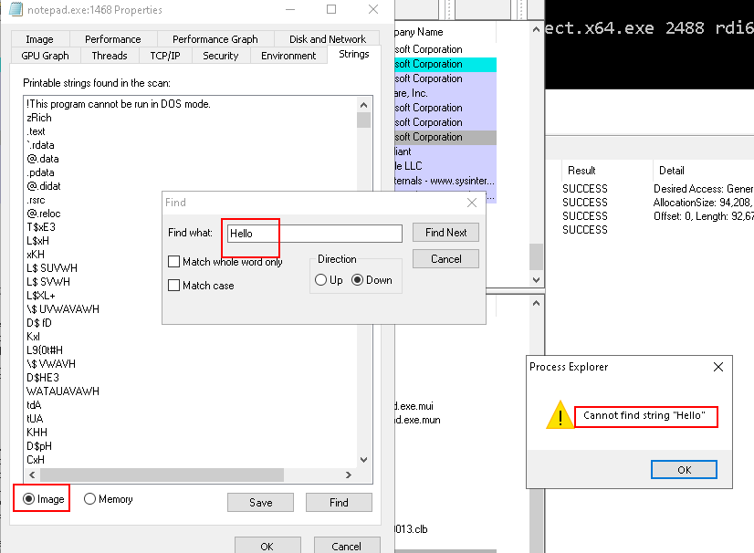  

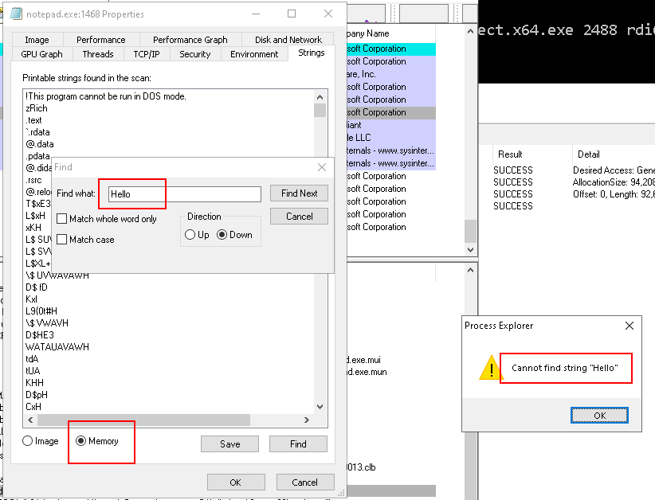  

<br/>


<br/>

---

## Task 4: Use IOCs to scan the memory

**Question**

Determine the IOCs you could prepare to help detect all three samples used in this lab and show how to use Yara to scan memory for them.

<br/>