# Lab 10 - Custom Backdoor Dynamic Analysis

- [Lab 10 - Custom Backdoor Dynamic Analysis](#lab-10---custom-backdoor-dynamic-analysis)
  - [Scenario](#scenario)
  - [Tools](#tools)
  - [Task 1: Finding general information and handles](#task-1-finding-general-information-and-handles)
    - [Static Analysis](#static-analysis)
    - [Dynamic Analysis](#dynamic-analysis)
  - [Task 2: Analyzing process activity](#task-2-analyzing-process-activity)
  - [Task 3: Sample IOCs](#task-3-sample-iocs)

---

## Scenario

You have been called by a client to examine a weird sample that was found on one of their developer’s systems. The client thinks this sample is hiding its true nature of activity.

<br/>

The goal of this lab is to understand how to analyze a backdoor using a reverse shell by performing dynamic analysis and to see if this is enough to identify key parts of the sample.

<br/>

After completing this lab, you will be able to analyze a sample with a backdoor using basic dynamic analysis techniques using tools such as Process Explorer, Process Hacker, Process Monitor, Netcat, and Wireshark.

<br/>

192.168.210.10 / AdminELS / Nu3pmkfyX

<br/>

----

## Tools

- Process Explorer / Process Hacker
- Process Monitor
- Netcat
- Wireshark

<br/>

---

## Task 1: Finding general information and handles

**Question**

Run the given sample and gather general information related to it.

<br/>

**Answer**

### Static Analysis

Load the sample in **PE Studio**:

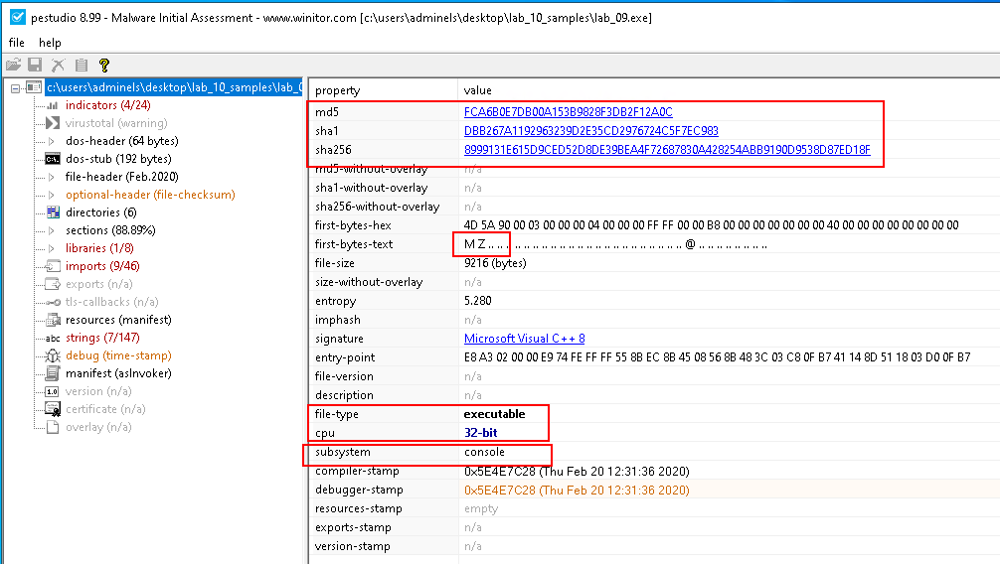  

- MD5: FCA6B0E7DB00A153B9828F3DB2F12A0C
- SHA1: DBB267A1192963239D2E35CD2976724C5F7EC983
- SHA256: 8999131E615D9CED52D8DE39BEA4F72687830A428254ABB9190D9538D87ED18F
- 32-bit executable (console)

<br/>

Check the **strings** tab:

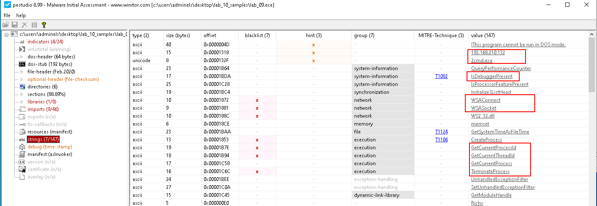  

- Interesting strings:
  - `192.168.210.132`
  - `2cmd.exe`
  - `IsDebuggerPresent` - Potential debug functionality
  - `WSAConnect` / `WSASocket` - Network utilities
  - `GetCurrentProcessId` / `GetCurrentThreadId` / `GetCurrentProcess` - Potential DLL injection API

<br/>

Check the libraries import:

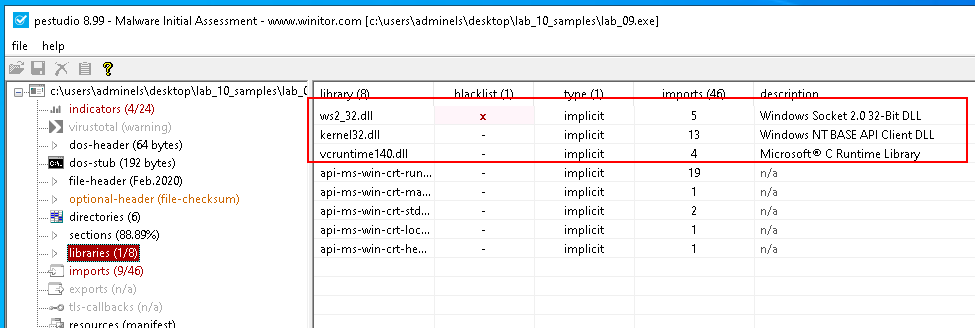  

- `ws2_32.dll` - Handle network connections

<br/>

Check the imports:

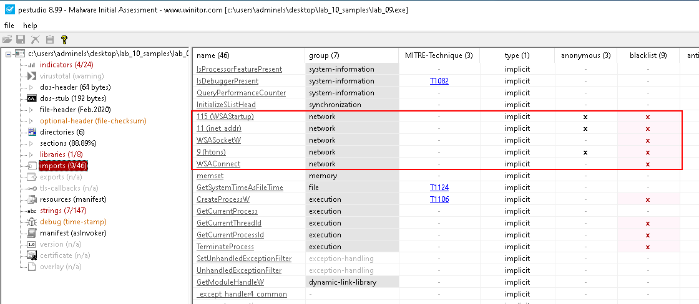  

- Network functions from `ws2_32.dll` - `WSAStartup`, `inet_addr`, `WSASocketW`, `htons`, `WSAConnect`

Note:
The names `115`, `11` etc mean they are exported by Ordinal

<br/>

### Dynamic Analysis

First run the following as admin:

- Process Explorer
- Process Monitor
- Wireshark (monitor both Ethernet adapter and loopback)

<br/>

Use privileged `cmd.exe` to launch `lab_09.exe`:

```
cd C:\Users\AdminELS\Desktop\Lab_10_Samples
lab_09.exe
```

  

- No obvious things shown to the user

<br/>

---

## Task 2: Analyzing process activity

**Question**

Analyze this malicious sample and find a way to create the environment that is needed by the sample in order to fully understanding with basic dynamic analysis methods only. Then, provide as much information to what this sample is and what activity it is doing.

<br/>

**Answer**

Filter out `Process Name is lab_09.exe` in Procmon. Then open **Process Tree** via `Tools > Process Tree`:

  


- `lab_09.exe` spawns `cmd.exe` (PID: 124)

<br/>

In addition to `lab_09.exe`, also filter out `Process Name is cmd.exe`. Then use `Tools > Network Summary` to inspect the network traffic:

  

- It tries connecting to `192.168.210.132:443`
- Note this IP is found in the executable strings

<br/>

Double-clicking the first entries will show all of the operations captured related to the traffic:

  


<br/>

In **Wireshark**, try to check the network connection related to `192.168.210.132` using `ip.host == 192.168.210.132`:

  

- No result

<br/>

Use `Edit > Find Packet` to find the string `192.168.210.132` to find the related traffic:

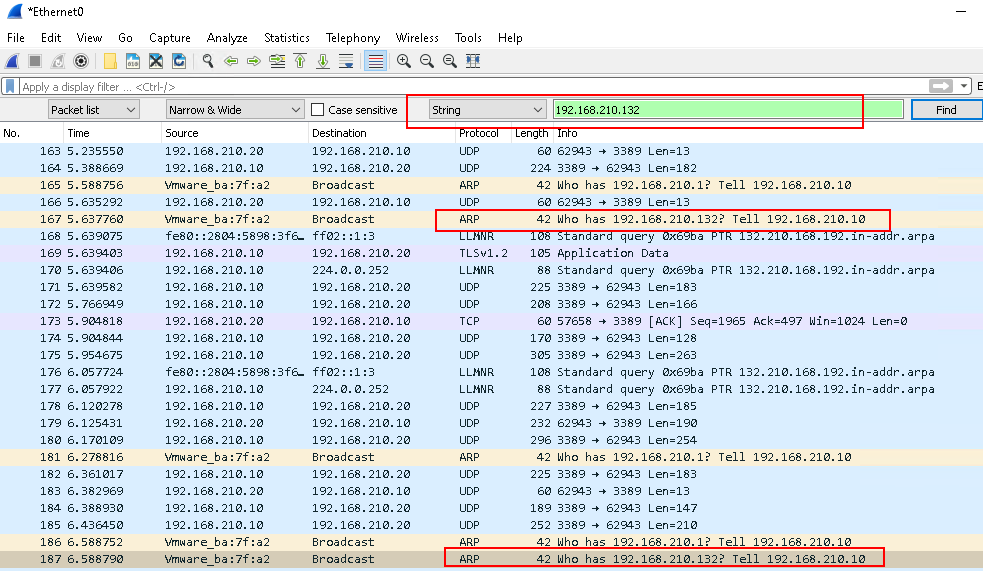  

- There are ARP traffic - the host is trying to find the available host with the IP address `192.168.210.132`; however there is no such host and there is no any ARP reply received

<br/>

To see the actions after a successful connection, let's try to give response to the request. The method is as follows:

1. Add a virtual IP address `192.168.210.132` in local network device
2. Use `netcat` to listen on `tcp/443`


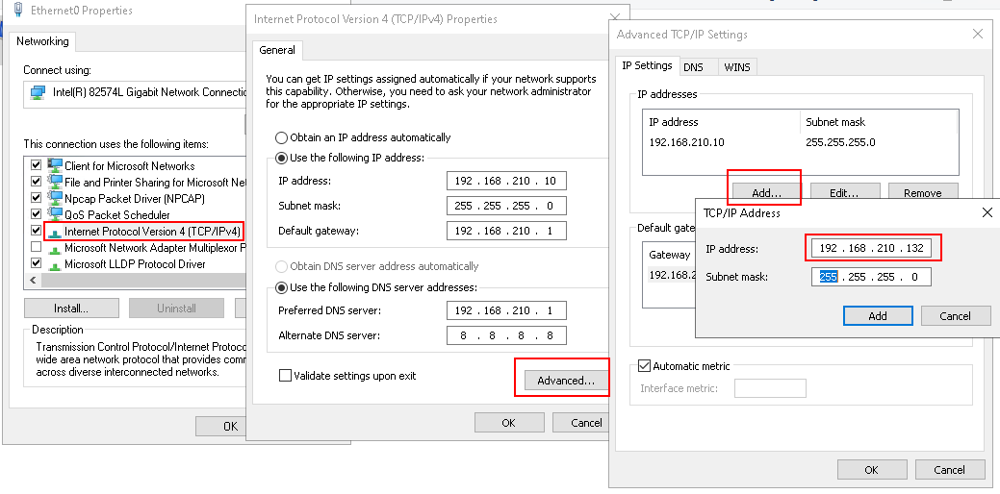  


```
nc.exe -nlvp 443
```

  

<br/>

Then rerun the sample.

<br/>

First inspect the netcat listener, it receives the connection and launches a CMD prompt:

  

- This is like a reverse shell!

Try to generate some events by running `ipconfig` in the spawned shell:

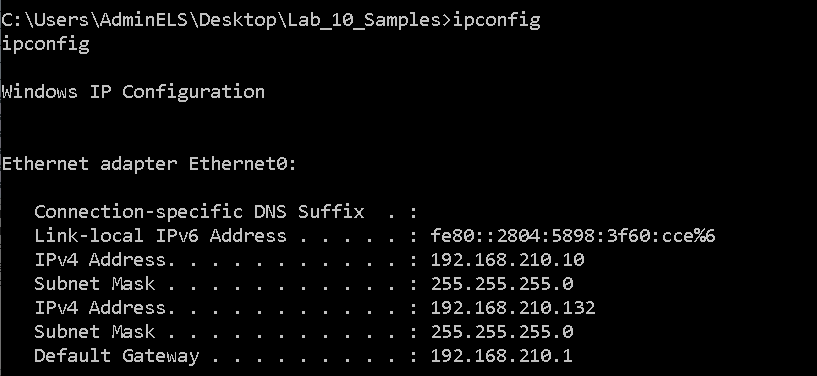  


<br/>

On **Procmon**, filter out `Process Name is cmd.exe` and `Process Name is lab_09.exe`. Then check the **Network Summary**:

  

<br/>

Double-clicking the network entry:

  

- Many network connections compared with before

<br/>

Check the **Process Tree** on **Procmon**:

  

- It shows `lab_09.exe` (PID: 4212) spawns a `cmd.exe` (PID: 3032)
- `cmd.exe` (PID: 3032) spawns `ipconfig.exe` (PID: 6344), which is the process that we run in the spawned shell

<br/>

To confirm this, we can generate some random events with unique signature:

- Create a folder: `mkdir TESTING001`
- Echo a message: `echo "This is TESTING002`
- Create a file with message: `echo Backdoor > .\TESTING001\TESTING003.txt`

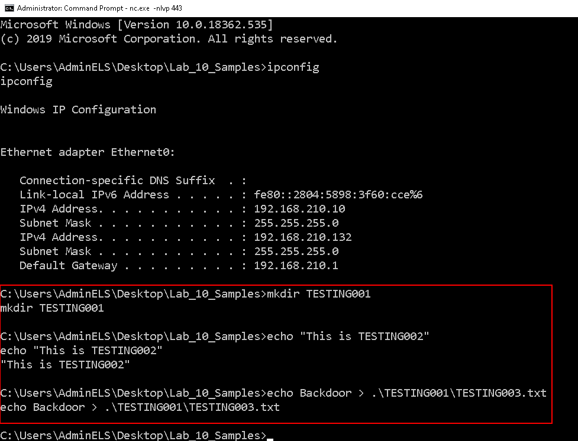  

<br/>

In Procmon, filter out `Path contains TESTING` (spawned cmd.exe).

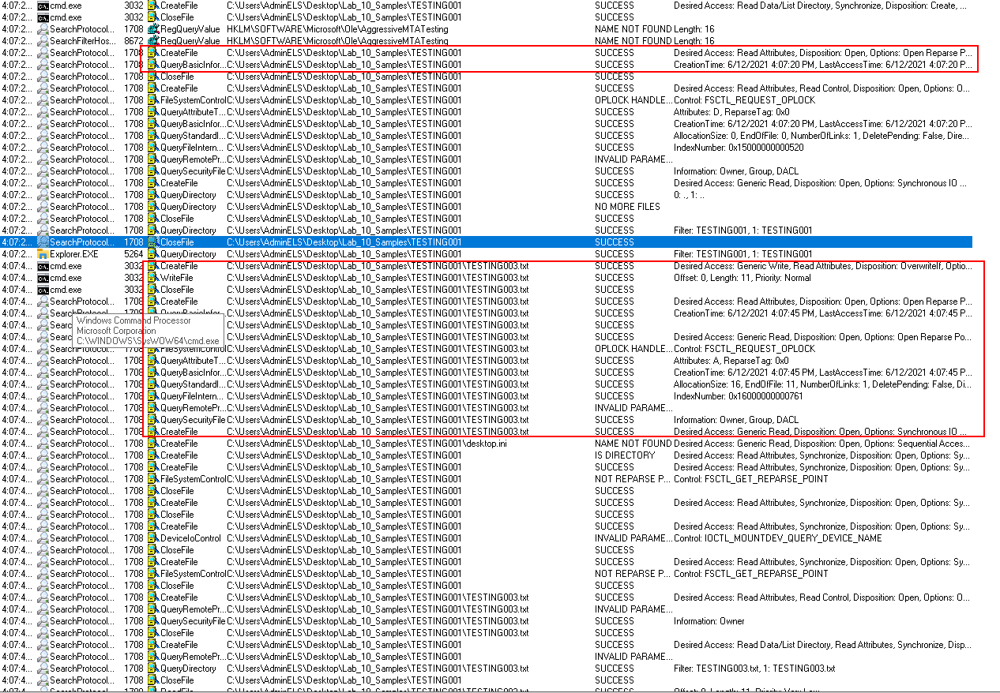  

- Note there are many operations handled by another process `SearchprotocolHost.exe` for createing folder and file

<br/>

Filter out `lab_09.exe` and `cmd.exe` only, we can see they spawned after the TCP connection:

  


<br/>

We can also inspect the TCP stream in Wireshark:

- Filter `ip.host eq 192.168.210.132`
- Right click one of the entry and `Follow TCP Stream`

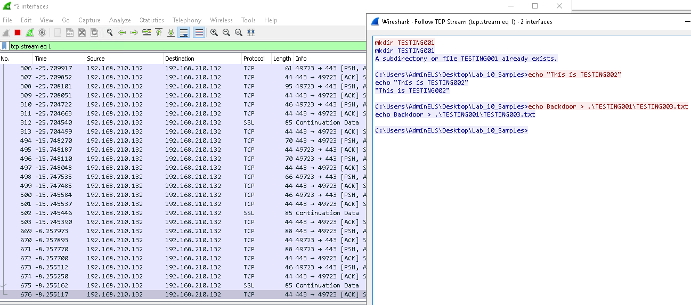  

- Note the payloads are in Cleartext

<br/>

---

## Task 3: Sample IOCs

**Question**

Determine the IOCs that could be created to find and identify this sample on other systems.

<br/>

**Answer**

We can create a YARA rule:

```
import "pe"
import "hash"

rule DetectLab09Backdoor 
{
    meta:
      description = "Detect lab_09.exe"
      author = "Brain You"
      date = "13 Jun 2021"
    strings:
      $str1 = "192.168.210.132" nocase ascii wide
      $str2 = "2cmd.exe" nocase ascii wide
      $str3 = "CreateProcessW" nocase ascii wide
      $str4 = "WSAConnect" nocase ascii wide
      $mz = {4d 5a}
    condition:
      ( ( all of ($str*) ) and ( $mz at 0 ) ) or 
      ( hash.md5(0, filesize) == "fca6b0e7db00a153b9828f3db2f12a0c" )
}
```

<br/>

Test it again the sample folder:

```
yara64.exe rule.yar -s -r C:\Users\AdminELS\Desktop\Lab_10_Samples\
```

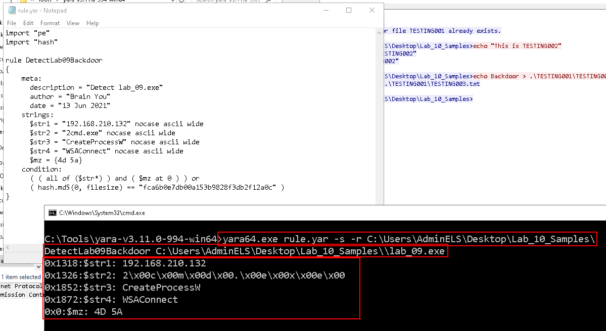  


<br/>

---