# Lab 11 - Keylogger Dynamic Analysis

- [Lab 11 - Keylogger Dynamic Analysis](#lab-11---keylogger-dynamic-analysis)
  - [Scenario](#scenario)
  - [Tools](#tools)
  - [Task 1: Finding main handles and files](#task-1-finding-main-handles-and-files)
    - [Static Analysis](#static-analysis)
    - [Dynamic Analysis](#dynamic-analysis)
  - [Task 2: Analyzing process activity](#task-2-analyzing-process-activity)
  - [Task 3: Sample IOCs](#task-3-sample-iocs)

---

## Scenario

You’ve been called by a client to examine a weird sample that was found on one of their developer’s systems. The client thinks this sample could be hiding its true nature of activity.

<br/>

The goal of this lab is to understand how to analyze a user level keylogger and locate the files where keystrokes are being saved to.

<br/>

After completing this lab, you will be able to analyze user-level keyloggers using basic dynamic analysis techniques using tools such as Process Explorer, Process Monitor, and Wireshark.

<br/>

192.168.210.10 / AdminELS / Nu3pmkfyX

<br/>

---

## Tools

- Sysinternals Process Explorer (procexp.exe) 
- Sysinternals Process Monitor (procmon.exe)
- Wireshark

<br/>

---

## Task 1: Finding main handles and files

**Question**

Run the given sample and find all the main parts of it: handles and files used.

<br/>

**Answer**

### Static Analysis

Open the sample in **PEStudio**:

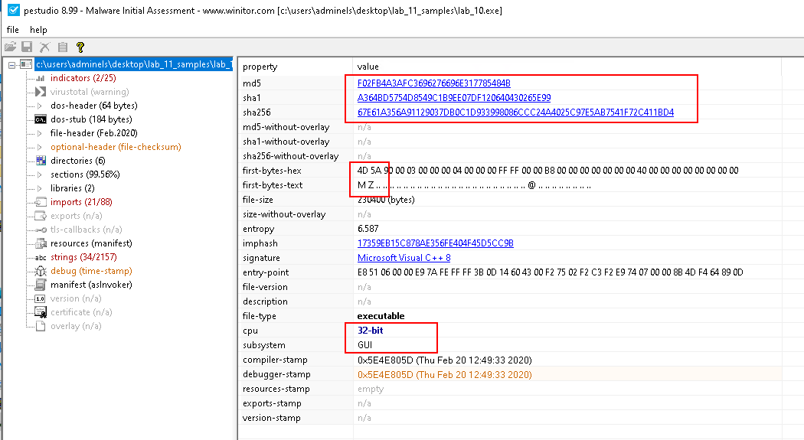  

- MD5: `F02FB4A3AFC3696276696E317785484B`
- SHA1: `A364BD5754D8549C1B9EE07DF120640430265E99`
- SHA256: `67E61A356A91129037DB0C1D933998086CCC24A4025C97E5AB7541F72C411BD4`
- It is a PE (indicated by the first bytes `MZ` `0x4d5a`)
- 32-bit with GUI

<br/>

Check the strings:

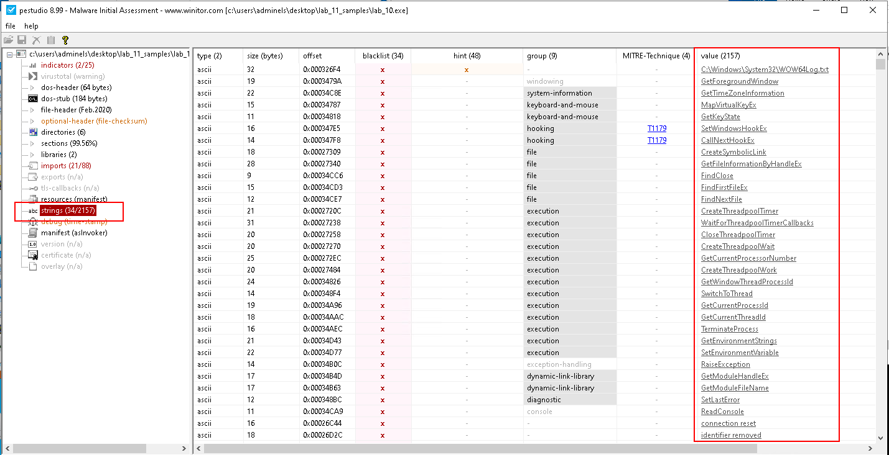  

- Interesting strings:
  - `C:\Windows\System32\WOW64Log.txt`
  - `connection reset`
  - `identifier removed`
  - `operator co await`

- Hooking related:
  - `CallNextHookEx`

- Execution related:
  - CloseThreadpoolTimer
  - CreateThreadpoolTimer
  - CreateThreadpoolWait
  - CreateThreadpoolWork
  - GetCurrentProcessId
  - GetCurrentProcessorNumber
  - GetCurrentThreadId
  - GetEnvironmentStrings
  - GetWindowThreadProcessId
  - SetEnvironmentVariable
  - SwitchToThread
  - TerminateProcess
  - WaitForThreadpoolTimerCallbacks

- File related:
  - CreateSymbolicLink
  - FindClose
  - FindFirstFileEx
  - FindNextFile
  - GetFileInformationByHandleEx

- IO related:
  - GetKeyState
  - MapVirtualKeyEx
  - GetKeyboardLayout

- DLL related:
  - GetModuleFileName
  - GetModuleHandleEx

<br/>

Check the imports:

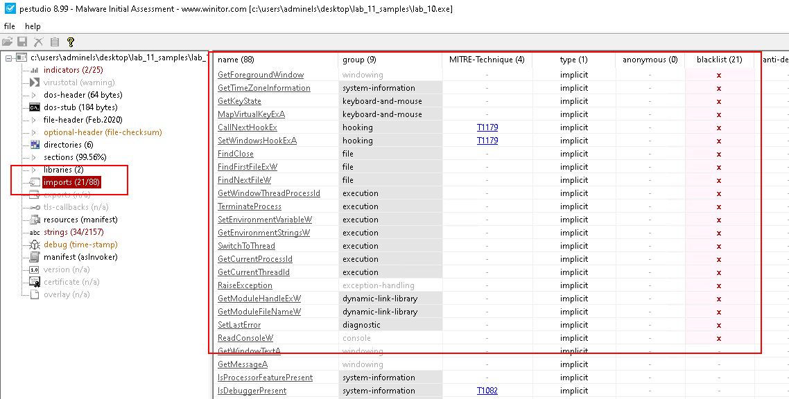  

- IO related:
  - GetKeyState
  - MapVirtualKeyExA

- Hooking related:
  - CallNextHookEx
  - SetWindowsHookExA

- File related:
  - FindClose
  - FindFirstFileExW
  - FindNextFileW

- Execution related:
  - GetWindowThreadProcessId
  - TerminateProcess
  - SetEnvironmentVariableW
  - GetEnvironmentStringsW
  - SwitchToThread
  - GetCurrentProcessId
  - GetCurrentThreadId

<br/>

Check the libraries:

  

- `user32.dll`
- `kernel32.dll`

<br/>

### Dynamic Analysis

Open, as admin, the following:

1. Process Monitor
2. Process Explorer
3. Wireshark

<br/>

Run the sample as admin:

```
lab_10.exe
```

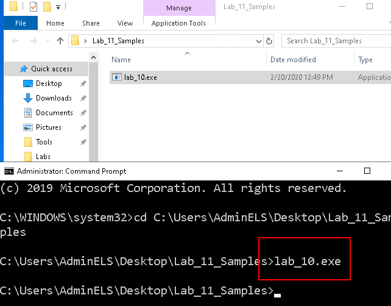  

- Nothing is shown to the user

<br/>

Inspect in Process Explorer:

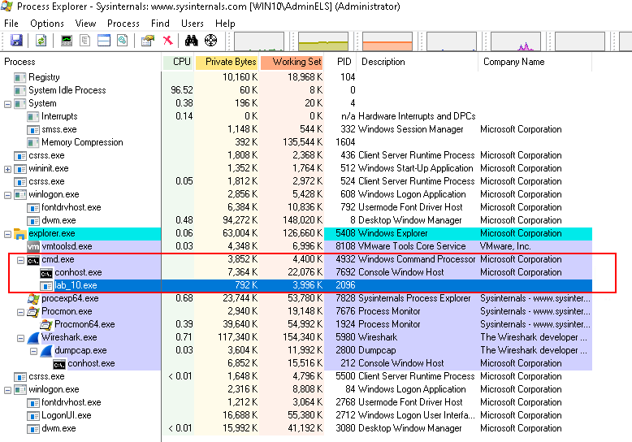  

- An instance of `lab_10.exe` (PID: 2096) is running

<br/>

In Process Monitor, inspect the Process Handle:

1. `View > Show Lower Pane`
2. `View > Lower Pane View > Handles`

  

- It is communicating with `C:\Windows\SysWOW64\WOW64Log.txt`

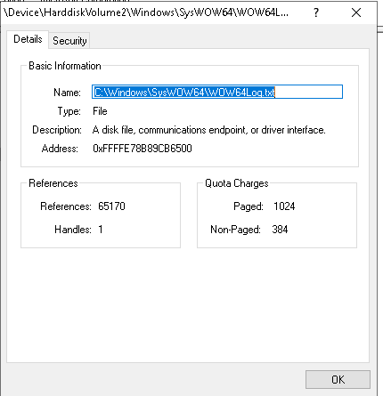  


<br/>

Also check the memory strings of `lab_10.exe` in **Process Explorer**:

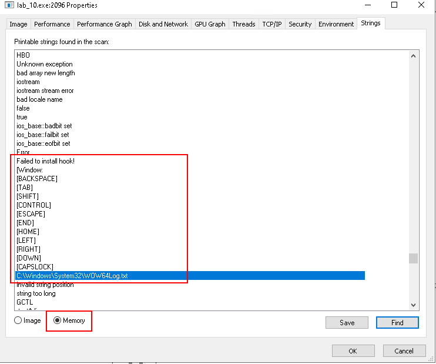  

- "Failed to install hook" is shown
- There are some keystrokes listed - likely they are the ones that the program cannot hook

<br/>

In the Static Analysis, it is suspected that this is a keylogger since it includes some I/O imports. 

Try to create a text file and see if the text is captured somewhere.

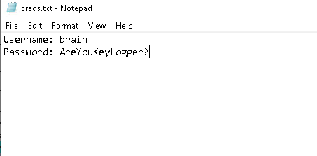  


<br/>

---

## Task 2: Analyzing process activity

**Question**

This is a malicious sample that was collected, and you’re required to analyze it and provide as much information to what activity it is doing.

<br/>

**Answer**

In **Process Monitor**, filter `Operation is CreateFile` and `ProcessName is lab_10.exe`:

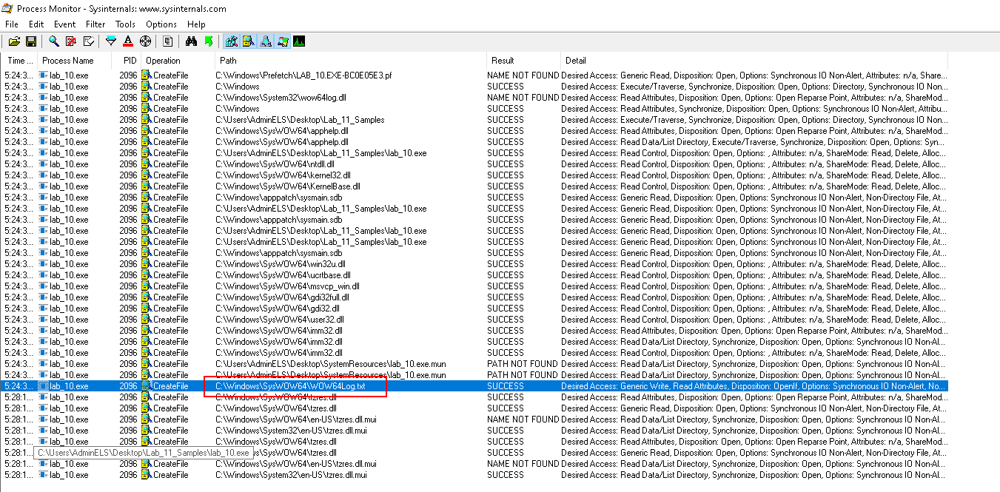  

- The operation of creating `WOW64Log.txt` is shown

  

- Desired Access is `Generic Write, Read Attributes`
- OpenResult is `Created`

<br/>

Right click the entry and click `Jump To ...`, it brings you to the target path:

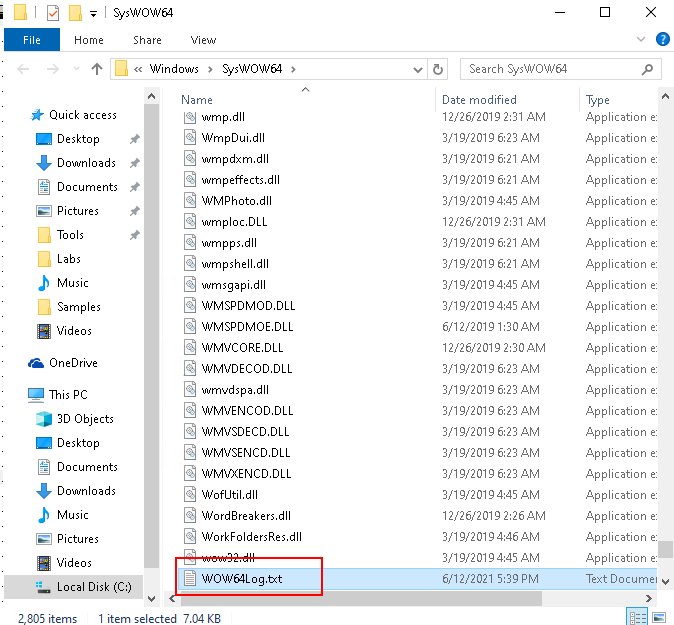  

<br/>

Inspect the file:

  

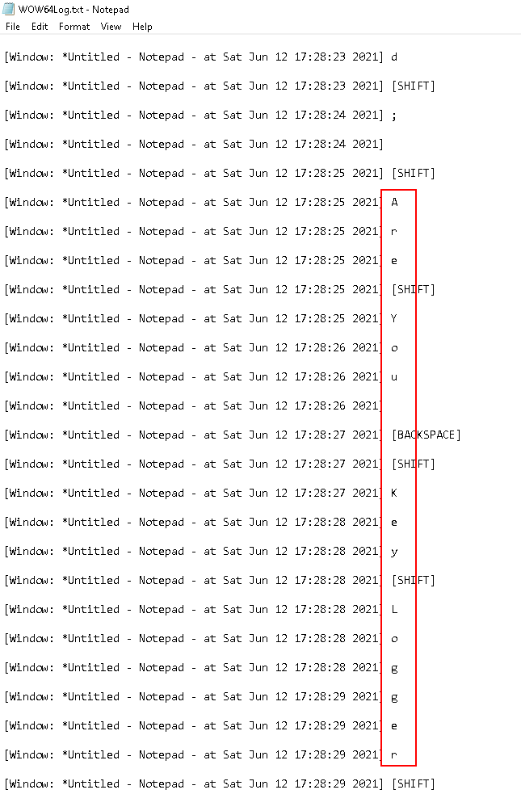  

- These are the character that we have typed

<br/>

Filter `Process Name is lab_10.exe`:

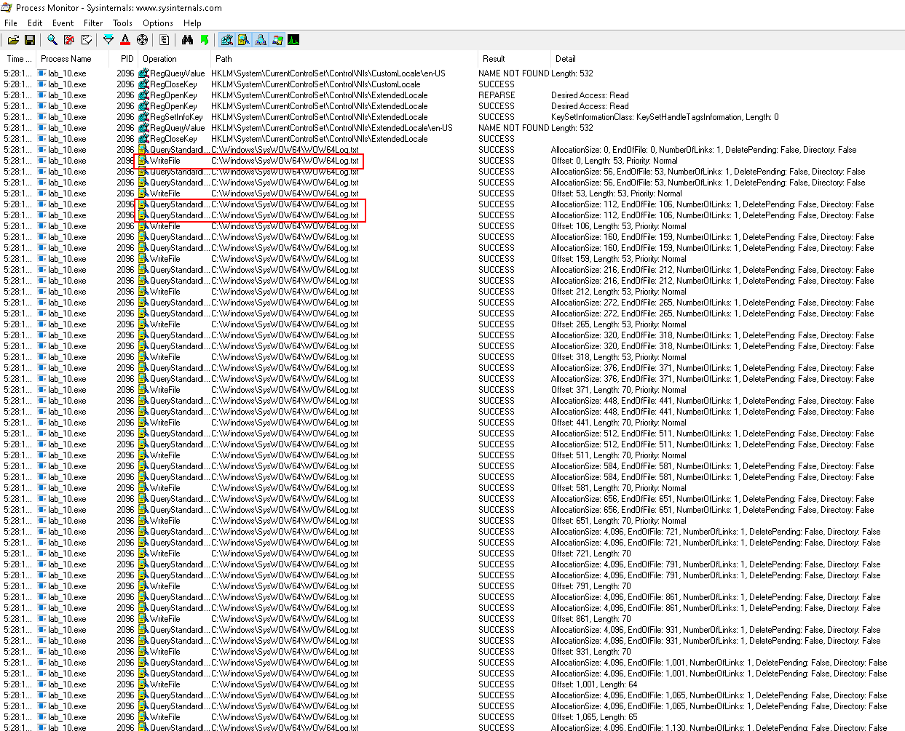  

- See the pattern `QueryStandardinformationFile` > `WriteFile`
- Note the bytes written are different: `53`, `70`, `64`, `65` etc -> This indicates the length of different keystokes

  


<br/>

---

## Task 3: Sample IOCs

**Question**

What are the IOCs that could be created to find and identify this sample on other systems?

<br/>

**Answer**

We can write a YARA rule to capture this in memory:

```
import "pe"
import "hash"

rule DetectKeyloggerLab10
{
    strings:
      $str1 = "[BACKSPACE]" nocase ascii wide
      $str2 = "[TAB]" nocase ascii wide
      $str3 = "[SHIFT]" nocase ascii wide
}

```

<br/>

---