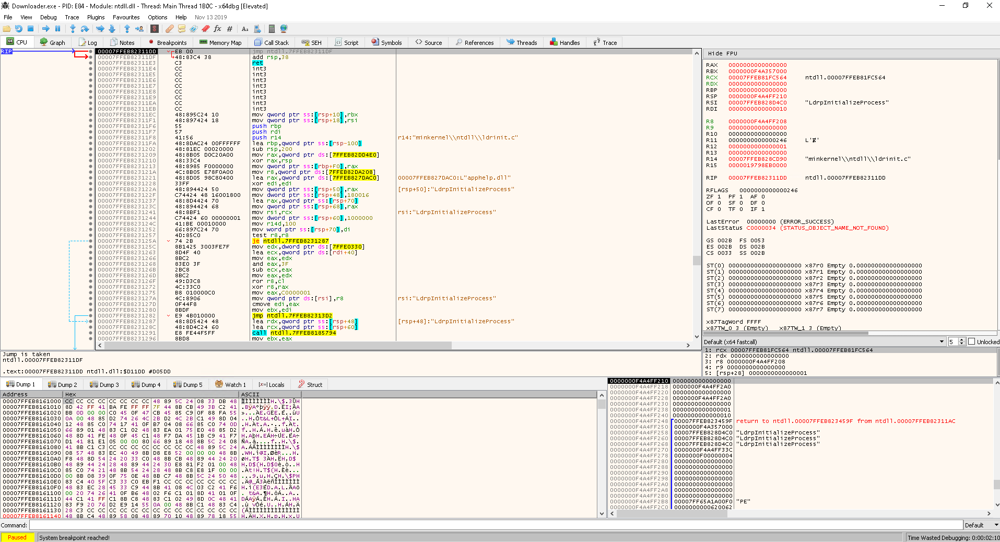
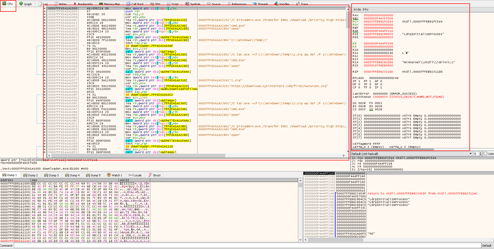
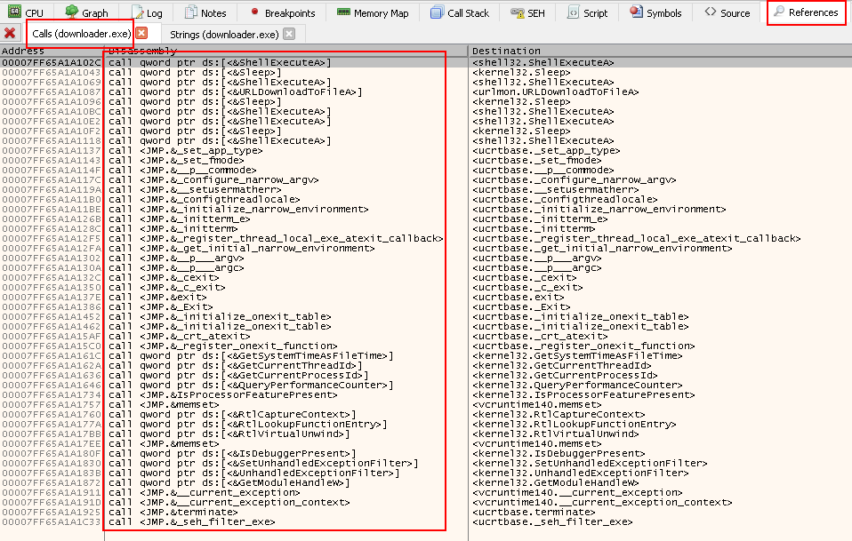

# Lab 13 - Debugging 64-bit Downloader using X64DBG

- [Lab 13 - Debugging 64-bit Downloader using X64DBG](#lab-13---debugging-64-bit-downloader-using-x64dbg)
  - [Scenario](#scenario)
  - [Tools](#tools)
  - [Task 1: General Sample Information](#task-1-general-sample-information)
  - [Task 2: Function calls and breakpoints](#task-2-function-calls-and-breakpoints)
  - [Task 3" Running the Downloader](#task-3-running-the-downloader)

---

## Scenario

You have been called by a client to examine a weird sample that was found on one of their developer’s systems. The client thinks this sample could be hiding its true nature of activity.

 

The goal of this lab is to understand how to both debug and reverse engineer a downloader which is widely used by different threat actors.

 

After completing this lab, you will be able to use a disassembler, such as IDA Pro, to reverse engineer a downloader. You will also be able to use a debugger, such as x64dbg, to debug the same downloader and understand what malicious activity is being carried by this downloader.

 

192.168.210.10 / AdminELS / Nu3pmkkfyX

 

---

## Tools

- x64dbg
- IDA Pro
- PEStudio

 

---

## Task 1: General Sample Information

**Question**

Gather general information about the sample using only a debugger.

 

**Answer**

First load (open) the sample into **x64dbg**.

Note:
Attach = Load a running process
Open = Load an Image

  

 

First check the **imported and exported APIs** by navigating to the **Symbols** tab:

  

 

Double clicking `Downloader.exe` on the left will bring us to the disassembly:

  

 

We can search for strings by `Right-click in the disassembly window > Search for > Current Module > String references`:

  

  

 

Since the static analysis has been done before, it is skipped in this part. 

---

## Task 2: Function calls and breakpoints

**Question**

This is a malicious sample that was collected, and you need to Figure out what functions are being used and where to place a breakpoint to control the process.

 

**Answer**

The main reason we use a debugger is to **have control of the execution flow** by adding breakpoints.

 

By default, the debugger will stop at either:

- A system entry
- TLS callback
- The program's entrypoint

 

In the **Symbol** tab, the program's entrypoint is highlighted in <red>red</red> (**Address of Entry Point**) - the red highlight mark means that there is a breakpoint at that address location.

  

 

Next, double-click `Downloader.exe` on the left to get back to the disassembly.

Then `right-click in the disassembly window > Search for > Current Module > Intermodular calls`.

  

  

- New tab titled `Calls`
- Names of the modules are listed in parenthesis on the right
- The first 9 function calls (`ShellExecuteA`, `Sleep`, `URLDownloadToFileA`) are of interest

 

Set breakpoints to the 9 function calls by `right-clicking the function > Toggle Breakpoint` one by one (or you can select the function calls then press `F2`):

  

 

After that you will see the related addresses highlighted in red:

  

 

We can also see the breakpoints we have set in the **Breakpoints tab**:

  

 

After setting the breakpoints, run the program either by:

1. Click the Blue Arrow on the toolbar
2. Press `F9`

Then we should be brought to the **EntryPoint** in the **CPU tab**:

  

  

 

---

## Task 3" Running the Downloader

**Question**

Determine the IOCs that could be created to find and identify this sample on other systems.

 

**Answer**

 

---