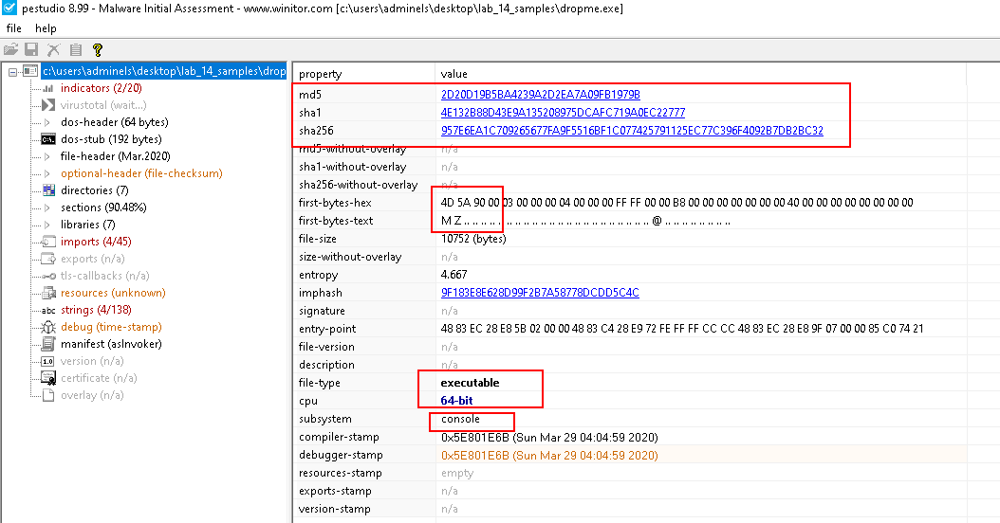
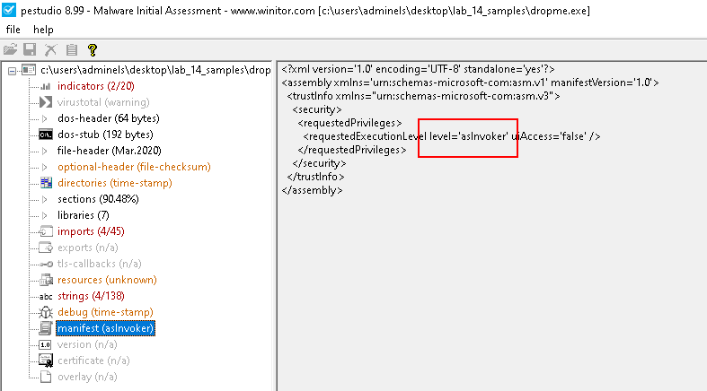
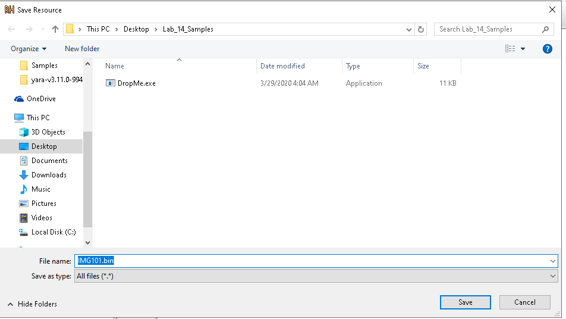
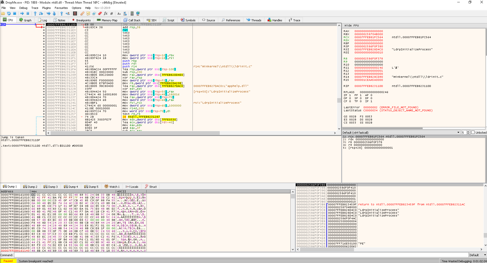

# Lab 14 - Debugging a 64-bit Dropper

- [Lab 14 - Debugging a 64-bit Dropper](#lab-14---debugging-a-64-bit-dropper)
  - [Scenario](#scenario)
  - [Tools](#tools)
  - [Task 1: PE and Resource info](#task-1-pe-and-resource-info)
    - [Static Analysis using PEStudio](#static-analysis-using-pestudio)
    - [Static Analysis - Resource Hacker](#static-analysis---resource-hacker)
  - [Task 2: Function calls and Breakpoints](#task-2-function-calls-and-breakpoints)
    - [IDA Pro](#ida-pro)
    - [X64dbg](#x64dbg)
  - [Task 3: Running the Dropper](#task-3-running-the-dropper)
  - [Task 4: Debugging the shellcode](#task-4-debugging-the-shellcode)
  - [Task 5: Explain the Graph Code Blocks](#task-5-explain-the-graph-code-blocks)

---

## Scenario

You’ve been called by a client to examine a sample that was found on one of their developer’s systems. The client thinks this sample could be hiding its true nature of activity.

<br/>

The goal of this lab is to understand how to both debug and reverse engineer a dropper, which is widely used by different threat actors.

<br/>

After completing this lab, you will be able to use a debugger such as x64dbg (and perhaps a disassembler, such as IDA Pro) to debug and reverse engineer a malicious 64-bit Dropper that drops a shellcode from its resource section and executes it. You will learn how to go through the code step-by-step and debug the shellcode to understand its true nature. This also is an excellent lab to learn more about 64-bit assembly and shellcode.

<br/>

192.168.210.10 / AdminELS / Nu3pmkfyX

<br/>

---

## Tools

- x64dbg
- IDA Pro
- PEStudio

<br/>

---

## Task 1: PE and Resource info

**Question**

Gather general information about the sample using different tools (static analysis).

<br/>

**Answer**

### Static Analysis using PEStudio

Load the sample in **PE Studio**.

  

- MD5: 2d20d19b5ba4239a2d2ea7a09fb1979b
- SHA1: 4e132b88d43e9a135208975dcafc719a0ec22777
- SHA256: 957e6ea1c709265677fa9f5516bf1c077425791125ec77c396f4092b7db2bc32
- 64-bit Console Application
- Windows PE (`4d 5a`)

<br/>

**Indicator**

  

<br/>

**File header**

  

- Potential compiled time: 29 March 2020 04:04:59 UTC

<br/>

**Sections**

  

- Standard non-packed header names

<br/>

**Strings**

  

- `0x1C3A` - `GetCurentProcessId`
- `0x1C50` - `GetCurrentThreadId`
- `0x1C96` - `RtlCaptureContext`
- `0x1CAA` - `RtlLookupFunctionEntry`

<br/>

**Imports**

  

- Similar to **Strings**
- Imports from `kernel32.dll`

<br/>

**Manifest**

  

- Does not require Admin privilege

<br/>

**Resources**

  

- Non standard resource

<br/>

### Static Analysis - Resource Hacker

Load the sample in **Resource Hacker**.

Check the `IMG` folder:

  

- Doesn't look like an image!

<br/>

Next try to export this as a binary data:

  

  

<br/>

Get the file hash of the output file using **PowerShell**:

```
Get-FileHash -Algorithm MD5 .\IMG101.bin
```

  

- MD5: EABB4194819818CF0F712D02EA00100E

<br/>

Check this hash on VirusTotal:

- https://www.virustotal.com/gui/file/94752fe0d2e88045ff9e6276c519d82bae098bc6a33273b36a447f97435f0c84/details

  

- 15/55 detection
- Suspicious finding

<br/>

---

## Task 2: Function calls and Breakpoints

**Question**

This is a malicious sample that was collected, and you need to figure out what functions are being used and where to place a breakpoint to control the process.

<br/>

**Answer**

### IDA Pro

Run **IDA Pro 64-bit** as admin, and load the sample. It brings us to the main function disassembly:

  

1. `FindResourceA` is called
2. `SizeofResource` is called
3. `LoadResource` is called
4. `VirutalAlloc` is called
5. `memcpy` is called
6. `rbx` is called <---- Interesting

<br/>

### X64dbg

Load the sample into **x64dbg**:

  

<br/>

Go to the **Symobol tab** and click `dropme.exe` on the left:

  

- Here are the imports and exports of the sample

<br/>


<br/>

---

## Task 3: Running the Dropper

**Question**

Use a debugger to run the dropper and understand what it’s doing.

<br/>

**Answer**


<br/>

---

## Task 4: Debugging the shellcode

**Question**

Use a debugger to trace through the shellcode step-by-step and understand its true nature.

<br/>

**Answer**


<br/>

---

## Task 5: Explain the Graph Code Blocks

**Question**

Generate a graph for the shellcode and explain its blocks. This is a DIY exercise.

<br/>

**Answer**


<br/>

---