# Lab 15 - Reverse Engineering a Keylogger using IDA Pro

- [Lab 15 - Reverse Engineering a Keylogger using IDA Pro](#lab-15---reverse-engineering-a-keylogger-using-ida-pro)
  - [Scenario](#scenario)
  - [Goal](#goal)
  - [Tools](#tools)
  - [Task 1: Main Sample Information](#task-1-main-sample-information)
  - [2 - Static Analysis using IDA](#2---static-analysis-using-ida)
    - [WOW64Log.txt](#wow64logtxt)
    - [SetWindowsHookExA](#setwindowshookexa)
    - [Function fn](#function-fn)
  - [Task 3: Sample IOCs](#task-3-sample-iocs)

---

## Scenario

You have been called by a client to examine a weird sample that was collected from one of their systems. The client thinks this sample could be hiding its true nature of activity.

 

---

## Goal

The goal of this lab is to continue using pestudio for basic analysis and then understand how to reverse engineer a bot sample using IDA Pro and find the true nature of the sample.

 

---

## Tools

- IDA Pro
- PeStudio

 

---

## Task 1: Main Sample Information

**Question**

Analyze the sample using basic static analysis methods to find and collect as much information as you can that would help during the reverse engineering (advanced static analysis) process.

 

**Answer**

Open the sample in **PeStudio**. Check the basic information:

  

- Hashes:
  - md5,F02FB4A3AFC3696276696E317785484B
  - sha1,A364BD5754D8549C1B9EE07DF120640430265E99
  - sha256,67E61A356A91129037DB0C1D933998086CCC24A4025C97E5AB7541F72C411BD4
- Archi: 32-bit
- Type: Windows PE

  

- PEStudio identifies it a Keylogger

 

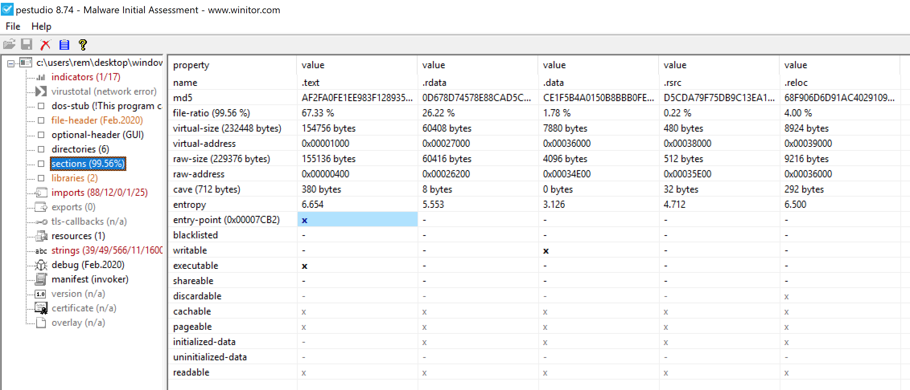  

 

Libraries:

  

 

Common key logger API are found:

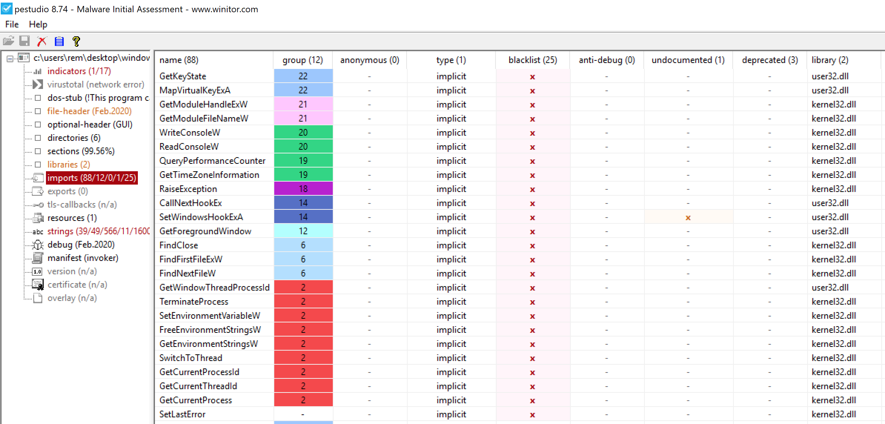  

- GetKeyState
- MapVirtualKeyExA
- GetKeyboardLayout
- SetWinodwsHookExA
...

 

Inspect the strings:

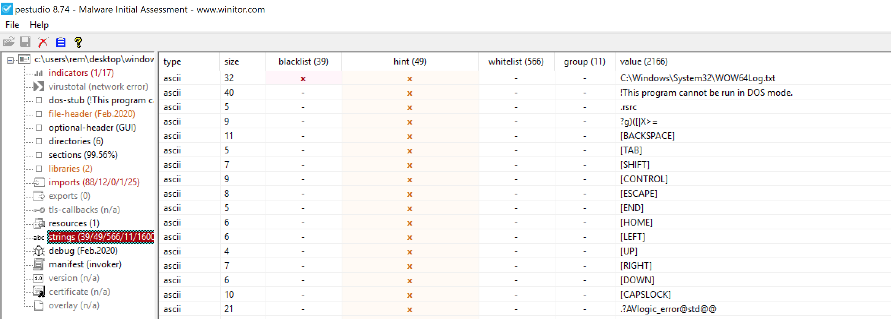  

- Command keyboard keys are found:
  - BACKSPACE
  - TAB
  - SHIFT
  - CONTROL
  - ESCAPE
  - END
  - HOME 
  - LEFT
  - UP
  - RIGHT
  - DOWN
  - CAPSLOCK
- Suspicious text file path: 
  - `C:\Windows\System32\WOW64Log.txt`

 

---

## 2 - Static Analysis using IDA

**Question**

Reverse engineer the collected smaple to understand its true nature.

 

**Answer**

Open the sample in **IDA**. 

 

### WOW64Log.txt

Let's start with some interesting strings. From Static Analysis, we see there is a file called `C:\Windows\System32\WOW64Log.txt`. Navigate to `View > Open Subviews > Strings`:

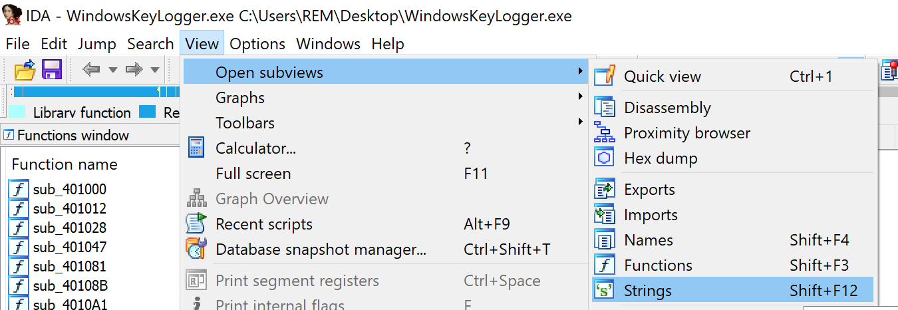  

- Type `C:\\Windows` and we can see the string reference:

  

- VA: `4334F4` in `.rdata`

 

Double click the row. Click on `aCWindowsSystem` and hit `x`:

  

- Click `OK` to get to the address referencing `aCWindowsSystem`

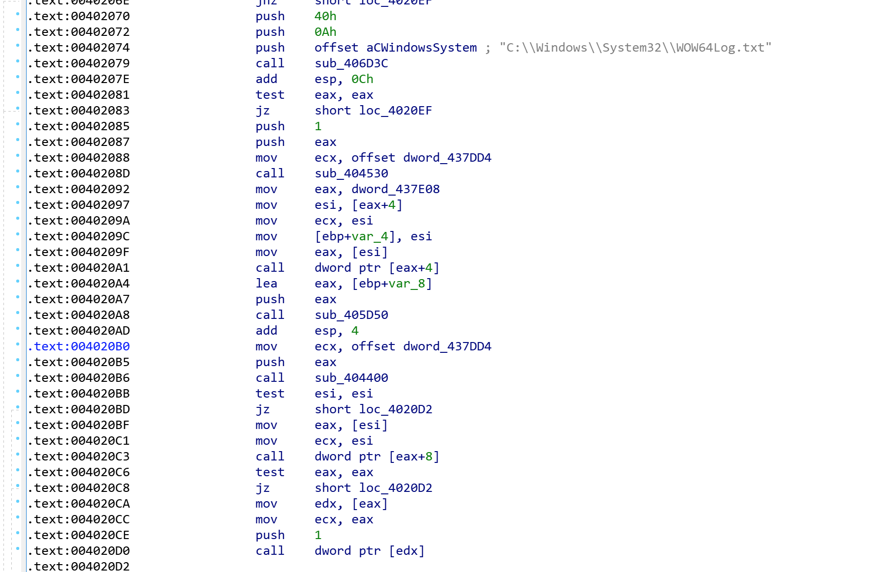  

- However there is not much information revealing how this is used

 

### SetWindowsHookExA

Move on to check other interesting API call. Go to the **Imports tab** and type `SetWindowsHookExA`:

  

- Double click and then click on `SetWindowsHookExA` again
- Hit `X`

  

- Click `OK`

 

Look into the MS document related to `SetWindowsHookExA`:

- https://docs.microsoft.com/en-us/windows/win32/api/winuser/nf-winuser-setwindowshookexa
- Purpose:
  - Installs an application-defined hook procedure into a hook chain. 
  - You would install a hook procedure to monitor the system for certain types of events. 
  - These events are associated either with a specific thread or with all threads in the same desktop as the calling thread.
- Parameters:
  - `idHook`
    - The type of hook procedure to be installed. 
  - `lpfn`:
    - A pointer to the hook procedure. 
    - If the `dwThreadId` parameter is zero or specifies the identifier of a thread created by a different process, the `lpfn` parameter must point to a hook procedure in a DLL. 
    - Otherwise, `lpfn` can point to a hook procedure in the code associated with the current process.
  - `hmod`:
    - A handle to the DLL containing the hook procedure pointed to by the lpfn parameter. 
    - The `hMod` parameter must be set to `NULL` if the `dwThreadId` parameter specifies a thread created by the current process and if the hook procedure is within the code associated with the current process.
  - `dwThreadId`:
    - The identifier of the thread with which the hook procedure is to be associated.
    - Of this parameter is zero, the hook procedure is associated with all existing threads running in the same desktop as the calling thread. 

- Return value:
  - If the function succeeds, the return value is the handle to the hook procedure.
  - If the function fails, the return value is NULL. 

 

Take a look at the parameters supplied:

- `idHook`
  - `0Dh` = `13` = `WH_KEYBOARD_LL`
  - Installs a hook procedure that monitors low-level keyboard input events.
  - https://docs.microsoft.com/en-us/windows/win32/winmsg/about-hooks#wh_keyboard_ll
    - https://docs.microsoft.com/en-us/previous-versions/windows/desktop/legacy/ms644985(v=vs.85)
    - `lParam` is a pointer to `KBDLLHOOKSTRUCT`
      - https://docs.microsoft.com/en-gb/windows/win32/api/winuser/ns-winuser-kbdllhookstruct?redirectedfrom=MSDN
        - `vkCode`: A Virual-key code from `1` - `254`
        - scanCode
        - flags
        - time
        - dwExtraInfo
- `lpfn`
  - `offset fn`
- `hmod` = 0
  - A thread in the current process
- `dwThreadId` = 0
  - All threads in the desktop

- Based on these information, we know that the specimen is using `SetWindowsHookExA` to install a hook procedure and monitor low-level keyboard input events.

 

At `40212D` - `test eax, eax` - It check whether the `SetWindowsHookExA` run successfully.

At `40212F` - If it runs successfully (non-zero output from the API return), it jumps to `402144`.

- Otherwise, it shows `Failed to install hook!` in a MessageBox.

 

The function `402144` - `mov esi, ds:GetMessageA` - move the pointer to `GetMessageA` to `esi`.

  

 

Then in the function `402150`, it calls `GetMessageA`. Let's check the MSDOC associated:

- https://docs.microsoft.com/en-us/windows/win32/api/winuser/nf-winuser-getmessagea
- Purpose:
  - Retrieves a message from the calling thread's message queue. 
  - The function dispatches incoming sent messages until a posted message is available for retrieval.
- Parameters:
  - `lpMsg`:
    - A pointer to an MSG structure that receives message information from the thread's message queue.
  - `hWnd`
    - A handle to the window whose messages are to be retrieved. The window must belong to the current thread.
    - If `hWnd` is `NULL`, `GetMessage` retrieves messages for any window that belongs to the current thread, and any messages on the current thread's message queue whose `hwnd` value is `NULL` (see the MSG structure). 
        - Therefore if `hWnd` is NULL, both **window messages** and **thread messages** are processed.
      - If `hWnd` is `-1`, `GetMessage` retrieves o**nly messages on the current thread's message queue** whose hwnd value is `NULL`;
        - that is, thread messages as posted by `PostMessage` (when the `hWnd` parameter is `NULL`) or `PostThreadMessage`.
  - `wMsgFilterMin`
    - The integer value of the lowest message value to be retrieved. 
    - Use `WM_KEYFIRST (0x0100)` to specify the first keyboard message or `WM_MOUSEFIRST (0x0200)` to specify the first mouse message.
  - `wMsgFilterMax`
    - The integer value of the highest message value to be retrieved. 
    - Use `WM_KEYLAST` to specify the last keyboard message or `WM_MOUSELAST` to specify the last mouse message.
  - If `wMsgFilterMin` and `wMsgFilterMax` are both zero, `GetMessage` returns all available messages (that is, no range filtering is performed).
- Return value:
  - If the function retrieves a message other than `WM_QUIT`, the return value is nonzero.
  - If the function retrieves the `WM_QUIT` message, the return value is zero.
  - If there is an error, the return value is `-1`. 

 

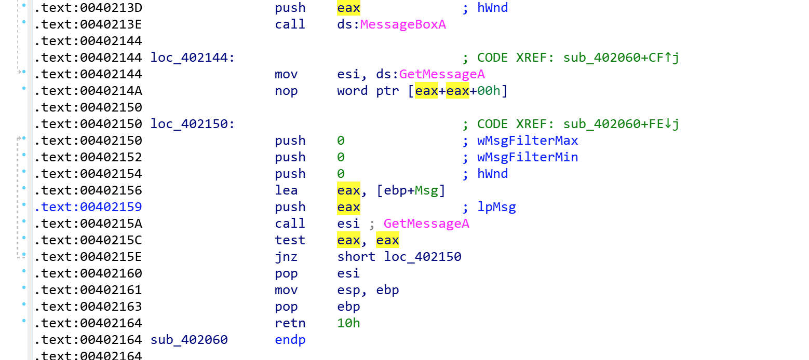  

Check the parameters supplied:

- `lpMsg` = `eax` = `[ebp+Msg]`
- `hWnd` = `0`
  - Retrieve messages for any window belonging to the current thread
- `wMsgFilterMin` / `wMsgFilterMax` = 0
  - Return all available messages

 

Then at `40215C` - `test eax, eax` - it checks if the `GetMessageA` successes and not `WM_QUIT`.

- If yes, jump to `402150`
- If not, return `0x10`

 

In short, from `40210F` to `40215E`, it install a hook and monitor any available keyboard inputs, unless it receives `WM_QUIT`.

 

### Function fn

In the `GetMessageA` API call, we see `fn` is supplied as `lpfn`. Double click it and check the code:

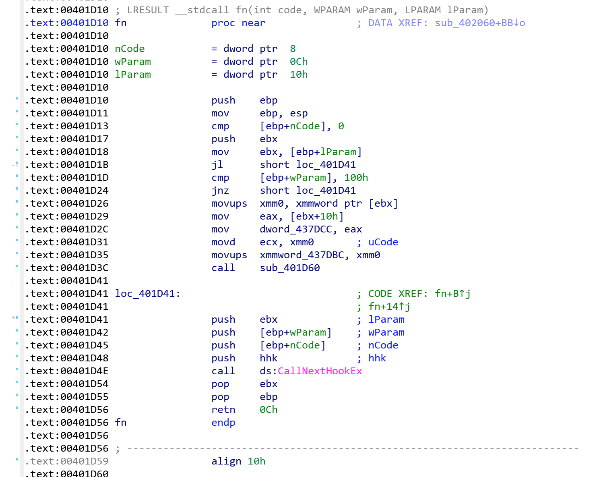  

- `401D13` - `cmp [ebp+nCode], 0` - Compare `0` with `nCode`
- `401D18` - `ebx, [ebp+lParam]` - move `lParam` to `ebx` on the top of the stack
- `401D1B` - Jump to `401D41` if `nCode` < 0
- `401D1D` - Compare `wParam` with `0x100`
  - Jump to `401D41` if `wParam < 0x100`

 

According to https://docs.microsoft.com/en-us/previous-versions/windows/desktop/legacy/ms644985(v=vs.85):

- `WM_KEYDOWN` = `0x100` = Key pressed
- `WM_KEYUP` = `0x101` = Key released
- `CallNextHookEx` is called

 

Here is the analysis for this part - see the comment:

  

 

Then look into the `call` instruction `401D60`:

  

- The function `401D60` only requires 1 parameter `uCode`
- The supplied parameter is `xmm0`, as denoted by **IDA**

 

Click on `xmm0` and see how it is assigned:

  

- At `401D26` - `movups xmm0, xmmword ptr [ebx]`
  - `movups` - move four unaligned packed single-precision floating-point values between XMM registers or memory 
  - `xmm0` is assigned with the value where `ebx` is pointing to
  - `ebx` is assigned with `lParam` at `401D18`
- Therefore `lParam` is passed to the function `401D60`

 

Double click `401D60` to inspect the code:

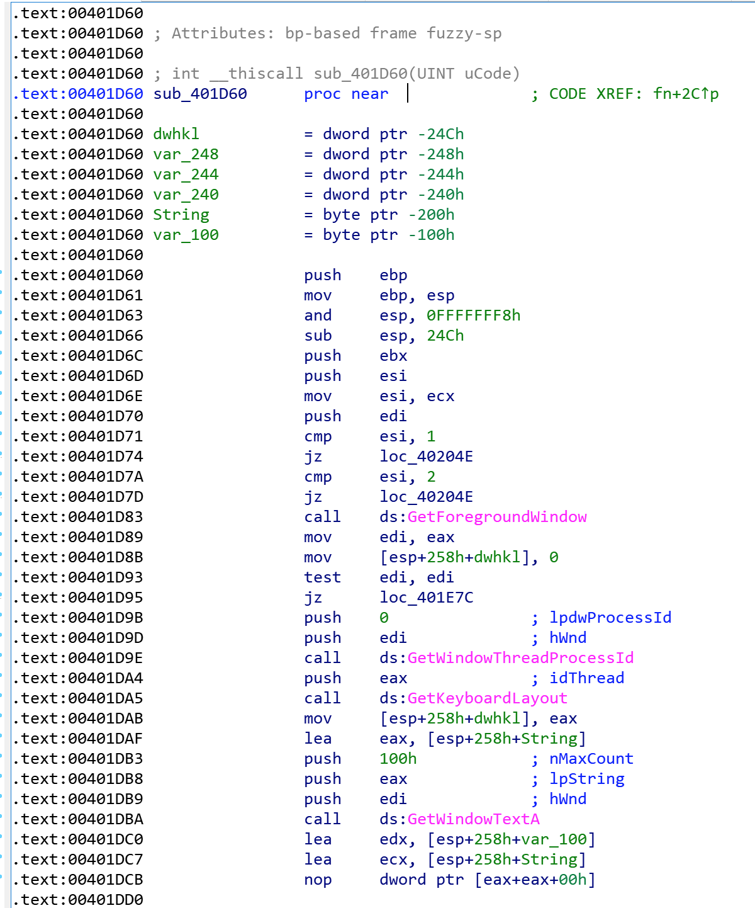  

First examine the API call `GetForegroundWindow`.

- https://docs.microsoft.com/zh-tw/windows/win32/api/winuser/nf-winuser-getforegroundwindow
- Purpose:
  - Retrieves a handle to the foreground window (the window with which the user is currently working). 
- Return value:
  - The return value is a handle to the foreground window. 
- No parameter for this
 

Then examine the API call `GetWindowThreadProcessId`. 

- https://docs.microsoft.com/en-us/windows/win32/api/winuser/nf-winuser-getwindowthreadprocessid
- Purpose:
  - Retrieves the identifier of the thread that created the specified window and, 
  - optionally, the identifier of the process that created the window.
- Parameter:
  - `hWnd`: The handle to the window
  - `lpdwProcessId`: 
    - A pointer to a variable that receives the process identifier. 
    - If this parameter is not NULL, GetWindowThreadProcessId copies the identifier of the process to the variable; otherwise, it does not.
- Return value:
  - The return value is the identifier of the thread that created the window.

 

- At `401D9D`, the `hWnd` value is supplied with `edi`

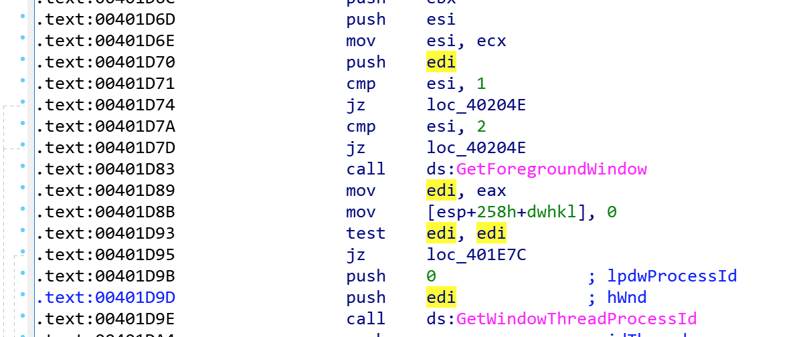  

- `edi` is the return handle from the API call `GetForegroundWindow` in this case
- That is to say, the purpose of `GetWindowThreadProcessId` is to get the thread identifier of the Foreground window

 

Then at `401DA5`, it calls `GetKeyboardLayout` using the thread identifier obtained from `GetWindowThreadProcessId`

- Purpose: Retrieves the active input locale identifier (formerly called the keyboard layout).
- Parameter:
  - `idThread`: The identifier of the thread to query, or 0 for the current thread.
- Return value:
  - The return value is the input locale identifier for the thread. 

 

Then at `401DBA`, it calls `GetWindowTextA`.

- Purpose:
  - Copies the text of the specified window's title bar (if it has one) into a buffer. 
- Parameter:
  - `hWnd`
    - A handle to the window or control containing the text.
    - `edi` in this case, which is the result of `GetForegroundWindow`
  - `lpString`:
    - The buffer that will receive the text.
    - `eax` in this case; which means `eax` will be the Foreground Window's title
  - `nMaxCount`:
    - The maximum number of characters to copy to the buffer, including the null character. If the text exceeds this limit, it is truncated.
    - `100h` in this case

 

Scroll down and we can see some initializations:

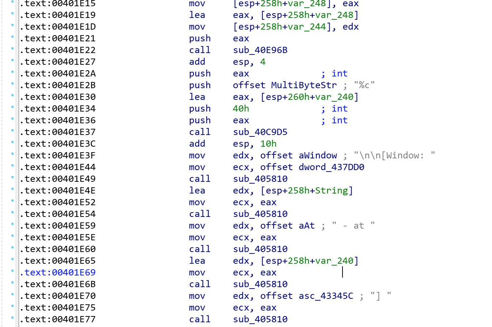  

- `\n\n[Window: `, ` - at ` and `]` looks like some pretext
  - The gap will be filled by the return value of `GetWindowTextA`
  - After ` - at ` it would be the time placeholder

 

Then we start seeing many `cmp esi, xxx` instructions:

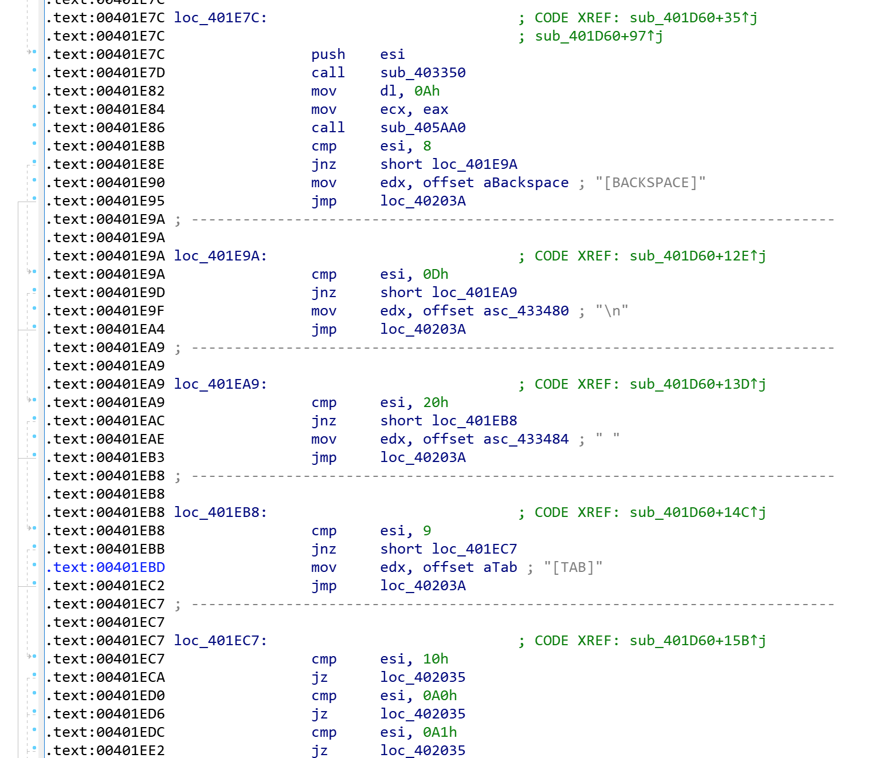  

- This is like a `case` function
- It compares `esi` with different value
  - Then supply a value to `edx` and jump to `40203A`

 

As indicated by the comment of **IDA**, the offset supplied to `edx` is representing a character. Recall the documentation here:

  

- https://docs.microsoft.com/en-gb/windows/win32/api/winuser/ns-winuser-kbdllhookstruct?redirectedfrom=MSDN
  - https://docs.microsoft.com/en-us/windows/win32/inputdev/virtual-key-codes
  - `0x08` = `BACKSPACE` key
    - Match the comment on IDA

Check one more example:

  

- MSDOC states `0x20` represents `SPACEBAR`
  - Match the comment on IDA as well

 

That is to say, this series of `cmp` is to match the message with the actual key pressed - this matches the behavior of a keylogger.

 

Check MSDOC for this API:

- https://docs.microsoft.com/en-us/windows/win32/api/winuser/nf-winuser-callnexthookex
- Purpose:
  - Passes the hook information to the next hook procedure in the current hook chain. 
  - A hook procedure can call this function either before or after processing the hook information.
- Parameters:
  - `hhk`
    - Useless
  - `nCode`
    - The hook code passed to the current hook procedure. 
    - The next hook procedure uses this code to determine how to process the hook information.
  - `wParam`
    - The `wParam` value passed to the current hook procedure. 
    - The meaning of this parameter depends on the type of hook associated with the current hook chain.
  - `lParam`
    - The `lParam` value passed to the current hook procedure. 
    - The meaning of this parameter depends on the type of hook associated with the current hook chain.
- Return value
  - This value is returned by the next hook procedure in the chain. 
  - The current hook procedure must also return this value. 
  - The meaning of the return value depends on the hook type.

 

Now inspect the actual parameters set:

- `nCode` = `[ebp+nCode]` = 8
  - https://docs.microsoft.com/en-us/windows/win32/winmsg/lowlevelmouseproc
  - If `nCode` is less than zero, the hook procedure must return the value returned by `CallNextHookEx`.
  - If `nCode` is greater than or equal to zero, and the hook procedure did not process the message, it is highly recommended that you call `CallNextHookEx` and return the value it returns; 
  - otherwise, other applications that have installed `WH_MOUSE_LL` hooks will not receive hook notifications and may behave incorrectly as a result. 
  - If the hook procedure processed the message, it may return a nonzero value to prevent the system from passing the message to the rest of the hook chain or the target window procedure.
- `wParam` = `[ebp+wParam]` = 0x0C
- `lParam` = `ebx` = `[ebp+lParam]` = 0x10

 

---

## Task 3: Sample IOCs

**Question**

Determine the IOCs that could be created to find and identify this sample on other systems.

 

**Answer**

Similar to [Lab 11](./l11-KeyloggerDynamicAnalysis.md)

 

---