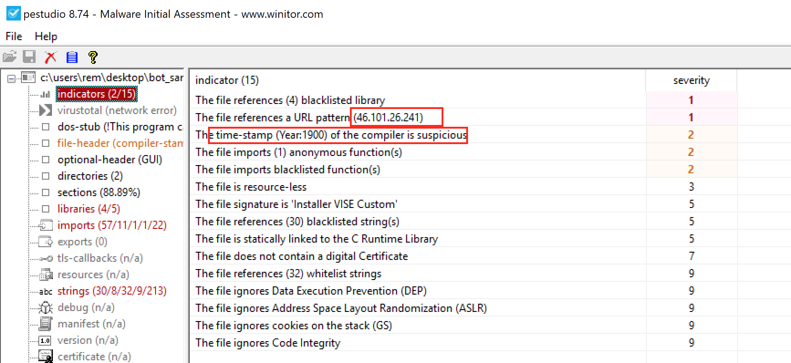
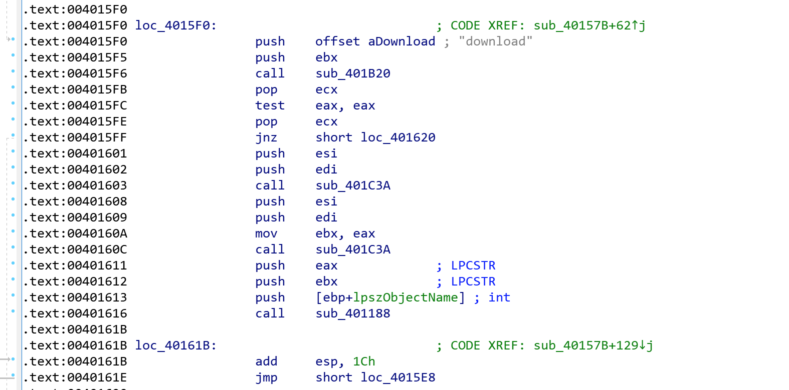
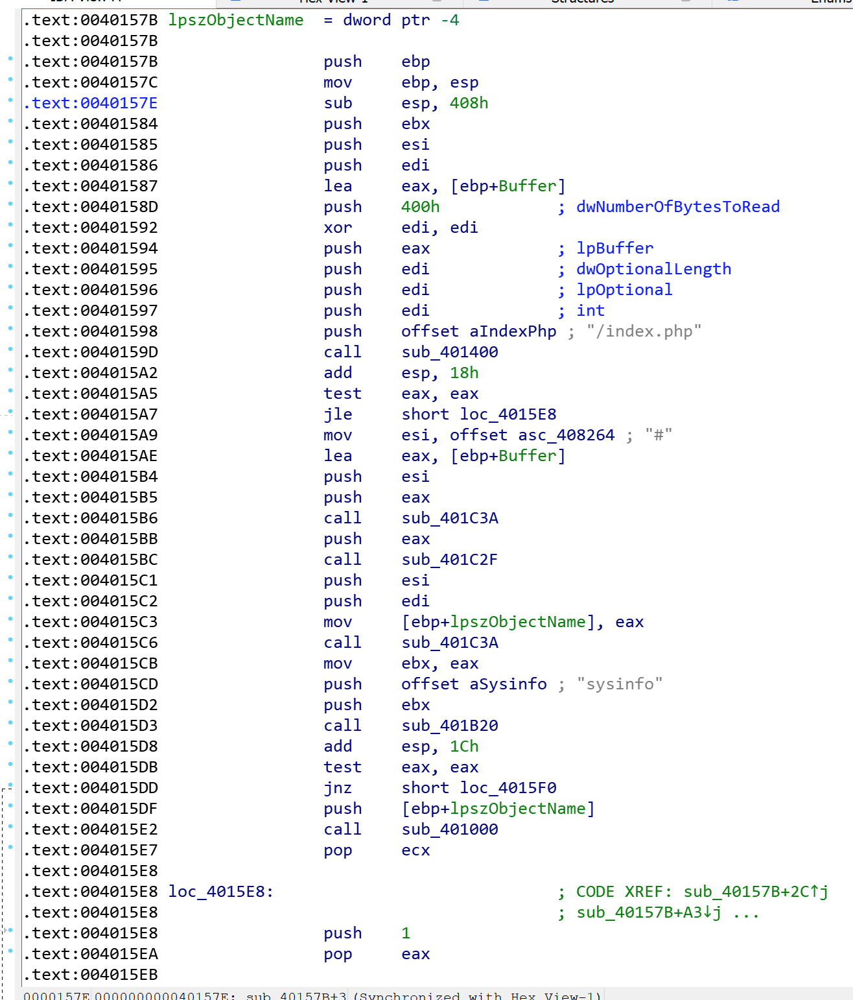
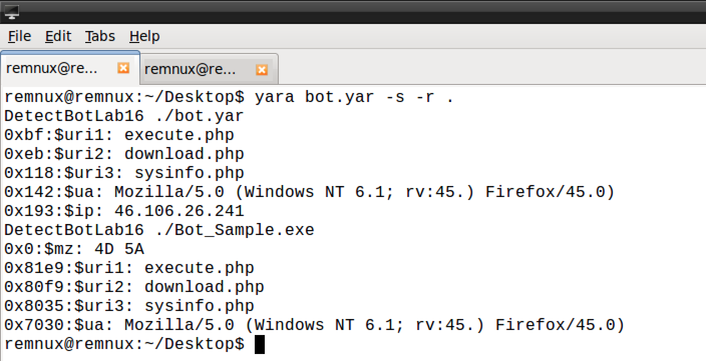

# Lab 16 - Reverse Engineering a BOT using IDA Pro

- [Lab 16 - Reverse Engineering a BOT using IDA Pro](#lab-16---reverse-engineering-a-bot-using-ida-pro)
  - [Scenario](#scenario)
  - [Goal](#goal)
  - [Tools](#tools)
  - [Task 1: Main Sample Information](#task-1-main-sample-information)
  - [Task 2: Static analysis using IDA Pro](#task-2-static-analysis-using-ida-pro)
  - [Task 3: Sample IOCs](#task-3-sample-iocs)
  - [Task 4: Dynamic Analysis](#task-4-dynamic-analysis)

---

## Scenario

You have been called by a client to examine a weird sample that was collected from one of their systems. The system was seen by the network security engineers connecting to a weird remote location. The client thinks this sample could be hiding its true nature of activity.

<br/>

---

## Goal

The goal of this lab is to continue using pestudio for basic analysis and then understand how to reverse engineer a bot sample using IDA Pro and find the true nature of the sample.

<br/>

---

## Tools

- IDA Pro
- PeStudio

<br/>

---

## Task 1: Main Sample Information

Analyze the sample using basic static analysis methods to find and collect as much information as you can to help during the reverse engineering (advanced static analysis) process.

<br/>

**Answer**

Load `Bot_Sample.exe` into **PeStudio**.

  

- Hashes
  - md5,5FB3F68ABDEA5FB5489495004440A58D
  - sha1,70393702494F1C189E03648406E9DBFD9B5F38D4
  - sha256,DB48EEF68E1CC667132BA32B0AA6B79F4B1E6EDDE4D131CB8E56BDF945314058
- Type: Windows PE
- 32-bit

<br/>

Check the indicator:

  

- Potential network IOC `46.101.26.241`
- Compiled time is weird

<br/>

Check the libraries:

  

- `urlmon.dll` - Provide network connectivity (e.g. URLDownloadToFile)
- `iphlpapi.dll` - IPv6
- `ws2_32.dll` - Windows Socket related

<br/>

Check the imports:

  

- Many network API imports

<br/>

Check the strings:

  

  

- `icmp_flood` / `http_flood` / `download` looks like some sorts of commands

<br/>

---

## Task 2: Static analysis using IDA Pro

Reverse engineer the collected sample to understand its true nature.

<br/>

**Answer**

Load the sample on **IDA**.

Let's check the API call `URLDownloadToFileA`. Navigate to `Imports tab` and type `URLDownloadToFileA`:

  

- Double click > Click the API again > Hit `X`

  

- Click `OK` to jump to the code calling this API

<br/>

Before analyzing further, click on the subroutine `sub_401188` and hit `X` to check which part of the code invokes `URLDownloadToFileA`:

  

<br/>

  

- `loc_4015F0`

  

<br/>

Further look into what calls `4015F0`:

  

  

  

- The function calling `4015F0` is `40157B`

<br/>

At `40159D`, it calls `sub_401400`. Prior to this call, there are parameters like `uri`, `lpBuffer`, `dwNumbmerOfBytesToRead` etc. This look like reading a buffer of some sorts. Note some parameters:

- `/index.php`
- `lpOptional` = `dwOptionalLength` = `int` = 0
- `dwNumberOfBytesToRead` = `0x400`

<br/>

Look into the function `sub_401400` by double clicking it:

  

- There are API calls related to Internet connection.

<br/>

Look into the `InternetOpenA` API call first. 

- Purpose:
  - Initializes an application's use of the WinINet functions.
- Parameters:
  - `lpszAgent`: Pointer to a null-terminated string that specifies the name of the application or entity calling the WinINet functions. This name is used as the user agent in the HTTP protocol.
    - `Mozilla/5.0 (Windows NT 6.1; rv:45.) Firefox/45.0)`
  - `dwAccessType`: Type of access required
    - `ebx` --> `0`
  - `lspzProxy`: Pointer to a null-terminated string that specifies the name of the proxy server(s) to use when proxy access is specified by setting dwAccessType to INTERNET_OPEN_TYPE_PROXY.
    - `ebx` --> `0`
  - `lpszProxyBypass`: Pointer to a null-terminated string that specifies an optional list of host names or IP addresses, or both, that should not be routed through the proxy when dwAccessType is set to INTERNET_OPEN_TYPE_PROXY.
    - `ebx` --> `0`
  - `dwFlags`: Optional
- Return value:
  - Returns a valid handle that the application passes to subsequent WinINet functions. 
  - If `InternetOpen` fails, it returns NULL.

<br/>

At `401430`, `cmp eax, ebx`, this is comparing `0` with `eax` (the return value). If the API call fails, it jumps to `4014D0`.

<br/>

Look into `InternetConnectA` API call:

- Purpose: Opens an File Transfer Protocol (FTP) or HTTP session for a given site.
- `lpszServerName` is pointing to `46.101.26.241`

This API call opens a HTTP connection to `46.101.26.241`.

<br/>

Then at `401476`, it calls `HttpOpenRequestA`.

- Purpose: Creates an HTTP request handle.
- `lpszVerb` is POST.
- `lpszReferrer` is set to be a static value `ab11957ef860960ff06c20b6c8eaabe3`

So far from the above APIs, the specimen will do a `POST` request to http://46.101.26.241/index.php, with the Referrer header `ab11957ef860960ff06c20b6c8eaabe3`.

<br/>

At `4014AC`, it calls `HttpAddRequestHeadersA`.

- https://docs.microsoft.com/en-us/windows/win32/api/wininet/nf-wininet-httpaddrequestheadersa
- Purpose: Adds one or more HTTP request headers to the HTTP request handle.
- Parameters:
  - `hRequest`: Handler
  - `lpszHeaders`: eax
    - `[ebp+szHeaders]`
  - `dwHeadersLength`
  - `dwModifiers`
- Return value:
  - Returns TRUE if successful, or FALSE otherwise.

In short, this API call adds one more HTTP Header `Response-id: %i`

<br/>

Then at `4014C1`, it sends the HTTP POST request out. (`HttpSendRequestA`)

- `4014C7` - `test eax, eax` - This check if the request is successful
  - If successful, it jumps to `4014D7`

<br/>

At `4014EA`, it calls `InternetReadFile`.

- https://docs.microsoft.com/en-us/windows/win32/api/wininet/nf-wininet-internetreadfile
- Purpose: Reads data from a handle opened by the InternetOpenUrl, FtpOpenFile, or HttpOpenRequest function.
- Parameters:
  - `hFile`
    - Handle returned from a previous call to `InternetOpenUrl`, `FtpOpenFile`, or `HttpOpenRequest`.
  - `lpBuffer`:
    - Pointer to a buffer that receives the data.
  - `dwNumberOfBytesToRead`:
    - Number of bytes to be read.
  - `lpdwNumberOfBytesRead`:
    - Pointer to a variable that receives the number of bytes read. InternetReadFile sets this value to zero before doing any work or error checking.

In this API call, it reads `0x1C` bytes of the data. 

The content of the resposne will be saved in the location where `lpBuffer` is pointing to (which is `esi` in this case)

<br/>

After that it calls `4013BE`, which closes the Internet handle.

<br/>

After the call, to `401400`, at the moment of `4015A2` execution, the `esi` will be the buffer pointer, which is the HTTP response from http://46.101.26.241/index.php.

<br/>

Based on the HTTP response, the specimen, at `401507`, compare `'0'` with the content of the HTTP response.

- If it is `<'0'` (most are special characters), jump to `401512`
- If it is `<='9'`, jump to `401528`
  - Combining these 2 conditions, it is matching the number `0-9` - Jump to `401528`
- Then it compares with `A` - if `<'A'`, jump to `40151A`
- If it is `<='z'`, jump to `401528`
  - Combining these 2 conditions, it is matching the characters `A-Za-z` - Jump to `401528`
- These will run in a loop until the whole word is enumerated

- Ref: https://www.cs.cmu.edu/~pattis/15-1XX/common/handouts/ascii.html

<br/>

Returning to the caller location `40159D`. It does some clean up and at `4015D3` it calls `401B20`, a `_strcmp` function. It compares the HTTP response with a hardcoded string `sysinfo`.

- `strcmp`
  - Return:
    - If matched, return 0
    - Unmatched, return non-zero

- At `4015DB`, 
  - if unmatches `sysinfo`, it jumps to `4015F0`.
    - Again this tries to match another string `download`
      - If unmatched `download`, jump to `401620`
        - Again this tries to match another string `http_flood`
          - If unmatched, jump to `401676`
            - Again this tries to match another string `icmp_flood`
              - If unmatched, jupm to `4016A9`
                - Again this tries to match `execute`
                  - If unmatched, call `4016D2`
                    - Try to match `wait`
                      - If unmatched, jump to `401701`
                        - If matched `die`, it exits at `401716`
                      - If matched, call `Sleep`
                  - If matched, call `40132D`
                    - Create a process using `CreateProcessA`
                    - Return the Process ID and POST to `execute.php`
              - If matched, it calls `4012B6`, which calls `IcmpCreateFile`, `IcmpSendEcho2` and `IcmpCloseHandle` for 12 times and then return
          - If matched, it prepares a number of parameters and finally call `40120D`
            - At `401280`, it uses `GET` request this time
            - At `40129A`, it sends the `GET ` request to the desired destination
            - `arg_C` stores the nubmer of iterations
            - If less than `arg_C` (`14h`), it redo the HTTP request again
            - If not, return
      - If matched `download`, jump to `401C3A` and call `401188` eventually
        - Call `URLDownloadToFileA` and show the result `Result: ` `Out of memory | download failure | ok` and `Result: 0x?`.
        - Then make a HTTP POST to `/download.php` to send back the result
  - if matches `sysinfo`, call `401000`
    - Calling `GlobalMemoryStatus`, `GetVersionExA`
    - Beautify the content using `Memory load: xxx | Total physical memory: xxx | Available physical memory: xxx | Available virtual memory: xxx | OS version: xxx | Build number: xxx |`
    - Then call `401400`, which is the HTTP request subroutine making the `POST` request
    - If the command received is `sysinfo`, it collects system information and POST them to `http://46.106.26.241/sysinfo.php`

<br/>

In short, this specimen is capable of doing a C2 callback to a hardcoded location `46.106.26.241`, which will send C2 commands to:

1. Gather system info (`sysinfo`)
2. Download files (`download`)
3. Perform HTTP Flood (`http_flood`)
4. Perform ICMP flood (`icmp_flood`)
5. Execute a command (`execute`)
6. Sleep (`sleep`)
7. Kill itself (`die`)

<br/>


---

## Task 3: Sample IOCs

Determine the IOCs that could be created to find and identify this sample on other systems.

<br/>

**Answer**

The most significant IOC is the hardcoded string `46.106.26.241`, which is the C2 server IP address.

The URIs of the C2 server are also worth-noticing:

- `execute.php`
- `download.php`
- `sysinfo.php`


<br/>

The User-Agent used: `Mozilla/5.0 (Windows NT 6.1; rv:45.) Firefox/45.0)`

<br/>


yara rule:

```
import "pe"

rule DetectBotLab16
{ 
  meta:
    description = "Detect Bot sample from eMAP Lab 16"
    author = "Brian Yau"
    date = "27 Jul 2021"
  strings:
    $mz = {4d 5a}
    $uri1 = "execute.php" nocase ascii wide
    $uri2 = "download.php" nocase ascii wide
    $uri3 = "sysinfo.php" nocase ascii wide
    $ua = "Mozilla/5.0 (Windows NT 6.1; rv:45.) Firefox/45.0)" nocase ascii wide
    $ip = "46.106.26.241"
  condition:
    (
      ($mz at 0 and
      all of ($uri*) and
      $ua ) or
      $ip
    )
}
```

  


<br/>

---

## Task 4: Dynamic Analysis

Run the sample and provide an explanation of what the sample does.

<br/>

**Answer**

<br/>

---