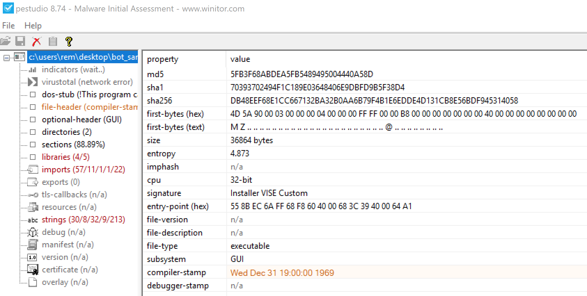
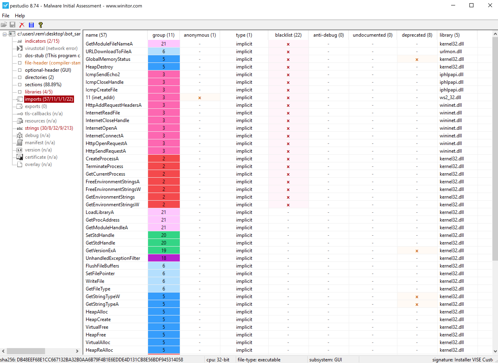
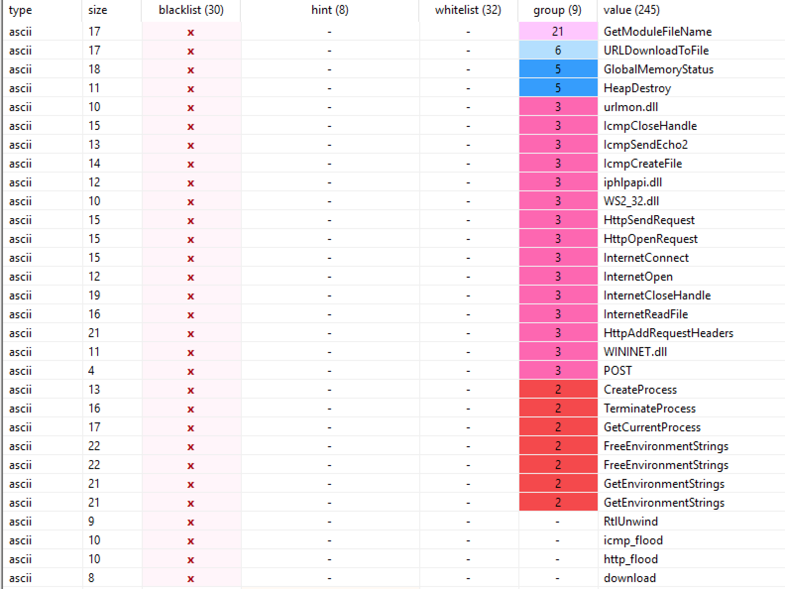
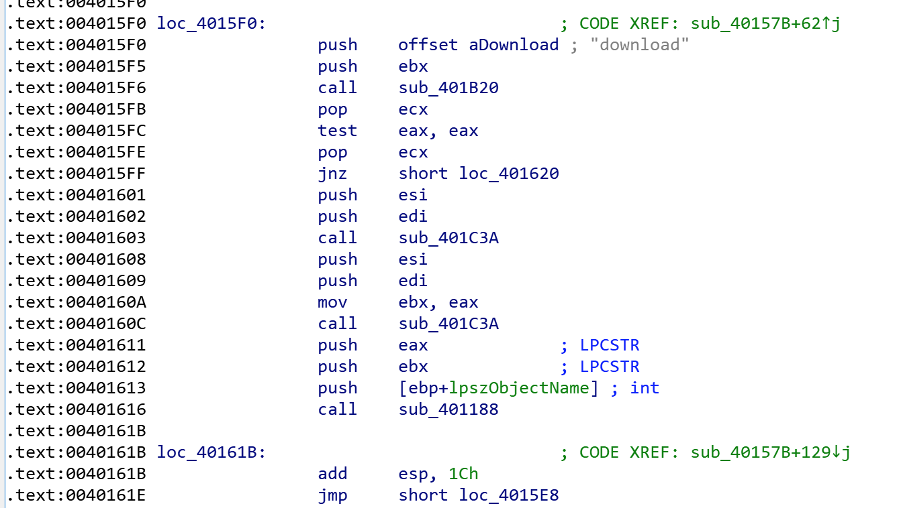

# Lab 16 - Reverse Engineering a BOT using IDA Pro

- [Lab 16 - Reverse Engineering a BOT using IDA Pro](#lab-16---reverse-engineering-a-bot-using-ida-pro)
  - [Scenario](#scenario)
  - [Goal](#goal)
  - [Tools](#tools)
  - [Task 1: Main Sample Information](#task-1-main-sample-information)
  - [Task 2: Static analysis using IDA Pro](#task-2-static-analysis-using-ida-pro)
  - [Task 3: Sample IOCs](#task-3-sample-iocs)
  - [Task 4: Dynamic Analysis](#task-4-dynamic-analysis)

---

## Scenario

You have been called by a client to examine a weird sample that was collected from one of their systems. The system was seen by the network security engineers connecting to a weird remote location. The client thinks this sample could be hiding its true nature of activity.

 

---

## Goal

The goal of this lab is to continue using pestudio for basic analysis and then understand how to reverse engineer a bot sample using IDA Pro and find the true nature of the sample.

 

---

## Tools

- IDA Pro
- PeStudio

 

---

## Task 1: Main Sample Information

Analyze the sample using basic static analysis methods to find and collect as much information as you can to help during the reverse engineering (advanced static analysis) process.

 

**Answer**

Load `Bot_Sample.exe` into **PeStudio**.

  

- Hashes
  - md5,5FB3F68ABDEA5FB5489495004440A58D
  - sha1,70393702494F1C189E03648406E9DBFD9B5F38D4
  - sha256,DB48EEF68E1CC667132BA32B0AA6B79F4B1E6EDDE4D131CB8E56BDF945314058
- Type: Windows PE
- 32-bit

 

Check the indicator:

  

- Potential network IOC `46.101.26.241`
- Compiled time is weird

 

Check the libraries:

  

- `urlmon.dll` - Provide network connectivity (e.g. URLDownloadToFile)
- `iphlpapi.dll` - IPv6
- `ws2_32.dll` - Windows Socket related

 

Check the imports:

  

- Many network API imports

 

Check the strings:

  

  

- `icmp_flood` / `http_flood` / `download` looks like some sorts of commands

 

---

## Task 2: Static analysis using IDA Pro

Reverse engineer the collected sample to understand its true nature.

 

**Answer**

Load the sample on **IDA**.

Let's check the API call `URLDownloadToFileA`. Navigate to `Imports tab` and type `URLDownloadToFileA`:

  

- Double click > Click the API again > Hit `X`

  

- Click `OK` to jump to the code calling this API

 

Before analyzing further, click on the subroutine `sub_401188` and hit `X` to check which part of the code invokes `URLDownloadToFileA`:

  

 

  

- `loc_4015F0`

  

 

---

## Task 3: Sample IOCs

Determine the IOCs that could be created to find and identify this sample on other systems.

 

**Answer**

 

---

## Task 4: Dynamic Analysis

Run the sample and provide an explanation of what the sample does.

 

**Answer**

 

---