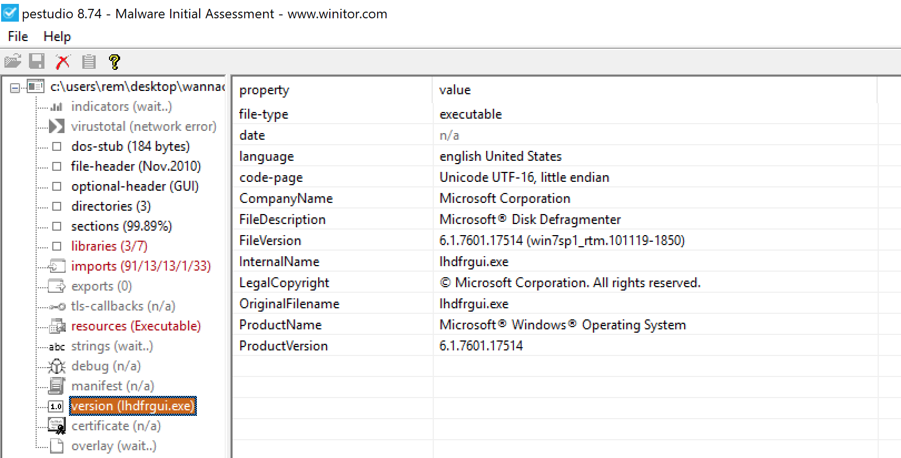

# Lab 17 - Analyzing the WannaCry Ransomware

- [Lab 17 - Analyzing the WannaCry Ransomware](#lab-17---analyzing-the-wannacry-ransomware)
  - [Scenario](#scenario)
  - [Goals](#goals)
  - [Tools](#tools)
  - [Task 1: Initial Sample Assessment](#task-1-initial-sample-assessment)
  - [Task 2: RE with a Debugger](#task-2-re-with-a-debugger)

---

## Scenario

You have been called by a client to examine a WannaCry Ransomware sample that was found on one of their systems and has encrypted all of their data.

<br/>

---

## Goals

The goal of this lab is to understand how to perform both Behavioral and Static Analysis techniques to analyze the famous WannaCry Ransomware.

<br/>

---

## Tools

- PeStudio
- Resource Hacker
- HxD Editor
- Process Hacker
- Procmon
- Fakenet-NG
- Wireshark

<br/>

---

## Task 1: Initial Sample Assessment

Do an initial assessment of the sample to understand what the basic information are we could gather from it. This is the basic static analysis phase.

<br/>

**Answer**

Load the sample into **PeStudio**.

<br/>

  

- Hashes:
  - md5,DB349B97C37D22F5EA1D1841E3C89EB4
  - sha1,E889544AFF85FFAF8B0D0DA705105DEE7C97FE26
  - sha256,24D004A104D4D54034DBCFFC2A4B19A11F39008A575AA614EA04703480B1022C

- 32-bit
- Windows PE
- Description:
  - `Microsoft® Disk Defragmenter`
- High entropy: `7.965`
  - Possible packed

<br/>

Check the version tab:

  

- Orginal name: `lhdfrgui.exe`

<br/>

Check the libraries:

  

- ws2_32.dll / iphlpapi.dll / wininet.dll
  - Internet connection

<br/>

Check the strings:

  

- `C:\%s\qeriuwjhrf`
- `http://www.iuqerfsodp9ifjaposdfjhgosurijfaewrwergwea.com`
- `launcher.dll`
- `mssecsvc.exe`
- `tasksche.exe`
- `icacls . /grant Everyone:F /T /C /Q`
- `.?AVexception@@`

```
.der
.pfx
.key
.crt
.csr
.p12
.pem
.odt
.sxw
.stw
.3ds
.max
.3dm
.ods
.sxc
.stc
.dif
.slk
.wb2
.odp
.sxd
.std
.sxm
.sqlite3
.sqlitedb
.sql
.accdb
.mdb
.dbf
.odb
.frm
.myd
.myi
.mdf
.ldf
.cpp
.pas
.asm
.cmd
.bat
.vbs
.sch
.jsp
.php
.asp
.java
.jar
.class
.mp3
.wav
.swf
.fla
.wmv
.mpg
.vob
.mpeg
.asf
.avi
.mov
.mp4
.mkv
.flv
.wma
.mid
.m3u
.m4u
.svg
.psd
.tiff
.tif
.raw
.gif
.png
.bmp
.jpg
.jpeg
.iso
.backup
.zip
.rar
.tgz
.tar
.bak
.ARC
.vmdk
.vdi
.sldm
.sldx
.sti
.sxi
.hwp
.dwg
.pdf
.wk1
.wks
.rtf
.csv
.txt
.eml
.msg
.pst
.ppsx
.ppsm
.pps
.pot
.pptm
.pptx
.ppt
.xltm
.xltx
.xlc
.xlm
.xlt
.xlw
.xlsb
.xlsm
.xlsx
.xls
.dotm
.dot
.docm
.docx
.doc
```

- `lhdfrgui.exe`

<br/>

---

## Task 2: RE with a Debugger

Use a debugger to perform reverse engineering on the malware and understand the execution flow of the malware. This will help you with the next tasks when you need to run the sample.

<br/>

**Answer**

