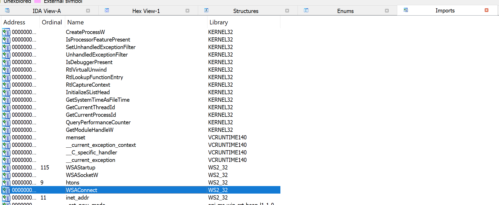
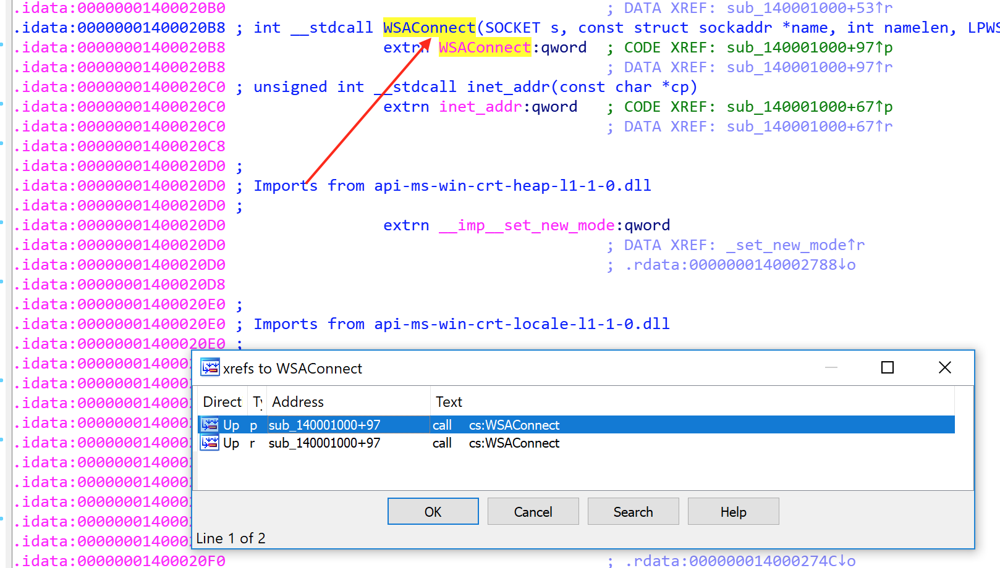
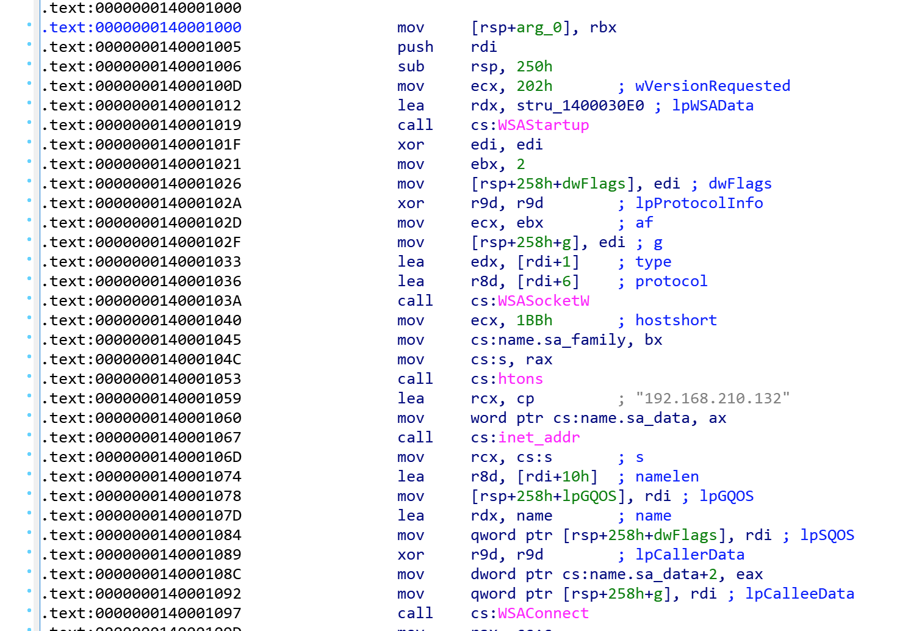
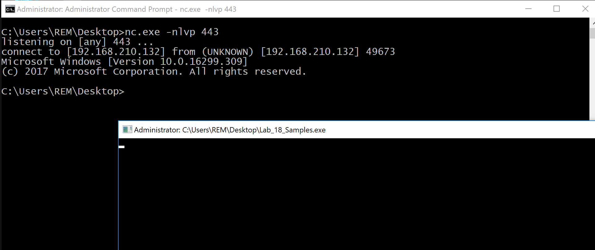

# Lab 18 - Reverse Engineerign a Custom Backdoor using IDA Pro

- [Lab 18 - Reverse Engineerign a Custom Backdoor using IDA Pro](#lab-18---reverse-engineerign-a-custom-backdoor-using-ida-pro)
  - [Scenario](#scenario)
  - [Goals](#goals)
  - [Task 1: General Sample Information](#task-1-general-sample-information)
  - [Task 2: RE the Malware](#task-2-re-the-malware)
  - [Task 3: Run time](#task-3-run-time)

----

## Scenario

You have been hired by a company to analyze a malicious executable that was collected from one of their systems. Their local network security team noticed unusual network traffic going from the infected system to another system.

<br/>

---

## Goals

The goal is to learn how to reverse engineer a malware sample acting as a backdoor using IDA Pro.

<br/>

---

## Task 1: General Sample Information

Gather general information about the sample using a PE analyzer (parser).

<br/>

**Answer**

Load the sample into **PeStudio**:

  

- Hashes:
  - md5,3280106D0EF1C6F0C20677D78877DC3A
  - sha1,4DA73895EE74E331BE3C19F260C1454A182858AD
  - sha256,EF4E45DFFE1835D8C58F5281589EF48CB824C1AF3359A9E3615C04EDFE8E121A
- Console application
- 64-bit
- Windows PE

<br/>

  

- Hardcoded IP address: `192.168.210.132`

<br/>

  

- Library `ws2_32.dll` reveals potential network capabilities

<br/>

Function involved:

  

- `WSAStartup`, `WSAConnect`, `WSASocketW` could be used in network connection

<br/>

Strings:

  

- (A) `192.168.210.132`
- (W) `2cmd.exe`


<br/>

---

## Task 2: RE the Malware

Now it is time to reverse engineer the malware sample and understand what it is doing, how it is doing it and what remote addresses is it connecting to.

<br/>

**Answer**

Load the sample into **IDA Pro**.

<br/>

From static analysis, we identified some interesting API calls. Let check `WSAConnect` for example.

Go to the **Imports tab** and double click `WSAConenct`. Then click on `WSAConnect` in the new view and hit `X`:

  

  

- Click `OK` to proceed

<br/>

Scroll up a little bit and inspect the API calls:

  

- `WSAStartup`
  - https://docs.microsoft.com/en-us/windows/win32/api/winsock/nf-winsock-wsastartup
  - Purpose:
     -  The `WSAStartup` function initiates use of the Winsock DLL by a process.
  -  Return:
     -  If successful, the WSAStartup function returns zero. 
     -  Otherwise, it returns one of the error codes listed below.

- `WSASocketW`
  - https://docs.microsoft.com/en-us/windows/win32/api/winsock2/nf-winsock2-wsasocketw
  - Purpose:
    - The `WSASocket` function creates a socket that is bound to a specific transport-service provider.
  - Parameters:
    - `af` = The address family specification.
      - `ecx` = `ebx` = 2 (Set at `140001021`)
        - 2 = `AF_INET` = IPv4
    - `type` = The type specification for the new socket.
      - `[rdi+1]` = `[esi+1]` = 1 (Set at `14000101F`)
        - 1 = `SOCK_STREAM` = TCP
    - `protocol` = `[rdi+6]` = 6 
      - `6` = `IPPROTO_TCP`
    - `g`  = `edi` = 0
      - No group
    - `dwFlags` = A set of flags used to specify additional socket attributes.
      - `edi` = 0 (Set at `14000101F`)
        - No additional setting
  - Return value:
    - If no error occurs, WSASocket returns a descriptor referencing the new socket. 
    - Otherwise, a value of INVALID_SOCKET is returned, and a specific error code can be retrieved by calling WSAGetLastError.
  - Summary:
    - Initialize a TCP socket (IPv4)


- `htons`
  - https://docs.microsoft.com/zh-hk/windows/win32/api/winsock/nf-winsock-htons
  - Purpose:
    - The `htons` function converts a `u_short` from host to TCP/IP network byte order (which is big-endian).
  - The parameter shows the port number `443`


- `inet_addr`
  - https://docs.microsoft.com/en-us/windows/win32/api/winsock2/nf-winsock2-inet_addr
  - Purpose:
    - The `inet_addr` function converts a string containing an IPv4 dotted-decimal address into a proper address for the `IN_ADDR` structure.
  - Parameter:
    - `cp` --> `192.168.210.132`
  - Return:
    - If no error occurs, the inet_addr function returns an unsigned long value containing a suitable binary representation of the Internet address given.

- `WSAConnect`
  - https://docs.microsoft.com/en-us/windows/win32/api/winsock2/nf-winsock2-wsaconnect
  - Purpose:
    - The `WSAConnect` function establishes a connection to another socket application, exchanges connect data, and specifies required quality of service based on the specified FLOWSPEC structure.
  - `s` = Socket descriptor = `cs:s` = `rax` at `14000104C`
    - Return value of `WSASocketW`
  - `namelen` = The length (in bytes) of the sockaddress structure pointed by the `name` parameter
    - `0x10` = 16 bytes
  - `lpSQOS` = A pointer to the FLOWSPEC structures for socket s, one for each direction.
    - = `rdi` = 0
  - `lpGQOS` = Reserved for future use with socket groups.
    - = `rdi` = 0
  - `name` = A pointer to a sockaddr structure that specifies the address to which to connect.
    - Address + Port + Family (IPv4)
  - `lpCallerData` = A pointer to the user data that is to be transferred to the other socket during connection establishment.
    - `xor r9d, r9d` = 0 = No user data will be passed to the peer
  - `lpCalleeData` = A pointer to the user data that is to be transferred back from the other socket during connection establishment.
    - = `rdi` = 0 = No data pass back
  - In short this connects to `192.168.210.132/443`

<br/>

Then we can see it calls `memset` and `CreateProcessW`.

<br/>

- `memset`
  - https://docs.microsoft.com/en-us/cpp/c-runtime-library/reference/memset-wmemset?view=msvc-160
  - Sets buffers to a specified character.
  - Parameters:
    - `dest`: Pointer to destination.
      - `[rsp+258h+Dst]`
    - `c`: Character to set
      - `xor edx,edx` = `0`
    - `count` = Number of characters.
      - `0x1F0` = 496
  - In short, the memory address pointed by `dest` will have 496 bytes space allocated

<br/>

- `CreateProcessW`
  - https://docs.microsoft.com/en-us/windows/win32/api/processthreadsapi/nf-processthreadsapi-createprocessw
  - `lpApplicationName` - The name of the module to be executed
    - `xor ecx,ecx` = 0
    - The `lpApplicationName` parameter can be NULL. In that case, the module name must be the first white space–delimited token in the `lpCommandLine` string.
  - `lpCommandLine` - The command line to be executed.
    - `[rsp+258h+CommandLine]` --> `movaps  xmmword ptr [rsp+258h+CommandLine], xmm0` at `14000110E`
      - `movaps` = Move Aligned Packed Single-Precision Floating-Point Values
      - We can also deem this as `mov` - Therefore `CommandLine` is associated with `xmm0`
        - (`140001107`) `movups  xmm0, cs:xmmword_140002240` - Have to inspect `140002240` to determine
        - Double-click it and we can find the xmmword `6500780065002E0064006D0063h`
          - We can cover this HEX to ASCII using http://www.unit-conversion.info/texttools/hexadecimal/
            - `exe.dmc` (Since this is little endian so the order is reversed)
    - Therefore the Commandline is `cmd.exe`
  - `lpProcessAttributes`: A pointer to a SECURITY_ATTRIBUTES structure that determines whether the returned handle to the new process object can be inherited by child processes. If lpProcessAttributes is NULL, the handle cannot be inherited.
    - `xor r9d,r9d` --> NULL --> Default security descriptor
  - `lpThreadAttributes`: A pointer to a SECURITY_ATTRIBUTES structure that determines whether the returned handle to the new thread object can be inherited by child processes.
    - `xor r9d,r9d` --> NULL --> Default security descriptor
  - `bInheritHandles`: If this parameter is TRUE, each inheritable handle in the calling process is inherited by the new process. If the parameter is FALSE, the handles are not inherited. 
    - Set to be `1` --> Inherited by the new process
  - `dwCreationFlags`: The flags that control the priority class and the creation of the process.
    - `edi` = `rdi` = 0  --> The process inherits both the error mode of the caller and the parent's console.
  - `lpEnvironment`: A pointer to the environment block for the new process. 
    - `rdi` = 0
  - `lpCurrentDirectory`: The full path to the current directory for the process.
    - `rdi` = 0  --> If this parameter is NULL, the new process will have the same current drive and directory as the calling process.
  - `lpStartupInfo`: A pointer to a STARTUPINFO or STARTUPINFOEX structure.
    - `rax` --> Which is determine at `14000112C` `lea rax, StartupInfo`
    - The structure is initialized from `1400010AC` to `140001100`
  - `lpProcessInformation`: A pointer to a PROCESS_INFORMATION structure that receives identification information about the new process.
    - `rax` -> same as `lpStartupInfo`
  - Return:
    - If the function succeeds, the return value is nonzero.
    - If the function fails, the return value is zero. 

<br/>

In summary, once connected to the target, it launches a `cmd.exe` process

<br/>

---

## Task 3: Run time

How can you run this sample even though you do not have access to another machine?

<br/>

**Answer**

We can add a virtual address of the hardcoded IP address `192.168.210.132`; or we can patch this on **x64dbg**.

  

<br/>

Then launch a netcat listener on tcp/443:

```
nc.exe -nlvp 443
```

  

<br/>

Then run the sample as admin:

  

- As shown, we get a shell on the listener

<br/>

---