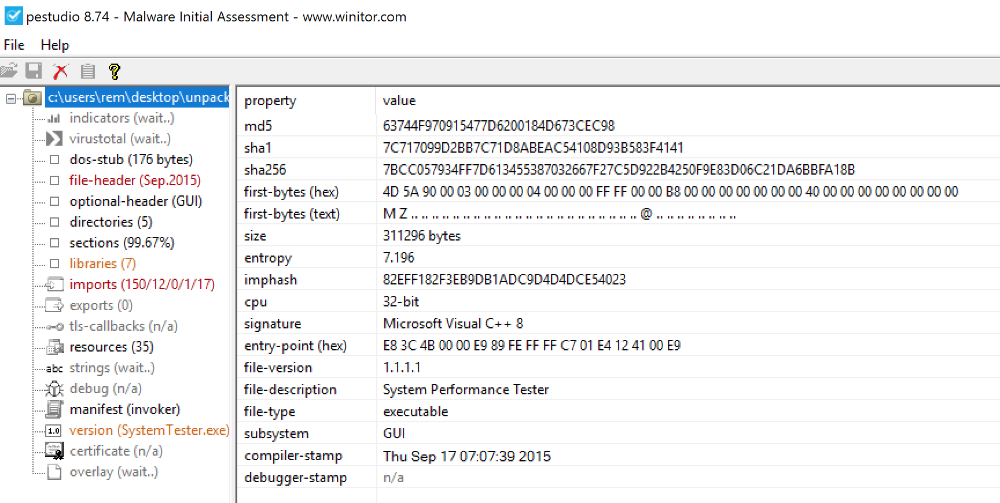
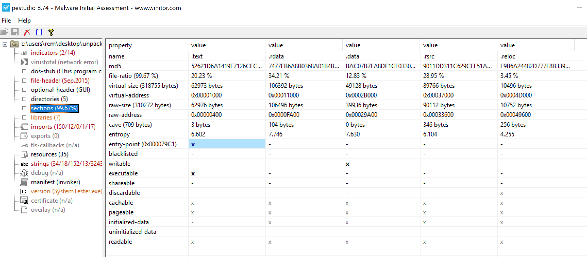
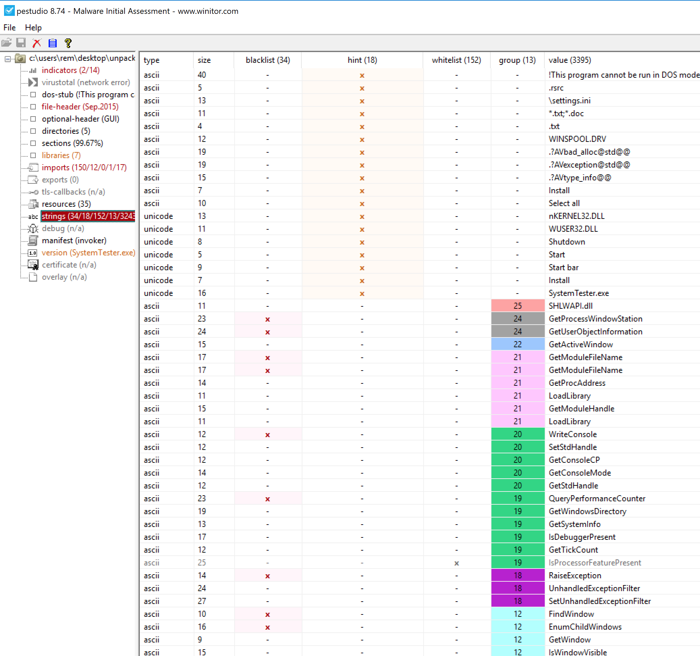
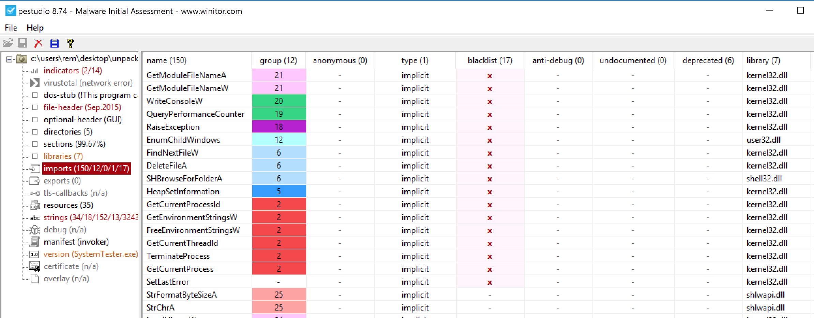
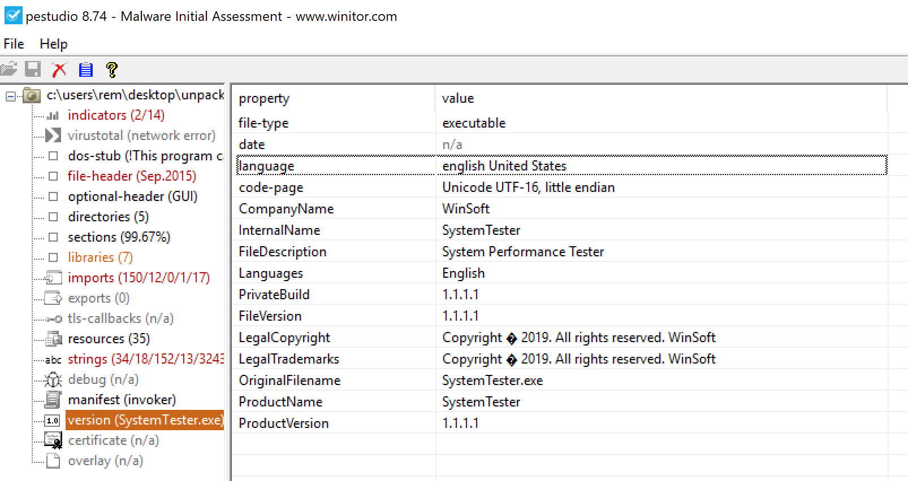

# Lab 19 - Manually Unpacking a Malware Using x64dbg

- [Lab 19 - Manually Unpacking a Malware Using x64dbg](#lab-19---manually-unpacking-a-malware-using-x64dbg)
  - [Scenario](#scenario)
  - [Goals](#goals)
  - [Task 1: Main Sample Information](#task-1-main-sample-information)
  - [Task 2: Unpacking sample using x64dbg](#task-2-unpacking-sample-using-x64dbg)
  - [Task 3: Dynamic Analysis](#task-3-dynamic-analysis)
  - [Task 4: Sample IOCs](#task-4-sample-iocs)

---

## Scenario

A client shared a sample with you that was collected from their environment and believes it
is packed in some way. The client asks you to unpack the sample and share basic
information about it.

 

---

## Goals

The goal of this lab is to understand how to use online resources and a debugger (x64dbg)
to unpack a sample that is packed.

 

---

## Task 1: Main Sample Information

Use the static analysis skills you learned to gather as much information you can to help with
further tasks. This should include analyzing the PE file to extract strings, sections, libraries,
and APIs referenced, etc.

 

**Answer**

  

- Hashes:
  - md5,63744F970915477D6200184D673CEC98
  - sha1,7C717099D2BB7C71D8ABEAC54108D93B583F4141
  - sha256,7BCC057934FF7D613455387032667F27C5D922B4250F9E83D06C21DA6BBFA18B
- Windows PE
- GUI
- 32-bit
- Entropy: 7.196 (High)

 

  

- Compile time: 17 Sept 2015

 

  

- Sections:
  - .text
  - .rdata
  - .data
  - .rsrc
  - .reloc

 

  

- Interesting strings:
  - (W) SystemTester.exe
  - (A) Select all
  - (A) WINSPOOL>DRV
  - (A) \\settings.ini

 

  

Suspicious imports:

- GetModuleFileNameA
- GetModuleFileNameW
- WriteConsoleW
- QueryPerformanceCounter
- RaiseException
- EnumChildWindows
- FindNextFileW
- DeleteFileA
- SHBrowseForFolderA
- HeapSetInformation
- GetCurrentProcessId
- GetEnvironmentStringsW
- FreeEnvironmentStringsW
- GetCurrentThreadId
- TerminateProcess
- GetCurrentProcess
- SetLastError

 

  

Version:

file-type,executable
date,n/a
language,english United States
code-page,Unicode UTF-16, little endian
CompanyName,WinSoft
InternalName,SystemTester
FileDescription,System Performance Tester
Languages,English
PrivateBuild,1.1.1.1
FileVersion,1.1.1.1
LegalCopyright,Copyright ? 2019. All rights reserved. WinSoft
LegalTrademarks,Copyright ? 2019. All rights reserved. WinSoft
OriginalFilename,SystemTester.exe
ProductName,SystemTester
ProductVersion,1.1.1.1

 

---

## Task 2: Unpacking sample using x64dbg

Use the information collected from task one to further analyze and unpack this sample.

 

**Answer**

 

---

## Task 3: Dynamic Analysis

Run the sample in order to understand what it is doing.

 

**Answer**

Load the sample into `x32dbg`.

 

---

## Task 4: Sample IOCs

What are the IOCs that could be created to find and identify this sample on other systems?

 

**Answer**

 

---