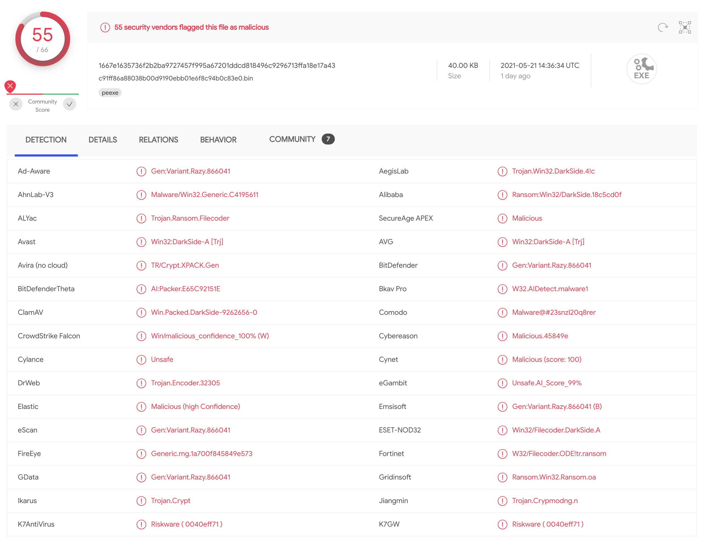
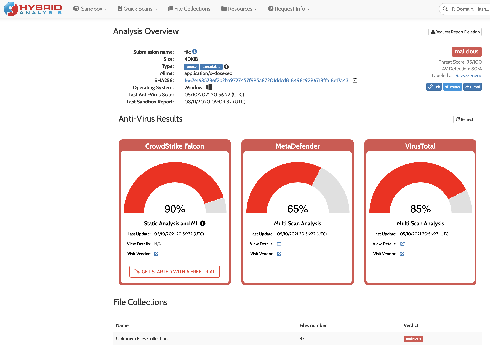
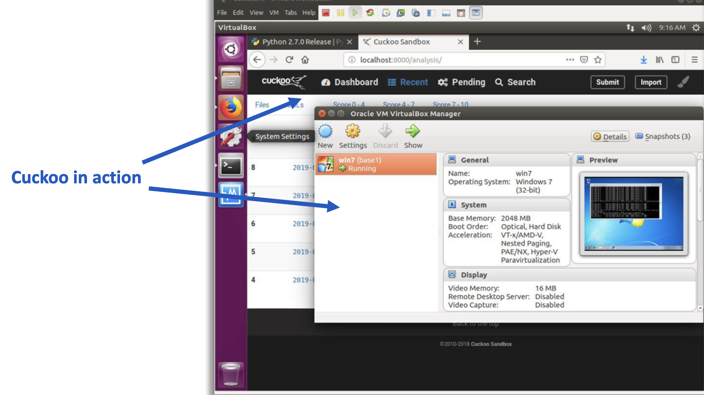

# 02 - Static Analysis

- [02 - Static Analysis](#02---static-analysis)
  - [Objectives](#objectives)
  - [Introduction](#introduction)
  - [File identification & Classification](#file-identification--classification)
    - [ASCII files](#ascii-files)
    - [Structured files (Binary files)](#structured-files-binary-files)
    - [File Signatures](#file-signatures)
  - [Hashes](#hashes)
    - [Fuzzy Hashing](#fuzzy-hashing)
  - [Strings](#strings)
    - [ASCII](#ascii)
    - [Unicode](#unicode)
    - [Tools](#tools)
  - [Scanners & Sandboxes](#scanners--sandboxes)
    - [Scanners](#scanners)
    - [Sandboxes](#sandboxes)
    - [Other scanners / sandboxes](#other-scanners--sandboxes)

---

## Objectives

1. Identify samples, generate hashes, extract strings during the analysis
2. When and why to use an online scanner / sandbox
3. The PE file format and its usage
4. Obfuscation and the basic detection method
5. How to collect IOCs from samples and write YARA signatures to search for malware on systems

<br/>

---

## Introduction

Analyzing a **sample**, we have to determine if it is **malicious** or **benign**.

Remember after collecting a sample, **DO NOT execute it yet!** We will use the Static Analysis techniques to analyze the sample.

**Basic Analysis** observe the file's metadata and other information that is embedded in it. Including:
- File identification & Classification
- Scanning
- File Format Analysis
- Identifying Obfuscation

**Advanced Analysis** examines the source code (kind of) of the malware. Assuming the source code is not available, the analysis is on disassembled into assembly instructions code.

<br/>

---

## File identification & Classification

**File Identification** is the process of identifying the file type and obtaining a unique **signature** of the sample being analyzed.

Classifying the sample can help understand if the sample belongs to a well-known malware family, which has been previously analyzed.

The approaches we use during file identification and classification will help build basic detection method and IOCs (e.g. a YARA rule).

<br/>

There are a number of methods used in Malware Analysis to identify files:

1. Based on the file type (PE / PDF / DOCX / ...)
2. Based on file hases (MD5 / SHA1 / SHA256 / Fuzzy hash / IMPHash)
3. Based on the strings embedded within the file (ASCII / Unicode / ...)

Identifying the file type help not only understand how the sample might be used, but also help select the proper tools to work with.

All files on a computer fall under one of two categories:

1. ASCII files - plaintext
2. Structured files - binary

<br/>

### ASCII files

Just plaintext which you can use a text editor to read - file types like `.json` / `.xml` / `.html` are also regarded as plaintext files.

  

<br/>

### Structured files (Binary files)

If a file is not a plaintext file, it has a binary structure. 

For example, here is the structure of PDF files:

  

For example, here is the PE file structure:

  

<br/>

If we take a look at the `PDF` file in Hexadecimal, your will notice the first few bytes indicating the file format:

  

For example, `.EXE` has a `4D 5A` (`MZ`) in the beginning of the HEX:

  

<br/>

Note:
Not all files have a header and footer!

<br/>

### File Signatures

In computing, a file signature is data used to identify or verify the contents of a file. 

**File magic number** are bytes within a file used to identify the format of the file; generally a **short sequence of bytes** (most are 2-4 bytes long) placed at the beginning of the file.

- https://www.garykessler.net/library/file_sigs.html

<br/>

For `PDF` files, the magic number is 4-byte: `25 50 44 46` (`%PDF`); the **trailers** could be:
- `0A 25 25 45 4F 46` (`.%%EOF`)
- `0A 25 25 45 4F 46 0A` (`.%%EOF.`)
- `0D 0A 25 25 45 4F 46 0D 0A` (`..%%EOF..`)
- `0D 25 25 45 4F 46 0D` (`.%%EOF.`)

For `PNG` files, the magic number is 8-byte: `89 50 4E 47 0D 0A 1A 0A` (`%PNG....`); the **trailer** is `49 45 4E 44 AE 42 60 82` (`IEND®B``‚...`)

<br/>

Again, identify the file type help you decide which tools to use to analyze the file at hand further. 

It should be noted that **we shouldn't determine a file type based on the file extension!!!!** A common technique called **File Injection** - for example, an EXE file can be stored as JPEG image's extension and while the user double clicks it, the EXE file is loaded.

<br/>

Another method to check a file type is to use the Linux command tool `file`:

```
file <file>
```

<br/>

Note:
The ICON of a file can be changed by using the tool **Resource Hacker**

<br/>

---

## Hashes

Next, we need to classify the sample and see if it is a known malware by hashing the sample - which generates a **fixed length** string. If executed correctly, without collison, a single bit of change will lead to a totally different hash value.

  

<br/>

Here are the common hashing algorithms used:

1. MD5 - 128 bits
2. SHA1 - 160 bits
3. SHA256 - 256 bits

We can use Linux CLI tools like `md5sum`, `sha1sum` and `sha256sum`; powershell `Get-FileHash -Algorithm <MD5/SHA1/SHA256> <FILE>`.

GUI tools like [HashMyFiles](https://www.nirsoft.net/utils/hash_my_files.html) and [Hasher](https://www.karenware.com/powertools/karens-hasher) can also be used.

<br/>

There are more algorithms used in malware analysis:

1. FuzzyHash
2. Import Hash (IMPHASH)
3. Section Hash

<br/>

Normally samples investigated are **stored in a knowledge base system** (or database). When you receive a sample, you will run it through the hashing function and then use the outputted hash to search the knowledge base to see if it was seen before; if yes, we do not need to go further seen it has been already analyzed and we know how to handle, artifacts, and how to eradicate the malware from infected systems.

Of course we can use the hashes (a kind of **IOC**) to search in bulk in your environment.

<br/>

### Fuzzy Hashing

Speaking of hashes, malware could apply **Polymorphism** to mutate while keeping the original algorithm intact - the same malware could have different hash value.

**Fuzzy Hashing** segments files, hashing those segments and do some math calculations against them to generate a value. 
- When the values are compared to other files, the same steps are followed
- Then they are compared with a database of hashes and then we are provided statistics on how much the sample is similar to the one seen in the database

<br/>

**SSDEEP** is a CLI tool for fuzzy hashing.

Note:
VirusTotal also provide the SSDEEP value of samples.

<br/>

---

## Strings

Strings can be useful and you can use them to create hints into what types of sample you are dealing with. It could also be another source of information gathering about the sample under investigation; for example:

1. Internal / External messages the sample uses
2. Function being referenced or invoked
3. What sections are used by the sample
4. IP addresses / Domains
5. Error handling / messages used
6. Other names / keywords

- EXE file & its sections
  

- APIs used
  

- Error messages
  


<br/>

**Strings** = A sequence of characters.

In computer languages, most strings are implemented using arrays of characters, but some implement it using records. Here is an example of array string:

  

<br/>

We can also see the Hex representation with a **NULL terminator**:

  

<br/>

There are 2 main types of character encoding:

1. ASCII
2. Unicode

<br/>

### ASCII

ASCII strings use **7-bits** to represent **128 characters**; however they are implemtned using `1-byte (8-bit)` on computers (aka **Extended-ASCII**) to represent **256 characters**.

  

Note that ASCII strings can be **printable** or **non-printable**! Some examples of non-printable characters:

- `\n` (`0x0A`) (Line Feed - LF)
- `\r` (`0x0D`) (Carriage Return - CR)

Note:
When inspecting in HEX, the non-printable characters are represented as `.` in the ASCII print.
In Windows, a new line is represented as `0x0D0A` (`\r\n`)

<br/>

### Unicode

Unicode also uses `0x0A` or `0x00` to terminate the sequence of characters. However, the space used is different!

Here is an example of **UTF-16** (**Wide Chars**) - **2-bytes** representation used as a standard by MS Windows.

  

<br/>

When extracting strings from files, you have to make sure you extract **both ASCII and Unicode** strings!!

<br/>

### Tools

CLI:
- `strings` - Linux tool - `strings <FILE>`
- `bstrings` - Windows tool - https://github.com/EricZimmerman/bstrings

GUI:
- [BinText (Windows)](https://www.portablefreeware.com/index.php?id=2506#:~:text=BinText%20is%20a%20file%20text,as%20well%20as%20Resource%20strings.)
- [StringSifter (Python)](https://github.com/fireeye/stringsifter)
- [FLOSS (Python)](https://github.com/fireeye/flare-floss)

<br/>

---

## Scanners & Sandboxes

### Scanners

**Scanners** are capable of scanning a file and decide whether a file is benign or malicious. Anti-Virus (AV) software could be a scanner.

Most scanners are **signature-based** and the user should be responsible for updating the signature database. While there are some online scanner where the database is updated by the vendors.

- Offline scanner: ClamAV / Malwarebytes
- Online scanner: VirusTotal / Hybrid-Analysis





<br/>

It should be noted that although these online scanners are really convenient to use, we **SHOULD NOT ALWAYS UPLOAD** samples to them.
- When you submit a sample that does not have a previous signature, the sample will be scanned and passed to all vendors and a signature for detecting it will be created
- The signature will then be publicly accessible (hashes)
- If your team is currently in the middle of an investigation and you have uploaded the sample, the threat actor will know that it is exposed
- Knowing that, the threat actor may change tactics, or even worse, destruct data

<br/>

Therefore, it is suggested to use an offline scanner / sandbox if possible!

<br/>

### Sandboxes

**Sandbox** is a software uses a security mechanism of creating an isolated or controlled environment, allowing a program to run inside it.

One of the most commonly used (Open-Source!) sandboxes for Malware Analysis is **Cuckoo**.
- https://github.com/ashemery/CuckooVM



Cuckoo can analyze most of the file types that you can think of, but it is better to double check what is support in the documentation.

<br/>

### Other scanners / sandboxes

- [Anlyz](https://sandbox.anlyz.io/dashboard)
- [Any.Run](https://app.any.run/)
- [ActivityComodo Valkyrie](https://valkyrie.comodo.com/)
- [Hybrid Analysis](https://www.hybrid-analysis.com/)
- [Intezer Analyze](https://www.intezer.com/)
- [SecondWrite Malware Deepview](https://www.secondwrite.com/)
- [AMIRA](https://github.com/Yelp/amira)
- Another good list [here](https://github.com/rshipp/awesome-malware-analysis#online-scanners-and-sandboxes)
- Comparison [here](https://linuxsecurity.expert/tools/cuckoo-sandbox/alternatives/)
- [Deep Freeze](https://www.faronics.com/en-uk/products/deep-freeze/enterprise)


<br/>

---

