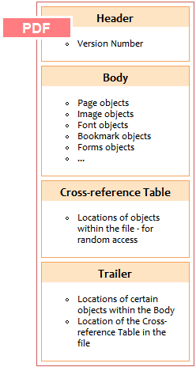
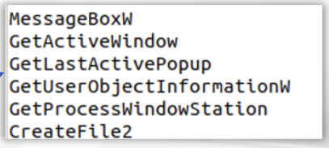
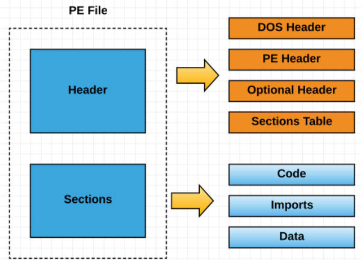
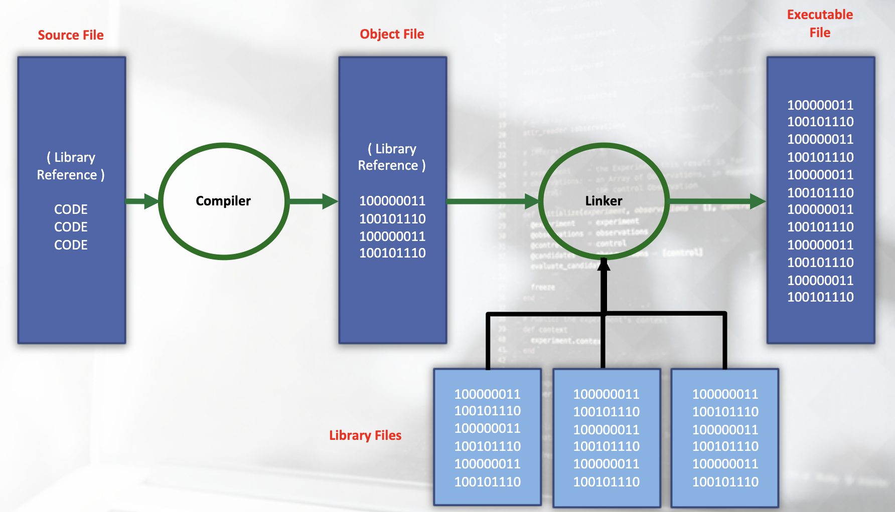
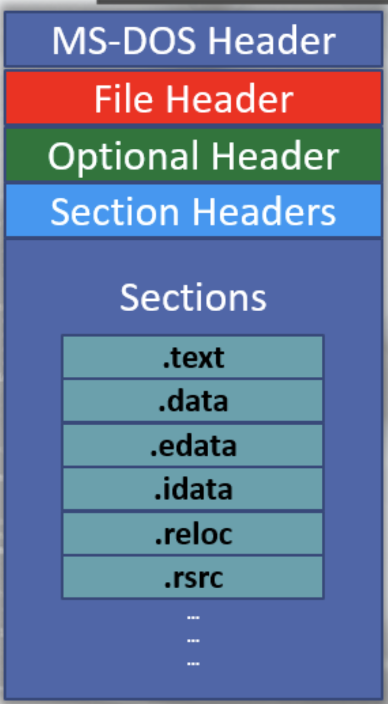
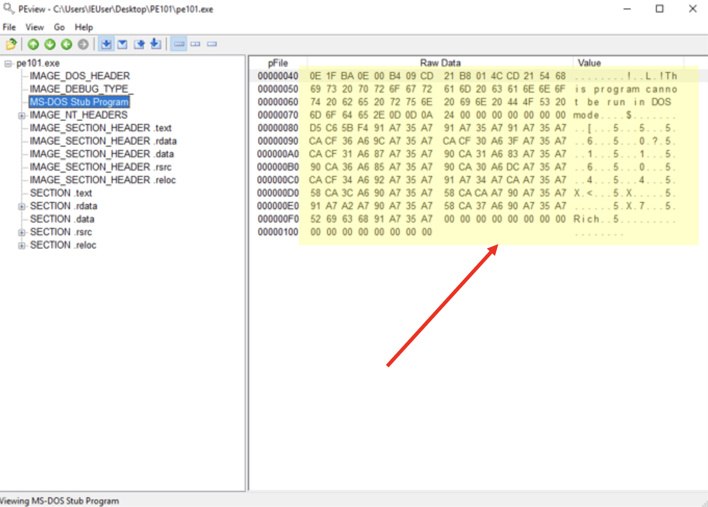
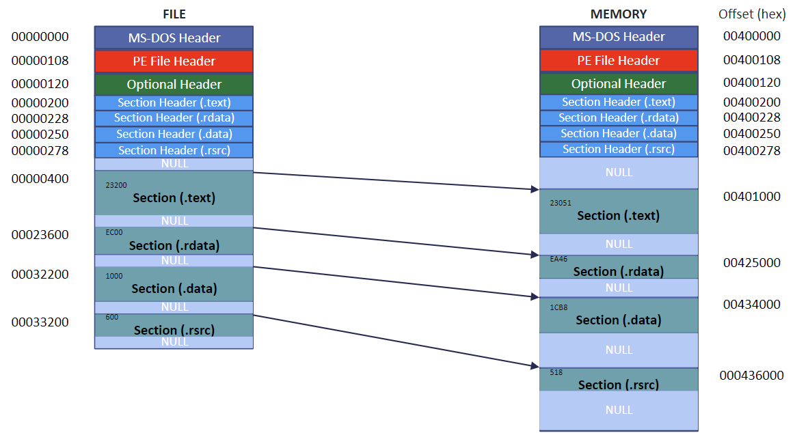

# 02 - Static Analysis

- [02 - Static Analysis](#02---static-analysis)
  - [Objectives](#objectives)
  - [Introduction](#introduction)
  - [File identification & Classification](#file-identification--classification)
    - [ASCII files](#ascii-files)
    - [Structured files (Binary files)](#structured-files-binary-files)
    - [File Signatures](#file-signatures)
  - [Hashes](#hashes)
    - [Fuzzy Hashing](#fuzzy-hashing)
  - [Strings](#strings)
    - [ASCII](#ascii)
    - [Unicode](#unicode)
    - [Tools](#tools)
  - [Scanners & Sandboxes](#scanners--sandboxes)
    - [Scanners](#scanners)
    - [Sandboxes](#sandboxes)
    - [Other scanners / sandboxes](#other-scanners--sandboxes)
  - [Fundamental of Anaylzing File Formats - PE](#fundamental-of-anaylzing-file-formats---pe)
    - [PE Structure](#pe-structure)
    - [Libraries](#libraries)
    - [Static Linking](#static-linking)
    - [Dynamic Linking](#dynamic-linking)
    - [Comparison of Static / Dynamic Linking](#comparison-of-static--dynamic-linking)
  - [Analyzing PE file](#analyzing-pe-file)
    - [File Headers](#file-headers)
    - [PE Headers](#pe-headers)
    - [Optional Header](#optional-header)
    - [Concept: Memory Addressing](#concept-memory-addressing)
  - [PE Check list](#pe-check-list)

---

## Objectives

1. Identify samples, generate hashes, extract strings during the analysis
2. When and why to use an online scanner / sandbox
3. The PE file format and its usage
4. Obfuscation and the basic detection method
5. How to collect IOCs from samples and write YARA signatures to search for malware on systems

<br/>

---

## Introduction

Analyzing a **sample**, we have to determine if it is **malicious** or **benign**.

Remember after collecting a sample, **DO NOT execute it yet!** We will use the Static Analysis techniques to analyze the sample.

**Basic Analysis** observe the file's metadata and other information that is embedded in it. Including:
- File identification & Classification
- Scanning
- File Format Analysis
- Identifying Obfuscation

**Advanced Analysis** examines the source code (kind of) of the malware. Assuming the source code is not available, the analysis is on disassembled into assembly instructions code.

<br/>

---

## File identification & Classification

**File Identification** is the process of identifying the file type and obtaining a unique **signature** of the sample being analyzed.

Classifying the sample can help understand if the sample belongs to a well-known malware family, which has been previously analyzed.

The approaches we use during file identification and classification will help build basic detection method and IOCs (e.g. a YARA rule).

<br/>

There are a number of methods used in Malware Analysis to identify files:

1. Based on the file type (PE / PDF / DOCX / ...)
2. Based on file hases (MD5 / SHA1 / SHA256 / Fuzzy hash / IMPHash)
3. Based on the strings embedded within the file (ASCII / Unicode / ...)

Identifying the file type help not only understand how the sample might be used, but also help select the proper tools to work with.

All files on a computer fall under one of two categories:

1. ASCII files - plaintext
2. Structured files - binary

<br/>

### ASCII files

Just plaintext which you can use a text editor to read - file types like `.json` / `.xml` / `.html` are also regarded as plaintext files.

  

<br/>

### Structured files (Binary files)

If a file is not a plaintext file, it has a binary structure. 

For example, here is the structure of PDF files:

  

For example, here is the PE file structure:

  

<br/>

If we take a look at the `PDF` file in Hexadecimal, your will notice the first few bytes indicating the file format:

  

For example, `.EXE` has a `4D 5A` (`MZ`) in the beginning of the HEX:

  

<br/>

Note:
Not all files have a header and footer!

<br/>

### File Signatures

In computing, a file signature is data used to identify or verify the contents of a file. 

**File magic number** are bytes within a file used to identify the format of the file; generally a **short sequence of bytes** (most are 2-4 bytes long) placed at the beginning of the file.

- https://www.garykessler.net/library/file_sigs.html

<br/>

For `PDF` files, the magic number is 4-byte: `25 50 44 46` (`%PDF`); the **trailers** could be:
- `0A 25 25 45 4F 46` (`.%%EOF`)
- `0A 25 25 45 4F 46 0A` (`.%%EOF.`)
- `0D 0A 25 25 45 4F 46 0D 0A` (`..%%EOF..`)
- `0D 25 25 45 4F 46 0D` (`.%%EOF.`)

For `PNG` files, the magic number is 8-byte: `89 50 4E 47 0D 0A 1A 0A` (`%PNG....`); the **trailer** is `49 45 4E 44 AE 42 60 82` (`IEND®B``‚...`)

<br/>

Again, identify the file type help you decide which tools to use to analyze the file at hand further. 

It should be noted that **we shouldn't determine a file type based on the file extension!!!!** A common technique called **File Injection** - for example, an EXE file can be stored as JPEG image's extension and while the user double clicks it, the EXE file is loaded.

<br/>

Another method to check a file type is to use the Linux command tool `file`:

```
file <file>
```

<br/>

Note:
The ICON of a file can be changed by using the tool **Resource Hacker**

<br/>

---

## Hashes

Next, we need to classify the sample and see if it is a known malware by hashing the sample - which generates a **fixed length** string. If executed correctly, without collison, a single bit of change will lead to a totally different hash value.

  

<br/>

Here are the common hashing algorithms used:

1. MD5 - 128 bits
2. SHA1 - 160 bits
3. SHA256 - 256 bits

We can use Linux CLI tools like `md5sum`, `sha1sum` and `sha256sum`; powershell `Get-FileHash -Algorithm <MD5/SHA1/SHA256> <FILE>`.

GUI tools like [HashMyFiles](https://www.nirsoft.net/utils/hash_my_files.html) and [Hasher](https://www.karenware.com/powertools/karens-hasher) can also be used.

<br/>

There are more algorithms used in malware analysis:

1. FuzzyHash
2. Import Hash (IMPHASH)
3. Section Hash

<br/>

Normally samples investigated are **stored in a knowledge base system** (or database). When you receive a sample, you will run it through the hashing function and then use the outputted hash to search the knowledge base to see if it was seen before; if yes, we do not need to go further seen it has been already analyzed and we know how to handle, artifacts, and how to eradicate the malware from infected systems.

Of course we can use the hashes (a kind of **IOC**) to search in bulk in your environment.

<br/>

### Fuzzy Hashing

Speaking of hashes, malware could apply **Polymorphism** to mutate while keeping the original algorithm intact - the same malware could have different hash value.

**Fuzzy Hashing** segments files, hashing those segments and do some math calculations against them to generate a value. 
- When the values are compared to other files, the same steps are followed
- Then they are compared with a database of hashes and then we are provided statistics on how much the sample is similar to the one seen in the database

<br/>

**SSDEEP** is a CLI tool for fuzzy hashing.

Note:
VirusTotal also provide the SSDEEP value of samples.

<br/>

---

## Strings

Strings can be useful and you can use them to create hints into what types of sample you are dealing with. It could also be another source of information gathering about the sample under investigation; for example:

1. Internal / External messages the sample uses
2. Function being referenced or invoked
3. What sections are used by the sample
4. IP addresses / Domains
5. Error handling / messages used
6. Other names / keywords

- EXE file & its sections
  

- APIs used
  

- Error messages
  


<br/>

**Strings** = A sequence of characters.

In computer languages, most strings are implemented using arrays of characters, but some implement it using records. Here is an example of array string:

  

<br/>

We can also see the Hex representation with a **NULL terminator**:

  

<br/>

There are 2 main types of character encoding:

1. ASCII
2. Unicode

<br/>

### ASCII

ASCII strings use **7-bits** to represent **128 characters**; however they are implemtned using `1-byte (8-bit)` on computers (aka **Extended-ASCII**) to represent **256 characters**.

  

Note that ASCII strings can be **printable** or **non-printable**! Some examples of non-printable characters:

- `\n` (`0x0A`) (Line Feed - LF)
- `\r` (`0x0D`) (Carriage Return - CR)

Note:
When inspecting in HEX, the non-printable characters are represented as `.` in the ASCII print.
In Windows, a new line is represented as `0x0D0A` (`\r\n`)

<br/>

### Unicode

Unicode also uses `0x0A` or `0x00` to terminate the sequence of characters. However, the space used is different!

Here is an example of **UTF-16** (**Wide Chars**) - **2-bytes** representation used as a standard by MS Windows.

  

<br/>

When extracting strings from files, you have to make sure you extract **both ASCII and Unicode** strings!!

<br/>

### Tools

CLI:
- `strings` - Linux tool - `strings <FILE>`
- `bstrings` - Windows tool - https://github.com/EricZimmerman/bstrings

GUI:
- [BinText (Windows)](https://www.portablefreeware.com/index.php?id=2506#:~:text=BinText%20is%20a%20file%20text,as%20well%20as%20Resource%20strings.)
- [StringSifter (Python)](https://github.com/fireeye/stringsifter)
- [FLOSS (Python)](https://github.com/fireeye/flare-floss)

<br/>

---

## Scanners & Sandboxes

### Scanners

**Scanners** are capable of scanning a file and decide whether a file is benign or malicious. Anti-Virus (AV) software could be a scanner.

Most scanners are **signature-based** and the user should be responsible for updating the signature database. While there are some online scanner where the database is updated by the vendors.

- Offline scanner: ClamAV / Malwarebytes
- Online scanner: VirusTotal / Hybrid-Analysis


<br/>

It should be noted that although these online scanners are really convenient to use, we **SHOULD NOT ALWAYS UPLOAD** samples to them.

- When you submit a sample that does not have a previous signature, the sample will be scanned and passed to all vendors and a signature for detecting it will be created
- The signature will then be publicly accessible (hashes)
- If your team is currently in the middle of an investigation and you have uploaded the sample, the threat actor will know that it is exposed
- Knowing that, the threat actor may change tactics, or even worse, destruct data

<br/>

Therefore, it is suggested to use an offline scanner / sandbox if possible!

<br/>

### Sandboxes

**Sandbox** is a software uses a security mechanism of creating an isolated or controlled environment, allowing a program to run inside it.

One of the most commonly used (Open-Source!) sandboxes for Malware Analysis is **Cuckoo**.
- https://github.com/ashemery/CuckooVM


Cuckoo can analyze most of the file types that you can think of, but it is better to double check what is support in the documentation.

<br/>

### Other scanners / sandboxes

- [Anlyz](https://sandbox.anlyz.io/dashboard)
- [Any.Run](https://app.any.run/)
- [ActivityComodo Valkyrie](https://valkyrie.comodo.com/)
- [Hybrid Analysis](https://www.hybrid-analysis.com/)
- [Intezer Analyze](https://www.intezer.com/)
- [SecondWrite Malware Deepview](https://www.secondwrite.com/)
- [AMIRA](https://github.com/Yelp/amira)
- Another good list [here](https://github.com/rshipp/awesome-malware-analysis#online-scanners-and-sandboxes)
- Comparison [here](https://linuxsecurity.expert/tools/cuckoo-sandbox/alternatives/)
- [Deep Freeze](https://www.faronics.com/en-uk/products/deep-freeze/enterprise)


<br/>

---

## Fundamental of Anaylzing File Formats - PE

When studying malware analysis, one of the most important topics to familiarize yourself with is understanding the **Portable Executable (PE)** file format.

### PE Structure



Here is the overview of the PE file structure.

When we double-click an EXE file, there are many activities being initiated in the background.

<br/>

**Concept 1: PE is like an OS helper**

Before being executed, every program informs the OS of the different requirements that it needs in order to run properly. These requirements could be - but not limited to:

1. Memory space needed
2. Memory permissions
3. Where to place the program in memory
4. What libraries and functions are needed
5. Where in the loaded address space to start the execution

<br/>

The PE structure has the answers to the above questions (and even more). All of the information are defined in the PE structure, and all the OS has to do is read them and try to obey the executable's desires. (of course sometimes the OS cannot satisfy all of the requirements)

<br/>

**Concept 2: Programs in general**

The 2nd concept to understand is that most executables today depend on other executables or **libraries**. When doing malware analysis, the samples you will be working with are 99% going to be dependent on some other libraries. Understanding how these libraries integrate into the program is a very important thing for the analysis.

<br/>

Think of a program which needs internet connection to download a file, and then save it on the computer. If the program does not depend on any libraries, it should contains the codes to:

1. Connect to the internet
2. Download a file
3. Write the file on the disk

However, this is unlikely to be how modern programs work - they usualy rely on other libraries to have those capabilities, and it makes:

1. Program distribution is easier
2. Program maintenance is easier

<br/>

### Libraries

**Libraries** are collections of code and data, which can be used by multiple programs at the same time.

In MS Windows, the implementation of a shared library is called **Dynamic-link Library (DLL)**. These libraries have the `.dll` file extension and it also use **PE file format** (same as `.exe`).

<br/>

This diagram shows the general stages of compiling a program:



<br/>

The **Linker** plays an role in adding the libraries to the final executable. There are in fact 2 ways of linking:

1. Static Linking
2. Dynamic Linking

### Static Linking


**Static Linking**, at compile time, the linker will resolve all the library requirements and copy the library into the final executable. In so, **the libraries are embedded inside the executable.**

<br/>

### Dynamic Linking

There are yet another 2 types of Dynamic linking:

1. Implicit Linking
2. Explicit Linking

- https://docs.microsoft.com/en-us/cpp/build/linking-an-executable-to-a-dll?view=msvc-160&viewFallbackFrom=vs-2019

<br/>

**Implicit Linking**

With implicit linking, the linker will link the library referenced into the program, but **this library and the functions referenced do not get added to the executable and are only loaded at execution time**. At execution time, the OS loads this library for the executable and manages al lthe memory addresses for the program.

When a program uses Implicit Linking, you will see a section (e.g. `.rdata`) in the PE structure, which holds all the libraries being imported and the functions referenced.

<br/>

**Explicit Linking**

Explicit Linking does not require an import section nor does the linker link the library to the program. It works like "plugins" of the compiled program. This type of **linking is done within the code itself** by the developer - there is **no need for the OS to load this library at the execution time of the program**.

An example of explicit linking would be using the **Win32 API** `LoadLibrary()` to load a DLL and then using `GetProcAddress()` to get the address of the function required.

In fact, this can be used for **obfuscation** as well.

<br/>

### Comparison of Static / Dynamic Linking

| **Factor** | **Static Linking** | **Dynamic Linking** |
| --- | --- | --- |
| Referencing speed | Faster | Slower |
| Executable size | Bigger | Smaller |
| How easy to maintain | Harder | Easier |
| Memory usage | High (prone to waste) | Lower |

<br/>

---

## Analyzing PE file

- [PE Format Reference](https://docs.microsoft.com/en-us/windows/win32/debug/pe-format)



**Portable Executable (PE)** is the binary file format used in MS Windows, Dynamic libraries, and others.

PE is actually derived from the **Common Object File Format (COFF)** specification, which is also used by most Unix executables. The name "portable" comes from the fact that the format is not architecture specific.

<br/>

PE is divided into many headers and sections:


- https://github.com/corkami/

<br/>

There are also some examples file types that use PE file format:
- `.exe`
- `.dll`
- `.mui`
- `.efi`
- `.acm` (Audio compression manager)
- `.osx` (ActiveX Forms)
- `.ax` (MPEF-4 DVD filter)
- `.scr` (Screensaver)
- `.cpl` (Control panel)
- `.sys` (Device driver - Kernel)
- `.drv` (Driver file - Kernel)
- `.tsp` (Windows Telephony Service Provider file)

<br/>

### File Headers

The main file headers are:

1. MS-DOS Header
2. Signature (Image only)
3. COFF File Header
4. Optional Header

**MS-DOS Header**

- AKA **MZ Header**
- Beginner of the PE file (offset 0)
- `MZ` / `0x5A4D`
- The value `MZ` are the initials of the PE designer Mark Zbikowski


There are 2 important fields in the MS-DOS header:

1. Signature: `MZ`
2. e_lfanew: DWORD offset to new PE header that includes `PE\0\0`

There data structure of this header could be seen in the following C data structure code:


<br/>

**MS-DOS Stub Program**

- https://docs.microsoft.com/en-us/cpp/build/reference/stub-ms-dos-stub-file-name?view=msvc-160&viewFallbackFrom=vs-2019

If the executable cannot run under MS-DOS, the system will print the error message `This program cannot be run in DOS mode` and then terminate:



Note:
This message can be changed at compile time using the `/STUB` linker option to have something else there

<br/>

**Offset to PE\0\0**

If you check the value at offset `0x3C` (MS-DOS header), you will find the `e_lfanew` field, which holds the offset to the PE header:


<br/>

### PE Headers


This structure contains more than one header.

Note:
The offsets displayed are relative to __the file start__.

Here is the COFF file header for 32-bit programs in C data structure:

```
typedef struct _IMAGE_NT_HEADERS {
  DWORD                   Signature;
  IMAGE_FILE_HEADER       FileHeader;
  IMAGE_OPTIONAL_HEADER32 OptionalHeader;
} IMAGE_NT_HEADERS32, *PIMAGE_NT_HEADERS32;
```

- https://docs.microsoft.com/en-us/windows/win32/api/winnt/ns-winnt-image_nt_headers32

Here is the COFF file header for 64-bit programs in C data structure:

```
typedef struct _IMAGE_NT_HEADERS64 {
  DWORD                   Signature;
  IMAGE_FILE_HEADER       FileHeader;
  IMAGE_OPTIONAL_HEADER64 OptionalHeader;
} IMAGE_NT_HEADERS64, *PIMAGE_NT_HEADERS64;
```

- https://docs.microsoft.com/en-us/windows/win32/api/winnt/ns-winnt-image_nt_headers64

In PEView, expanding the `IMAGE_NT_HEADER`, you will see the in the **Signature tab**, the `PE\0\0` / `0x50450000` (`PE` header signature) shows.


<br/>

**COFF File Header**

After the **signature**, we can see the standard **COFF file header** (important fields are highlighted):


The C data structure for the COFF file header:

```
struct COFFHeader {
  short Machine;
  short NumberOfSections;
  long TimeDateStamp:
  long PointerToSymbolTable;
  long NumberOfSymbols;
  short SizeOfOptionalHeader;
  short Characteristics;
}
```

The most important fields:

| **Field** | **Description** |
| --- | --- |
| Machine | Identify the target machine that this program could be used on. |
| NumberOfSections | Show the number of sections this program has. |
| TimeDateStamp | Indicate when the file was create (since 00:00 January 1, 1970). This can be used for intelligence, but also be careful since it could be changed easily. |
| Characteristics | Indicate the attributes of the file. |

- **Machine** field

Also, note the following **Machine** types:

| **Description** | **Constant** | **Value** | 
| --- | --- | --- |
| x64 | `IMAGE_FILE_MACHINE_AMD64` | `0x8664` |
| Intel 386 or later | `IMAGE_FILE_MACHINE_I386` | `0x14c` | 
| ARM little endian | `IMAGE_FILE_MACHINE_ARM` | `0x1c0` |
| ARM64 little endian | `IMAGE_FILE_MACHINE_ARM64` | `0xaa64` |
| Power PC little endian | `IMAGE_FILE_MACHINE_POWERPC` | `0x1f0` |

- **Characteristics** field

The following flag values are examples of those found in the **characteristics** field:

| **Flag** | **Description** |
| --- | --- |
| IMAGE_FILE_EXECUTABLE_IMAGE | Used for Image only and indicates the image field is valid and can be run |
| IAMGE_FILE_LARGE_ADDRESS_AWARE | Application can handle > 2-GB addresses |
| IMAGE_FILE_32BIT_MACHINE | Machine is using a 32-bit word architecture |
| IMAGE_FILE_SYSTEM | The image file is a system file, not a user program |
| IMAGE_FILE_DLL | The image file is a dynamic-link library (DLL) - This defines if this is a **DLL** or not, which is only a signle bit different from EXE file. (DLLs need another program to run them.) |

<br/>

### Optional Header

Optional Header **is not really optional!** Especially for executables. It contains all the information the loader requries in order to load the program.

- https://docs.microsoft.com/en-us/windows/win32/debug/pe-format#optional-header-image-only

- The 32-bit PE Optional Header presented as a C data structure:

```
 struct PEOptHeader
 {
/* 32 bit version of the PE Optional Header also known as IMAGE_OPTIONAL_HEADER
char is 1 byte
short is 2 bytes
long is 4 bytes
*/
    short signature; //decimal number 267 for 32 bit, 523 for 64 bit, and 263 for a ROM image. 
    char MajorLinkerVersion; 
    char MinorLinkerVersion;
    long SizeOfCode;
    long SizeOfInitializedData;
    long SizeOfUninitializedData;
    long AddressOfEntryPoint;  //The RVA of the code entry point
    long BaseOfCode;
    long BaseOfData;
    /*The next 21 fields are an extension to the COFF optional header format*/
    long ImageBase;
    long SectionAlignment;
    long FileAlignment;
    short MajorOSVersion;
    short MinorOSVersion;
    short MajorImageVersion;
    short MinorImageVersion;
    short MajorSubsystemVersion;
    short MinorSubsystemVersion;
    long Win32VersionValue;
    long SizeOfImage;
    long SizeOfHeaders;
    long Checksum;
    short Subsystem;
    short DLLCharacteristics;
    long SizeOfStackReserve;
    long SizeOfStackCommit;
    long SizeOfHeapReserve;
    long SizeOfHeapCommit;
    long LoaderFlags;
    long NumberOfRvaAndSizes;
    data_directory DataDirectory[NumberOfRvaAndSizes];     //Can have any number of elements, matching the number in NumberOfRvaAndSizes.
 }                                        //However, it is always 16 in PE files.
```

- The 64-bit PE Optional Header presented as a C data structure:

```
truct PEOptHeader
 {
/* 64 bit version of the PE Optional Header also known as IMAGE_OPTIONAL_HEADER64
char is 1 byte
short is 2 bytes
long is 4 bytes
long long is 8 bytes
*/
    short signature; //decimal number 267 for 32 bit, 523 for 64 bit, and 263 for a ROM image. 
    char MajorLinkerVersion; 
    char MinorLinkerVersion;
    long SizeOfCode;
    long SizeOfInitializedData;
    long SizeOfUninitializedData;
    long AddressOfEntryPoint;  //The RVA of the code entry point
    long BaseOfCode;
    /*The next 21 fields are an extension to the COFF optional header format*/
    long long ImageBase;
    long SectionAlignment;
    long FileAlignment;
    short MajorOSVersion;
    short MinorOSVersion;
    short MajorImageVersion;
    short MinorImageVersion;
    short MajorSubsystemVersion;
    short MinorSubsystemVersion;
    long Win32VersionValue;
    long SizeOfImage;
    long SizeOfHeaders;
    long Checksum;
    short Subsystem;
    short DLLCharacteristics;
    long long SizeOfStackReserve;
    long long SizeOfStackCommit;
    long long SizeOfHeapReserve;
    long long SizeOfHeapCommit;
    long LoaderFlags;
    long NumberOfRvaAndSizes;
    data_directory DataDirectory[NumberOfRvaAndSizes];     //Can have any number of elements, matching the number in NumberOfRvaAndSizes.
 }                                        //However, it is always 16 in PE files.

```

<br/>

Here is how it looks like in PEView:


| **Optional Header Field** | **Description** |
| --- | --- | 
| Signature / Magic | Represent `PE32` (`0x10b`) for 32 bit and `PE32+` (`0x20B`) for 64 bit |
| AddressOfEntryPoint | A relative address to the image base, where the execution starts from. |
| ImageBase | The preferred address of the first byte of image when loaded into memory; must be a **multiple of 64K**. The default for DLLs is `0x100000000`. The default for most Windows EXEs is `0x00400000`. |
| SectionAlignment | The alignment (in bytes) of sections when they are loaded into memory. It must be greater than or equal to **FileAlignment**. The default is the **page size** for the architecture. |
| FileAlignment | The alignment factor (in bytes) that is used to align the raw data of sections in the image file. **The value should be a power of 2 between 512 and 64K**, inclusive. The default is 512. If the **SectionAlignment** is less than the architecture's page size, then **FileAlignment** must match **SectionAlignment** |
| MajorOperatingSystemVersion | The major version number of the required OS. See https://en.wikipedia.org/wiki/Comparison_of_Microsoft_Windows_versions |
| MajorSubsystemVersion | The major version number of the subsystem. | 
| SizeOfImage | The size of image in bytes, including all headers, which must be a multiple of **SectionAlignment** |
| Subsystem | The subsystem that is required to run this image. Most commonly seen are `IMAGE_SUBSYSTEM_WINDOWS_GUI` and `IMAGE_SUBSYSTEM_WINDOWS_CUI`. See https://docs.microsoft.com/en-us/windows/win32/debug/pe-format#windows-subsystem |
| DLLCharacteristics | The DLL characteristics of the image. |

Note:
The execution starts from the address defined in `AddressOfEntryPoint` but not the beginning of the `.exe` file (offset 0)! Though there is an exception to this convention when using **TLS**.

<br/>

**DLLCharacteristics**

The main DLLCharacteristics are:

- https://docs.microsoft.com/en-us/windows/win32/debug/pe-format#dll-characteristics

| **Constant** | **Description** |
| --- | --- |
| `IMAGE_DLLCHARACTERISTICS_DYNAMIC_BASE` | The DLL could be relocated at load time. |
| `IMAGE_DLLCHARACTERISTICS_FORCE_INTEGRITY` | Code integrity checks are enforced. |
| `IMAGE_DLLCHARACTERISTICS_NX_COMPAT` | The image is compatible with **data execution prevention (DEP)**. |
| `IMAGE_DLLCHARACTERISTICS_NO_SEH` | The image does not use **structured exception handling (SEH)**, which is used by Windows for exception handling. |
| `IMAGE_DLLCHARACTERISTICS_TERMINAL_SERVER_AWARE` | The image is terminal server aware (special feature to run image in TSA environment). |

<br/>

### Concept: Memory Addressing

Here we have to clarify how the following works (**extremely important!**):

1. Relative Virtual Address (RVA)
2. Base Address
3. Virtual Address (VA)

<br/>

On a 32-bit (2^8) OS, each process is promised **4GB** of virtual memory:

- Low: `0x00000000`
- High: `0xFFFFFFFF`

Assume we have the following example - this is how the file is presented on disk and in memory:

  

- A **Virtual Address (VA)** is just a memory address within that address space - which has nothing to do with the physical memory addresses.
- We do not deal with physical memory address space but only virtual addresses
- In the image above, the address of where the PE file header (in RED color) is loaded in memory is `0x00400108`


## PE Check list

**Optional Header**

1. Signature (e.g. PE32)
2. Entry Point address
3. Image base address
4. Section Alignment (n bytes)
5. File Alignment (m bytes)
6. Major OS
7. Size of image (k bytes)
8. Subsystem (CUI / GUI)
9. DLLCharacteristics

