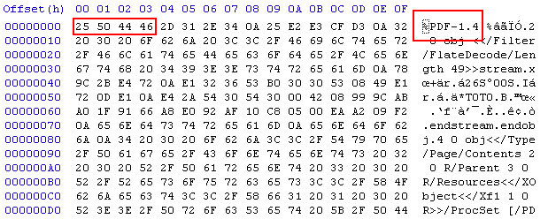

# 02 - Static Analysis

- [02 - Static Analysis](#02---static-analysis)
  - [Objectives](#objectives)
  - [Introduction](#introduction)
  - [File identification & Classification](#file-identification--classification)
    - [ASCII files](#ascii-files)
    - [Structured files (Binary files)](#structured-files-binary-files)
    - [File Signatures](#file-signatures)
  - [Hashes](#hashes)

---

## Objectives

1. Identify samples, generate hashes, extract strings during the analysis
2. When and why to use an online scanner / sandbox
3. The PE file format and its usage
4. Obfuscation and the basic detection method
5. How to collect IOCs from samples and write YARA signatures to search for malware on systems

<br/>

---

## Introduction

Analyzing a **sample**, we have to determine if it is **malicious** or **benign**.

Remember after collecting a sample, **DO NOT execute it yet!** We will use the Static Analysis techniques to analyze the sample.

**Basic Analysis** observe the file's metadata and other information that is embedded in it. Including:
- File identification & Classification
- Scanning
- File Format Analysis
- Identifying Obfuscation

**Advanced Analysis** examines the source code (kind of) of the malware. Assuming the source code is not available, the analysis is on disassembled into assembly instructions code.

<br/>

---

## File identification & Classification

**File Identification** is the process of identifying the file type and obtaining a unique **signature** of the sample being analyzed.

Classifying the sample can help understand if the sample belongs to a well-known malware family, which has been previously analyzed.

The approaches we use during file identification and classification will help build basic detection method and IOCs (e.g. a YARA rule).

<br/>

There are a number of methods used in Malware Analysis to identify files:

1. Based on the file type (PE / PDF / DOCX / ...)
2. Based on file hases (MD5 / SHA1 / SHA256 / Fuzzy hash / IMPHash)
3. Based on the strings embedded within the file (ASCII / Unicode / ...)

Identifying the file type help not only understand how the sample might be used, but also help select the proper tools to work with.

All files on a computer fall under one of two categories:

1. ASCII files - plaintext
2. Structured files - binary

<br/>

### ASCII files

Just plaintext which you can use a text editor to read - file types like `.json` / `.xml` / `.html` are also regarded as plaintext files.

  

<br/>

### Structured files (Binary files)

If a file is not a plaintext file, it has a binary structure. 

For example, here is the structure of PDF files:

  

For example, here is the PE file structure:

  

<br/>

If we take a look at the `PDF` file in Hexadecimal, your will notice the first few bytes indicating the file format:

  

For example, `.EXE` has a `4D 5A` (`MZ`) in the beginning of the HEX:

  

<br/>

Note:
Not all files have a header and footer!

<br/>

### File Signatures

In computing, a file signature is data used to identify or verify the contents of a file. 

**File magic number** are bytes within a file used to identify the format of the file; generally a **short sequence of bytes** (most are 2-4 bytes long) placed at the beginning of the file.

- https://www.garykessler.net/library/file_sigs.html

<br/>

For `PDF` files, the magic number is 4-byte: `25 50 44 46` (`%PDF`); the **trailers** could be:
- `0A 25 25 45 4F 46` (`.%%EOF`)
- `0A 25 25 45 4F 46 0A` (`.%%EOF.`)
- `0D 0A 25 25 45 4F 46 0D 0A` (`..%%EOF..`)
- `0D 25 25 45 4F 46 0D` (`.%%EOF.`)

For `PNG` files, the magic number is 8-byte: `89 50 4E 47 0D 0A 1A 0A` (`%PNG....`); the **trailer** is `49 45 4E 44 AE 42 60 82` (`IEND®B``‚...`)

<br/>

Again, identify the file type help you decide which tools to use to analyze the file at hand further. 

It should be noted that **we shouldn't determine a file type based on the file extension!!!!** A common technique called **File Injection** - for example, an EXE file can be stored as JPEG image's extension and while the user double clicks it, the EXE file is loaded.

<br/>

Another method to check a file type is to use the Linux command tool `file`:

```
file <file>
```

<br/>

Note:
The ICON of a file can be changed by using the tool **Resource Hacker**

<br/>

---

## Hashes

