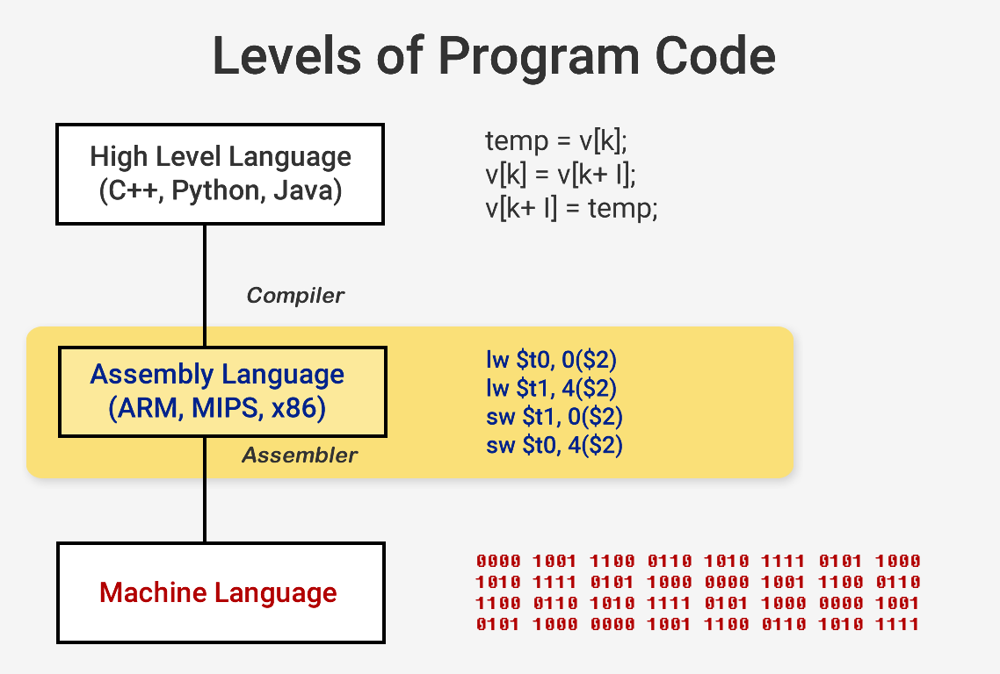
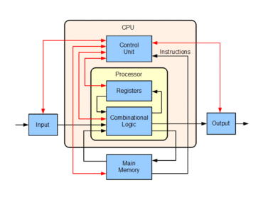
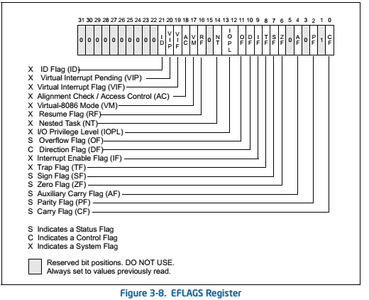
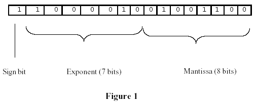
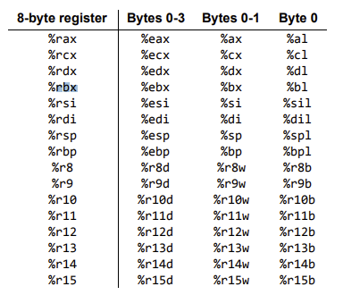

# 03 - x64 Assembly

- [03 - x64 Assembly](#03---x64-assembly)
  - [Assembly Language Introduction](#assembly-language-introduction)
  - [CPU Architecture](#cpu-architecture)
    - [Control Unit (CU)](#control-unit-cu)
    - [Registers](#registers)
    - [General Purpose Registers](#general-purpose-registers)
    - [Segment Registers](#segment-registers)
    - [RFLAGS Register](#rflags-register)
    - [Instruction Pointer Register](#instruction-pointer-register)
    - [Instruction Set](#instruction-set)
  - [Assembly Basics](#assembly-basics)
    - [Instructions](#instructions)
    - [Fundamental Data Types](#fundamental-data-types)
    - [Using Registers](#using-registers)
    - [Math Opeartions](#math-opeartions)
    - [Logical Operations](#logical-operations)
    - [Control-Transfer Instructions](#control-transfer-instructions)

---

## Assembly Language Introduction

**Assembly language** is a Low-Level Programming language. Low level programming languages are close to the machine language, nonportable, and with almost no abstraction

  

<br/>

Assembly language is an intermediate layer between machine code and (almost) all high-level languages. 

High level languages which require a **virtual machine** (like **JAVA**) have a different approach. The virtual machine runs the code and might convert it to Assembly then Machine code at runtime using a **JIT compiler** (**Just-In-Time** compiler).

<br/>

For example, here is the flow of JAVA program:

  

<br/>

Here are some additional details on the main characteristics of Assembly as a Low-Level Language:

1. **Close to machine code**: Every machine code is represented by a single assembly instruction.
2. **Non-portable**: Because it is close to the machine code, the code can be used on that specific machine. If we need it on another machine, we will need to re-write the code!
3. **No abstraction**: Every instruction can be directly converted to a machine code depending on its operand. The language does not provide objects, classes, reusable functions, or even control statements or loops. All of that can be achieved in assembly, but with a lot of code!

<br/>

A simple statement in C++ can result in multiple Assembly language instructions (thus, multiple machine codes), as seen below:

  

<br/>

There are many high programming languages that make developers’ life easier, and for some developers, these languages make application development an art and a fun process! It is much easier to create programs in high level languages, plus it is easier to both debug and maintain them.

However, learning low-level / old fashion languages (like C / C++), since they are really useful when doing **reverse-engineering**.

<br/>

Assembly language was needed for a quite long time to create an **optimized code for performance reasons**. But with modern compilers shipped with intelligent optimizers, the usage for a low-level language has dropped! Still we have to learn it because:

1. Writing code for specific tasks related to **hardware drivers** for some operating systems (out of the scope of this course).
2. **Reverse engineering** an existing executable’s code to find a vulnerability and create an exploit, or **to understand the executable’s functionality**.

<br/>

When debugging software, we target the running process and dive into its executable code (the machine code). Reading this code as **Assembly instructions** is much easier than reading sequences of endless hexadecimal numbers (byte-code). 

Learning Assembly language will help us to **understand the behavior of this program during execution at the CPU level**, and with such knowledge we can detour the code during execution to take other paths that suite our analysis.

<br/>

---

## CPU Architecture

Because Assembly language is a machine code that can be understood by humans, the first step in our journey is to understand the architecture of a Machine (the CPU).

From a high-level view, the CPU consist of the following components:

  

1. **Control Unit (CU)**: Manage execution and data flow of all other components.
2. **Registers**: Special memory-stores to be used by various machine instructions. Almost all instructions refer to a register in one of their operands.
3. **Arithmetic and Logic Unit (ALU)**: to handle arithmetic and logical (bitwise) operation on integer values.

<br/>

That was a simple architecture. In modern CPUs, there are more units, and more internal memory-stores (like cache memory). Some CPUs now even include an internal Graphic Processing Unit (GPU).

<br/>

### Control Unit (CU)

The Control Unit (CU):

  


1. Fetches machine codes from the Memory
2. Decodes codes into instructions
3. Loads/saves data into Registers
4. Orders other Units to perform specific actions
5. Repeats all of that again and again

<br/>

### Registers

We will discuss **Intel® 64 architecture** (64-bit CPU is the most used), which is the same architecture used by **AMD64**. It is also referred to as **x64**, and compatible with **x86_64** architecture. The Intel® 64 CPUs have four main types of registers:

1) **General Purpose Registers**: 16 registers, 64-bit each, used for **many purposes** (reason for calling them general).

- Operands for logical and arithmetic operations
- Operands for address calculations
- Pointers to memory locations

2) ***Segment Registers**: 6 registers; 64-bit each. To **control memory segmentation** (code space, data space, etc..) during execution

3) **RFLAGS Register**: a single 64-bit register that holds many bitrepresented flags; each flag has a special meaning

4) **Instruction Pointer Register**: a single 64-bit register. **Points to the memory location that holds the next machine instruction to be executed**. (this is important for exploit development to gain control of the value saved in this register)

<br/>

### General Purpose Registers

General purpose registers are 64-bit registers. CPU instructions can access these registers completely, or partially:

- Access the complete 64-bit register
- Access the lower 32-bit part of the register
- Access the lower 16-bit part of the register
- Access the lower 8-bit part of the register
- Only 4 registers have a special access to (high part) of the (lower 16-bit part)

  

- For example, the register `RAX` is a general-purpose register. Referring to `RAX` in an instruction means that we are trying to access the **full value held by the register**. While `EAX` means we are accessing only the lower 32bit part of the same register.

<br/>

Here is the list of 64-bit registers:

  

- Each Assembly instruction has its own applicability of register usage.
- That is what makes them **Registers not an arbitrary random Variable**.

<br/>

Each register has a common use in many instructions. 

The register’s names is derived from their common usage:

| **Register** | **Usage** |
| --- | --- |
| **RAX** | Many **A**rithmetic instructions depend on the value of this register. |
| **RBX** | Mostly used as the **B**ase index for pointers. |
| **RCX** | Loop operations use this register as their **C**ounter. |
| **RDX** | Used by many **D**evice input/output operations, and arithmetic **D**ivide instructions. |
| **RDI** | Used by string operations as the **D**estination **I**ndex. |
| **RSI** | Used by string operations as the **S**ource **I**ndex. |
| **RBP** | Mostly used as the **B**ase **P**ointer for the memory location holds variables passed to sub-routines. |
| **RSP** | Mostly used as a **S**tack **P**ointer for the program’s logical stack. |
| **R8...R15** | They are new Registers added to 64-bit CPUs. With no special use by instructions, they can be used as **helpers for any instruction that accepts them as operands**. |

<br/>

Generally speaking:

| Keyword | Description |
| --- | --- |
| `L` | (8-bit) = partial access - `Low` |
| `H` | (8-bit) = special access - `High` |
| `X` | (16-bit) = partial access - `High + Low` |
| `E` | (32-bit) = partial access - `Extended` |
| `D` / `W` / `B` in R8..R15 | Partial access - `DWORD` / `WORD` / `BYTE` |

<br/>

In addition to the common use of Registers in Assembly instructions; Operating Systems have their (standard) way to use them on function/API calls. This is named (**Calling Convention**), which will be discussed in detail later in this module.

<br/>

### Segment Registers

Segments are specific areas defined in a program for containing data, code and stack. There are three main segments:

1. **Code Segment**: It contains all the instructions to be executed. A 16-bit **Code** Segment register or `CS` register stores the starting address of the code segment.
2. **Data Segment**: It contains data, constants and work areas. A 16-bit **Data** Segment register or `DS` register stores the starting address of the data segment.
3. **Stack Segment**: It contains data and return addresses of procedures or subroutines. It is implemented as a 'stack' data structure. The Stack Segment register or `SS` register stores the starting address of the stack.

Apart from the `DS`, `CS` and `SS` registers, there are other extra segment registers - `ES` (extra segment), `FS` and `GS`, which provide additional segments for storing data.

<br/>

For the sake of more clarity; let us assume that we are using a 16-bit CPU, this means that General Purpose Registers are 16-bit length. 

If we need to copy the value `0x12` (`12h` - 12 hexadecimal which is `18` in decimal) to the memory, and for that we use a register as a pointer, we will notice that we can only access `64Kbytes` of the memory. Because the maximum value that a register can be set to is `65535` (2^16 – 1).

To access more than `64-Kbytes` memory, we can use a **combination of Segment and General Register** to have more than 16-bit length for maximum value:

```
MOV ES:CX, 12h
```

- `ES:CX` allows the instruction to refer to more memory. 
- But that still depends on the segmentation mode

It is clear now why these registers are almost not used in 64-bit programs. It is because 64-bit registers can address (2^64 – 1) bytes (16 Exabytes, or 16 million Terabytes). 

64-bit Operating Systems use `FS` and `GS` registers to create **virtual memory isolation rings** for **security reasons**.

<br/>

### RFLAGS Register

`RFLAGS` is a 64-bit register, but the **high 32-bit part is reserved for future use**, in other words not used yet.

A flag, is **one bit** of the 32-bits of RFLAGS register. Many instructions either affect and/or get affected by the values in RFLAGS flags.

<br/>

It is worth to mention that in **32-bit (x86)** architecture; this register was a 32-bit register and named `EFLAGS`. The x64 architecture just extended the size of the register but kept its use unchanged from the older x86. Additionally, **not all 32 flags are used. Some of them are reserved** and must be kept intact.

<br/>

The following diagram shows the flags in `RFLAGS`:

  

<br/>

### Instruction Pointer Register

The short name of the **Instruction Pointer register** in x64 architect is `RIP`. The **next instruction to be executed** is always pointed by this register. Be aware that it is the next instruction, not the current instruction.

There is no instruction that can update the value of this register. Simply because **changing this pointer will change the original execution flow/path of the program**.

When a sub-routine is called using a `call` instruction; the current value of RIP register is pushed into the program’s memory stack, so it can be popped later after the subroutine returned using a `ret` instruction so execution can continue from where it was interrupted by the call instruction.

<br/>

**We cannot manipulate this register directly because there is no instruction to do that**, the architecture prevents us from doing that, but the value of this register is being **saved to memory stack and loaded from there. The memory region that we can access and modify through the use of many instructions!** Sounds interesting to exploit developers and maybe to us, too.

<br/>


### Instruction Set

The **Control Unit (CU)** does all the processing magic by executing a series of instructions represented by Machine Codes (aka byte-code).

**Machine Codes** are just a set of **binary** numbers. The CU makes these codes usable by performing a very simple task according to code values. Therefore, the long list of codes understood by the CPU is called **Instruction Set**.

Deep knowledge of Instruction Set formatting is not our interest. Our interest is to know how to **read/write instructions in Assembly Language** (better than the readable format in binary representation).

<br/>

---

## Assembly Basics

### Instructions

In general; instructions are represented in the following format:

- `<INSTRUCTION> <DEST>[,<SOURCE>]`

Anything after a semicolon is considered a comment, except for semicolon inside double quotations which are treated as normal text. For example:

- `move eax, ebx; comment here`
- Copy EBX value to EAX

<br/>

| **Instruction** | **Description** |
| --- | --- |
| `mov rcx, 20h` | Copy `0x20` to `rcx` register |
| `;move rcx, 20h` | Comment line |
| `mov rcx; 20h` | Syntax error - `mov` takes dest + src |
| `inc eax` | Increment `eax` (+ 1) |
| `CLTQ` | Convert signed value in `eax` into 64-bit and copy it to `rax` |

<br/>

There are many groups of instructions, each group represents a feature of the CPU, therefore one CPU can contain a set of categories that are not included in another CPU even if they are both x64 architecture. For example:

 - **General Purpose Instructions**: Available in all x86 and x64 CPUs
 - **x87 FPU Instructions**: For floating point, available in almost all modern x64 CPUs
 - **MMX Instructions**: Multimedia helpers, available in almost all modern x64 CPUs
 - **Intel® SHA Extension:**: SHA algorithm calculators, available in Intel® Atom CPUs

<br/>

Assembly Language contains hundreds of instructions. Each instruction has its own **use**, **size**, and **speed**! The size of instruction (in **bytes**) varies according to given operands. Same goes for execution speed of the instruction.

But for modern CPUs, speed comparison between instruction is not feasible anymore! For many factors in modern CPU architecture.

<br/>

Low level programming developers tend to learn as many instructions as they can for two main reasons:

1. **Optimization**: For example both `add eax, 1` and `inc eax` will increment the value of `EAX` register by one. We use `INC` because its machine code is smaller. But if we need to watch **Carry Flag** (`CF`) then we use `ADD` because it affects that flag unlike `INC` instruction that preserves it.
2. **Obfuscation**: Some instructions make it harder on reverse engineers to figure out the execution path of the process. Note that obfuscation may greatly impact optimization.

<br/>

### Fundamental Data Types

Fundamental Data Types also represent unsigned numeric values:

1. **Byte**: 1 memory byte (8-bits)
2. **Word**: 2 memory bytes (16-bits)
3. **Double Word**: 4 memory bytes (32-bits)
4. **Quad Word**: 8 memory bytes (64-bits)
5. **Double Quad Word**: 16 memory bytes (128-bits)

<br/>

**Signed Number**

Each fundamental data type can represent a **Signed Numeric value** by **reserving the highest bit for the sign** (`0` for positive, `1` for negative). Negatives are calculated by 2'Complement method:

```
Example 1:

Signed Number:      1 1 0 1 1 0 1 1

Inverse:            0 0 1 0 0 1 0 0
+                                 1
-------------------------------------
                    0 0 1 0 0 1 0 1   --> 1 + 4 + 32 = 37
                                      --> (11011011) = -37

================================================================

Example 2:

Signed Number:      1 0 0 0 0 0 1 0

Inverse:            0 1 1 1 1 1 0 1
+                                 1
-------------------------------------
                    0 1 1 1 1 1 1 0   --> 2 + 4 + 8 + 16 + 32 + 64 = 126
                                      --> (1000 0010) = -126
```

For example:

| **Data Length** | **Binary** | **Unsigned** | **Signed** |
| --- | --- | --- | --- |
| Byte | 0000 0010 | 2 | 2 |
| Byte | `1`000 0010 | 130 | -126 |
| Word | 00000000 10000010 | 130 | 130 |
| Word | `1`0000000 10000010 | 32898 | -32638 |

<br/>

**Floating-point Data Type**

**Floating-Point Data Type** is the binary representation for floats (numbers with decimal fractions). 

In the binary level (the only level understood by the CPU), mathematic operations on floats are complicated when compared to operations on integers. For example, 32-bit value for a float contains three things:

  

For a 32-bit:

- 0~22nd bit = Precision / Mantissa
- 23rd~30th bit = Exponent
- 31th bit = Sign bit

<br/>

General Purpose Instructions CANNOT deal with float value directly. A simple operation like incrementing a float value by one will **require many lines of complicated code** using GeneralPurpose instructions like `ADD`, `MOV`, `SHL`, `SHR`, etc.

The use of FPU instruction comes here:

- `FADD` is used to add values to a float
- `FMUL` is used for multiplication

<br/>

`FPU` Instructions can process four types of floats:

  

<br/>

### Using Registers

Copying values from one register to another, from memory location to register, or from a register to memory location is called **moving**.

Therefore, in Assembly language, when we move a value, we are actually **copying** it from source to destination. The most frequently used instruction for this purpose is `MOV` instruction.

<br/>

Registers are the **fastest** memory locations in the computer, simple because they are built **inside the CPU** and highly integrated with CPU units. Because accessing registers is faster than accessing memory, it will be very convenient for any operation to move values from memory to registers, process them, then moving results back to memory.

<br/>

Note:
Speaking about fast memory, there is a small memory named **cache memory**, which is located **inside the CPU too** and is considered very fast compared to main memory (RAM). Cache memory contains small copies of the RAM, gathered by complex internal CPU mechanism. When a memory location is needed; the CPU looks first in cache memory to fetch the value from there instead of going the long way to the RAM.

Note:
There is no way to directly access cache memory intentionally by any instruction. It is a pure internal architecture thing that is handled implicitly by the CPU. Therefore, we won’t be focusing on cache memory in our Assembly coding or disassembling tasks.

<br/>

A register itself can be accessed in many sizes (ex: `RAX` for 64-bit, `EAX` for 32-bit). Moving values between registers and memory locations must be handled in identical sizes. Moving values **partially** to a register will not affect values **already** saved in other parts of that register. Keep that in mind. For example:

```
mov rax, 0x100000000;   now rax = 0x00000001 0000 0000
mov eax, 0xffff;        now rax = 0x00000001 0000 ffff
mov ah, 0;              now rax = 0x00000001 0000 00ff
```

<br/>

In this example, we use `SHL` instruction, which shifts bits to the left inside the target part of the register. Syntax is `SHL <REGISTER>, <bits count>`:

  

- `mov rbx, 0xa0000000f`    :  New `rbx` value = 0x`0000000a 0000 000f`
- `shl ebx, 8`              :  New `rbx` value = 0x0000000a `0000 0f00`
- `shl rbx, 4`              :  New `rbx` value = 0x`000000a0 0000 f000`
- `shl bx, 4`               :  New `rbx` value = 0x000000a0 0000 `0000`
- `mov bl, 0xbb`            :  New `rbx` value = 0x000000a0 0000 `00bb`

- `mov rcx, 0xcc`           :  New `rcx` value = 0x`00000000 0000 00cc`
- `shl rcx, 32`             :  New `rcx` value = 0x`000000cc 0000 0000`
- `mov ecx, ebx`            :  New `rcx` value = 0x000000cc `0000 00bb`

<br/>

### Math Opeartions

Registers can be used for mathematical operations through General Purpose instructions. 

A fast way is to try the code in an online compiler that uses GCC or NASM behind the scene. For example:

- https://defuse.ca/online-x86-assembler.htm
- https://rextester.com/l/nasm_online_compiler

<br/>

The most used instructions are:

- `ADD`: calculates summation of destination and source operand and saves the result in destination.
- `SUB`: subtracts the value of source from destination and saves the result in destination.
- `MUL`
- `DIV`

<br/>

Both `ADD` and `SUB` accept two operand (source and destination), where operands can be:

- Registers
- Memory
- Immediate (constant)

However, not all combinations are allowed. For example:

- `add eax, bx` is not allowed - wrong operand size combination
- `add rex, rax`
- `add al, bl`
- `add al, bh`
- `add ah, r8b`
- `add al, r8b` is not allowed
- `add ax, 1`
- `add 1, ax` is not allowed - destination cannot be immediate
- `add eax, dword ptr [esi]`
- `add dword ptr [esi], 1`

<br/>

`MUL` and `DIV` have special use of Registers (many other instructions have). Unlike `ADD` and `SUB`, these instruction accept one operand, and that operand is considered a source. The destination operand is implicit and **must be filled in a previous statement**.

`mul <SOURCE>` considers the destination as `RAX`, `EAX`, `AX`, or `AL` (depending on source size). It will multiply value of source by value of destination then saves the result in destination Register as the low part, and `RDX`, `EDX`, `DX`, `DL` (depending on source size) as a high part.

For example, 16-bit multiplication must use AX and DX:

- Consider `ffh x ab00h = aa5500h`

```
mov ax, 0xff
mov bx, 0xab00
mul bx
```

| ax | bx | dx | dx:ax |
| --- | --- | --- | --- |
| `00ffh` | | | |
| 00ffh | `ab00h` | | |
| `5500h` | ab00h | `00aah` | `00aa5500h` | 

<br/>

Another example - 32-bit multiplication must use `EAX` and `EDX`:

- Consider `0xff00 * 0xab0000 = 0xaa55000000`

```
mov eax, 0xff00
mov ebx, 0xab0000
mul ebx
```

| eax | ebx | edx | edx:eax |
| --- | --- | --- | --- |
| `0xff00` | | | |
| 0xff00 | `0xab0000` | | |
| `0x55000000` | 0xab0000 | `0x000000aah` | `0x00aa55000000` | 

<br/>

`DIV` instruction works in a similar way. We will consider it an exercise to search for the appropriate way to use the DIV instruction. 

It is also important to know that `MUL` deals with `unsigned` values. While `IMUL` (a different instruction) is for signed values.

DIV results are integers with a reminder. For float division, we use the instruction `FDIV`.

<br/>

### Logical Operations

Logical operations can be performed using `AND`, `OR`, `XOR`, and `NOT` instructions.

Flags like Zero Flag (`ZF`) are affected by the result of these instructions.

In addition, `TEST` instruction is used to perform a virtual `AND` operation and affects flag values **without saving the result in destination operand**.

<br/>

Logical instruction are very important as they are heavily used to control execution path of the program. This is done using **conditional jump instructions** that are controlled by the flags.

<br/>

XOR instruction can be seen a lot in a way that looks odd:

- `xor eax, eax`
- This will do a logical `XOR` for the value of EAX Register with itself and save the result in the EAX Register. **The result will always be Zero**, so the instruction is similar to: `mov eax, 0`

The `XOR` instruction is an optimized use of Assembly instructions.

Converting `MOV` instruction to machine code consumes more bytes than converting `XOR` instruction. Moreover, in older CPUs, `XOR` is faster than `MOV`.

Note:
XOR --> Exclusive OR.  If the comparing bits are different, the output will be `1`.

<br/>

**Bitwise Operations**

Bitwise operations are performed using many instructions like:

- `SHL`: shift bits to the left (to higher bits). Most-significant bits might be lost.
- `SHR`: shift bits to the right (to lower bits). Least-significant bits might be lost.
- `ROL`: rotate bits to the left. Most-significant bits reinserted into the right.
- `ROR`: rotate bits to the right. Least-significant bits reinserted into the left.

For example:

| Assembly instruction | eax in binary |
| --- | --- |
| mov eax 0x1004 | 0001 0000 0000 0100 |
| shr ax, 2 | 0001 0000 0000 `0001` |
| ror eax, 1 | `1000 1000 0000 0000` |
| shl ax, 1 | 1000 1000 0000 `0000` |
| shl eax, 1 | `0001 0000 0000 0000` |

<br/>

### Control-Transfer Instructions

To change execution path and create a control flow of the program, **Control-Transfer instructions** come in handy. Using them is the only way to change the value of `RIP` - the execution path.

Control-Transfer instructions can be split in two main categories:

1. **Unconditional**: always change path when encountered. For example, the instructions like: `JMP`, `CALL`, `RET` and `INT`
2. **Conditional**: change path if-and-only-if a condition is met. For example, instructions like: `JZ`, `JNZ`, `JC`, `JE`, and `LOOP`

- `JZ`: Jump if Zero Flag (`ZF`) is set (1)
- `JNZ` Jump if Zero Flag (`ZF`) is clear (0)
- `JCF`: Jump if Carry Flag is set (1)
- `JE`: Jump if Equal (when Zero Flag (`ZF`) is set), which is the same as `JZ`; the machine code of `JZ` and `JE` are the same.
- `JG`: Jupm if greater (when `ZF` is cleared, and `SF`=`OF`)

<br/>

For example, the following assembly code compares the values of `ebx` and `eax` and changes the execution path if both registers contain the same value:

```
xor ebx, eax
jz 0x50000000;      address of next line of code when equal
```

<br/>

Consider the impact of the `XOR` instruction, which saves the output into the destination register. What is the original value which was overwritten is needed later in the program? If we need to preserve that value, then we need to use the instruction `CMP`:

```
cmp ebx, eax
jz 0x50000000;      address of next line of code when equal
```

<br/>

**LOOP**

`LOOP` instruction controls execution path in a special way. It decrements the value of the `ECX` Register by one then jumps if the value in `ECX` is not zero. Take a look at the example below:

```
xor rax, rax
mov ecx, 12

_summation_loop:
add eax, ecx

loop _summation_loop

mov ebx, eax
```

1. `xor rax, rax` --> Clear `rax` so `rax` becomes `0`
2. `mov ecx, 12` --> Initialize the value of `ecx` to be `12`
3. `loop _summation_loop` --> Keep repeating `add eax, ecx`, each time `ecx` is decremented, until value in `ecx` = 0. So basically it loops `12` times and the value of `eax` is `12 + 11 + 10 + 9 + 8 + ... + 1 = 78`
4. `mov ebx, eax`  --> Copy the value in `eax` to `ebx` --> `ebx` = 78

- At the end of the above code, `EBX` will be 78.
- The code used a label instead of an actual address `_summation_loop`. Labels are helpers in Assembly Language to be used instead of addresses of instructions. Labels can also be used with `JUMP` and `CALL` instructions.

<br/>

Don’t mix between Assembly labels and function names in high level languages. Assembly labels are very similar to C labels that are used by legacy `goto` statements.

Best practices of high-level languages restrict the use of `goto` and labels. **But for Assembly; the program highly depends on jumps and labels!**

<br/>

**INT**

`INT` (Interrupt) instruction is a very special instruction that is used to call kernel functions. These kernel calls are named interrupts.

The program must fill few registers with specific values in a specific way before calling an interrupt; each interrupt has its own manual regarding that. Because interrupts are kernel calls, this make them **dependent on the Operating System that is running the program**.

<br/>

**Sub-routines**

`CALL` instruction is used similarly to `JUMP` to change execution path unconditionally. 

The power of `CALL` instruction is that it **saves the original value of `RIP` Register on the stack**. Then `RET` instruction is used to pop out `RIP` value and return back to the original location (the instruction exactly after `CALL`).

A sub-routine is a virtual convention that is used to define the chunk of instructions starting from first instruction located by `CALL`, and ended by `RET`. 

Calling a sub-routine can also represent a system function call.