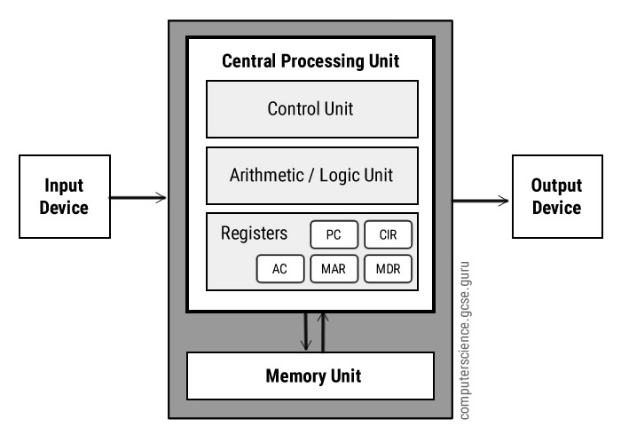
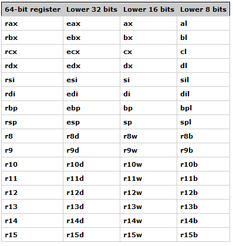

# 03 - x64 Assembly

- [03 - x64 Assembly](#03---x64-assembly)
  - [Assembly Language Introduction](#assembly-language-introduction)
  - [CPU Architecture](#cpu-architecture)
    - [Control Unit (CU)](#control-unit-cu)
    - [Registers](#registers)
    - [General Purpose Registers](#general-purpose-registers)
    - [Segment Registers](#segment-registers)
    - [RFLAGS Register](#rflags-register)

---

## Assembly Language Introduction

**Assembly language** is a Low-Level Programming language. Low level programming languages are close to the machine language, nonportable, and with almost no abstraction

  

<br/>

Assembly language is an intermediate layer between machine code and (almost) all high-level languages. 

High level languages which require a **virtual machine** (like **JAVA**) have a different approach. The virtual machine runs the code and might convert it to Assembly then Machine code at runtime using a **JIT compiler** (**Just-In-Time** compiler).

<br/>

For example, here is the flow of JAVA program:

  

<br/>

Here are some additional details on the main characteristics of Assembly as a Low-Level Language:

1. **Close to machine code**: Every machine code is represented by a single assembly instruction.
2. **Non-portable**: Because it is close to the machine code, the code can be used on that specific machine. If we need it on another machine, we will need to re-write the code!
3. **No abstraction**: Every instruction can be directly converted to a machine code depending on its operand. The language does not provide objects, classes, reusable functions, or even control statements or loops. All of that can be achieved in assembly, but with a lot of code!

<br/>

A simple statement in C++ can result in multiple Assembly language instructions (thus, multiple machine codes), as seen below:

  

<br/>

There are many high programming languages that make developers’ life easier, and for some developers, these languages make application development an art and a fun process! It is much easier to create programs in high level languages, plus it is easier to both debug and maintain them.

However, learning low-level / old fashion languages (like C / C++), since they are really useful when doing **reverse-engineering**.

<br/>

Assembly language was needed for a quite long time to create an **optimized code for performance reasons**. But with modern compilers shipped with intelligent optimizers, the usage for a low-level language has dropped! Still we have to learn it because:

1. Writing code for specific tasks related to **hardware drivers** for some operating systems (out of the scope of this course).
2. **Reverse engineering** an existing executable’s code to find a vulnerability and create an exploit, or **to understand the executable’s functionality**.

<br/>

When debugging software, we target the running process and dive into its executable code (the machine code). Reading this code as **Assembly instructions** is much easier than reading sequences of endless hexadecimal numbers (byte-code). 

Learning Assembly language will help us to **understand the behavior of this program during execution at the CPU level**, and with such knowledge we can detour the code during execution to take other paths that suite our analysis.

<br/>

---

## CPU Architecture

Because Assembly language is a machine code that can be understood by humans, the first step in our journey is to understand the architecture of a Machine (the CPU).

From a high-level view, the CPU consist of the following components:

  

1. **Control Unit (CU)**: Manage execution and data flow of all other components.
2. **Registers**: Special memory-stores to be used by various machine instructions. Almost all instructions refer to a register in one of their operands.
3. **Arithmetic and Logic Unit (ALU)**: to handle arithmetic and logical (bitwise) operation on integer values.

<br/>

That was a simple architecture. In modern CPUs, there are more units, and more internal memory-stores (like cache memory). Some CPUs now even include an internal Graphic Processing Unit (GPU).

<br/>

### Control Unit (CU)

The Control Unit (CU):

  


1. Fetches machine codes from the Memory
2. Decodes codes into instructions
3. Loads/saves data into Registers
4. Orders other Units to perform specific actions
5. Repeats all of that again and again

<br/>

### Registers

We will discuss **Intel® 64 architecture** (64-bit CPU is the most used), which is the same architecture used by **AMD64**. It is also referred to as **x64**, and compatible with **x86_64** architecture. The Intel® 64 CPUs have four main types of registers:

1) **General Purpose Registers**: 16 registers, 64-bit each, used for **many purposes** (reason for calling them general).

- Operands for logical and arithmetic operations
- Operands for address calculations
- Pointers to memory locations

2) ***Segment Registers**: 6 registers; 64-bit each. To **control memory segmentation** (code space, data space, etc..) during execution

3) **RFLAGS Register**: a single 64-bit register that holds many bitrepresented flags; each flag has a special meaning

4) **Instruction Pointer Register**: a single 64-bit register. **Points to the memory location that holds the next machine instruction to be executed**. (this is important for exploit development to gain control of the value saved in this register)

<br/>

### General Purpose Registers

General purpose registers are 64-bit registers. CPU instructions can access these registers completely, or partially:

- Access the complete 64-bit register
- Access the lower 32-bit part of the register
- Access the lower 16-bit part of the register
- Access the lower 8-bit part of the register
- Only 4 registers have a special access to (high part) of the (lower 16-bit part)

  

- For example, the register `RAX` is a general-purpose register. Referring to `RAX` in an instruction means that we are trying to access the **full value held by the register**. While `EAX` means we are accessing only the lower 32bit part of the same register.

<br/>

Here is the list of 64-bit registers:

  

- Each Assembly instruction has its own applicability of register usage.
- That is what makes them **Registers not an arbitrary random Variable**.

<br/>

Each register has a common use in many instructions. 

The register’s names is derived from their common usage:

| **Register** | **Usage** |
| --- | --- |
| **RAX** | Many **A**rithmetic instructions depend on the value of this register. |
| **RBX** | Mostly used as the **B**ase index for pointers. |
| **RCX** | Loop operations use this register as their **C**ounter. |
| **RDX** | Used by many **D**evice input/output operations, and arithmetic **D**ivide instructions. |
| **RDI** | Used by string operations as the **D**estination **I**ndex. |
| **RSI** | Used by string operations as the **S**ource **I**ndex. |
| **RBP** | Mostly used as the **B**ase **P**ointer for the memory location holds variables passed to sub-routines. |
| **RSP** | Mostly used as a **S**tack **P**ointer for the program’s logical stack. |
| **R8...R15** | They are new Registers added to 64-bit CPUs. With no special use by instructions, they can be used as **helpers for any instruction that accepts them as operands**. |

<br/>

Generally speaking:

| Keyword | Description |
| --- | --- |
| `L` | (8-bit) = partial access - `Low` |
| `H` | (8-bit) = special access - `High` |
| `X` | (16-bit) = partial access - `High + Low` |
| `E` | (32-bit) = partial access - `Extended` |
| `D` / `W` / `B` in R8..R15 | Partial access - `DWORD` / `WORD` / `BYTE` |

<br/>

In addition to the common use of Registers in Assembly instructions; Operating Systems have their (standard) way to use them on function/API calls. This is named (**Calling Convention**), which will be discussed in detail later in this module.

<br/>

### Segment Registers

Segments are specific areas defined in a program for containing data, code and stack. There are three main segments:

1. **Code Segment**: It contains all the instructions to be executed. A 16-bit **Code** Segment register or `CS` register stores the starting address of the code segment.
2. **Data Segment**: It contains data, constants and work areas. A 16-bit **Data** Segment register or `DS` register stores the starting address of the data segment.
3. **Stack Segment**: It contains data and return addresses of procedures or subroutines. It is implemented as a 'stack' data structure. The Stack Segment register or `SS` register stores the starting address of the stack.

Apart from the `DS`, `CS` and `SS` registers, there are other extra segment registers - `ES` (extra segment), `FS` and `GS`, which provide additional segments for storing data.

<br/>

For the sake of more clarity; let us assume that we are using a 16-bit CPU, this means that General Purpose Registers are 16-bit length. 

If we need to copy the value `0x12` (`12h` - 12 hexadecimal which is `18` in decimal) to the memory, and for that we use a register as a pointer, we will notice that we can only access `64Kbytes` of the memory. Because the maximum value that a register can be set to is `65535` (2^16 – 1).

To access more than `64-Kbytes` memory, we can use a **combination of Segment and General Register** to have more than 16-bit length for maximum value:

```
MOV ES:CX, 12h
```

- `ES:CX` allows the instruction to refer to more memory. 
- But that still depends on the segmentation mode

It is clear now why these registers are almost not used in 64-bit programs. It is because 64-bit registers can address (2^64 – 1) bytes (16 Exabytes, or 16 million Terabytes). 

64-bit Operating Systems use `FS` and `GS` registers to create **virtual memory isolation rings** for **security reasons**.

<br/>

### RFLAGS Register

