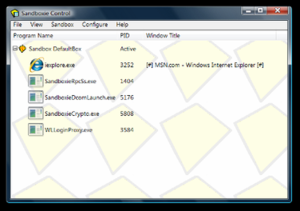
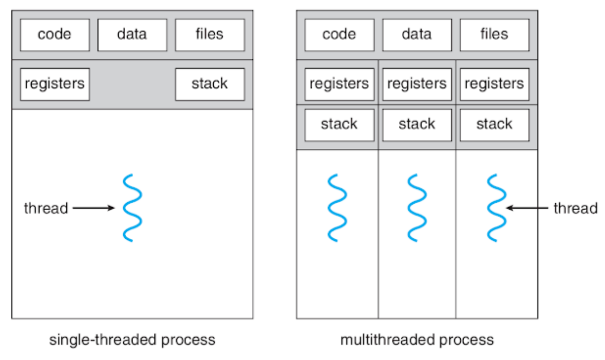
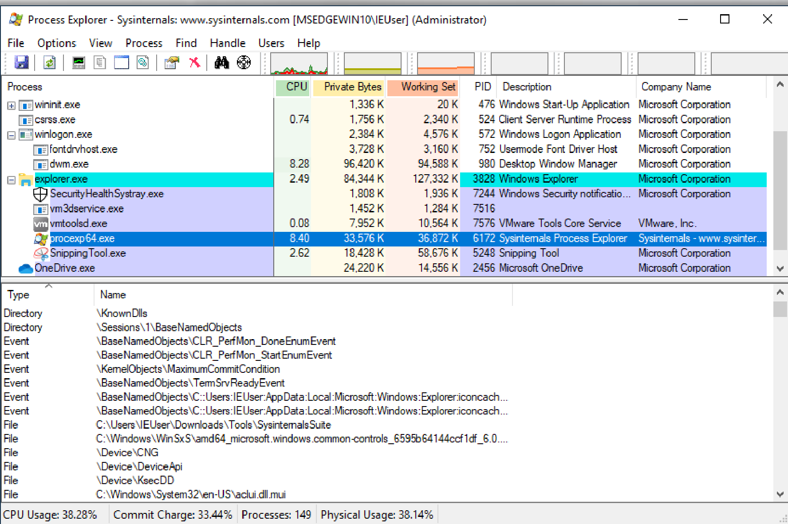
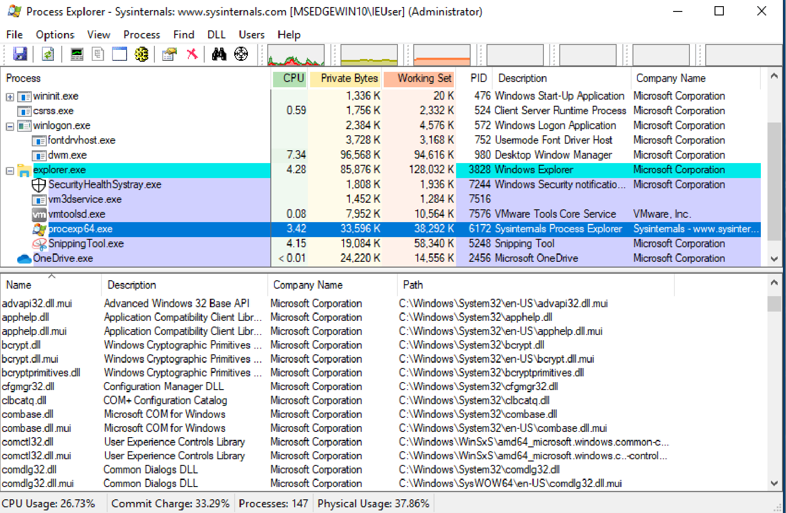
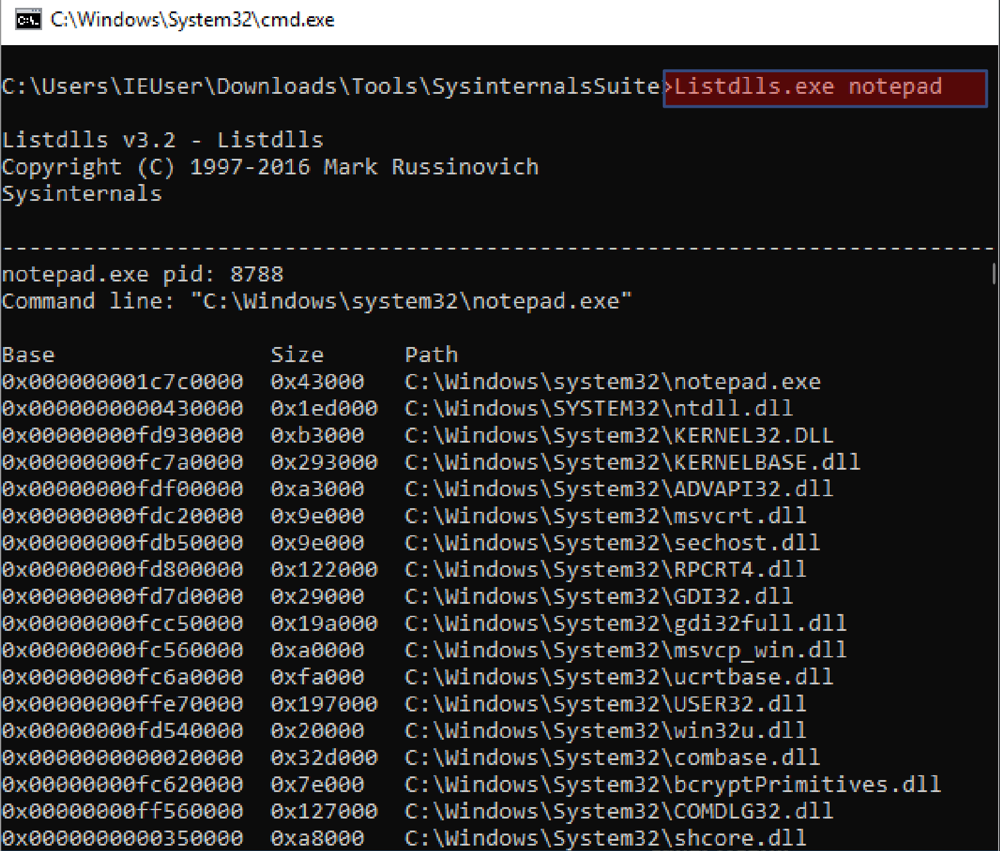
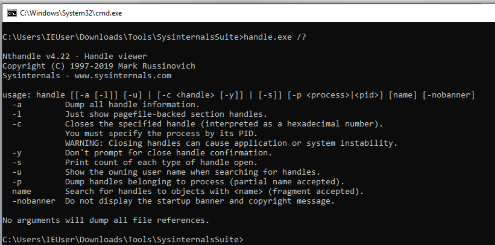
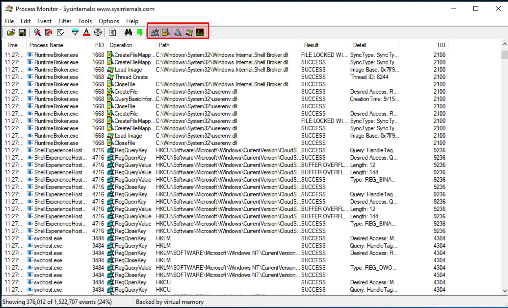
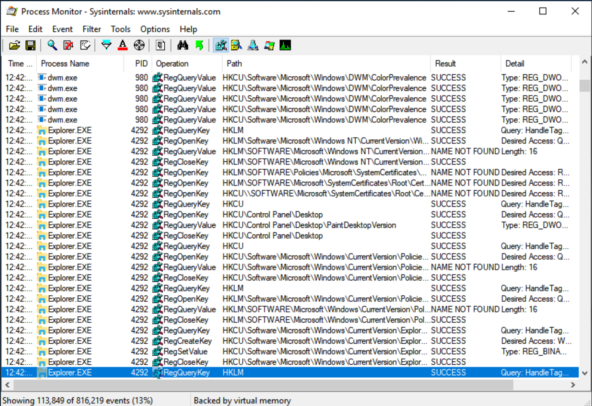
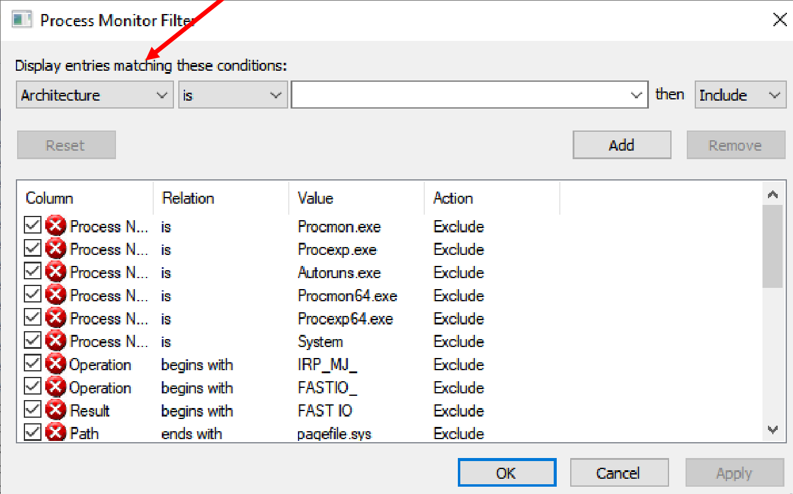
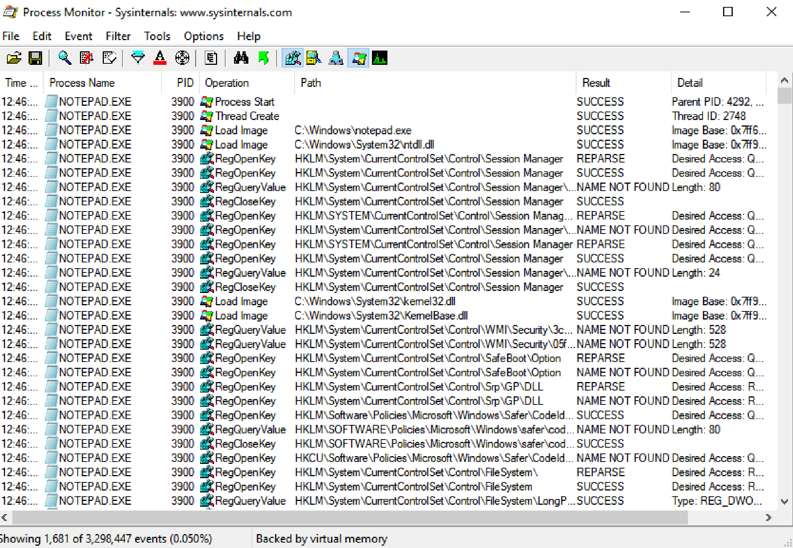

# 04 - Behavior Analysis

- [04 - Behavior Analysis](#04---behavior-analysis)
  - [Introduction](#introduction)
  - [Dynamic Analysis](#dynamic-analysis)
  - [Execution Environments - Virtual Machines](#execution-environments---virtual-machines)
  - [Execution Environments - Separate Physical System](#execution-environments---separate-physical-system)
  - [Execution Environments - Automated Sandbox](#execution-environments---automated-sandbox)
  - [Feeding the Malware](#feeding-the-malware)
  - [Static vs. Dynamic Analysis](#static-vs-dynamic-analysis)
  - [Dynamic Analysis Methodology](#dynamic-analysis-methodology)
    - [Phase 1: Baseline](#phase-1-baseline)
    - [Phase 2: Pre-execution](#phase-2-pre-execution)
    - [Phase 3: Post-execution](#phase-3-post-execution)
    - [Phase 4: Analyze and Document](#phase-4-analyze-and-document)
  - [Understanding Windows Processes](#understanding-windows-processes)
    - [Shared Libraries (DLLs)](#shared-libraries-dlls)
    - [Handles](#handles)
  - [Process Creation Steps](#process-creation-steps)
  - [Sysinternals Tools](#sysinternals-tools)
    - [Process Explorer](#process-explorer)
    - [WinObj](#winobj)
    - [listDLLs](#listdlls)
    - [Sysinternals Handles Tool](#sysinternals-handles-tool)
    - [Process Monitor (Procmon)](#process-monitor-procmon)
  - [System Processes & Services](#system-processes--services)
    - [Known Windows 10 Processes](#known-windows-10-processes)
  - [Windows on Windows 64 (WoW64)](#windows-on-windows-64-wow64)
    - [WoW64 Main Components and Layout](#wow64-main-components-and-layout)
    - [WoW64 File System Redirections](#wow64-file-system-redirections)
    - [WoW64 Registry Redirector](#wow64-registry-redirector)
  - [More Windows System Files](#more-windows-system-files)

---

## Introduction

In this module, we will be discussing topics related to dynamic malware analysis. We will be focusing on the behavior of malware and why we need to dynamically analyze it, the different dynamic analysis methods, pros and cons of each method, techniques, and tools.

We also will be discussing the different types of malware in their technical aspects, such as but not limited to:

- Downloaders
- Droppers
- C&C
- Backdoors
- KeyLoggers
- Fileless malware

<br/>

Then we will go over the methods that malware uses to operate their malicious payloads, such as Injection Techniques, Persistent Methods, using LoLBins, etc.

We will first discuss in general what dynamic analysis is, the different types of dynamic analysis, when to use each, and the differences between them.

Then we will dive into the realm of windows processes, what they are, the different types of resources used, and how they are used.

<br/>

---

## Dynamic Analysis

Until now, we understood that we could analyze malware using **static** methods, whether looking at signatures, what functions/APIs they use, or disassembling them and looking at low-level code.

But,
* what if those methods do not reveal much, or do not cover the whole story?
* What if we have a sample that is applying some **obfuscation**? 
* What if the malware sample is **packed** using some custom packing mechanism? 
* What if the malware is extending its armory by **updating itself** with code from outside? How are we going to be able to find out what and how that happened?'

Running a sample gets you closer to answering those questions … and this is where dynamic analysis comes into play.

<br/>

**Dynamic Malware Analysis** is analyzing malware samples by running them in a contained environment.

Yes, we will run the malware sample and see what it does, how it behaves, the harm it is doing, what operations are being executed and how they are being executed. We will observe the systems and services, which are being affected during the execution, whether the malware is hiding, and if so, how is it hiding itself. All of this a **contained** environment.

<br/>

A **contained** environment can be anything from a simple virtual machine, all the way to a physically separated system, running on a physically separated network. All of this depends on the type of malware you are dealing with and your budget.

Nowadays, there is a debate regarding the effectiveness of static analysis vs. dynamic analysis. Some researchers and analysts feel that, with the complexity of the technology used by malware developers, it is better to do dynamic analysis rather than static analysis. There is no right answer, though, so it doesn’t hurt to know both sides and use them as needed. And that’s why MAP covers both!

<br/>

**Execution Possibilities:**

Another reason it is called dynamic analysis is that there are so many possibilities that can happen, and it is up to the analyst to track, monitor, and understand what is happening.

Does that mean it is bad to run the sample? **The answer is definitely NO**. As long as you are prepared and understand what you are doing, you should be able to find some answers.

<br/>

Execution Environments:

1. Virtual Machines
2. Separate Physical Systems
3. Automated Sandbox

<br/>

---

## Execution Environments - Virtual Machines

One of the most commonly used approaches is to run the malware sample in a VM. Usually, this VM is in a pre-configured state, a saved point in time, which could easily be rolled back to in case of a mistake or the need to repeat a step., which The ability to repeat a step in a matter of clicking a button is one of the main reasons why this is widely used nowadays!

You might be asking whether you should be running the Virtual Machine Hypervisor on your computer (host) or not. 

Well, we advise you to run the sample **at minimum within a VM**, but we also advise you to do so on a computer where it doesn’t store any personal or important information. You never know if you’re dealing with a sample that might jump out of your sandbox and harm your system!

<br/>

---

## Execution Environments - Separate Physical System

This is another option for executing the malware, but this depends on having a budget to have separate networks and systems. This might be an excellent option, but it is the most expensive one for sure!

When running the sample on a physical system, it is great to have **tools** that can **provision the system back to a normal clean state again**; in other words, "reboot to restore". You don’t want to have to set up your workstation from scratch, do you?

There are many tools that can help, and I will mention a few of them in the next slides. There are others, though, especially if you need a tool to provision a whole lab environment for you. Unfortunately, such tools are more expensive!

* Shadow Defender (SD)

http://www.shadowdefender.com/

  


An easy-to-use **reboot-to-restore** security solution for Windows that protects your computer's real environment against malicious activities and unwanted changes.

SD can run your system in a virtual environment called 'Shadow Mode', which can redirect each system change to a virtual environment with no change to your real environment. This makes it convenient for malware analysis.

<br/>

* DeepFreeze

https://www.faronics.com/en-uk/products/deep-freeze

  


Another good **reboot-to-restore **security solution, which allows system administrators to protect the core operating system and configuration files on a workstation or server by restoring a computer back to the saved configuration, each time the computer is restarted.

That is also why it could be useful for malware analysis.

<br/>

* Sandboxie

https://www.sandboxie.com/

  


Runs your programs in an isolated space, which prevents them from making permanent changes to other programs and data in your computer.

So it is sandboxing an application not the whole system; remember that.

<br/>

- RollBack Rx Professional

https://horizondatasys.com/rollback-rx-time-machine/rollback-rx-professional/

  

RollBack Rx Professional is an instant time machine for your PC.

A comprehensive Windows System Restore solution that empowers users and IT administrators to easily restore their PCs to any previous state within seconds, which again makes it good for our case.

<br/>


**Bypass VM**

We will cover this later in the course with more details on how malware is capable of bypassing VMs, but there are a couple of malware families that did get bypass the VM, in other words have Anti-VM capabilities, such as:

- Trojan **Andromeda**
- Ransomware: **Cerber** and **Locky**
- Banking: **Vawtrak** and **Dridex**

<br/>

---

## Execution Environments - Automated Sandbox

  


If you do not have the capabilities of running your own environment for many different reasons, then there is still the option of using an automated sandbox.

An example of automated sandbox environment for malware analysis is Cuckoo. We will cover this in more detail at the end of this module.

<br/>


---


## Feeding the Malware

Another important part of dynamic analysis, is you will need to adapt to the changes required by the malware.

What I mean here is that you will need to provide the sample you'’'re working on with all the environmental requirements it needs.

In other words, you need to fit the environment for the malware to run, as if it is running on the device it was created for while running in our analysis machine.

<br/>

There are two states to define the security level of the contained environment you create:'

1. Insecure environment
2. Hardened environment

<br/>

- Insecure environment

One of the approaches used is to create an environment that lacks many of the security measures on purpose, to see how the malware acts. You want to be able to see what are the capabilities of the malware you are dealing with.

This also means running the sample with **high privileges** to see its capabilities when running as a high integrity process.

<br/>

- Hardened environment

This approach is usually used to test the ability to withstand a successful compromise in the environment. In other words, you want to test how well secure is the environment if that malware sample was executed in it. 

By doing so, you may find hidden, exploitable misconfigurations and/or vulnerabilities in your environment.

Usually the sample is run with different user privileges.

<br/>

---

## Static vs. Dynamic Analysis

Before we start executing malware, you should have a good understanding of the pros and cons of both static and dynamic malware analysis. The next slides, covers a couple points that you should keep in mind. 

As we mentioned before, it is good to have an idea and understanding of how to do both in terms of time required, difficulty, benefits etc., then use them as needed.

<br/>

| Type | Method | Difficult | Note |
| --- | --- | --- | --- |
| Static | Header Analysis and Hashing | Easy | Fast, inexpensive |
| Static | PE Analysis | Intermediate | Fast, inexpensive |
| Static | Using Scanners | Easy | Fast, inexpensive |
| Static | Reverse Engineering | Difficult | Slow, expensive, require understanding of low-level language |
| Static | Static code analysis | Difficult | Slow, expensive, require uderstanding of code language |
| Dynamic | Running the malware sample | Intermediate | Relatively fast - depends on the sample if dormant or not. Not very expensive |
| Dynamic | Running the Sample in a sandbox | Easy | Relatively fast (depends on sample if dormant or not). Not very expensive |
| Dynamic | Debugging | Difficult | Slow, expensive, require uderstanding of low-level language |

<br/>

---

## Dynamic Analysis Methodology

It is always good to have a methodology that you follow and apply. It is not a roadmap that cannot be changed and adapt new paths if needed, but it is a useful starting point for most malware samples, which we will run in the contained environment.

The methodology consists of four phases, each includes a different number of tasks or steps:

1. Baseline
2. Pre-Execution
3. Post-Execution
4. Analyze and Document

  


Often, multiple iterations between phases 2 - 4 are needed to conclude the analysis.

<br/>

### Phase 1: Baseline

1. Create a VM with the OS needed. 
2. Install all the tools needed. 
3. Take a snapshot of the VM. 
4. This will be considered your baseline.

<br/>

### Phase 2: Pre-execution

1. Perform any specific configuration if needed. 
2. Transfer Malware Sample to VM. 
3. Start the required tools (e.g. monitoring, tracking, debugging, etc.).

<br/>

### Phase 3: Post-execution

1. Execute the malware
2. Start tracking and monitoring its behavior and activities. (e.g. System calls / File access / Network Traffic / ...)
3. Dump/Capture screenshots, memory dumps, config files, registry files, unpacked executables, ...

<br/>

### Phase 4: Analyze and Document

1. Analyze and take notes of everything that happened. 
2. Observe exhibited behavior. 
3. Document events and actions.

<br/>

---

## Understanding Windows Processes

Before we start anything related to running a malware, let’s dive into the Windows System Internals and understand the main components of a process and the system we will be doing our investigations and analysis on.

This is very important to understand how to track and monitor suspicious processes in your contained environment.

<br/>

**Process**

Info:
Definition: a process is a resource mechanism, used to represent a running instance of a program.

When reading most of the operating system books, you will see it is defined as a program in execution, but it’s is far more than that, plus it is "technically" not true!

This resource mechanism is also an object by itself, which is used to manage the resources required by a program in a contained or isolated environment.

This means, each process has its own environment! 

<br/>

  

**Process Elements**

  

Each process has the following main elements:

1. Executable Image (the program file)
2. Private Virtual Address Space
3. Private Handle Table
4. Access Token
5. Thread(s)

<br/>

**Executable Image**

- This is the executable program itself, the file htat includes the code to be executed
- It is also referred to **Image File**
- Every process will have at least one image file

<br/>

**Private Virtual Address Space (VAS)**

Each process has its own linear virtual address space that it uses to load the resources required. This could be the image file, the libraries required, stack, heap, and other resources.

This address space is private to the process itself and is what helps create the contained and isolated environment for the process to run in it safely, without interfering with other processes running on the machine.

<br/>

The size of the user space VAS for each process depends on three main features:

1. Is the **process** 32/64 bit?
2. Is the **system** 32/64 bit?
3. Is the **linker** flag `/LARGEADDRESAWARE:yes` set?

<br/>

Each process on a 32-bit system have 2GB by default.

If 32-bit process on 32-bit system has been linked with the `LARGEADDRESSAWARE` flag, it could be increased to a max of **3GB**, which is done using `BCDEdit /set increaseuserva Megabytes`.

<br/>

If 32-bit process on 64-bit system and has been linked with the `LARGEADDRESSAWARE` flag, then it has **4GB**. If not, then it will have the default 2GB.

<br/>

For 64-bit processes on a Windows 8 and earlier, it will have 8TB VAS and 128TB for Windows 8.1 and later.

<br/>

**Process Modes**

If you noticed a couple of slides back, I mentioned "**user space**". Yes, I was covering the size of the user space VAS only. Processes can be running in one of two modes:

1. User-mode
2. Kernel-mode

<br/>

- Mode

  

The processor switches between the two modes available depending on the type of code being executed.

When we start an application (e.g. notepad.exe), it will launch in user-mode and then t**he processor will switch to kernel-mode whenever a privileged operation is needed to deal with the system resources through the kernel** (e.g. open a file on disk).

What this means is there is a VAS reserved for code running in:

1. User-mode code called `User space`
2. Kernel-mode code called `Kernel space`

<br/>

- Space

Each application running in user-mode will have its own VAS, but **the operating system will share one VAS**! 

This means the OS and all its components (will be explained later) are all running in one VAS.

The size of the system VAS is **2GB** on 32-bit systems and will be theoretically using **248TB** on 64-bit systems.

<br/>

**32-bit User & Kernel VAS**

*Ref: https://docs.microsoft.com/en-us/windows-hardware/drivers/gettingstarted/user-mode-and-kernel-mode*

  

The lower address ranges from 0x00000000 to 0x7FFFFFFF is used for the user space.

  

Higher address ranges from 0x80000000 to 0xFFFFFFFF is used for the kernel space.

<br/>

**64-bit User & Kernel VAS**

  


The address ranges from 0x000'00000000 through 0x7FF'FFFFFFFF is used for the user space.

And portions of the address ranges from 0xFFFF0800'00000000 through 0xFFFFFFFF'FFFFFFFF is used for the kernel space.

<br/>

Now, you might be asking, each process has that amount of address space? Hey, but I don’t have that amount of RAM on my computer!

Those are good questions, but the reason how each process has all that amount of space, even if you physically do not have that amount of RAM or even disk space, is it is all **virtual**!!! Yes, this is an illusion, **there is no true 4GB** or whatever of RAM/Disk space used. That’s why it’s called **virtual memory**.

<br/>

**Virtual Memory**

Processes always deal with virtual memory and the reason why it is referred to as virtual, is because:

1. There is an indirect relationship between the address used and the address in physical memory.
2. An allocated buffer for a process could be mapped to a physical address or could be mapped to a file on-disk called **page**.

The process does not need to know if the memory address that is going to be accessed is actually in physical memory or not. 

If the memory address that is going to be executed is in physical memory (RAM), then the CPU will execute it, if not then what happens is the CPU will raise a **page fault** and that will inform the memory manager to go fetch that page where the data resides in and load it into the memory for the CPU to execute it.

<br/>

**VAS vs Physical Address Space (PAS)**

*Ref: https://docs.microsoft.com/en-us/windows/win32/memory/virtual-address-space*

Now, each process will be divided into what is called **pages** (4 kilobytes in size) and again, not all pages are loaded into the main memory (RAM), only those needed. More on pages in the memory forensics module.

These pages while in the virtual memory are contiguous addresses, when loaded into main memory, they could be placed anywhere.

<br/>

**Mapping VAS to PAS**

The memory manager is responsible for mapping addresses in the virtual address space, to those in the physical address space. We do not access physical addresses and are only dealing with virtual addresses.

You can think of it for now that each process will have its own table where the address in VAS is mapped to the address in PAS.

When the process needs to access a location, the table is checked to see if that address is in physical memory or not. If it is, then it will be accessed, if not, then it will trigger a **page fault** as we said and then get loaded into physical memory, which leads to updating this table.

<br/>

---

### Shared Libraries (DLLs)

Virtual memory also helps in utilizing the physical memory, by only loading the required data into physical memory to be executed. If it is not going to be executed, then no need to load it.

Also, if we have two processes that use the same library, why load the library twice? What if three processes need the same library? Four?

This is another situation where virtual memory makes it easy to load one copy of the shared library or DLL and then have all other processes, regardless how many they are just have the memory manager map the address of the DLL into their tables (one responsible for mapping).

Here is an illustration showing Shared Libraries (DLLs) and how they are mapped in memory:

  

<br/>


### Handles

**Handle** - You can think of it as an indirect pointer to an object in kernel space.

Each process also has a table that points to kernel objects, which is private to the process. These objects could be:

- File
- Registry key
- Network Socket
- LPC port
- Mutex, Semaphore, Event, IOCP
- Tokens
- Process / Thread
- GDI Objects (e.g. Window / Bitmap / Region / ...)

<br/>

**Private Handle Table**

For example, let's' say we have a process that wants to write to a file, what will happen is the process requests access to the file through the kernel. The kernel will be responsible for opening the file and creating a handle, which is later added to the handle table, so now the process can use it to access the file.

If you want to know what objects exists on a Windows system, you can use the **SysInternals WinObj** to check that. There are so many different types of objects, we only mentioned very few of them:

- https://docs.microsoft.com/en-us/sysinternals/downloads/winobj

  

<br/>

**Access Token**

This is the object that stores the default security context of the process, which later is used by the thread that will be doing the actual execution of the code.

Keep in mind that a thread could later have a different token, by impersonating another security context.

A process's token by default will include the security context of the user running the process, plus the groups and permissions that the user has.

Also keep in mind that we can start processes with the context of another user, which means a different token with a different context will be created and attached to the newly created process.

<br/>

**Thread(s)**

Threads are the true execution units of a process. They are the ones doing the execution.

Each process will have at least one thread and normally will start executing the code at the main entry point of the EXE file.

  

- Process with a **single thread** (left) and a process with **multi-threads** (right)

Could there be a process with no threads? The answer is **yes**, but they are **useless**, and the kernel will terminate them since they do nothing.

Another important thing to keep in mind is a process should normally start from the entry point as we mentioned previously, but that might not always be the case and some malware might start executing from the **thread local storage (TLS)**!!

Warning:
Those are the main and brief explanation of each element and how they are used, but that does not mean that they are always used that way! Malware developers and exploit developers both try to exploit weaknesses and cross boundaries…

<br/>

---

## Process Creation Steps

Another important execution flow to understand, is how the Windows system creates a process. There are a number of operations that happen in order to create a process and it is very important to know what are they, their flow, why and what happens at each step, etc.

The illustration in the following covers these steps. Some of them are covered in this module, while others are left for the memory forensics module. So don’t worry if you do not find an explanation for everything now, this is what we want you to focus on now.

  

<br/>

- The first thing that happens is the kernel opening the image file and verifying if it is truly a portable executable (PE) file and following its file format specifications.
- After that, the kernel creates an object for the process and another object for the thread.
- Then the kernel will map the image file to the process and the `NtDLL`.DLL file is mapped to the process as well. (NOTE: Actually the `NtDLL` library is mapped to every single process except some special cases, which are not covered in this course (Pico and Minimal processes).)
- Now a notification will be sent to the Windows subsystem process (`csrss.exe`) with details that a new process and thread have been created.
- By now, the kernel has created and prepared the environment for the process and could move on to the execution phase.

<br/>

Assume you had code similar to the following (anything after `//` are comments to help understanding the code):

```
CreateProcess( L"C:\\Windows\\notepad.exe",
    argv[1],    // Command Line
    NULL,       // Process handle not inheritable
    NULL,       // Thread handle not inheritable
    FALSE,      // Set Handle inheritance to FALSE
    0,          // Not creation flags
    NULL,       // Use parent's evnironment block
    NULL,       // Use parent's starting directory
    &si,        // Pointer to STARTUPINFO structure
    &pi         // Pointer to PROCESS_INFORMATION structure
)
```

- The `CreateProcess` API call is in a simple C++ code within a `main()` function. Many would think that the first execution step is going to be the `main()` function, but that is not true and there are other operations that happen before the main function and the code inside it gets executed. 
- In reality, the `NtDLL` still needs to do some other tasks, which are creating the **Process Environment Block (PEB)** and the **Thread Environment Block (TEB)**. These are covered in detail in the memory forensics module.
- Now some initializations take place such as creating the **heap pool** for both the process and the thread.
- The last part is to load the required DLLs, such as `Kernel32.DLL`, `User32.DLL`, `Advapi32.DLL`, etc.

<br/>

Keep in mind that process could be created using other functions such as the ones below:

- `CreateProcess`
- `CreateProcessAsUser`
- `CreateProcessWithToken`
- `WinExec`
- `ShellExecute`
- `NtCreateProcess`
- `NtCreateThread`
- `NtCreateUserProcess`
- `CreateProcessInternal`

Here is an illustration of how some of them work and interconenct with each other:

  

Those are the main process creation Windows APIs and steps used, but are there others? The answer is Yes, but these should be good to get you going.

<br/>

---

## Sysinternals Tools

Ref: 
- https://docs.microsoft.com/en-us/sysinternals/
- https://techcommunity.microsoft.com/t5/windows-blog-archive/bg-p/Windows-Blog-Archive/label-name/Mark%20Russinovich

**Sysinternals tools** is a website that offers a suite of free tools that was created by Bryce Cogswell and Mark Russinovich back in 1996 and then got acquired by Microsoft. These tools are continuously being updated.

These utilities are not useful just to manage, diagnose, troubleshoot, and monitor a Microsoft Windows environment, but they are very useful for Malware Analysts and Threat Hunters too.

We will be using Sysinternals a lot through this course, therefore we highly recommend checking out Mark Russinovich’s blog posts for more details and cases how they helped with trojans, ransomware, and even APTs.

Another good resource is the book titled “**Troubleshooting with the Windows Sysinternals Tools**”, which covers an indepth usage of the tools.

<br/>

### Process Explorer

**Process Explorer** is an advanced task manager that could be used to learn more about processes that are active. Process explorer also helps in **tracking what DLLs and handles** are opened by a process. It could be used for troubleshooting systems and memory leaks, and used for investigations.

  

As we can see in the main window, the processes are listed in a tree and on the right, we can see how much CPU and memory is being used by each process, as well as the process ID.

<br/>

- Process Handles

  

- DLLs Loaded by a process

  

<br/>

### WinObj

It is also important to understand the different **kernel objects** that Microsoft Windows operating system provides. These could be seen using the Sysinternals **WinObj** tool.

  


- https://docs.microsoft.com/en-us/sysinternals/downloads/winobj

**WinObj** is a 32-bit Windows NT program that uses the native Windows NT API (provided by `NTDLL.DLL`) to access and display information on the NT Object Manager's name space.

<br/>

### listDLLs

Libraries (DLLs) have a core usage in Windows and in any other operating system, since they feed the programs with different features and capabilities that the programs could use to operate and do whatever they were programmed for.

As we will see later in the course, DLLs could be used in process injection techniques, which are often used by adversaries in their malware as attempts to evade detection.

  


- https://docs.microsoft.com/en-us/sysinternals/downloads/listdlls

One of the ways to display what DLLs are loaded into a process other than using **Process Explorer**, is to use `ListDLLs.exe`, also from Sysinternals.

<br/>

### Sysinternals Handles Tool

- https://docs.microsoft.com/en-us/sysinternals/downloads/handle

As we have explained previously, handles are references to objects in kernel space that available to a process. We can list handles of a process using Process Explorer, but there is another tool from Sysinternals named **“handles”**, which could also do that.

  

<br/>

### Process Monitor (Procmon)

- https://docs.microsoft.com/en-us/sysinternals/downloads/procmon

**Procmon** is an advanced process monitoring tool that could show you in real-time what a process/thread activity looks like behind the scenes. In other words, it will show you all the activities and events that are happening while the process/thread is active.

Quoted from Mark Russinovich’s mention in his book:

> The majority of the 'Case Of' troubleshooting stories I receive from users can be summarized as, 'We had a mysterious problem; we ran Procmon; we found the cause of the problem.'

Procmon is a truly advanced logging tool that can provide you with so much information about operations and/or events performed by processes on files, process/thread, registry, and network activities in real time.

We will be using procmon in most, if not all of our basic dynamic analysis. This is a tool that I highly recommend you experiment with and become proficient at.

<br/>

**Procexp** shows that a process has an open handle to a specific file, while Procmon will show you the low-level operations that was performed by the process on that file, when these operations occurred, how much time they took, if the operations were successful or not, what is the full call stack (the code trail that is leading to the operation), and other information.

Each row corresponds to a one low-level event that has occurred on the system. Each row includes the following:

| Field | Description |
| --- | --- |
| Time | The time when the event occurred |
| Process Name | With an icon for the process' executable file |
| PID | Process ID |
| Operation | With an icon that represents the type of the event. Examples on operations paths are: a file-system path that begins with a drive letter or UNC path, a registry path that begins with the hive name, or source and destination of network addresses and ports. Events that are usually associated with malware includes: creating a registry key, deleting a file, changing the file’s attribute, etc. |
| Path of operation | If applicable, the path of the object on which the operation is applied |
| Results | The operation result may by SUCCESS, KEY DELETED, ACCESS DENIED, END OF FILE, PATH NOT FOUND, and BUFFER OVERFLOW. |
| Details | Extra information about each operation such as: `fileOpen` (information like what type of open it is and what sharing mode it has |

Note:
The operation result “`BUFFER OVERFLOW`” in Procmon means that the client application requested data but didn’t have a large enough bucket to hold all of the data. So the server is responding to tell the client that they need a bigger bucket. **No exploitation** here.

<br/>

Right click on any row and select `Properties` (or hit `Ctrl + K`) to show the Event Properties window. The event properties window has three tabs:

1) **Event tab**: this tab shows more detailed information about each event including Date and time, Thread ID, event class, operation, result of operation, path, and duration.

  


In the shown figure, the event was `ReadFile` on a dll file in the
System32 folder and its result was `SUCCESS`.

Under the line there are more details about the event. These details are specific to the event and will be different for other events (please keep that in mind).

<br/>

2) **Process**: This tab shows information about the process of the chosen event at the time when the event occurred.

  

<br/>

3) **Stack**: Show the thread stack of the thread when the event was recorded. The stack can be useful for determining the reason an event took place and the component responsible for the event.

  

Kernel-mode frames of a stack are designated with the letter '`K`' on the left of the frame and user-mode stacks (not all systems) with the letter '`U`’.

  


If Process Monitor is able to locate symbols for images referenced in the trace, it will attempt to resolve addresses to the functions in which they reside.

<br/>

To search for an event based on a text value in that event, select Find from the `Edit` menu (`Ctrl + F`). Procmon enables exact and partial match to any value you specify; examples on partial matches are “`begins with`”, “`ends with`”, `contains`; “`less than`” or “`more than`”.

If you want to jump for a file location or a registry, select the file or registry event and then select `Jump To` from the `Event` menu (`Ctrl + J`).

<br/>

**Procmon Filtering**

Since Procmon shows huge amount of information, filtering is considered a key operation to determine the events of interest. You can apply filtering in so many different ways, including:

1. Process Name
2. Operation
3. Result
4. Detail
5. Path
6. Others


1) To filter based on **Process Name** - Right clicking on the event or the process, as shown on the figure,s enables you to include a particular process name, a specific type of event or a path, or exclude them in the search. Based on the selected column, different filters can be applied.

  

2) Filtering Based on **Process Operation** - As you can see in the following, we are filtering based on the process operation `CreateFile`:

  

3) Filtering Based on **File Path** - As you can see in the figure, we are filtering based on the process operation `C:\Users\IEUser\Desktop\Procmon-filters.txt`

  

4) Filtering Based on **Operation Result** - As you can see in the figure, we are filtering based on the process operation’s result `SUCCESS`:

  

5) Filtering by **Timestamp** - Using the `Exclude Events Before` and `Exclude Events After` enables you to see operations only after or before a specific timestamp.

  

6) Filtering Based on **Event Activity** - As you can see in the figure, we can filter based on the event activity: registry, file system, networking, process & threads, and profiling.

  

<br/>

Process Monitor includes five major types of profiling (five buttons in the red rectangle) can be used to include or exclude particular event. The events are:

1. **Registry Activity**: Includes events performed on the registry, such as creation, enumeration, query and deletion of keys and values (`RegCreateKey`, `RegEnumKey`, `RegSetValue`, `ReDeleteValue`, `RegQueryValue`, `RegCloseKey`, `RegOpenKey`)
2. **File System Activity**: Includes operations on local and remote file systems and devices, such as opening a file, closing a file, a directory being enumerated, a file being written to, asking about the file size, timestamps of a file or directory, etc
3. **Network Activity**: Includes the source and destination addresses of all UDP and TCP network activity. You can configure ProcMon to resolve network names from network addresses or to only show the IP addresses. To show resolved network names, select Show Resolved Network Addresses from the Option menu.
4. **Process and Thread Activity**: Includes events such as a process being created, started, or destroyed, a thread being created or destroyed, a program loading a DLL, executable images and data files being loaded into a process’ address space.
5. **Profiling Events**: Generates logs for event of every process and thread on the system, such as the amount of processor time and used memory storage.

<br/>

  

- For example, if we are looking for specific activity changes, then we can exclude all other activities that are not of interest.
- Here we can see that the focus is only on registry activity and that’s why we can only see events related to Windows registry.

  

- You can also use the `Include` Process From Window which enables you to filter the display based on the process ID that is associated with a window you have selected or many of the other properties as seen in the figure.

  

- We can use the `Jump To` option to jump to a specific location. As we can see in the figure, we can use this to jump to the location being accessed by the registry even.

<br/>

  

- As you can see, we were able to jump a specific location in the registry. This is very useful when you also want to validate or check what info has been added, removed, updated, etc.

<br/>

  

- We can also save the results of captured events for later usage. Let’s say you want to come back to analyze the results later, you can just save the results in three different formats: `PML` (standard procmon format), `CSV`, and `XML`.

| Format | Description |
| --- | --- |
| PML | The native Procmon file format. This format preserves all captured data, including module and stack information. |
| CSV | Help to import the captured data into Excel, TimeLine Explorer or any other data analysis application. You can also perform comparisons between two trace files using text-filecomparison tools such as WinDiff or WinMerge, etc. |
| XML | Allow the trace file to be processes by tools that can parse XML |

<br/>

  


- Sometimes it is necessary to **stop the capture** maybe to adjust your filters or to do some preparations before capturing. Be aware that procmon can consume a lot of memory, so we have the option to cease the capture. Either click on the **magnifier** icon on the toolbar, or go to `File → Capture Events`, or pressing `Ctrl+E`.

  


- Now if you either click on the **magnifier** icon on the toolbar, or go to `File → Capture Events`, or pressing `Ctrl+E`, you will start capturing events again and then you can see in the bottom status bar it shows the number of events that are recorded so far.

<br/>

  

- We can do more granular filtering using the Filter menu or the cyan funnel on the main window of procmon. Choosing either way will lead to the window, which is shown to the right.
- You can apply a filter based on CommandLine, PID, Image Path, Process Name, User, etc.

  

  


- Here, we will be filtering based on the Process Name and specifying that it `is` Notepad.exe. To include this in the current filter settings, we have to select “`Include`” and press `Add`. After that, we can apply it.

<br/>

  

- Or in this case, select to view registry, process and threads related activities, which are associated with `notepad.exe`.

<br/>

Now you might be asking: *What Procmon Operation filters are useful for malware analysis?*

- While there is no exact answer, since each case is different, but over the course of usage, the filters explained next are helpful:
- `Send` and `Receive` for both `TCP` and `UDP`: will capture any connections attempts that are used by malware while it’s running
- `Load Image`: loading DLLs and Executables that the malware is trying to load.
- `Create File`: will capture all create file attempts that are done by the malware. Please note that not all `CreateFile` attempts are actually creating files/directories! This operation could be used for reading, writing, moving, and even deleting files
- `Registry activities`: this type of activity is used by malware, for example, to preserve persistence on the machine after reboot, by creating registry key(s).
- `Process Create`, `Process Start` and `Thread Create`: includes created and started processes, plus threads during execution.

<br/>

**WARNING!**

1. Be careful while applying filters to avoid eliminating important events. For example, if a malware is disguising itself with the name of one of your analysis tools, then the exclude filter will not help to identify such malware.
2. You may apply a filter to show only events that are associated with a specific suspicious process, but this will eliminate malicious activities of another process that the malware creates (and migrates to).
3. The more you understand how processes work and how filters work too, the more you’ll be able to adjust your filtering to get greater results.


<br/>

FAQ:

**Oh, and did anyone mention to you that you can save your filters?**

- Well yeah, you can save filters for later use by selecting “`Save Filter`” from the Filter menu.

<br/>

**Any other Process Monitor (procmon) tricks that I should be aware of?**

1. Boot logging
2. Drop filtered events
3. History depth
4. Backing files

**Boot Logging**

- Procmon can be configured to start logging system activity at a very early point in the booting process. 
- For malware analysis, this helps track events that happen before, during, or with absence of user logon, such as boot-start device drivers, the logon sequence, auto start services, or shell initialization.
- Can also be helpful in tracking events that occur during user logoff or system shutdown. 
- Therefore, it helps to capture malwares that execute at the system startup and use rootkit evasion tactics.

<br/>

From the Options menu → select the Enable Boot Logging option:

  

- What this does, is it will configure Procmon to start its own driver as a “`boot start driver`” that loads very early in the system’s boot sequence of the next system startup, before most other drivers.
- The driver will continue logging through shutdown or until you run Procmon again. What this also means is, if you don’t run Procmon during a boot session, you’ll capture a trace of the entire boot-to-shut-down cycle!

<br/>

**Drop Filtered Event**

- This option in the Filter menu will reduce the number of captured logs by Procmon. 
- Use this option only if you’re sure about what exactly you need - since any event that does not meet the specified filter will never be logged and cannot be recovered later!

<br/>

**History Depth**

- Procmon keeps track of memory usage and will stop events capturing if the system’s virtual memory is filled runs low. 
- You can control the number of preserved entries by selecting the “History Depth” dialog box from the Options menu.

<br/>

**Backing Files**

To keep Procmon logging events in case the virtual memory runs low, we can configure it to store captured events to a particular file on the disk by choosing “`Backing Files`” from the File menu.

<br/>

---

## System Processes & Services

### Known Windows 10 Processes

Whether you're going to use a Windows 10 for running your samples, or maybe collect samples from a Windows 10 environment, it is very important to be able to identify what are the normal Windows 10 processes and what aren’t. 

Once you understand what is running and how, it will be easier to spot anomalies. While this course is not about Threat Hunting and this approach could be very useful there, we still believe, it will help you with Malware Analysis.

  

- It is better to use Sysinternals **Process Explorer (procexp)** while going over this section, so you can grasp the information visually.

<br/>

**(1) System Idle Process**

This is not truly a process and is used to track the idleness of the system’s CPU.

| Field | Description |
| --- | --- |
| Process | System Idle Process |
| Parent | No parent |
| PID | 0 | 
| Image | No true image, command line, etc. |
| cmdline | N/A |
| Note | - Created by `ntoskrnl.exe` <br/>- Run in **kernel mode** always <br/>- Number of threads represents the number of available CPUs <br/>- One thread oor each CPU to keep it busy |

<br/>

**(2) Windows Registry**

This is not truly a process.

| Field | Description |
| --- | --- |
| Process | Registry |
| Parent | No parent |
| PID | Varied |
| PPID | Vaired | 
| Image | No true image, command line, etc. |
| cmdline | N/A |
| cwd | N/A |
| Note | Used to manage the Windows registry instead of using page pools. So it's used as a **cache for the Windows Registry in memory** instead of on disk. |

<br/>

**(3) System Process**

There is no true image for this process too!

| Field | Description |
| --- | --- |
| Process | System |
| Parent | N/A |
| Childs | - Interrupts <br/>- smss.exe <br/>- Memory Compression |
| PID | 4 |
| Image | N/A |
| cmdline | N/A |
| Note | - Created by `ntoskrnl.exe` <br/>- Run in **Kernel Mode** only <br/>- Own the sockets and handles to any file that the kernel opens <br/>- Processes ID are **multiple of 4**, with the value `4` belonging to system |

Note:
**Why did the System Process have a Process ID of 4 when the System Idle Process had 0?**<br/><br/>
Process IDs on Microsoft Windows are multiple of 4, with the value of 4 always belonging to System.

<br/>

**(4) Windowws Interrupts**

Not truly a process again.

| Field | Description |
| --- | --- |
| Process | Interrupts |
| Parent | System |
| Childs | N/A |
| PID | N/A |
| PPID | 4 |
| Image | N/A |
| cmdline | N/A |
| cwd | N/A |
| Note | - No image and its parent should be `system` <br/>- Just used to measure the time required to service HW interrupts and deferred **Procedure Calls** |

<br/>

**(5) Windows Memory Compression Process**

Not truly a process.

| Field | Description |
| --- | --- |
| Process | Memory Compression Process |
| Parent | System |
| Childs | N/A |
| PID | N/A |
| PPID | 4 |
| Image | N/A |
| cmdline | N/A |
| cwd | N/A |
| Note | - Used to hold compressed memory in its address space <br/>- Useful for systems with limited resources |

<br/>

**(6) Windows Session Manager Subsystem (smss.exe)**

| Field | Description |
| --- | --- |
| Process | smss.exe (Session Manager Subsystem) |
| Parent | System (0x4) / `smss.exe` |
| Childs | `winlogon.exe` |
| PID | N/A |
| PPID | 4 (system) started by system |
| Image | `C:\Windows\System32\smss.exe` |
| cmdline | `SystemRoot\System32\smss.exe` |
| cwd | `C:\Windows` |
| Notes | - 1st **User-mode** process <br/>- Responsible of starting user sessions <br/>- Only one copy should exist at any given time! <br/>- Create user session #1 <br/>- Create user session #0 (system services) <br/>- Start during the boot sequence <br/>- Initialize evnironment variables <br/>- Load subsystems: OS/2, POSIX, Windows (Win32) subsystem <br/>- Load both kernel & user-mode of Win32 subsystem: Win32k.sys (kernel-mode), winsrv.dll (user-mode) and csrss.exe (user-mode) <br/>- Create DOS device mappings (e.g. COM, LPT1, and drive letters) listed at `HKLM\SYSTEM\CurrentControlSet\Control\Session Manager\DOS Devices` <br/>- Create virtual memory paging files |

<br/>

**(7) Windows Initialization Process (wininit.exe)**

| Field | Description |
| --- | --- |
| Process | wininit.exe (Windows Initialization Process)) |
| Parent | This is created by `smss.exe` but not the currently running copy. What happens is, another `smss.exe` creates this process then exits. (Parent dies) |
| Childs | - `services.exe` <br/>- `lsass.exe` <br/>- `Fontdrvhost.exe` <br/>- `lsm.exe` <br/>- `Lsalso.exe` <br/>- `WerFault.exe` |
| PID | N/A |
| PPID | N/A |
| Image | `C:\Windows\System32\wininit.exe` |
| cmdline | `wininit.exe` | 
| cwd | `C:\Windows\System32\` |
| Notes | - Create the `%windir%\temp` directory <br/>- `DEP and High Entropy ASLR enabled <br/>- Check Strings /Environment |

<br/>

**(8) Windows Service Control Manager (SCM) (services.exe)**

| Field | Description |
| --- | --- |
| Process | services.exe (Service Control Manager (SCM)) |
| Parent | wininit.exe |
| Childs | - svchost.exe (System and ShareHost 3rd party services) <br/>- 3rd party services standalone.exe <br/>- System Scheduled Tasks set to run with system privileges and task action set to custom handler |
| PID | N/A |
| PPID | N/A |
| Image | N/A |
| cmdline | wininit.exe |
| cwd | `C:\Windows\System32\` |
| Notes | - `%SystemRoot%\System32\services.exe` <br/>- ASLR, DEP, CFG all enabled <br/>- Used to control services that run as background services and are not attached to a user session <br/>- SCM will either directly start the process or call `svchost.exe` which will host the service DLLS <br/>- Only one instance should be running at any given time <br/>- Runs under session 0 |

<br/>

**(9) Windows Service Host Process (svchost.exe)**

| Field | Description |
| --- | --- |
| Process | svchost.exe (Service Host Process) |
| Parent | services.exe |
| Childs | Many (For threat hunting, better adopt blacklist approach. e.g. `cmd.exe and parent_cmdline!=*schedule*` could spot backdoor shell) |
| PID | N/A |
| PPID | N/A |
| Image | `C:\Windows\System32\svchost` |
| cmdline | N/A |
| cwd | N/A |
| Notes | - Multiple instances can be running <br/>- User should be one of the 3 options: <br/>  1. `NT AUTHORITY\SYSTEM`<br/>  2. `LOCAL SERVICE`<br/>  3. `NETWORK SERVICE` <br/>- Must include `-k <NAME>`, where `<NAME>` is a category key value in the registry `SOFTWARE\MICROSOFT\WINDOWS NT\CurrentVersion\Svhost` <br/>- All instances shoudl be running in session 0 <br/>- Cmd Check: `tasklist /svc /fi "IMAGENAME eq such"` |

<br/>

**(10) Local Security AUthentication Server (lsass.exe)**

| Field | Description |
| --- | --- |
| Process | lsass.exe (Local Security AUthentication Server) |
| Parent | - Pre-Vista: `winlogon.exe` <br/>- Post-Vista: `wininit.exe` |
| Childs | N/A |
| PID | N/A |
| PPID | N/A |
| Image | `C:\Windows\System32\lsass.exe` |
| cmdline | `C:\Windows\System32\lsass.exe` |
| cwd | `C:\Windows\System32\` |
| Notes | - Auto Start location: `HKLM\System\CurrentControlSet\Services\VaoHSV` <br/>- Run in session 0 <br/>- Responsible for enforcing the security policy, verifying passwords and creating access tokens. <br/>- Target for code injection <br/>- Receives the username and password that captured by `winlogon.exe` for authentication and verify if the received username and password match what is stored in the registry or active directory. <br/>- LSASS process calls `NtCreateToken` to generate access token object that contains the profile of user's security and sends it to `winlogon.exe`. |

<br/>

**(11) Windows Explorer (explorer.exe)**

| Field | Description |
| --- | --- |
| Process | explorer.exe (Windows Explorer) |
| Parent | - userinit.exe <br/>- winlogon.exe <br/>- Anything.exe using explorer.exe |
| Childs | - Anything started by interactively by a user session (e.g. Chrome.exe) <br/>- Programs set to autostart (RunKey / StartupFolder / ...) |
| PID | N/A |
| PPID | N/A |
| Image | `C:\Windows\explorer.exe` |
| cmdline | N/A |
| cwd | N/A |
| Notes | - Parent will show as `Non-existent Process` since `userinit.exe` terminates itself <br/>- Autostart from `HKLM\SOFTWARE\Microsoft\Windows NT\CurrentVersion\Winlogon\Shell` |

<br/>

**(12) Windows Logon (winlogon.exe)**

| Field | Description |
| --- | --- |
| Process | winlogon.exe (Windows Logon) |
| Parent | Does not exist (spawned by `smss.exe` but it exits) |
| Childs | - dwm.exe <br/>- `mpnotify.exe` <br/>- fontdrvhost.exe <br/>- userinit.exe <br/>- scrnsave.exe <br/>- PhotoScreensaver.scr |
| PID | N/A |
| PPID | N/A | 
| Image | `C:\Windows\System32\winlogon.exe` |
| cmdline | `C:\Windows\System32\winlogon.exe` |
| cwd | `C:\Windows\System32\` |
| Notes | - Used for interactive user logon\logoff when SAS keystroke combinations are used (`ctrl+alt`) --> Processes `Ctrl+Alt+Del` <br/>- Runs in session 1 <br/>- Monitor files and directories changes that implement Windows File Protection<br/>- Might create `LogonUI.exe` when credentials are required, and UI displays the logon dialog <br/>- Network Provider DLLs can also be called by `winlogon.exe` if additional secure authentication is required <br/>- Secure Authentication Sequence (SAS) - Is used to send the username and password to `lsass.exe` through LPC and receives access token object that contains the user's security profile. Afterwards, `winlogon.exe` calls the initial process (default: `userinit.exe`), under the registry key `HKLM\Software\Microsoft\Windows NT\CurrentVersion\Winlogon` |

<br/>

**(13) Windows Client/Server Runtime Subsystem (csrss.exe)**

| Field | Description |
| --- | --- |
| Process | csrss.exe (Client/Server Runtime Subsystem) |
| Parent | N/A |
| Childs | N/A |
| PID | N/A | 
| PPID | N/A |
| Image | `C:\Windows\System32\csrss.exe` | 
| cmdline | N/A | 
| cwd | `C:\Windows\System32\` |
| Notes | - User-mode process, part of the Windows32 subsystem <br/>- Legacy process (from Windows NT) <br/>- Responsible for console Windows <br/>- Create / Delete processes and threads, temp files, etc. <br/>- With `win32.sys` kernel-mode devices driver, plus `conhost.exe` for console windows, plus a range of DLLs to convert Windows API calls to kernel-mode system service calls <br/>- An idle process that contains a single thread to monitor the CPU's idle time |

<br/>

**(14) Windows User Initialization Process (userinit.exe)**

| Field | Description |
| --- | --- |
| Process | userinit.exe |
| Parent | winlogon.exe |
| Childs | - explorer.exe <br/>- cmd.exe (or alike) with cmd line containing `*\\netlogon\\*` (stuff set to autostart via NetLogon Share) |
| PID | N/A |
| PPID | N/A |
| Notes | Initializes the user environment and launches `Explorer.exe`, then **exits**. This is the reason why `Explorer.exe` is shown with no parent. Note that `Winlogon.exe`, the parent of `userinit.exe`, doesn't exit as it handles system logoff also |

<br/>

The following are some other process:

<br/>

**(15) gpscript.exe**

| Field | Description |
| --- | --- |
| Process | gpscript.exe |
| Parent | `svchost.exe` |
| Child | `cmd.exe` (or alike) with cmdline containing `*\\sysvol\\*`, which is GPO related |
| Image | `C:\Windows\System32\gpscript.exe` |

<br/>

The following processes (16-23) are 64-bit processes; others will be found in WOW64.

**(16) wmiprvse.exe / wsmprovehost.exe / winrshost.exe**

| Field | Description |
| --- | --- |
| Process | wmiprvse.exe / wsmprovehost.exe / winrshost.exe |
| Parent | svchost.exe |
| Childs | any.exe (in general legit SCCM related activities) exclud legit ones |
| Image | `C:\Windows\System32\wbem\wmiprvse.exe` |

**(17) searchindexer.exe**

| Field | Description |
| --- | --- |
| Process | searchindexer.exe |
| Parent | services.exe |
| Childs | - Searchindexer.exe <br/>- SearchFilterHost.exe <br/>- Wermgr.exe |
| Image | `C:\Windows\System32\SearchIndexer.exe` |

**(18) runtimebroker.exe**

| Field | Description |
| --- | --- |
| Process | runtimbroker.exe |
| Parent | svchost.exe |
| Childs | Many, difficult to baseline at this level |
| Image | `C:\Windows\System32\RuntimeBroker.exe` |

**(19) taskhostw.exe**

| Field | Description |
| --- | --- |
| Process | taskhostw.exe |
| Parent | svchost.exe (Schedule) |
| Childs | - `C:\Windows\Microsoft.NET\Framework\v4.*\ngentask.exe` <br/>- Top seen: `DsmUserTask.exe`, `Winsak.exe`, `WerFault.exe` and a few more ... |
| Image | `C:\Windows\System32\taskhostw.exe` |

**(20) Dllhost.exe**

| Field | Description |
| --- | --- |
| Process | dllhost.exe |
| Parent | svchost.exe |
| Childs | - `C:\Program Files*\*\uninstallers.exe` (Random 3rd party uninstallers. Better to use blacklist mode - For example, `dllhost.exe` spawning `cmd.exe` is suspicious) <br/>- `srtasks.exe*ExecuteScopeRestorePoint*` <br/>- `rundll32.exe*shell32.dll, Control_RulDLL*C:\Windows\System32\8.cpl` <br/>- `rundll32.exe*-localserver*`<br/>- `explorer.exe*ms-settings:troubleshoot*`  |
| Image | `C:\Windows\System32\dllhost.exe` |

**(21) searchprotocolhost.exe**

| Field | Description |
| --- | --- |
| Process | searchprotocolhost.exe |
| Parent | - Dllhost.exe <br/>- Searchindexer.exe |
| Childs | `werFault.exe` in case of crash |
| Image | `C:\Windows\System32\SearchProtocolHost.exe` |

**(22) LogonUI.exe**

| Field | Description |
| --- | --- |
| Process | LogonUI.exe |
| Parent | winlogon.exe |
| Childs | Rare (e.g. Self password reset mgmt solutions) and `werfault.exe` in case of crash |
| Image | `C:\Windows\System32\LoginUI.exe` |

**(23) spoolsv.exe (Spooler subsystem app)**


| Field | Description |
| --- | --- |
| Process | spoolsv.exe |
| Parent | services.exe |
| Childs | Splowow64.exe |
| Image | `C:\Windows\System32\spoolsv.exe` |

<br/>

Windows Process Map (main processes):

  

<br/>

---

## Windows on Windows 64 (WoW64)

*Ref: https://docs.microsoft.com/en-us/windows/win32/winprog64/wow64-implementation-details?redirectedfrom=MSDN*

Windows 32-bit on Windows 64-bit aka WoW64 is a subsystem of the Windows operating system capable of running 32-bit applications on 64-bit Windows.

In other words, it’s a system designed to help 32-bit applications run on 64-bit Windows without the application knowing that its truly running in an emulated environment.

WoW64 Main Components and Layout:

  

<br/>

### WoW64 Main Components and Layout

As we saw in the previous layout figure, the WOW64 emulator runs in **user mode**.

WoW64 is an **interface** between the 32-bit version of `Ntdll.dll` and the kernel of the processor, and it intercepts kernel calls.

WOW64 emulator DLLs consists of:

1. `Wow64.dll` - the core emulation infrastructure and the thunks for the `Ntoskrnl.exe` entry-point functions.
2. `Wow64Win.dll` - provides thunks for the `Win32k.sys` entry-point functions.
3. `Wow64Cpu.dll` - (x64 only) - provides support for running x86 programs on x64.

These DLLs, along with the `Ntdll.dll` (64-bit version), are the only 64-bit binaries that can be loaded into a 32-bit process.

<br/>

On a Windows 64-bit System, there will be two sets of Executables and DLLs:

1. `C:\Windows\System32` - Native 64-bit - Therefore for example a `cmd.exe` running from this path, is a native 64-bit image, same for `notepad.exe` and all other images running from that path.
2. `C:\Windows\SysWoW64` - 32-bit images

Windows has two sets of EXEs & DLLs; therefore, you can also find a `cmd.exe`, `notepad.exe`, `regedit.exe`, etc. of binary images running from the SysWoW64 directory, which are all truly 32-bit images.

<br/>

  

- This is an example of `notepad.exe` (32-bit) running from SysWoW64 directory
- Also see the WoW64 subsystem files being loaded `wow64win.dll`, `wow64cpu.dll` and `wow64.dll`

<br/>

  

- This is `notepad.exe` (64-bit) runnign from System32 directory

<br/>

Note:
**Why all this redundancy in DLLs and EXEs?**<br/><br/>The reason is because 32-bit processes cannot load 64-bit DLLs and the opposite is true too! Also if you recall from previous modules, the pointer sizes and address ranges are both different, which means they just cannot work without this emulation! The only exception is DLLs that contain resources only.

<br/>

  

- Also, if you check the 32-bit version, you will see that it has to load both the 32-bit and 64-bit version of `NTDLL.dll` 
- Because calls must be done using 64-bit version, so the 32-bit will pass them to the 64-bit, which is part of how these processes work on a Windows 64-bit.
- Check the addresses used for each of the `NTDLL.dll` images - The 32-bit version is using a 32-bit address (4 bytes), while the 64-bit is using a 64-bit address (8 bytes).

<br/>

### WoW64 File System Redirections

*Ref: https://docs.microsoft.com/en-us/windows/win32/winprog64/file-system-redirector*

WOW64 hides the fact that there is a different directory for 64-bit and 32-bit images by using a file system redirector.

In most cases, whenever a 32-bit application attempts to access `%windir%\System32`, `%windir%\lastgood\system32`, or `%windir%\regedit.exe`, the access is redirected to an architecture-specific path.

Below is a list of examples what happens when a 32-bit x86 Process makes a request:

| Original Path Requested | Redirected Path for 32-bit x86 Processes |
| --- | --- |
| `%windir%\System32` | `%windir%\SysWOW64` |
| `%windir%\lastgood\system32` | `%windir%\lastgood\SysWOW64` |
| `%windir%\cmd.exe` | `%windir%\SysWOW64\cmd.exe` |


File redirection exceptions could happen if:

1. Access to display UAC has special case
2. Directories below are aslo exempted from redirection

- `%windir%\system32\catroot`
- `%windir%\system32\catroot2`
- `%windir%\system32\driverstore`
- `%windir%\system32\drivers\etc`
- `%windir%\system32\logfiles`
- `%windir%\system32\spool`

<br/>


### WoW64 Registry Redirector

*Ref: https://docs.microsoft.com/en-us/windows/win32/winprog64/registry-redirector*

Similar to the file system redirector, the registry also has a redirector to isolate 32-bit and 64-bit applications by providing separate logical views of certain portions of the registry.

Registry calls are intercepted to their respective logical registry views and are mapped to their corresponding physical registry location.

The redirection process is transparent to the application.

<br/>

Redirected keys are mapped to physical locations under `Wow6432Node`.

- For example, `HKEY_LOCAL_MACHINE\Software` is redirected to `HKEY_LOCAL_MACHINE\Software\Wow6432Node`

However, the physical location of redirected keys should be considered reserved by the system and applications should not access a key's physical location directly, because this location may change.

Note:
**Why are we discussing all of this?**<br/><br/>Well if you are monitoring a 32-bit malware sample on a Windows 64-bit system and then you see the files, libraries, and registry locations being accessed are all different than what you might expect, now you know why.

<br/>

Further information about WoW64:

- https://docs.microsoft.com/en-us/windows/win32/winprog64/registryredirector
- https://docs.microsoft.com/en-us/windows/win32/winprog64/filesystem-redirector
- https://docs.microsoft.com/enus/windows/win32/winprog64/interprocess-communication
- https://docs.microsoft.com/enus/windows/win32/winprog64/debugging-wow64
- https://slideplayer.com/slide/6078157/ 
- https://en.wikipedia.org/wiki/WoW64

<br/>

---

## More Windows System Files

