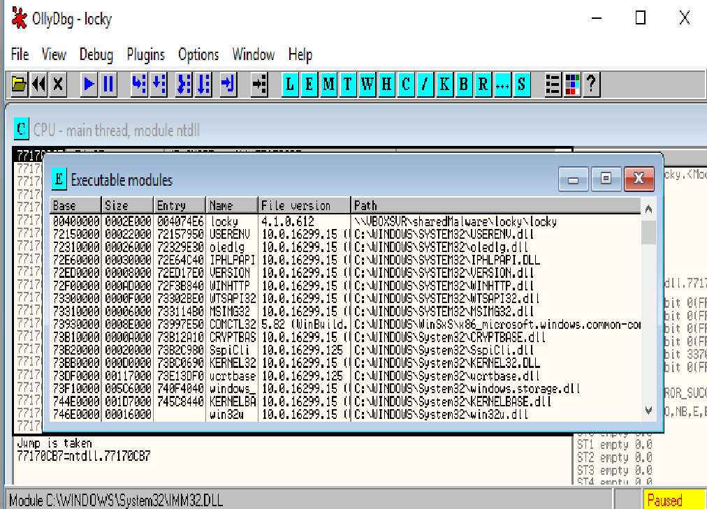
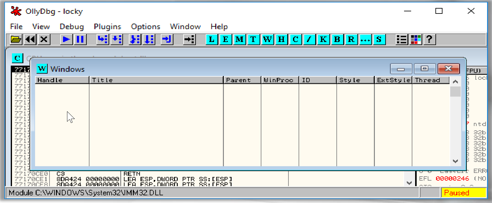
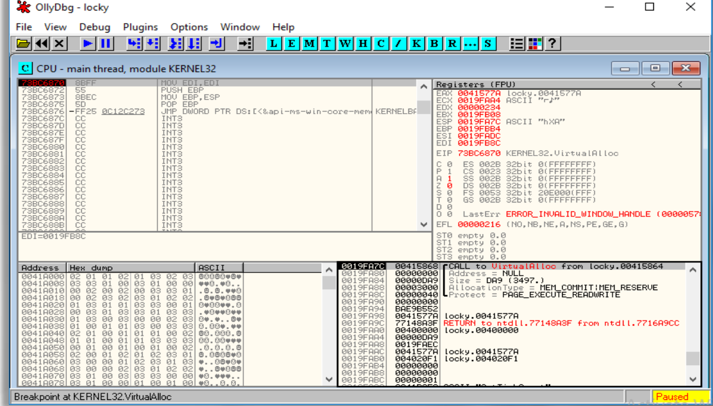
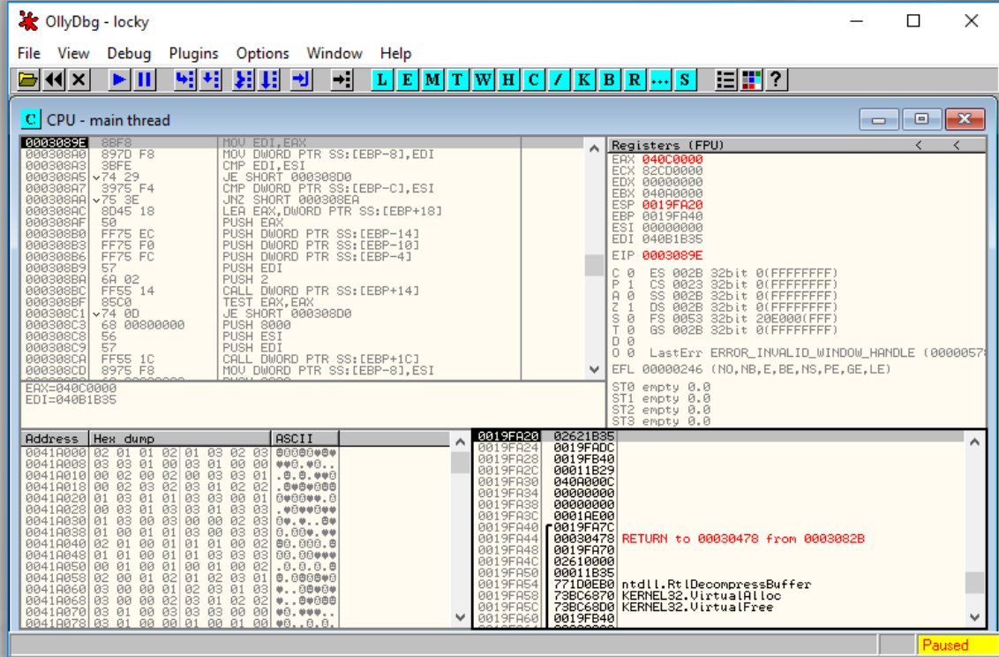
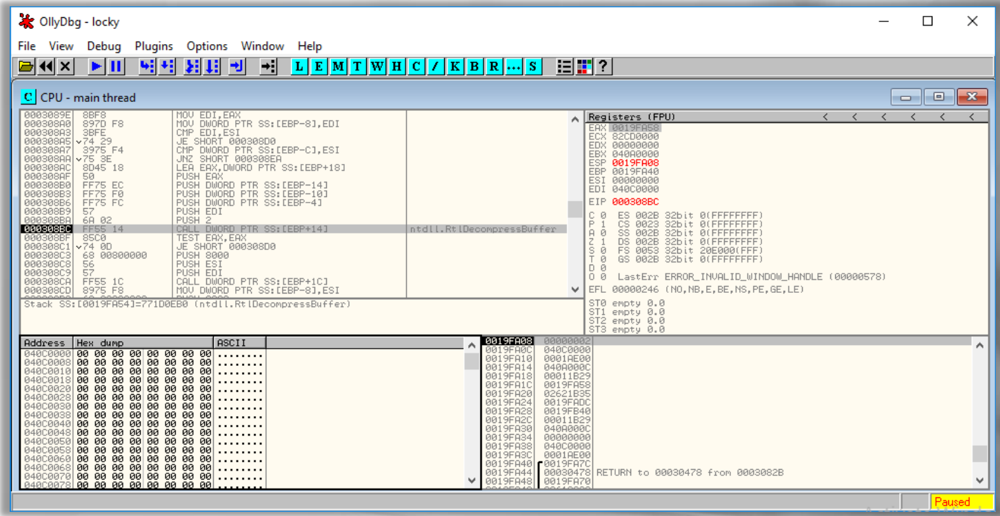
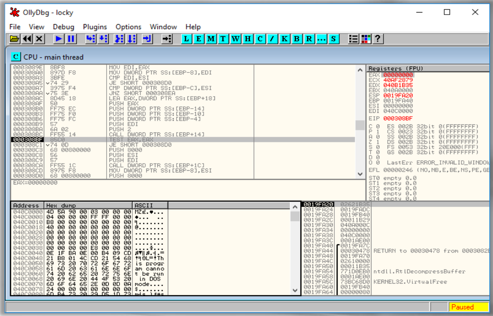

# 05 - Debugging & Disassembly Techniques

- [05 - Debugging & Disassembly Techniques](#05---debugging--disassembly-techniques)
  - [Introduction](#introduction)
    - [Decompiler](#decompiler)
    - [Debugger](#debugger)
    - [PE Viewer](#pe-viewer)
    - [Network Analyzers](#network-analyzers)
    - [Using Debugger with Disassembly](#using-debugger-with-disassembly)
    - [Launch vs Attach](#launch-vs-attach)
    - [Debugging DLLs](#debugging-dlls)
    - [Process Control](#process-control)
    - [Breakpoints](#breakpoints)
    - [Debugging 32-bit / 64-bit Malware](#debugging-32-bit--64-bit-malware)
    - [Source Code vs. Binary Debugging](#source-code-vs-binary-debugging)
    - [Debugger vs. Assembler](#debugger-vs-assembler)
  - [Debugging & Debuggers](#debugging--debuggers)
    - [Ollydbg](#ollydbg)
    - [Immunity Debugger](#immunity-debugger)

---

## Introduction

Debuggers and Disassembly and why we need them:

- Breakpoints, process control, types of breakpoints
- Stepping-in, out, over, etc
- Launch, Attach and the differences
- Debugging 32-bit/64-bit malware
- Debugging DLLs
- Source vs Binary, etc
- Debugger vs. Disassembler

 

For a long time and still, **Reverse Engineering (RE)** is the leading technique for understanding the structure and operations of malicious programs and what they’re programmed to do.

 

As malware is developed to be more sophisticated, reverse engineering tools become more mature and accessible.

 

Malware RE includes disassembling (and decompiling in some cases) malicious programs.

During RE, binary instructions of the program are transformed into code mnemonics (or **higher-level constructs**) so that analysts can see what the program performs and which systems it affects.

By knowing and understanding its operations, engineers can create solutions to mitigate its malicious effects.

 

By reverse engineering the **WannaCry** Ransomware, the efforts to find its spreading mechanism led to discovering the “**kill switch**” technique, which stopped its spread.

 

Several tools can be used to reverse malicious programs. We can classify them based on their functionalities into:

- Disassemblers
- Debuggers
- Decompilers

 

We use debuggers and disassemblers to:

- understand the functionality of malicious programs whose source code is unavailable.
- simplify the process of code analysis.
- determine the nature of the malware and its purpose. For example, is this malware an information stealer, keylogger, rootkit, and so on.
- understand how the system was infected and its impact.
- discover host-based indicators, including filenames and registry keys, which can be used as signatures
- extract network indicators related to the malware. This can be used to find similar infections via network monitoring tools. For example, if the analysis reveals that a malware is contacting a specific IP address, we can use this IP address as a signature to detect other hosts that are contacting this IP address.

 

### Decompiler

**Decompilers** are used to transform binary code into a high-level code (pseudocode), and to generate **high-level code** that is more concise and easier to read and understand.

 

### Debugger

**Debuggers** are used to execute the target program in a controlled manner, i.e., instead of executing the entire binary, you can execute a specific instruction of function.

You can view and change the program’s execution flow to gain insights about the functionality while its running.

Debugger allows the reverser to conduct a dynamic analysis by **controlling particular aspects of the program during its operation**, such as memory areas of the program. This helps to understand the program’s functionality and how it impacts a system or network.

Examples:
- Ollydbg
- Immnuity Debugger
- x64dbg
- GDB
- Windbg

 

### PE Viewer

PE Viewers (stands for “Windows Portable Executable” file format) are used to extract valuable information from executables. They provide functionality such as dependency viewing.

Examples:
- CFF Explorer
- PE Explorer
- PE Bear
- pestudio

 

### Network Analyzers

**Network analyzers** are used to study how a program is communicating with other machines, such as revealing connections made by the program and what data it is trying to send.

While network analyzers might not be a debugger, they do help in your debugging process.

Example:

- Wireshark

 

### Using Debugger with Disassembly

**Disassembler** shows the *program’s state before execution*. We are presented with the program’s **low-level assembly** instructions.

 

**Debugger** shows *memory locations, registers, and functions’ arguments* during execution. It further allows the reverser to change them while the program is running.

 

You can change the program execution using debuggers. This includes:

- Modify a control flag
- Modify an instruction pointer
- Modify the code instructions

- For example, we can **skip a function** - You can avoid a call to a particular function, by setting a breakpoint on the function call and then modify the instruction pointer to point to the instruction that is after the call. *(Note: this may crash the program execution.)*

 

### Launch vs Attach

To start using a debugger, you can either launch a new process or attach it to an existing process.

 

**Launch** is to **run a program** using a **debugger**. The program running stops immediately before the execution of its main entry point after which, control over the paused program is given to the reverser.

 

**Attach** is to **bind a debugger to an already running program**.

- Pause all program's threads
- Commonly used to debug a process thatis infected by malware
- Note that you will **miss the initial actions** of the process that occur before the debugger is attached

 

### Debugging DLLs

To debug a DLL, we need to find its entry point. This can be done by following these steps:

1. Use a debugger to launch or attach the process to a host process.
2. When a DLL is loaded using **x64dbg**, the debugger will drop an executable in the same folder where this DLL is saved. This executable will act as the host process to execute the DLL.
4. When the DLL is loaded, we need to pause the execution at the entry point of the DLL. For example, if a DLL is loaded using **x64dbg**, the execution will pause at the DLL entry point, TLS call back, or the system breakpoint. By unchecking both TLS and system breakpoint, the debugger will pause the execution at the DLL entry point.

 

### Process Control

Debuggers enable the reverser to control or modify the process behavior while it is running.

Using debuggers, you can:

1. Control the program execution
2. Interrupt the program execution via breakpoints

 

Debuggers offer the following functionalities for execution control:

- Continue (Run) execution
- Step into / Step over
- Execute till Rturn / Run until return
- Run to cursor / Run until selection

 

**Continue (Run)**

Using `Continue (Run)`, a debugger will execute program instructions until it reaches a **breakpoint** or an exception occurs.

If you use this option without a breakpoint, the debugger will execute all instructions without granting you any granular control. 

Hence, this option is used in correlation with breakpoints, to pause the execution when a breakpoint is reached.

 

**Single Step**

- Execute 1 instruction
- Slow
- May get bogged with unimportant details

 

**Step Over**

- Execute one instruction; however, if the instruction is a **function call**, then it **finishes the call** and pauses on the instruction after the call.
- Decrease the code amount that need to be analyzed by “stepping over” some functions
- Pay attention not to miss important functionality, especially in a case where the stepped over function is `void` (does not return anything)
- After step over, you can check the program’s resources, such as the CPU register’s current values

 

**Step into**

- Step into, like step over, executes a single command.
- However, step into **enters a function call** when encountered and execution is transferred to the first instruction inside the called function.
- Helps to understand the inner working of a function and not just the return values from it (which again is what step over is doing).

 

**Execute till return**

- The debugger will execute all instructions of the current function until it encounters a return instruction (`ret` or `retn`).
- You may use it in case you stepped into a function accidentally or the function is not interesting and want to get out of it.

 

**Run to cursor**

- Debugger will execute all instructions until it reaches the current location of the cursor or reaches the selected instruction.

 

### Breakpoints

- Debugger allows this feature to interrupt the execution of the program at a particular location.
- A program that is paused at the breakpoint becomes broken.
- For example, if you can’t figure where a call instruction is redirecting the flaw to, add a breakpoint on the call and check the content of the register `EAX`, which will hold the memory location.

- A breakpoint can be set at:
  - Particular instruction
  - Function / API calls
  - Access to memory address (READ / WRITE / EXECUTE)

- You can set several breakpoints in the program; the execution will be interrupted if any of these breakpoints is reached.
  - Example: Adding a breakpoint at a call to `VirtualAllocEx` and then read the return alue in `EAX|RAX`
  - Example: Add breakpoints at other functions like `WriteProcessMemory`

  

 

There are also several types of breakpoints:

1. Software breakpoint
2. Hardware breakpoint
3. Memory breakpoint
4. Conditional breakpoint

 

**Hardware Breakpoint**

These registers allow to interrupt the execution of the program using debug registers. The control is transferred to the debugger when memory is accessed for reading or writing.

 

The CPU debug registers are eight registers, **DR0-DR7**.

- **DR0-DR3**: breakpoint registers: these registers contain the breakpoints line addresses.
- **DR4-DR5**: reserved
- **DR6**: debug status: indicates the activated breakpoint.
- **DR7**: debug control: determines the activation mode of the breakpoint via the access mode, whether it is read, write, or execute.

 
 

**Software Breakpoint**

The debugger overwrite the first byte of the instruction with the `INT 3` instruction (the `0xCC` opcode). Upon trigger, control is transferred from the program to debugger.

You can set **unlimited** number of software breakpoint. However, advanced malware searches for the breakpoint instruction, `INT 3`, and if found, the malware changes its normal behavior (e.g. performs something non-malicious to avoid detection during a debugging session).

 
 

**Memory Breakpoints**

Used to interrupt the execution if the memory is accessed (for read or write).

Useful in case you want to inspect when a specific memory address is accessed and by which instruction.

 
 

**Conditional Breakpoints**

- Break in case a condition is satisfied.
- Cause slowness
- This feature is offered by the debugger, not a feature of instructions or CPU, hence you can determine a condition for software or hardware breakpoints.

 
 

### Debugging 32-bit / 64-bit Malware

The main difference is that 64-bit malware uses **extended registers**, **64-bit memory addresses/pointers**, and have slightly different conventions for API calling.

 

For 32-bit function, when the arguments are pushed, the stack grows and if they are popped the stack shrinks. 

For 64-bit function, **the space for the stack is allocated at the function beginning and is not modified till the end of the function**. This space is used to store function parameters and local variables.

 
 

### Source Code vs. Binary Debugging

We perform analysis on malicious binary since the source code of this binary is not available.

 

Source-level debugging is performed on the high-level language, and usually this feature is available in the integrated development environments (IDEs).

 

Both allow to pass over the program instructions and to set breakpoints to examine values of memory locations.

 

**Source code analysis** depends on the programming language. Analysis of source code is much easier than analysis of compiled binaries.

 

**Binary debugging** requires **reverse-engineering** and low-level programming skills **(unmanaged code)**.

 
 

### Debugger vs. Assembler

A **debugger** is used to examine and control the execution and internal state of another program. Hence, it offers a dynamic view of the program while it is running.

 

Using debuggers we can get insight about the **program’s functionality while it is runnin**g. Debuggers provide more information about the functionality of a program than the disassembler.

 

Debuggers allow us to examine the** value of memory location, registers contents, and argument** passed to functions.

Also it provides the ability to change the execution of the program..

 

Disassemblers provides a **snapshot** of the program **before the execution** of its first instruction.

 

Note:
https://www.hex-rays.com/products/decompiler/compare_vs_disassembly/

 

---

## Debugging & Debuggers

### Ollydbg

Free to download:

- http://ollydbg.de/

 

**Ollydbg** is a GUI-based debugger and contains only user level debugging mode. It can extend its features using plugins.

WARNING:
Always run **Ollydbg** as ADMIN! When we do malware analysis, we are interested in seeing what could the malware do when the malware has full privileges. If the goal is to test the overall environment’s security posture with regards to the debugged sample, then you may run it with the privileges of a regular user.

 
 

To load an executable into Ollydbg, use Open (to start a new process and attach to it) or Attach (to already running one):

  

 

When you select a file, Ollydbg will start the analysis of the file. This is the default view that we are presented with.

  

 
 

**Main Windows**

On the Upper left is the **CPU** view, which displays:

1. Virtual address of the instructions
2. Opcodes 
3. Assembler Mnemonics 
4. Information added, such as functions names of the well-known ones that the debugger can identify

  

 

On the Upper right is the **CPU registers** window:

  

 

In the lower left, we see the **Memory Dump** window:

  

 

The Stack window is in the lower right window:

  

  

**Top bar buttons**

  

- Restart (Ctrl + F2) 
- Stop (Alt + F2) 
- Start (F9) 
- Pause (F12) 
- Step into (F7) 
- Step Over (F8) 
- Trace into (Ctrl + F11) 
- Trace over (Ctrl + F12) 
- Execute till return (Ctrl + F9)

 

  

The view button at the top menu allows for different views.

A hotkey is associated with some views, which is preceded by the `Alt` key

Only, the "`patches`" view’s hotkey is preceded with the `Ctrl` key.

Also, these views are associated with the blue buttons at the top right.

 

  

Selecting the “**Executable modules (`Alt+E`)**” or pressing the blue "`E`” button, a window containings all of the files that the loaded executables has opened pops up.

This window displays the **“base”** virtual address, the binary’s virtual size in memory, the virtual address of the Entry Point, the module name, file version, and finally the file path for each loaded module in loaded by the debugged process.

 

**Threads** Window:

  

 

**Windows** window:

  

 

The Handles window:

  

 

The SEH (Structured Exception Handler) chain window:

  

 
 

  

- The debug button at the top menu contains different debug options.

 
 

  

Setting a Breakpoint is achieved through either:

- Hotkey `F2`
- Right click > Breakpoints
- Options > Command Line > Write `bp <API_NAME>`

 

When a breakpoint is set, the virtual address will turn into red at the breakpoint’s location:

  

 

Breakpoint using Command Line:

  

- This will stop execution at each `VirtualAlloc` function call

 
 

  

- We can see the ollydbg comments.
- It shows the arguments that passed to the `VirtualAlloc` function.

 

  

- If you want to return to the caller function, you can achieve it by pressing `Alt+F9`.

 

  

- The `eax` register contains the return value of the function
- Right click and choose `follow in dump`, to see what is present at the memory location of that address

 

  

- To perform step over, use `F8` or click on the button.

 

The memory dump shows an exe file written to memory:

  

 

You can export the executable from the memory of the process to your analyst’s machine through the memory map:

  

 
 

### Immunity Debugger

